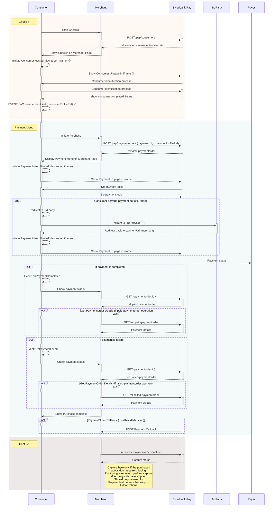

Swedbank Pay Checkout allows your customers to be identified with Swedbank Pay,
enabling existing Swedbank Pay Checkout users to pay with their favorite payment
methods in just a few simple steps.

## Prerequisites

To start integrating Swedbank Pay Checkout, you need the following:

*   [HTTPS][https] enabled web server.
*   Agreement that includes Swedbank Pay Checkout.
*   Obtained credentials (merchant Access Token) from Swedbank Pay through
    Swedbank Pay Admin. Please observe that Swedbank Pay Checkout encompass
    both the **`consumer`** and **`paymentmenu`** scope.

## Introduction

To get started with Swedbank Pay Checkout, you should learn about its different
components and how they work together. Swedbank Pay Checkout consists of two
related, but disconnected concepts: **Checkin** and **Payment Menu**. Checkin
identifies the consumer in our Consumer API and Payment Menu authorizes the
payment with our Payment Menu API.

The next step is to **Capture** the payment. You can either capture the total
amount, or do a part-capture (as described under
[After Payment][after-payment-capture]). Connect these steps and you have
Swedbank Pay Checkout.

While Checkin is a necessary component to store personal information and access
features like storing cards, it is not a mandatory step for the Checkout process
to work. If the payer is from a country where we currently don't support
Checkin, or if he or she opts not to store their data, that's fine. The Payment
Menu can still be used as a **guest**.

Below, you will see a sequence diagram showing the sequence of a Swedbank Pay
checkout.



### Explanations

Under, you see a list of notes that explains some of the sequences in the
diagram.

#### Checkin

*   ① `rel: view-consumer-identification` is a value in one of the operations,
    sent as a response from Swedbank Pay to the Merchant.
*   ② `Initiate Consumer Hosted View (open iframe)` creates the iframe.
*   ③ `Show Consumer UI page in iframe` displays the checkin form as content inside
    of the iframe.
*   ④ `onConsumerIdentified (consumerProfileRef)` is an event that triggers when
    the consumer has been identified, and delivers a field
    `consumerProfileRef` as a reference to be used in the payment menu.

#### Payment Menu

*   ⑤ `Authorize Payment` is when the payer has accepted the payment.





[after-payment-capture]: /checkout/capture
[https]: /home/technical-information#connection-and-protocol
[payment-order]: /checkout/other-features#payment-orders
