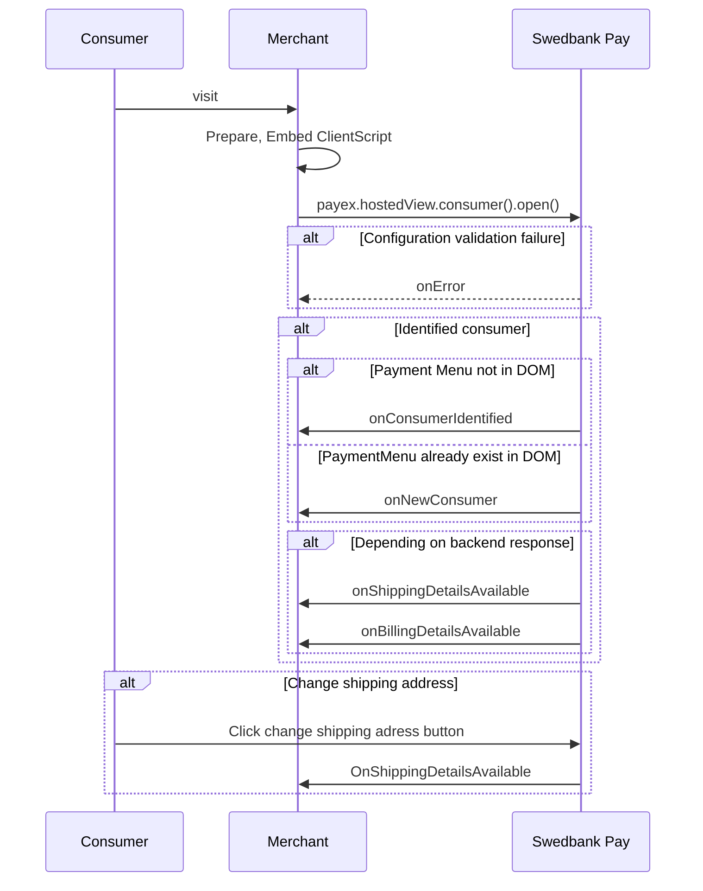
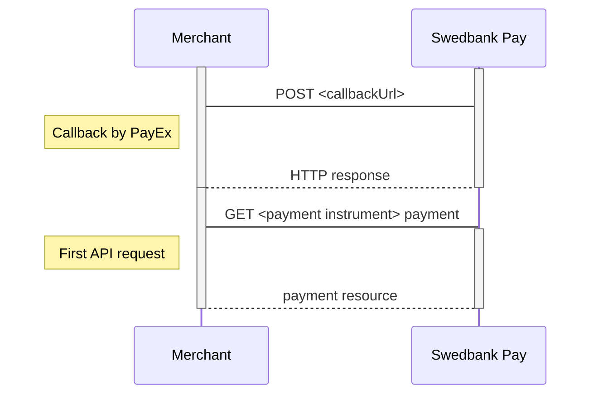





## Payment Url

For our hosted views solution in Checkout (using
[Payment Order][payment-order]), we have a URL property called `paymentUrl`
that will be used if the consumer is redirected out of the hosted view
(the `iframe`). The consumer is redirected out of `iframe` when selecting
payment methods Vipps or in the 3D secure verification for credit card
payments.

The URL should represent the page of where the payment hosted view was hosted
originally, such as the checkout page, shopping cart page, or similar.
Basically, `paymentUrl` should be set to the same URL as that of the page
where the JavaScript for the hosted payment view was added to in order to
initiate the payment. Please note that the `paymentUrl` must be able to invoke
the same JavaScript URL from the same Payment or Payment Order as the one that
initiated the payment originally, so it should include some sort of state
identifier in the URL. The state identifier is the ID of the order, shopping
cart or similar that has the URL of the Payment or Payment Order stored.

If `paymentUrl` is not supplied, retry of payments will not be possible in
[Payment Order][payment-order], which makes it more tedious to retry payment
as the whole process including the creation of the payment order needs to
be performed again.

With `paymentUrl` in place, the retry process becomes much more convenient for
both the integration and the payer.

## Purchase Payment Orders

The `Purchase` operation is used in all common purchase scenarios.

{:.code-header}
**Purchase**

```js
{
    "paymentorder": {
        "operation": "Purchase"
    {
}
```

## Verify Payment Orders

The `Verify` operation lets you post verifications to confirm the validity of
**credit card information**, without reserving or charging any amount. This
option is mainly used to initiate a recurring payment scenario where the card
will be charged at a later date. The request body is equivalent to a `Purchase`
order with credit card as the selected item.
A [payment token][payment-orders-resource] will be generated automatically,
rendering the parameter `generateRecurrenceToken` unnecessary for this
operation.

{:.code-header}
**Verify**

```js
{
    "paymentorder": {
        "operation": "Verify"
    {
}
```

## Recurring Payments

If you want to enable subsequent recurring – server-to-server – payments for
credit card, you need to create a recurrence token. This token will be utilized
after the initial payment order.

**Recurrence Token**

* When initiating a `Purchase` payment order, you need to make sure that the
  attribute `generateRecurrenceToken` is set to `true`. This recurrence token
  will stored in the[authorization transaction][transaction]
  sub-resource on the underlying credit card payment resource.
* When initiating a `Verify` payment order, a recurrence token will be generated
  automatically. This recurrence token is stored in the
  [verification][verification-transaction]  sub-resource on the underlying
  credit card payment resource.

You can view the current payment resource, containg the recurrence token and
other payment instrument properties, by [expanding the sub-resource][expanding]
[`currentpayment`][current-payment] when doing a `GET` request on the
`paymentorders` resource.

{:.code-header}
**Request**

```http
GET /psp/paymentorders/<paymentorderId>?$expand=currentpayment HTTP/1.1
Host: api.payex.com
```

### Creating recurring credit card payments

When you have a `recurrenceToken` token safely tucked away, you can use this
token in a subsequent `Recur` payment order. This will be a server-to-server
affair, as we have tied all necessary payment instrument details related to the
recurrence token during the initial payment order.

{:.code-header}
**Request**

```http
POST /psp/paymentorders HTTP/1.1
Host: api.payex.com
Authorization: Bearer <MerchantToken>
Content-Type: application/json

{
  "paymentorder": {
    "operation": "Recur",
    "recurrenceToken": "5adc265f-f87f-4313-577e-08d3dca1a26c",
    "currency": "SEK",
    "amount": 1000,
    "vatAmount": 250,
    "description": "Test Purchase",
    "userAgent": "Mozilla/5.0...",
    "language": "sv-SE",
    "urls": {
      "callbackUrl": "https://example.com/callback"
    },
    "payeeInfo": {
      "payeeId": "12345678-1234-1234-1234-123456789012",
      "payeeReference": "CD1234",
      "payeeName": "Merchant1",
      "productCategory": "A123",
      "orderReference": "or-12456",
      "subsite": "Subsite1"
    },
    "orderItems": [
      {
        "reference": "P1",
        "name": "Product1",
        "type": "PRODUCT",
        "class": "ProductGroup1",
        "itemUrl": "https://example.com/shop/id=123",
        "imageUrl": "https://example.com/product1.jpg",
        "description": "Product 1 description",
        "discountDescription": "Volume discount",
        "quantity": 4,
        "quantityUnit": "pcs",
        "unitPrice": 300,
        "discountPrice": 200,
        "vatPercent": 2500,
        "amount": 1000,
        "vatAmount": 250
      }
    ],
    "metadata": {
      "key1": "value1",
      "key2": 2,
      "key3": 3.1,
      "key4": false
    }
  }
}
```

#### Enable or Disable Payment Menu 

It is possible to disable the payment menu when only one instrument exist by
setting the `disablePaymentMenu` property to `true`. The default value is
`false`, exemplified below.

{:.code-header}
**Request**

```js
{
    "paymentorder": {
        "disablePaymentMenu": false
    {
}
```

{:.text-center}
![example disablePaymentMenu = false][image_enabled_payment_menu]{:width="464" :height="607"}

Setting `disablePaymentMenu` property to `true` removes all other payment
instruments but the one that is available.

{:.code-header}
**Request**

```js
{
    "paymentorder": {
        "disablePaymentMenu": true
    {
}
```

{:.text-center}
![example disablePaymentMenu = true][image_disabled_payment_menu]{:width="463" :height="553"}

## Sub-resources

The `paymentOrders` resource utilize several sub-resources, relating to
underlying [payments][payment-orders-resource-payments],
[the current payment active][current-payment],
[payers][payment-orders-resource-payers] and [URLs][payment-resource-urls].
Common sub-resources like [payeeinfo][payment-resource-payeeinfo], that are
structurally identical for both payments and payments orders, are described in
the [Payment Resources][payment-resource] section.

### Payments Resource

A payment order is able to hold more than one payment object,
_even though a successful payment order only harbour one successful payment_.
This is necessary as the consumer might select and initate a payment option that
is not followed through successfully. I.e. if the consumer cancels an invoice
payment, a cancel transaction will still be tied to that particular invoice
payment resource. This payment resource will continue to exist, even if the
consumer successfully should finish the purchase with a credit card payment instead.

{:.code-header}
**Request**

```http
GET /psp/paymentorders<paymentorderId>/payments HTTP/1.1
Host: api.payex.com
Authorization: Bearer <MerchantToken>
Content-Type: application/json

{
    "paymentorder": "/psp/paymentorders/5adc265f-f87f-4313-577e-08d3dca1a26c",
    "payments": {
        "id": "/psp/paymentorders/5adc265f-f87f-4313-577e-08d3dca1a26c/payments",
        "paymentList" : [
            {
                "id": "/psp/creditcard/payments/5adc265f-f87f-4313-577e-08d3dca1a26c",
                "instrument" : "CreditCard",
                "Created": "2016-09-14T13:21:29.3182115Z"
            },
            {
                "id": "/psp/invoice/payments/5adc265f-f87f-4313-577e-08d3dca1a26d",
                "instrument" : "Invoice",
                "Created": "2016-09-14T13:21:29.3182115Z"
            }
        ]
    }
}
```

{:.table .table-striped}
| **Property** | **Type** | **Description**
| *paymentorder* | object | The payment order object.
|payments.id | `string` | The relative URI of the current `payments` resource.
|payments.paymentList | `string` |The array of payment objects.
|payments.paymentList[] | `string` | The payment object.

### Current Payment Resource

The `currentpayment` resource displays the payment that are active within the
payment order container.

{:.code-header}
**Request**

```http
GET /psp/paymentorders/5adc265f-f87f-4313-577e-08d3dca1a26c/currentpayment HTTP/1.1
Host: api.payex.com
Authorization: Bearer <MerchantToken>
Content-Type: application/json
```

{:.code-header}
**Response**

```http
HTTP/1.1 200 OK
Content-Type: application/json

{
    "paymentorder": "/psp/paymentorders/5adc265f-f87f-4313-577e-08d3dca1a26c",
    "menuElementName": "creditcard",
    "payment": {
        "recurrenceToken": "5adc265f-f87f-4313-577e-08d3dca1a26c",
        "id": "/psp/creditcard/payments/5adc265f-f87f-4313-577e-08d3dca1a26c",
        "number": 1234567890,
        "instrument": "CreditCard",
        "created": "2016-09-14T13:21:29.3182115Z",
        "updated": "2016-09-14T13:21:57.6627579Z",
        "operation": "Purchase|Verify|Recur",
        "intent": "Authorization",
        "state": "Ready|Pending|Failed|Aborted",
        "currency": "NOK|SEK|...",
        "amount": 1500,
        "remainingCaptureAmount": 1500,
        "remainingCancellationAmount": 1500,
        "remainingReversalAmount": 0,
        "description": "Test Purchase",
        "payerReference": "AB1234",
        "userAgent": "Mozilla/5.0...",
        "language": "nb-NO",
        "prices": { "id": "/psp/creditcard/payments/5adc265f-f87f-4313-577e-08d3dca1a26c/prices" },
        "transactions": { "id": "/psp/creditcard/payments/5adc265f-f87f-4313-577e-08d3dca1a26c/transactions" },
        "authorizations": { "id": "/psp/creditcard/payments/5adc265f-f87f-4313-577e-08d3dca1a26c/authorizations" },
        "captures": { "id": "/psp/creditcard/payments/5adc265f-f87f-4313-577e-08d3dca1a26c/captures" },
        "cancellations": { "id": "/psp/creditcard/payments/5adc265f-f87f-4313-577e-08d3dca1a26c/cancellations" },
        "reversals": { "id": "/psp/creditcard/payments/5adc265f-f87f-4313-577e-08d3dca1a26c/reversals" },
        "verifications": { "id": "/psp/creditcard/payments/5adc265f-f87f-4313-577e-08d3dca1a26c/verifications" },
        "urls" : { "id": "/psp/creditcard/payments/5adc265f-f87f-4313-577e-08d3dca1a26c/urls" },
        "payeeInfo" : { "id": "/psp/creditcard/payments/5adc265f-f87f-4313-577e-08d3dca1a26c/payeeInfo" },
        "metadata" : { "id": "/psp/creditcard/payments/5adc265f-f87f-4313-577e-08d3dca1a26c/metadata" },
        "settings": { "id": "/psp/creditcard/payments/5adc265f-f87f-4313-577e-08d3dca1a26c/settings" }
    },
    "operations": []
}
```

{:.table .table-striped}
| Property                           | Type         | Description                                                                                                                                                                                      |
| :--------------------------------- | :----------- | :----------------------------------------------------------------------------------------------------------------------------------------------------------------------------------------------- |
| `paymentorder`                     | `string`     | The URI of the payment order the payment belongs to.                                                                                                                                             |
| `menuElementName`                  | `string`     | `creditcard`, `invoice`, etc. The name of the selected menu element.                                                                                                                             |
| `payment`                          | `object`     | The payment object.                                                                                                                                                                              |
| └➔&nbsp;`recurrenceToken`          | `string`     | The created recurrenceToken, if `operation : Verify` or `generateRecurrenceToken : true` was used.                                                                                               |
| └➔&nbsp;`id`                       | `string`     | The relative URI to the payment.                                                                                                                                                                 |
| └➔&nbsp;`number`                   | `integer`    | The payment `number`, useful when there's need to reference the payment in human communication. Not usable for programmatic identification of the payment, for that `id` should be used instead. |
| └➔&nbsp;`instrument`               | `string`     | The payment instrument used.                                                                                                                                                                     |
| └➔&nbsp;`created`                  | `string`     | The ISO-8601 date of when the payment was created.                                                                                                                                               |
| └➔&nbsp;`updated`                  | `string`     | The ISO-8601 date of when the payment was updated.                                                                                                                                               |
| └➔&nbsp;`operation`                | `string`     | `Purchase`, `payout`, `Verify` or `recur. `The type of the initiated payment.                                                                                                                    |
| └➔&nbsp;`intent`                   | `string`     | The intent of the payment.                                                                                                                                                                       |
| └➔&nbsp;`state`                    | `string`     | `Ready`, `Pending`, `Failed` or `Aborted`. Indicates the state of the payment. This field is only for status display purposes.                                                                   |
| └➔&nbsp;`currency`                 | `string`     | The currency of the payment.                                                                                                                                                                     |
| └➔&nbsp;`prices`                   | `object`     | The prices object.                                                                                                                                                                               |
| └─➔&nbsp;`amount`                  | `integer`    | Amount is entered in the lowest momentary units of the selected currency. E.g. `10000` = `100.00 NOK`, `5000` = `50.00 SEK`.                                                                     |
| └─➔&nbsp;`remainingCaptureAmount`  | `integer`    | The available amount to capture.                                                                                                                                                                 |
| └─➔&nbsp;`remainingCancelAmount`   | `integer`    | The available amount to cancel.                                                                                                                                                                  |
| └─➔&nbsp;`remainingReversalAmount` | `integer`    | The available amount to reverse.                                                                                                                                                                 |
| └➔&nbsp;`description`              | `string(40)` | A textual description of maximum 40 characters of the purchase.                                                                                                                                  |
| └➔&nbsp;`payerReference`           | `string`     | The reference to the consumer from the merchant system, like mobile number, customer number etc.                                                                                                 |
| └➔&nbsp;`userAgent`                | `string`     | The [user agent] string of the consumer's browser.                                                                                                                                               |
| └➔&nbsp;`language`                 | `string`     | `nb-NO`, `sv-SE` or `en-US`                                                                                                                                                                      |

### URLs Resource

The `urls` resource contains the URIs related to a payment order, including
where the consumer gets redirected when going forward with or cancelling a
payment session, as well as the callback URI that is used to inform the payee
(merchant) of changes or updates made to underlying payments or transaction.

{:.code-header}
Request

```http
GET /psp/paymentorders/5adc265f-f87f-4313-577e-08d3dca1a26c/urls/ HTTP/1.1
Host: api.payex.com
Authorization: Bearer <MerchantToken>
Content-Type: application/json
```

{:.code-header}
Response

```http
HTTP/1.1 200 OK
Content-Type: application/json

{
    "paymentorder": "/psp/payments/5adc265f-f87f-4313-577e-08d3dca1a26c",
    "urls": {
        "id": "/psp/payments/5adc265f-f87f-4313-577e-08d3dca1a26c/urls",
        "hostUrls": [ "http://test-dummy.net", "http://test-dummy2.net" ],
        "completeUrl": "http://example.com/payment-complete",
        "cancelUrl": "http://example.com/payment-canceled",
        "paymentUrl": "http://example.com/perform-payment",
        "callbackUrl": "http://api.example.com/payment-callback",
        "logoUrl": "http://merchant.com/path/to/logo.png",
        "termsOfServiceUrl": "http://merchant.com/path/to/tems"
    }
}
```

{:.table .table-striped}
| Property                    | Type     | Description                                                                                                                                                                                                                                |
| :-------------------------- | :------- | :----------------------------------------------------------------------------------------------------------------------------------------------------------------------------------------------------------------------------------------- |
| `paymentorder`              | `string` | The URI to the payment order the resource belong to.                                                                                                                                                                                       |
| `urls`                      | `object` | The URLs object.                                                                                                                                                                                                                           |
| └➔&nbsp;`id`                | `string` | The relative URI to the `urls` resource.                                                                                                                                                                                                   |
| └➔&nbsp;`hostsUrl`          | `string` | An array of the whitelisted URIs that are allowed as parents to a Hosted View, typically the URI of the web shop or similar that will embed a Hosted View within it.                                                                       |
| └➔&nbsp;`completeUrl`       | `string` | The URI that Swedbank Pay will redirect back to when the payment page is completed.                                                                                                                                                               |
| └➔&nbsp;`cancelUrl`         | `string` | The URI to redirect the payer to if the payment is canceled. Only used in redirect scenarios. If both cancelUrl and paymentUrl is sent, the paymentUrl will used.                                                                          |
| └➔&nbsp;`paymentUrl`        | `string` | The URI that Swedbank Pay will redirect back to when the payment menu needs to be loaded, to inspect and act on the current status of the payment. Only used in hosted views. If both cancelUrl and paymentUrl is sent, the paymentUrl will used. |
| └➔&nbsp;`callbackUrl`       | `string` | The URI that Swedbank Pay will perform an HTTP `POST` against every time a transaction is created on the payment. See [callback][callback-reference] for details.                                                                                 |
| └➔&nbsp;`logoUrl`           | `string` | The URI that will be used for showing the customer logo. Must be a picture with at most 50px height and 400px width.                                                                                                                       |
| └➔&nbsp;`termsOfServiceUrl` | `string` | A URI that contains your terms and conditions for the payment, to be linked on the payment page.                                                                                                                                           |

### Payer Resource

The `payer` resource contains payer information related to the payment order.
The information is retrieved via a consumer profile token
(`consumerProfileRef`), from the [Consumers resource][consumer-reference]
during login/checkin.

{:.code-header}
**Request**

```http
GET /psp/paymentorders/5adc265f-f87f-4313-577e-08d3dca1a26c/payers/ HTTP/1.1
Host: api.payex.com
Authorization: Bearer <MerchantToken>
Content-Type: application/json
```

{:.code-header}
**Response**

```http
HTTP/1.1 200 OK
Content-Type: application/json

{
    "paymentorder": "/psp/paymentorders/5adc265f-f87f-4313-577e-08d3dca1a26c",
    "payer" : {
        "id": "/psp/paymentorders/5adc265f-f87f-4313-577e-08d3dca1a26c/payer",
        "reference": "reference to payer",
        "email": "email",
        "msisdn": "msisdn",
        "shippingAddress": {
            "addressee": "firstName + lastName",
            "coAddress": "coAddress",
            "streetAddress": "streetAddress",
            "zipCode": "zipCode",
            "city": "city",
            "countryCode": "countryCode"
        }
    }
}
```

{:.table .table-striped}
| Property                  | Type     | Description                                         |
| :------------------------ | :------- | :-------------------------------------------------- |
| `paymentorder`            | `string` | The URI of the payment order the payer belongs to.  |
| `payer`                   | `object` | The payer object.                                   |
| └➔&nbsp;`id`              | `string` | The relative URI to the current `payer` resource.   |
| └➔&nbsp;`email`           | `string` | Payer's registered email address.                   |
| └➔&nbsp;`msisdn`          | `string` | Payer'registered mobile phone number.               |
| └➔&nbsp;`shippingAddress` | `object` | The shipping address object related to the `payer`. |
| └─➔&nbsp;`addresse`       | `object` | The shipping address object related to the `payer`. |
| └─➔&nbsp;`coAddress`      | `string` | Payer' s c/o address, if applicable.                |
| └─➔&nbsp;`streetAddress`  | `string` | Payer's street address                              |
| └─➔&nbsp;`zipCode`        | `string` | Payer's zip code                                    |
| └─➔&nbsp;`city`           | `string` | Payer's city of residence                           |
| └─➔&nbsp;`countryCode`    | `string` | Country Code for country of residence.              |

## Checkin Events

The Checkin Seamless View can inform about events that occur during Checkin
through JavaScript event callbacks which can be implemented in the
`configuration` object passed to the `payex.hostedView.consumer(configuration)`
object.



### `onConsumerIdentified`

This event triggers when a consumer has performed Checkin and is identified,
if the Payment Menu is not loaded and in the DOM.

The `onConsumerIdentified` event is raised with the following event argument
object:

{:.code-header}
**`onConsumerIdentified` event object**

```js
{
  "actionType": "OnConsumerIdentified",
  "consumerProfileRef": "<consumerProfileRef>"
}
```

### `onNewConsumer`

This event triggers when a consumer has performed Checkin and is identified,
if the Payment Menu is loaded and present in the DOM.

The `onNewConsumer` event is raised with the following event argument object:

{:.code-header}
**`onNewConsumer` event object**

```js
{
  "actionType": "OnNewConsumer",
  "consumerProfileRef": "<consumerProfileRef>"
}
```

### `onShippingDetailsAvailable`

Triggered when a consumer has been identified or shipping address has been
updated.

{:.code-header}
**`onShippingDetailsAvailable` event object**

```js
{
  "actionType": "OnBillingDetailsAvailable",
  "url": "/psp/consumers/<ConsumerProfileRef>/shipping-details"
}
```

### `onBillingDetailsAvailable`

Triggered when a consumer has been identified

{:.code-header}
**`onBillingDetailsAvailable` event object**

```js
{
  "actionType": "OnBillingDetailsAvailable",
  "url":"/psp/consumers/<ConsumerProfileRef>/billing-details"
}
```

### `onError`

Triggered on terminal errors, and when the configuration fails validation.

## Payment Menu Events

During operation in the Payment Menu, several events can occur. They are
described below.

### `onPaymentMenuInstrumentSelected`

This event triggers when a user actively changes payment instrument in the
Payment Menu. The `onPaymentMenuInstrumentSelected` event is raised with the
following event argument object:

{:.code-header}
**`onPaymentMenuInstrumentSelected` event object**

```js
{
    "name": "menu identifier",
    "instrument": "creditcard | vipps | swish | invoice",
}
```

{:.table .table-striped}
| Property     | Type     | Description                                                                                                                                                      |
| :----------- | :------- | :--------------------------------------------------------------------------------------------------------------------------------------------------------------- |
| `name`       | `string` | The name and identifier of specific instrument instances - i.e. if you deploy more than one type of credit card payments, they would be distinguished by `name`. |
| `instrument` | `string` | `Creditcard`, `vipps`, `swish`, `invoice`. The instrument selected by the user.                                                                                  |

### `onPaymentCreated`

This event triggers when a user has selected a payment instrument and actively
attempts to perform a payment. The `onPaymentCreate` event is raised with the
following event argument object:

{:.code-header}
**`onPaymentCreated` event object**

```js
{
    "id": "/psp/creditcard/payments/653b1f5d-8e6c-4cce-d42d-08d58e414c69",
    "instrument": "creditcard | vipps | swish | invoice",
}
```

{:.table .table-striped}
| Property     | Type     | Description                                                                                     |
| :----------- | :------- | :---------------------------------------------------------------------------------------------- |
| `id`         | `string` | The relative URI to the payment.                                                                |
| `instrument` | `string` | `Creditcard`, `vipps`, `swish`, `invoice`. The instrument selected when initiating the payment. |

### `onPaymentCompleted`

This event triggers when a payment has completed successfully. The `onPaymentCompleted` event is raised with the following event argument object:

{:.code-header}
**`onPaymentCompleted` event object**

```js
{
    "id": "/psp/creditcard/payments/653b1f5d-8e6c-4cce-d42d-08d58e414c69",
    "redirectUrl": "https://en.wikipedia.org/wiki/Success"
}
```

{:.table .table-striped}
| Property      | Type     | Description                                                     |
| :------------ | :------- | :-------------------------------------------------------------- |
| `id`          | `string` | The relative URI to the payment.                                |
| `redirectUrl` | `string` | The URI the user will be redirect to after a completed payment. |

### `onPaymentCanceled`

This event triggers when the user cancels the payment. The `onPaymentCanceled` event is raised with the following event argument object:

{:.code-header}
**`onPaymentCanceled` event object**

```js
{
    "id": "/psp/creditcard/payments/653b1f5d-8e6c-4cce-d42d-08d58e414c69",
    "redirectUrl": "https://en.wikipedia.org/wiki/Canceled"
}
```

{:.table .table-striped}
| Property      | Type     | Description                                                    |
| :------------ | :------- | :------------------------------------------------------------- |
| `id`          | `string` | The relative URI to the payment.                               |
| `redirectUrl` | `string` | The URI the user will be redirect to after a canceled payment. |

### `onPaymentFailed`

This event triggers when a payment has failed, disabling further attempts to
perform a payment. The `onPaymentFailed` event is raised with the following
event argument object:

{:.code-header}
**`onPaymentFailed` event object**

```js
{
    "id": "/psp/creditcard/payments/653b1f5d-8e6c-4cce-d42d-08d58e414c69",
    "redirectUrl": "https://en.wikipedia.org/wiki/Failed"
}
```

{:.table .table-striped}
| Property      | Type     | Description                                                  |
| :------------ | :------- | :----------------------------------------------------------- |
| `id`          | `string` | The relative URI to the payment.                             |
| `redirectUrl` | `string` | The URI the user will be redirect to after a failed payment. |

### `onPaymentTermsOfService`

This event triggers when the user clicks on the "Display terms and conditions"
link. The `onPaymentTermsOfService` event is raised with the following event
argument object:

{:.code-header}
**`onPaymentTermsOfService` event object**

```js
{
    "origin": "owner | merchant",
    "openUrl": "https://example.org/terms.html"
}
```

{:.table .table-striped}
| Property  | Type     | Description                                                                      |
| :-------- | :------- | :------------------------------------------------------------------------------- |
| `origin`  | `string` | `owner`, `merchant`. The value is always `merchant` unless Swedbank Pay hosts the view. |
| `openUrl` | `string` | The URI containing Terms of Service and conditions.                              |

### `onError`

This event triggers during terminal errors or if the configuration fails
validation. The `onError` event will be raised with the following event argument
object:

{:.code-header}
**`onError` event object**

```js
{
    "origin": "consumer | paymentmenu | creditcard | invoice | ...",
    "messageId": "<unique message ID>",
    "details": "Descriptive text of the error"
}
```

{:.table .table-striped}
| Property    | Type     | Description                                                                               |
| :---------- | :------- | :---------------------------------------------------------------------------------------- |
| `origin`    | `string` | `consumer`, `paymentmenu`, `creditcard`, identifies the system that originated the error. |
| `messageId` | `string` | A unique identifier for the message.                                                      |
| `details`   | `string` | A human readable and descriptive text of the error.                                       |

## Operations

When a payment order resource is created and during its lifetime, it will have a set of operations that can be performed on it. The state of the payment order resource, what the access token is authorized to do, the chosen payment instrument and its transactional states, etc. determine the available operations before the initial purchase. A list of possible operations and their explanation is given below.

{:.code-header}
**Operations**

```js
{
    "paymentOrder": {
        "id": "/psp/paymentorders/8bf85423-841d-4fb8-d754-08d6d398f0c5",
    }
    "operations": [
        {
            "method": "PATCH",
            "href": "https://api.externalintegration.payex.com/psp/paymentorders/8bf85423-841d-4fb8-d754-08d6d398f0c5",
            "rel": "update-paymentorder-abort",
            "contentType": "application/json"
        },
        {
            "method": "PATCH",
            "href": "https://api.externalintegration.payex.com/psp/paymentorders/8bf85423-841d-4fb8-d754-08d6d398f0c5",
            "rel": "update-paymentorder-updateorder",
            "contentType": "application/json"
        },
        {
            "method": "GET",
            "href": "https://ecom.externalintegration.payex.com/paymentmenu/eb6932c2e24113377ecd88da343a10566b31f59265c665203b1287277224ef60",
            "rel": "redirect-paymentorder",
            "contentType": "text/html"
        },
        {
            "method": "GET",
            "href": "https://ecom.externalintegration.payex.com/paymentmenu/core/scripts/client/px.paymentmenu.client.js?token=eb6932c2e24113377ecd88da343a10566b31f59265c665203b1287277224ef60&culture=nb-NO",
            "rel": "view-paymentorder",
            "contentType": "application/javascript"
        },
        {
            "method": "POST",
            "href": "https://api.externalintegration.payex.com/psp/paymentorders/b80be381-b572-4f1e-9691-08d5dd095bc4/captures",
            "rel": "create-paymentorder-capture",
            "contentType": "application/json"
        },
        {
            "method": "POST",
            "href": "https://api.externalintegration.payex.com/psp/paymentorders/b80be381-b572-4f1e-9691-08d5dd095bc4/cancellations",
            "rel": "create-paymentorder-cancel",
            "contentType": "application/json"
        },
        {
            "method": "POST",
            "href": "https://api.externalintegration.payex.com/psp/paymentorders/b80be381-b572-4f1e-9691-08d5dd095bc4/reversals",
            "rel": "create-paymentorder-reversal",
            "contentType": "application/json"
        }
    ]
}
```

{:.table .table-striped}
| Property      | Type     | Description                                       |
|:--------------|:---------|:--------------------------------------------------|
| `href`        | `string` | The target URI to perform the operation against.
| `rel`         | `string` | The name of the relation the operation has to the current resource.
| `method`      | `string` | `GET`, `PATCH`, `POST`, etc. The HTTP method to use when performing the operation.
| `contentType` | `string` | The HTTP content type of the resource referenced in the `href` property.

The operations should be performed as described in each response and not as
described here in the documentation. Always use the `href` and `method` as
specified in the response by finding the appropriate operation based on its
`rel` value. The only thing that should be hard coded in the client is the value
of the `rel` and the request that will be sent in the HTTP body of the request
for the given operation.

{:.table .table-striped}
| Operation                          | Description                             |
|:-----------------------------------|:----------------------------------------|
| `update-paymentorder-abort`        | [Aborts][abort] the payment order before any financial transactions are performed.
| `update-paymentorder-updateorder`  | [Updates the order][update-order] with a change in the `amount` and/or `vatAmount`.
| `redirect-paymentorder`            | Contains the URI that is used to redirect the consumer to the Swedbank Pay Payment Pages containing the Payment Menu.
| `view-paymentorder`                | Contains the JavaScript `href` that is used to embed the Payment Menu UI directly on the webshop/merchant site.
| `create-paymentorder-capture`      | The second part of a two-phase transaction where the authorized amount is sent from the payer to the payee. It is possible to do a part-capture on a subset of the authorized amount. Several captures on the same payment are possible, up to the total authorization amount.
| `create-paymentorder-cancellation` | Used to cancel authorized and not yet captured transactions. If a cancellation is performed after doing a part-capture, it will only affect the not yet captured authorization amount.
| `create-paymentorder-reversal`     | Used to reverse a payment. It is only possible to reverse a payment that has been captured and not yet reversed.

### View Payment Order

The `view-paymentorder` operation contains the URI of the JavaScript that needs to be set as a `script` element's `src` attribute, either client-side through JavaScript or server-side in HTML as shown below.

```html
<!DOCTYPE html>
<html>
    <head>
        <title>Swedbank Pay Checkout is Awesome!</title>
    </head>
    <body>
        <div id="checkout"></div>
        <script src="https://ecom.payex.com/paymentmenu/core/scripts/client/px.paymentmenu.client.js?token=38540e86bd78e885fba2ef054ef9792512b1c9c5975cbd6fd450ef9aa15b1844&culture=nb-NO"></script>
        <script language="javascript">
            payex.hostedView.paymentMenu({
                container: 'checkout',
                culture: 'nb-NO',
                onPaymentCompleted: function(paymentCompletedEvent) {
                    console.log(paymentCompletedEvent);
                },
                onPaymentFailed: function(paymentFailedEvent) {
                    console.log(paymentFailedEvent);
                },
                onPaymentCreated: function(paymentCreatedEvent) {
                    console.log(paymentCreatedEvent);
                },
                onPaymentToS: function(paymentToSEvent) {
                    console.log(paymentToSEvent);
                },
                onPaymentMenuInstrumentSelected: function(paymentMenuInstrumentSelectedEvent) {
                    console.log(paymentMenuInstrumentSelectedEvent);
                },
                onError: function(error) {
                    console.error(error);
                },
            }).open();
        </script>
    </body>
</html>
```

### Update Order

Change amount and vat amount on a payment order. If you implement `updateorder`
**you need to `refresh()`** the [Payment Menu front end][payment-menu] so the
new amount is shown to the end customer.

{:.code-header}
**Request**

```http
PATCH /psp/paymentorders/b80be381-b572-4f1e-9691-08d5dd095bc4 HTTP/1.1
Authorization: Bearer <MerchantToken>
Content-Type: application/json

{
    "paymentorder": {
        "operation": "UpdateOrder",
        "amount": 2500,
        "vatAmount": 120
    }
}
```

{:.code-header}
**Response**
```http
Response
HTTP/1.1 200 OK
Content-Type: application/json

{
    "paymentorder": {
        "id": "/psp/paymentorders/5adc265f-f87f-4313-577e-08d3dca1a26c",
        "created": "2018-09-14T13:21:29.3182115Z",
        "updated": "2018-09-14T13:21:57.6627579Z",
        "operation": "Purchase",
        "state": "Ready",
        "currency": "SEK",
        "amount": 1500,
        "vatAmount": 0,
        "remainingCaptureAmount": 1500,
        "remainingCancellationAmount": 1500,
        "remainingReversalAmount": 0,
        "description": "Test Purchase",
        "initiatingSystemUserAgent": "PostmanRuntime/3.0.1",
        "userAgent": "Mozilla/5.0...",
        "language": "nb-NO",
        "urls" : { "id": "/psp/paymentorders/5adc265f-f87f-4313-577e-08d3dca1a26c/urls" },
        "payeeInfo" : { "id": "/psp/paymentorders/5adc265f-f87f-4313-577e-08d3dca1a26c/payeeinfo" },
        "settings": { "id": "/psp/paymentorders/5adc265f-f87f-4313-577e-08d3dca1a26c/settings" },
        "payers": { "id": "/psp/paymentorders/5adc265f-f87f-4313-577e-08d3dca1a26c/payers" },
        "orderItems" : { "id": "/psp/paymentorders/5adc265f-f87f-4313-577e-08d3dca1a26c/orderItems" },
        "metadata": { "id": "/psp/paymentorders/5adc265f-f87f-4313-577e-08d3dca1a26c/metadata" },
        "payments": { "id": "/psp/paymentorders/5adc265f-f87f-4313-577e-08d3dca1a26c/payments" },
        "currentPayment": { "id": "/psp/paymentorders/5adc265f-f87f-4313-577e-08d3dca1a26c/currentpayment" }
    },
    "operations": [
        {
            "method": "PATCH",
            "href": "https://api.externalintegration.payex.com/psp/paymentorders/479a7a2b-3b20-4302-fa84-08d676d15bc0",
            "rel": "update-paymentorder-abort",
            "contentType": "application/json"
        },
        {
            "method": "GET",
            "href": "https://ecom.externalintegration.payex.com/paymentmenu/4b0baaf8fdb5a56b5bdd78a8dd9e63e42e93ec79e5d0c0b5cc40f79cf43c9428",
            "rel": "redirect-paymentorder",
            "contentType": "text/html"
        },
        {
            "method": "GET",
            "href": "https://ecom.externalintegration.payex.com/paymentmenu/core/scripts/client/px.paymentmenu.client.js?token=4b0baaf8fdb5a56b5bdd78a8dd9e63e42e93ec79e5d0c0b5cc40f79cf43c9428&culture=nb-NO",
            "rel": "view-paymentorder",
            "contentType": "application/javascript"
        }
    ]
}
```

The response given when changing a payment order is equivalent to a `GET`
request towards the `paymentorders` resource, [as displayed above][payment-orders-resource].
Remember to call .refresh() on the Payment Menu in JavaScript

### Capture



### Abort

To abort a payment order, perform the `update-paymentorder-abort` operation that
is returned in the payment order response. You need to include the following
in the request body:

{:.code-header}
**Request**

```http
PATCH /psp/paymentorders/5adc265f-f87f-4313-577e-08d3dca1a26c HTTP/1.1
Host: api.externalintegration.payex.com
Authorization: Bearer <MerchantToken>
Content-Type: application/json

{
  "paymentorder": {
    "operation": "Abort",
    "abortReason": "CancelledByConsumer"
  }
}
```

{:.code-header}
**Response**

```http
Response
HTTP/1.1 200 OK
Content-Type: application/json

{
    "paymentorder": {
        "id": "/psp/paymentorders/5adc265f-f87f-4313-577e-08d3dca1a26c",
        "created": "2018-09-14T13:21:29.3182115Z",
        "updated": "2018-09-14T13:21:57.6627579Z",
        "operation": "Purchase",
        "state": "Ready",
        "currency": "SEK",
        "amount": 1500,
        "vatAmount": 0,
        "remainingCaptureAmount": 1500,
        "remainingCancellationAmount": 1500,
        "remainingReversalAmount": 0,
        "description": "Test Purchase",
        "initiatingSystemUserAgent": "PostmanRuntime/3.0.1",
        "userAgent": "Mozilla/5.0...",
        "language": "nb-NO",
        "urls" : { "id": "/psp/paymentorders/5adc265f-f87f-4313-577e-08d3dca1a26c/urls" },
        "payeeInfo" : { "id": "/psp/paymentorders/5adc265f-f87f-4313-577e-08d3dca1a26c/payeeinfo" },
        "settings": { "id": "/psp/paymentorders/5adc265f-f87f-4313-577e-08d3dca1a26c/settings" },
        "payers": { "id": "/psp/paymentorders/5adc265f-f87f-4313-577e-08d3dca1a26c/payers" },
        "orderItems" : { "id": "/psp/paymentorders/5adc265f-f87f-4313-577e-08d3dca1a26c/orderItems" },
        "metadata": { "id": "/psp/paymentorders/5adc265f-f87f-4313-577e-08d3dca1a26c/metadata" },
        "payments": { "id": "/psp/paymentorders/5adc265f-f87f-4313-577e-08d3dca1a26c/payments" },
        "currentPayment": { "id": "/psp/paymentorders/5adc265f-f87f-4313-577e-08d3dca1a26c/currentpayment" }
    },
    "operations": [
        {
            "method": "PATCH",
            "href": "https://api.externalintegration.payex.com/psp/paymentorders/479a7a2b-3b20-4302-fa84-08d676d15bc0",
            "rel": "update-paymentorder-abort",
            "contentType": "application/json"
        },
        {
            "method": "GET",
            "href": "https://ecom.externalintegration.payex.com/paymentmenu/4b0baaf8fdb5a56b5bdd78a8dd9e63e42e93ec79e5d0c0b5cc40f79cf43c9428",
            "rel": "redirect-paymentorder",
            "contentType": "text/html"
        },
        {
            "method": "GET",
            "href": "https://ecom.externalintegration.payex.com/paymentmenu/core/scripts/client/px.paymentmenu.client.js?token=4b0baaf8fdb5a56b5bdd78a8dd9e63e42e93ec79e5d0c0b5cc40f79cf43c9428&culture=nb-NO",
            "rel": "view-paymentorder",
            "contentType": "application/javascript"
        }
    ]
}
```

The response given when aborting a payment order is equivalent to a `GET`
request towards the `paymentorders` resource, [as displayed above][payment-orders],
with its `state` set to `Aborted`.

### Cancel



#### Reversal









### Authorizations

The `authorizations` resource contains information about authorization
transactions made on a specific payment.

{:.code-header}
**Request**

```http
GET /psp/creditcard/payments/5adc265f-f87f-4313-577e-08d3dca1a26c/authorizations HTTP/1.1
Host: api.payex.com
Authorization: Bearer <MerchantToken>
Content-Type: application/json
```

{:.code-header}
**Response**

```http
HTTP/1.1 200 OK
Content-Type: application/json

{
  "payment": "/psp/creditcard/payments/5adc265f-f87f-4313-577e-08d3dca1a26c",
  "authorizations": {
    "id": "/psp/creditcard/payments/5adc265f-f87f-4313-577e-08d3dca1a26c/authorizations",
    "authorizationList": [
      {
        "direct": false,
        "paymentToken": "12345678-1234-1234-1234-123456789012",
        "recurrenceToken": "12345678-1234-1234-1234-123456789013",
        "maskedPan": "123456xxxxxx1234",
        "expiryDate": "mm/yyyy",
        "panToken": "12345678-1234-1234-1234-123456789012",
        "cardBrand": "Visa",
        "cardType": "Credit",
        "issuingBank": "UTL MAESTRO",
        "countryCode": "999",
        "acquirerTransactionType": "3DSECURE",
        "issuerAuthorizationApprovalCode": "397136",
        "acquirerStan": "39736",
        "acquirerTerminalId": "39",
        "acquirerTransactionTime": "2017-08-29T13:42:18Z",
        "authenticationStatus": "Y",
        "nonPaymentToken": "string",
        "externalNonPaymentToken": "string",
        "externalSiteId": "string",
        "transactionInitiator": "CARDHOLDER",
        "id": "/psp/creditcard/payments/5adc265f-f87f-4313-577e-08d3dca1a26c/authorizations/12345678-1234-1234-1234-123456789012",
        "transaction": {
          "id": "/psp/creditcard/payments/5adc265f-f87f-4313-577e-08d3dca1a26c/transactions/12345678-1234-1234-1234-123456789012",
          "created": "2019-08-13T10:32:21.861621Z",
          "updated": "2019-08-13T10:32:23.4271016Z",
          "type": "Authorization",
          "state": "Failed",
          "number": 1234567890,
          "amount": 1000,
          "vatAmount": 2500,
          "description": "Test transaction",
          "payeeReference": "AH123456",
          "failedReason": "ExternalResponseError",
          "failedActivityName": "Authorize",
          "failedErrorCode": "REJECTED_BY_ACQUIRER",
          "failedErrorDescription": "unknown error, response-code: 51",
          "isOperational": false,
          "problem": {
            "type": "https://api.payex.com/psp/errordetail/creditcard/acquirererror",
            "title": "Operation failed",
            "status": 403,
            "detail": "Unable to complete Authorization transaction, look at problem node!",
            "problems": [
              {
                "name": "ExternalResponse",
                "description": "REJECTED_BY_ACQUIRER-unknown error, response-code: 51"
              }
            ]
          },
          "operations": []
        }
      }
    ]
  }
}
```

{:.table .table-striped}
| Property                                 | Type     | Description            |
|:-----------------------------------------|:---------|:-----------------------|
| `payment`                     | `string` | The relative URI of the payment this authorization transactions resource belongs to.
| `authorizations`              | `object` | The authorizations object.
| └➔&nbsp;`id`                  | `string` | The relative URI of the current authorization transactions resource.
| └➔&nbsp;`authorizationList`   | `array`  | The array of authorization transaction objects.
| └➔&nbsp;`authorizationList[]` | `object` | The authorization transaction object described in the `authorization` resource below.

{:.code-header}
**Request**

```http
GET /psp/creditcard/payments/5adc265f-f87f-4313-577e-08d3dca1a26c/authorizations/12345678-1234-1234-1234-123456789012 HTTP/1.1
Host: api.payex.com
Authorization: Bearer <MerchantToken>
Content-Type: application/json
```

{:.code-header}
**Response**

```http
HTTP/1.1 200 OK
Content-Type: application/json

{
  "payment": "/psp/creditcard/payments/5adc265f-f87f-4313-577e-08d3dca1a26c",
  "authorization": {
    "direct": false,
    "paymentToken": "12345678-1234-1234-1234-123456789012",
    "recurrenceToken": "12345678-1234-1234-1234-123456789013",
    "maskedPan": "123456xxxxxx1234",
    "expiryDate": "mm/yyyy",
    "panToken": "12345678-1234-1234-1234-123456789012",
    "cardBrand": "Visa",
    "cardType": "Credit",
    "issuingBank": "UTL MAESTRO",
    "countryCode": "999",
    "acquirerTransactionType": "3DSECURE",
    "issuerAuthorizationApprovalCode": "397136",
    "acquirerStan": "39736",
    "acquirerTerminalId": "39",
    "acquirerTransactionTime": "2017-08-29T13:42:18Z",
    "authenticationStatus": "Y",
    "nonPaymentToken": "string",
    "externalNonPaymentToken": "string",
    "externalSiteId": "string",
    "transactionInitiator": "CARDHOLDER",
    "id": "/psp/creditcard/payments/5adc265f-f87f-4313-577e-08d3dca1a26c/authorizations/12345678-1234-1234-1234-123456789012",
    "transaction": {
      "id": "/psp/creditcard/payments/5adc265f-f87f-4313-577e-08d3dca1a26c/transactions/12345678-1234-1234-1234-123456789012",
      "created": "2019-08-13T10:32:21.861621Z",
      "updated": "2019-08-13T10:32:23.4271016Z",
      "type": "Authorization",
      "state": "Failed",
      "number": 1234567890,
      "amount": 1000,
      "vatAmount": 2500,
      "description": "Test transaction",
      "payeeReference": "AH123456",
      "failedReason": "ExternalResponseError",
      "failedActivityName": "Authorize",
      "failedErrorCode": "REJECTED_BY_ACQUIRER",
      "failedErrorDescription": "unknown error, response-code: 51",
      "isOperational": false,
      "problem": {
        "type": "https://api.payex.com/psp/errordetail/creditcard/acquirererror",
        "title": "Operation failed",
        "status": 403,
        "detail": "Unable to complete Authorization transaction, look at problem node!",
        "problems": [
          {
            "name": "ExternalResponse",
            "description": "REJECTED_BY_ACQUIRER-unknown error, response-code: 51"
          }
        ]
      },
      "operations": []
    }
  }
}
```

{:.table .table-striped}
| Property                                  | Type     | Description           |
|:------------------------------------------|:---------|:----------------------|
| `payment`                                 | `string` | The relative URI of the payment this authorization transaction resource belongs to.
| `authorization`                           | `object` | The authorization object.
| └➔&nbsp;`id`                              | `string` | The relative URI of the current authorization transaction resource.
| └➔&nbsp;`paymentToken`                    | `string` | The payment token created for the card used in the authorization.
| └➔&nbsp;`recurrenceToken`                 | `string` | The recurrence token created for the card used in the authorization.
| └➔&nbsp;`maskedPan`                       | `string` | The masked PAN number of the card.
| └➔&nbsp;`expireDate`                      | `string` | The month and year of when the card expires.
| └➔&nbsp;`panToken`                        | `string` | The token representing the specific PAN of the card.
| └➔&nbsp;`cardBrand`                       | `string` | `Visa`, `MC`, etc. The brand of the card.
| └➔&nbsp;`cardType`                        | `string` | `Credit Card` or `Debit Card`. Indicates the type of card used for the authorization.
| └➔&nbsp;`issuingBank`                     | `string` | The name of the bank that issued the card used for the authorization.
| └➔&nbsp;`countryCode`                     | `string` | The country the card is issued in.
| └➔&nbsp;`acquirerTransactionType`         | `string` | `3DSECURE` or `SSL`. Indicates the transaction type of the acquirer.
| └➔&nbsp;`acquirerStan`                    | `string` | The System Trace Audit Number assigned by the acquirer to uniquely identify the transaction.
| └➔&nbsp;`acquirerTerminalId`              | `string` | The ID of the acquirer terminal.
| └➔&nbsp;`acquirerTransactionTime`         | `string` | The ISO-8601 date and time of the acquirer transaction.
| └➔&nbsp;`issuerAuthorizationApprovalCode` | `string` | The issuer's six-digit code used to identify the approval for a specific authorization request.
| └➔&nbsp;`authenticationStatus`            | `string` | `Y`, `A`, `U` or `N`. Indicates the status of the authentication.
| └➔&nbsp;`transaction`                     | `object` | The object representation of the generic [`transaction` resource][transaction].

#### Create authorization transaction

The `direct-authorization` operation creates an authorization transaction
directly whilst the `redirect-authorization` operation redirects the consumer
to Swedbank Pay Payment pages where the payment is authorized.

> **Note:** In order to use the `direct-authorization` operation, the servers
and application involved in retrieving and transferring the credit card number
from the payer to Swedbank Pay needs to be [PCI DSS][pci-dss] certified.**

{:.code-header}
**Request**

```http
POST /psp/creditcard/payments/5adc265f-f87f-4313-577e-08d3dca1a26c/authorizations HTTP/1.1
Host: api.payex.com
Authorization: Bearer <MerchantToken>
Content-Type: application/json

{
    "transaction": {
        "cardNumber": "4925000000000004",
        "cardExpiryMonth": 11,
        "cardExpiryYear": 22,
        "cardVerificationCode": "185",
        "cardholderName": "John Hancock"
    }
}
```

{:.table .table-striped}
| ✔︎︎︎︎︎ | Property                  | Type        | Description                   |
|:-:|:--------------------------|:-------------|:------------------------------|
| ✔︎︎︎︎︎ | `transaction.cardNumber` | `string` | Primary Account Number (PAN) of the card, printed on the face of the card.
| ✔︎︎︎︎︎ | `transaction.cardExpiryMonth` | `integer` | Expiry month of the card, printed on the face of the card.
| ✔︎︎︎︎︎ | `transaction.cardExpiryYear` | `integer` | Expiry year of the card, printed on the face of the card.
|   | `transaction.cardVerificationCode` | `string` |Card verification code (CVC/CVV/CVC2), usually printed on the back of the card.
|   | `transaction.cardholderName` | `string` | Name of the card holder, usually printed on the face of the card.

**Response**

The [`authorization`][transaction] resource contains information about an
authorization transaction made towards a payment, as previously described.

### Transactions



#### Transaction



## Callback

The Callback  functionality is similar for all payment methods.

* Setting a `callbackUrl` in the HTTP `POST` API is optional, but highly
  recommended. If a payer closes the browser window, a network error or
  something else happens that prevents the payer from being redirect from Swedbank Pay back to the merchant website, the callback is what ensures that you receive information about what happened with the payment.
* When a change or update from the back-end system are made on a payment or transaction, Swedbank Pay will perform a callback to inform the payee (merchant) about this update.
* Swedbank Pay will make an HTTP `POST` to the `callbackUrl` that was specified when the payee (merchant) created the payment.
* When the `callbackUrl` receives such a callback, an HTTP `GET``` request must be made on the payment or on the transaction. The retrieved payment or transaction resource will give you the necessary information about the recent change/update.
* The callback will be retried if it fails. Below are the retry timings, in milliseconds from the initial transaction time:
  * 30000 ms
  * 60000 ms
  * 360000 ms
  * 432000 ms
  * 864000 ms
  * 1265464 ms
* The callback is sent from the following IP address `82.115.146.1`.

{:.code-header}
**Payment Instrument Callback**

```js
{
   "payment": {
       "id": "/psp/<payment instrument>/payments/22222222-2222-2222-2222-222222222222",
       "number": 222222222
    },
   "transaction": {
       "id": "/psp/<payment instrument>/payments/22222222-2222-2222-2222-222222222222/<transaction type>/33333333-3333-3333-3333-333333333333",
       "number": 333333333
    }
}
```

{:.code-header}
**Payment Order Callback**

```js
{
    "paymentOrder":{
        "id": "/psp/paymentorders/11111111-1111-1111-1111-111111111111",
        "instrument": "<payment instrument>"
    },
    "payment":{
        "id": "/psp/<payment instrument>/payments/22222222-2222-2222-2222-222222222222",
        "number": 222222222
    },
    "transaction":{
        "id": "/psp/<payment instrument>/payments/22222222-2222-2222-2222-222222222222/<transaction type>/33333333-3333-3333-3333-333333333333",
        "number": 333333333
    }
}
```

{:.table .table-striped}
| Parameter| Description
| `Payment Instrument` | `CreditCard`, `Invoice`, `Swish`, `Vipps`, `DirectDebit`, `MobilePay`
| `Transaction Type` | `Authorization`, `Capture`, `Cancellation`, `Reversal`

The sequence diagram below shows the HTTP ``POST` you will receive from PayEx, and the two `GET` requests that you make to get the updated status.



## Problems

When performing operations against the API, it will respond with a problem message that contain details of the error type if the request could not be successfully performed. Regardless of why the error occurred, the problem message will follow the same structure as specified in the [Problem Details for HTTP APIs][http-api-problems]] specification.

The structure of a problem message will look like this:

```js
{
    "type": "https://api.payex.com/psp/<error_type>",
    "title": "There was an input error",
    "detail": "Please correct the errors and retry the request",
    "instance": "9a20d737-670d-42bf-9a9a-d36736de8721",
    "status": 400,
    "action": "RetryNewData",
    "problems": [{
        "name": "CreditCardParameters.Issuer",
        "description": "minimum one issuer must be enabled "
    }]
}
```

{:.table .table-striped}
| Property | Type | Description
|:--------------------------|:-------------|:------------------------------|
| `type` | `string` | The URI that identifies the error type. This is the **only property usable for programmatic identification** of the type of error! When dereferenced, it might lead you to a human readable description of the error and how it can be recovered from.
| `title` | `string` | The title contains a human readable description of the error.
| `detail` | `string` | A detailed, human readable description of the error.
| `instance` | `string` | The identifier of the error instance. This might be of use to Swedbank Pay support personnel in order to find the exact error and the context it occurred in.
| `status` | `integer` | The HTTP status code that the problem was served with.
| `action` | `string` | The `action` indicates how the error can be recovered from.
| `problems` | `array` | The array of problem detail objects.
| └➔&nbsp;`[].name` | `string` | The name of the property, header, object, entity or likewise that was erroneous.
| └➔&nbsp;`[].description` | `string` | The description of what was wrong with the property, header, object, entity or likewise identified by `name`.

### Common Problems

All common problem types will have a URI in the format `https://api.payex.com/psp/<error-type>`. The **URI is an identifier** and is currently not possible to dereference, although that might be possible in the future.

{:.table .table-striped}
| Type                  | Status | Description                                 |
|:----------------------|:------:|:--------------------------------------------|
| `inputerror`          | `400`  | The server cannot or will not process the request due to an apparent client error (e.g. malformed request syntax, size to large, invalid request).
| `forbidden`           | `403`  | The request was valid, but the server is refusing the action. The necessary permissions to access the resource might be lacking.
| `notfound`            | `404`  | The requested resource could not be found, but may be available in the future. Subsequent requests are permissible.
| `systemerror`         | `500`  | A generic error message.
| `configurationerror`  | `500`  | A error relating to configuration issues.

### Payment Instrument Specific Problems

Problem types for a specific payment instrument will have a URI in the format `https://api.payex.com/psp/<payment-instrument>/<error-type>`. You can read more about the payment instrument specific problem messages below:

* [Card Payments][card-payments-problems]
* [Invoice][invoice-payments-problems]
* [Swish][swish-payments-problems]
* [Vipps][vipps-payments-problems]

### Expansion

The payment resource contain the ID of related sub-resources in its response
properties. These sub-resources can be expanded inline by using the request
parameter `expand`. This is an effective way to limit the number of necessary
calls to the API, as you return several properties related to a Payment resource
in a single request.

Note that the `expand` parameter is available to all API requests but only
applies to the request response. This means that you can use the expand
parameter on a `POST`  or `PATCH`request to get a response containing the target
resource including expanded properties.

This example below add the `urls` and `authorizations` property inlines to the
response, enabling you to access information from these sub-resources.

{:.code-header}
**Expansion**

```http
GET /psp/creditcard/payments/5adc265f?$expand=urls,authorizations HTTP/1.1
Host: api.payex.com
```

To avoid unnecessary overhead, you should only expand the nodes you need info
about.

## Payee Info





[abort]: #operations
[transaction]: #transaction
[callback-reference]: /checkout/other-features#callback
[card-payments-problems]: /payments/credit-card/other-features#problem-messages
[consumer-reference]: /checkout/other-features#payeereference
[current-payment]: #current-payment-resource
[expanding]: #expansion
[http-api-problems]: https://tools.ietf.org/html/rfc7807
[image_disabled_payment_menu]: /assets/img/checkout/test_purchase.PNG
[image_enabled_payment_menu]: /assets/img/checkout/payment_menu.PNG
[invoice-payments-problems]: /payments/invoice/other-features#problem-messages
[order-items]: /checkout/payment#order-items
[payee-reference]: /checkout/other-features#payeereference
[payment-menu]: /checkout/payment#payment-menu
[payment-orders-resource-payers]: #payer-resource
[payment-orders-resource-payments]: #current-payment-resource
[payment-orders-resource]: /checkout/payment#payment-orders
[payment-orders]: /checkout/payment#payment-orders
[payment-resource-payeeinfo]: /checkout/other-features#payeereference
[payment-resource-urls]: #urls-resource
[payment-resource]: #payments-resource
[pci-dss]: https://www.pcisecuritystandards.org/
[swish-payments-problems]: /payments/swish/other-features#problem-messages
[update-order]: /checkout/after-payment#update-order
[user-agent]: https://en.wikipedia.org/wiki/User_agent
[verification-transaction]: #verify-payment-orders
[vipps-payments-problems]: /payments/vipps/other-features#problem-messages
