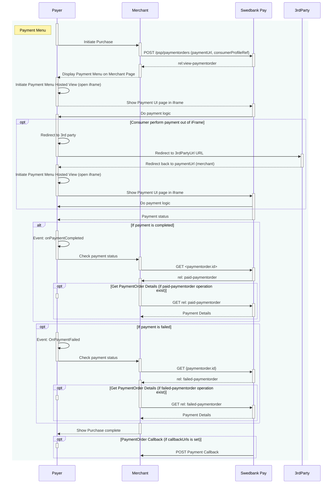



## Introduction

Below, you will se the sequence diagram of the payment menu. Notice that there
are two optional ways of performing the payment:

* Consumer perform payment **out** of `iframe`.
* Consumer perform payment **within** `iframe`.



## Payment Menu Back End

We start by performing a `POST` request towards the `paymentorder` resource
with the `consumerProfileRef` we obtained in the checkin process described
above.
Remember to read up on our [URL resource][urls].





### Payment Url



### Request

{:.code-header}
**Request**

```http
POST /psp/paymentorders HTTP/1.1
Host: {{ page.apiHost }}
Authorization: Bearer <AccessToken>
Content-Type: application/json

{
    "paymentorder": {
        "operation": "Purchase",
        "currency": "SEK",
        "amount": 1500,
        "vatAmount": 375,
        "description": "Test Purchase",
        "userAgent": "Mozilla/5.0...",
        "language": "sv-SE",
        "generateRecurrenceToken": false,
        "urls": {
            "hostUrls": [ "https://example.com", "https://example.net" ],
            "completeUrl": "https://example.com/payment-completed",
            "cancelUrl": "https://example.com/payment-canceled",
            "paymentUrl": "https://example.com/perform-payment",
            "callbackUrl": "https://api.example.com/payment-callback",
            "termsOfServiceUrl": "https://example.com/termsandconditoons.pdf"
        },
        "payeeInfo": {
            "payeeId": "{{ page.merchantId }}"
            "payeeReference": "AB832",
            "payeeName": "Merchant1",
            "productCategory": "A123",
            "orderReference": "or-123456",
            "subsite": "MySubsite"
        },
        "payer": {
            "consumerProfileRef": "{{ page.paymentToken }}",
            "email": "olivia.nyhuus@payex.com",
            "msisdn": "+4798765432",
            "workPhoneNumber" : "+4787654321",
            "homePhoneNumber" : "+4776543210"
        },
        "orderItems": [
            {
                "reference": "P1",
                "name": "Product1",
                "type": "PRODUCT",
                "class": "ProductGroup1",
                "itemUrl": "https://example.com/products/123",
                "imageUrl": "https://example.com/product123.jpg",
                "description": "Product 1 description",
                "discountDescription": "Volume discount",
                "quantity": 4,
                "quantityUnit": "pcs",
                "unitPrice": 300,
                "discountPrice": 200,
                "vatPercent": 2500,
                "amount": 1000,
                "vatAmount": 250
            },
            {
                "reference": "P2",
                "name": "Product2",
                "type": "PRODUCT",
                "class": "ProductGroup1",
                "description": "Product 2 description",
                "quantity": 1,
                "quantityUnit": "pcs",
                "unitPrice": 500,
                "vatPercent": 2500,
                "amount": 500,
                "vatAmount": 125
            }
        ],
        "riskIndicator": {
            "deliveryEmailAddress": "olivia.nyhuus@payex.com",
            "deliveryTimeFrameIndicator": "01",
            "preOrderDate": "19801231",
            "preOrderPurchaseIndicator": "01",
            "shipIndicator": "01",
            "giftCardPurchase": false,
            "reOrderPurchaseIndicator": "01",
            "pickUpAddress": {
                "name": "Olivia Nyhus",
                "streetAddress": "Saltnestoppen 43",
                "coAddress": "",
                "city": "Saltnes",
                "zipCode": "1642",
                "countryCode": "NO"
            }
        }
    }
}
```

{:.table .table-striped}
| Required | Property                              | Type         | Description                                                                                                                                                                                                                                                                                                                                                                                                                                                                                                                                                      |
| :------: | :------------------------------------ | :----------- | :--------------------------------------------------------------------------------------------------------------------------------------------------------------------------------------------------------------------------------------------------------------------------------------------------------------------------------------------------------------------------------------------------------------------------------------------------------------------------------------------------------------------------------------------------------------- |
|  ✔︎︎︎︎︎  | `paymentorder`                        | `object`     | The payment order object.                                                                                                                                                                                                                                                                                                                                                                                                                                                                                                                                        |
|  ✔︎︎︎︎︎  | └➔&nbsp;`operation`                   | `string`     | The operation that the payment order is supposed to perform.                                                                                                                                                                                                                                                                                                                                                                                                                                                                                                     |
|  ✔︎︎︎︎︎  | └➔&nbsp;`currency`                    | `string`     | The currency of the payment.                                                                                                                                                                                                                                                                                                                                                                                                                                                                                                                                     |
|  ✔︎︎︎︎︎  | └➔&nbsp;`amount`                      | `integer`    | The amount including VAT in the lowest monetary unit of the currency. E.g. `10000` equals `100.00 SEK`and `5000` equals `50.00 SEK`.                                                                                                                                                                                                                                                                                                                                                                                                                             |
|  ✔︎︎︎︎︎  | └➔&nbsp;`vatAmount`                   | `integer`    | The amount of VAT in the lowest monetary unit of the currency. E.g. `10000` equals `100.00 SEK` and `5000` equals `50.00 SEK`.                                                                                                                                                                                                                                                                                                                                                                                                                                   |
|  ✔︎︎︎︎︎  | └➔&nbsp;`description`                 | `string`     | The description of the payment order.                                                                                                                                                                                                                                                                                                                                                                                                                                                                                                                            |
|  ✔︎︎︎︎︎  | └➔&nbsp;`userAgent`                   | `string`     | The user agent of the payer.                                                                                                                                                                                                                                                                                                                                                                                                                                                                                                                                     |
|  ✔︎︎︎︎︎  | └➔&nbsp;`language`                    | `string`     | The language of the payer.                                                                                                                                                                                                                                                                                                                                                                                                                                                                                                                                       |
|  ✔︎︎︎︎︎  | └➔&nbsp;`generateRecurrenceToken`     | `bool`       | Determines if a recurrence token should be generated. A recurrence token is primarily used to enable future recurring payments - with the same token - through server-to-server calls. Default value is `false`.                                                                                                                                                                                                                                                                                                                                                 |
|  ✔︎︎︎︎︎  | └➔&nbsp;`urls`                        | `object`     | The `urls` object, containing the URLs relevant for the payment order.                                                                                                                                                                                                                                                                                                                                                                                                                                                                                           |
|  ✔︎︎︎︎︎  | └─➔&nbsp;`hostUrls`                   | `array`      | The array of URIs valid for embedding of Swedbank Pay Hosted Views.                                                                                                                                                                                                                                                                                                                                                                                                                                                                                              |
|  ✔︎︎︎︎︎  | └─➔&nbsp;`completeUrl`                | `string`     | The URL that Swedbank Pay will redirect back to when the payer has completed his or her interactions with the payment. This does not indicate a successful payment, only that it has reached a final (complete) state. A `GET` request needs to be performed on the payment order to inspect it further.                                                                                                                                                                                                                                                         |
|          | └─➔&nbsp;`cancelUrl`                  | `string`     | The URI to redirect the payer to if the payment is canceled, either by the payer or by the merchant trough an `abort` request of the `payment` or `paymentorder`.                                                                                                                                                                                                                                                                                                                                                                                                |
|          | └─➔&nbsp;`paymentUrl`                 | `string`     | The URI that Swedbank Pay will redirect back to when the payment menu needs to be loaded, to inspect and act on the current status of the payment.                                                                                                                                                                                                                                                                                                                                                                                                               |
|  ✔︎︎︎︎︎  | └─➔&nbsp;`callbackUrl`                | `string`     | The URI to the API endpoint receiving `POST` requests on transaction activity related to the payment order.                                                                                                                                                                                                                                                                                                                                                                                                                                                      |
|  ✔︎︎︎︎︎  | └─➔&nbsp;`termsOfServiceUrl`          | `string`     | The URI to the merchant terms of service document the payer must accept in order to complete the payment. This is not the Swedbank Pay Terms of Service. Requires `https`.                                                                                                                                                                                                                                                                                                                                                                                       |
|  ✔︎︎︎︎︎  | └➔&nbsp;`payeeInfo`                   | `string`     | The `payeeInfo` object, containing information about the payee.                                                                                                                                                                                                                                                                                                                                                                                                                                                                                                  |
|  ✔︎︎︎︎︎  | └─➔&nbsp;`payeeId`                    | `string`     | The ID of the payee, usually the merchant ID.                                                                                                                                                                                                                                                                                                                                                                                                                                                                                                                    |
|  ✔︎︎︎︎︎  | └─➔&nbsp;`payeeReference`             | `string(30)` | A unique reference from the merchant system. It is set per operation to ensure an exactly-once delivery of a transactional operation. See [payeeReference][payee-reference] for details.                                                                                                                                                                                                                                                                                                                                                                         |
|          | └─➔&nbsp;`payeeName`                  | `string`     | The name of the payee, usually the name of the merchant.                                                                                                                                                                                                                                                                                                                                                                                                                                                                                                         |
|          | └─➔&nbsp;`productCategory`            | `string`     | A product category or number sent in from the payee/merchant. This is not validated by Swedbank Pay, but will be passed through the payment process and may be used in the settlement process.                                                                                                                                                                                                                                                                                                                                                                   |
|          | └─➔&nbsp;`orderReference`             | `string(50)` | The order reference should reflect the order reference found in the merchant's systems.                                                                                                                                                                                                                                                                                                                                                                                                                                                                          |
|          | └─➔&nbsp;`subsite`                    | `String(40)` | The subsite field can be used to perform [split settlement][split-settlement] on the payment. The subsites must be resolved with Swedbank Pay [reconciliation][settlement-and-reconciliation] before being used.                                                                                                                                                                                                                                                                                                                                                 |
|          | └➔&nbsp;`payer`                       | `object`     | The `payer` object containing information about the payer relevant for the payment order.                                                                                                                                                                                                                                                                                                                                                                                                                                                                        |
|   ︎︎︎    | └─➔&nbsp;`consumerProfileRef`         | `string`     | The consumer profile reference as obtained through [initiating a consumer session][initiate-consumer-session].                                                                                                                                                                                                                                                                                                                                                                                                                                                   |
|          | └➔&nbsp;`orderItems`                  | `array`      | The array of items being purchased with the order. Used to print on invoices if the payer chooses to pay with invoice, among other things                                                                                                                                                                                                                                                                                                                                                                                                                        |
|  ✔︎︎︎︎︎  | └─➔&nbsp;`reference`                  | `string`     | A reference that identifies the order item.                                                                                                                                                                                                                                                                                                                                                                                                                                                                                                                      |
|  ✔︎︎︎︎︎  | └─➔&nbsp;`name`                       | `string`     | The name of the order item.                                                                                                                                                                                                                                                                                                                                                                                                                                                                                                                                      |
|  ✔︎︎︎︎︎  | └─➔&nbsp;`type`                       | `string`     | `PRODUCT`, `SERVICE`, `SHIPPING_FEE`, `PAYMENT_FEE`, `DISCOUNT`, `VALUE_CODE` or `OTHER`. The type of the order item.                                                                                                                                                                                                                                                                                                                                                                                                                                            |
|  ✔︎︎︎︎︎  | └─➔&nbsp;`class`                      | `string`     | The classification of the order item. Can be used for assigning the order item to a specific product category, such as `MobilePhone`. Note that `class` cannot contain spaces. Swedbank Pay may use this field for statistics.                                                                                                                                                                                                                                                                                                                                   |
|          | └─➔&nbsp;`itemUrl`                    | `string`     | The URL to a page that can display the purchased item, product or similar.                                                                                                                                                                                                                                                                                                                                                                                                                                                                                       |
|   ︎︎︎    | └─➔&nbsp;`imageUrl`                   | `string`     | The URL to an image of the order item.                                                                                                                                                                                                                                                                                                                                                                                                                                                                                                                           |
|          | └─➔&nbsp;`description`                | `string`     | The human readable description of the order item.                                                                                                                                                                                                                                                                                                                                                                                                                                                                                                                |
|          | └─➔&nbsp;`discountDescription`        | `string`     | The human readable description of the possible discount.                                                                                                                                                                                                                                                                                                                                                                                                                                                                                                         |
|  ✔︎︎︎︎︎  | └─➔&nbsp;`quantity`                   | `integer`    | The 4 decimal precision quantity of order items being purchased.                                                                                                                                                                                                                                                                                                                                                                                                                                                                                                 |
|  ✔︎︎︎︎︎  | └─➔&nbsp;`quantityUnit`               | `string`     | The unit of the quantity, such as `pcs`, `grams`, or similar. This is a free-text field and is used for your own book keeping.                                                                                                                                                                                                                                                                                                                                                                                                                                   |
|  ✔︎︎︎︎︎  | └─➔&nbsp;`unitPrice`                  | `integer`    | The price per unit of order item, including VAT.                                                                                                                                                                                                                                                                                                                                                                                                                                                                                                                                |
|          | └─➔&nbsp;`discountPrice`              | `integer`    | If the order item is purchased at a discounted price. This property should contain that price, including VAT.                                                                                                                                                                                                                                                                                                                                                                                                                                                                   |
|  ✔︎︎︎︎︎  | └─➔&nbsp;`vatPercent`                 | `integer`    | The percent value of the VAT multiplied by 100, so `25%` becomes `2500`.                                                                                                                                                                                                                                                                                                                                                                                                                                                                                         |
|  ✔︎︎︎︎︎  | └─➔&nbsp;`amount`                     | `integer`    | The total amount including VAT to be paid for the specified quantity of this order item, in the lowest monetary unit of the currency. E.g. `10000` equals `100.00 SEK` and `5000` equals `50.00 SEK`.                                                                                                                                                                                                                                                                                                                                                            |
|  ✔︎︎︎︎︎  | └─➔&nbsp;`vatAmount`                  | `integer`    | The total amount of VAT to be paid for the specified quantity of this order item, in the lowest monetary unit of the currency. E.g. `10000` equals `100.00 SEK` and `5000` equals `50.00 SEK`.                                                                                                                                                                                                                                                                                                                                                                   |
|          | └➔&nbsp;`riskIndicator`               | `array`      | This **optional** array consist of information that helps verifying the payer. Providing these fields decreases the likelyhood of having to promt for 3-D Secure authenticaiton of the payer when they are authenticating the purchacse.                                                                                                                                                                                                                                                                                                                         |
|          | └─➔&nbsp;`deliveryEmailAdress`        | `string`     | For electronic delivery, the email address to which the merchandise was delivered. Providing this field when appropriate decreases the likelyhood of a 3-D Secure authentication for the payer.                                                                                                                                                                                                                                                                                                                                                                  |
|          | └─➔&nbsp;`deliveryTimeFrameIndicator` | `string`     | Indicates the merchandise delivery timeframe. <br>`01` (Electronic Delivery) <br>`02` (Same day shipping) <br>`03` (Overnight shipping) <br>`04` (Two-day or more shipping)                                                                                                                                                                                                                                                                                                                                                                                      |
|          | └─➔&nbsp;`preOrderDate`               | `string`     | For a pre-ordered purchase. The expected date that the merchandise will be available. Format: `YYYYMMDD`                                                                                                                                                                                                                                                                                                                                                                                                                                                         |
|          | └─➔&nbsp;`preOrderPurchaseIndicator`  | `string`     | Indicates whether the payer is placing an order for merchandise with a future availability or release date. <br>`01` (Merchandise available) <br>`02` (Future availability)                                                                                                                                                                                                                                                                                                                                                                                      |
|          | └─➔&nbsp;`shipIndicator`              | `string`     | Indicates shipping method chosen for the transaction. <br>`01` (Ship to cardholder's billing address) <br>`02` (Ship to another verified address on file with merchant)<br>`03` (Ship to address that is different than cardholder's billing address)<br>`04` (Ship to Store / Pick-up at local store. Store address shall be populated in shipping address fields)<br>`05` (Digital goods, includes online services, electronic giftcards and redemption codes) <br>`06` (Travel and Event tickets, not shipped) <br>`07` (Other, e.g. gaming, digital service) |
|          | └─➔&nbsp;`giftCardPurchase`           | `bool`       | `true` if this is a purchase of a gift card.                                                                                                                                                                                                                                                                                                                                                                                                                                                                                                                     |
|          | └─➔&nbsp;`reOrderPurchaseIndicator`   | `string`     | Indicates whether the payer is placing an order for merchandise with a future availability or release date. <br>`01` (Merchandise available) <br>`02` (Future availability)                                                                                                                                                                                                                                                                                                                                                                                      |
|          | └➔&nbsp;`pickUpAddress`               | `object`     | If `shipIndicator` set to `04`, then prefill this with the payers `pickUpAddress` of the purchase to decrease the risk factor of the purchase.                                                                                                                                                                                                                                                                                                                                                                                                                   |
|          | └─➔&nbsp;`name`                       | `string`     | If `shipIndicator` set to `04`, then prefill this with the payers `name` of the purchase to decrease the risk factor of the purchase.                                                                                                                                                                                                                                                                                                                                                                                                                            |
|          | └─➔&nbsp;`streetAddress`              | `string`     | If `shipIndicator` set to `04`, then prefill this with the payers `streetAddress` of the purchase to decrease the risk factor of the purchase.                                                                                                                                                                                                                                                                                                                                                                                                                   |
|          | └─➔&nbsp;`coAddress`                  | `string`     | If `shipIndicator` set to `04`, then prefill this with the payers `coAddress` of the purchase to decrease the risk factor of the purchase.                                                                                                                                                                                                                                                                                                                                                                                                                       |
|          | └─➔&nbsp;`city`                       | `string`     | If `shipIndicator` set to `04`, then prefill this with the payers `city` of the purchase to decrease the risk factor of the purchase.                                                                                                                                                                                                                                                                                                                                                                                                                            |
|          | └─➔&nbsp;`zipCode`                    | `string`     | If `shipIndicator` set to `04`, then prefill this with the payers `zipCode` of the purchase to decrease the risk factor of the purchase.                                                                                                                                                                                                                                                                                                                                                                                                                         |
|          | └─➔&nbsp;`countryCode`                | `string`     | If `shipIndicator` set to `04`, then prefill this with the payers `countryCode` of the purchase to decrease the risk factor of the purchase.                                                                                                                                                                                                                                                                                                                                                                                                                     |

### Response

The response back should look something like this (abbreviated for brevity):

{:.code-header}
**Response**

```http
HTTP/1.1 201 Created
Content-Type: application/json

{
    "paymentorder": {
      "id": "/psp/paymentorders/{{ page.paymentOrderId }}"
    },
    "operations": [
        {
            "href": "{{ page.frontEndUrl }}/paymentmenu/core/scripts/client/px.paymentmenu.client.js?token={{ page.paymentToken }}&culture=sv-SE",
            "rel": "view-paymentorder",
            "method": "GET",
            "contentType": "application/javascript"
        }
    ]
}
```

{:.table .table-striped}
| Property       | Type     | Description                                                                        |
| :------------- | :------- | :--------------------------------------------------------------------------------- |
| `paymentorder` | `object` | The payment order object.                                                          |
| └➔&nbsp;`id`   | `string` | The relative URI to the payment order.                                             |
| `operations`   | `array`  | The array of possible operations to perform, given the state of the payment order. |

The `paymentorder` object is abbreviated since it's just the `id` and
`operations` we are interested in. Store the `id` of the Payment Order
in your system to look up status on the completed payment later.

Then find the `view-paymentorder` operation and embed its `href` in a
`<script>` element.
That script will then load the Seamless View for the Payment Menu. We will look
into how to hook that up next.

## Payment Menu Front End

To load the payment menu from the JavaScript URL obtained in the back end API
response, it needs to be set as a `script` element's `src` attribute. You can
cause a page reload and do this with static HTML or you can avoid the page
refresh by invoking the POST to create the payment order through Ajax and then
create the script element with JavaScript, all inside the event handler for
[`onConsumerIdentified`][technical-reference-onconsumer-identified].
The HTML code will be unchanged in this example.

{:.code-header}
**JavaScript**

```js
window.onload = function () {
    var request = new XMLHttpRequest();
    request.addEventListener('load', function () {
        // We will assume that our own backend returns the
        // exact same as what SwedbankPay returns.
        response = JSON.parse(this.responseText);

        var script = document.createElement('script');
        // This assumes the operations from the response of the POST of the
        // payment order is returned verbatim from the server to the Ajax:
        var operation = response.operations.find(function (o) {
            return o.rel === 'view-consumer-identification';
        });
        script.setAttribute('src', operation.href);
        script.onload = function () {
            payex.hostedView.consumer({
                // The container specifies which id the script will look for
                // to host the checkin component
                container: "checkin",
                onConsumerIdentified: function onConsumerIdentified(consumerIdentifiedEvent) {
                    // When the consumer is identified, we need to perform an AJAX request
                    // to our server to forward the consumerProfileRef in a server-to-server
                    // POST request to the Payment Orders resource in order to initialize
                    // the Payment Menu.
                    var request = new XMLHttpRequest();
                        request.addEventListener('load', function() {
                            response = JSON.parse(this.responseText);
                            // This is identical to how we get the 'view-consumer-identification'
                            // script from the check-in.
                            var script = document.createElement('script');
                            var operation = response.operations.find(function(o) {
                                return o.rel === 'view-paymentorder';
                            });
                            script.setAttribute('src', operation.href);
                            script.onload = function() {
                                // When the 'view-paymentorder' script is loaded, we can initialize the
                                // Payment Menu inside our 'payment-menu' container.
                                payex.hostedView.paymentMenu({
                                    container: 'payment-menu',
                                    culture: 'sv'
                                }).open();
                            };
                            // Append the Payment Menu script to the <head>
                            var head = document.getElementsByTagName('head')[0];
                            head.appendChild(script);
                        });
                        // Like before, you should replace the address here with
                        // your own endpoint.
                        request.open('POST', <Your-Endpoint-Here>, true);
                        request.setRequestHeader('Content-Type', 'application/json; charset=utf-8');
                        // In this example, we send the entire Consumer Identified Event Argument
                        // Object as JSON to the server, as it contains the consumerProfileRef.
                        request.send(JSON.stringify(consumerIdentifiedEvent));
                },
                onShippingDetailsAvailable: function onShippingDetailsAvailable(shippingDetailsAvailableEvent) {
                    console.log(shippingDetailsAvailableEvent);
                }
            }).open();
        };
        // Appending the script to the head
        var head = document.getElementsByTagName('head')[0];
        head.appendChild(script);
    });
    // Place in your own API endpoint here.
    request.open('POST', <Your-Endpoint-Here>, true);
    request.setRequestHeader('Content-Type', 'application/json; charset=utf-8');
    // We send in the previously mentioned request here to the checkin endpoint.
    request.send(JSON.stringify({
        operation: 'initiate-consumer-session',
        msisdn: '+46739000001',
        email: 'leia.ahlstrom@example.com',
        consumerCountryCode: 'SE',
        nationalIdentifer: {
            socialSecurityNumber: '199710202392',
            countryCode: "SE"
        }
    }));
};
```

This should bring up the Payment Menu in a Seamless View, looking something like this:

{:.text-center}
![Payment Menu with card payment opened][payment-menu-image]{:width="407" height="627"}

When the consumer completes the payment, the Payment Menu script will be
signaled and a full redirect to the `completeUrl` sent in with the
Payment Order will be performed. When the `completeUrl` on your server is hit,
you can inspect the status on the stored `paymentorder.id` on the server, and
then perform `capture`.
If the payment is a `Sale` or one-phase purchase, it will be automatically
captured. A third scenario is if the goods are sent
physically to the payer; then you should await capture until after the
goods have been sent.

You may open and close the payment menu using `.open()` and `.close()`
functions. You can also invoke `.refresh()` to
[update the Payment Menu][payment-order-operations] after any changes to the
order.

Now that you have completed the Payment Menu integration, you can move on to
finalizing the payment in the [After Payment section][after-payment].



[after-payment]: after-payment
[checkin-image]: /assets/img/checkout/your-information.png
[consumer-reference]: /checkout/other-features#payeereference
[initiate-consumer-session]: /checkout/checkin#checkin-back-end
[msisdn]: https://en.wikipedia.org/wiki/MSISDN
[operations]: /checkout/other-features#operations
[order-items]: #order-items
[payee-reference]: /checkout/other-features#payeereference
[payment-menu-image]: /assets/img/checkout/payment-menu.png
[payment-menu]: #payment-menu
[payment-order-capture]: /checkout/after-payment#capture
[payment-order-operations]: /checkout/after-payment#operations
[payment-order]: #payment-orders
[paymentorder-items]: #items
[settlement-and-reconciliation]: /checkout/other-features#settlement-and-reconciliation
[split-settlement]: /checkout/other-features#split-settlement
[technical-reference-onconsumer-identified]: /checkout/payment-menu-front-end
[urls]: /checkout/other-features#urls-resource
[user-agent]: https://en.wikipedia.org/wiki/User_agent
