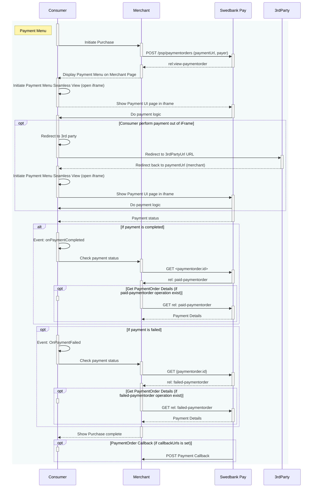

## Step 3: Create Payment Order

Once the consumer has been identified, the next step is to initiate the payment
using `consumerProfileRef` retrieved in the previous step.

We start by performing a `POST` request towards the `paymentorder` resource
with the payer information (such as `consumerProfileRef`) we obtained in the
checkin process described above. This information will appear prefilled in the
Payment Menu.

If you are sending a guest user `POST` request, simply leave out the
`consumerProfileRef` from the input, and the payer will be sent to an empty
Payment Menu. Information like `email`, `address` and `msisdn` can still be
added manually in the payer node. If added, it will appear prefilled in the
Payment Menu.

Remember to read up on our [URL resource][urls].







### Request



### Response

The response back should look something like this (abbreviated for brevity):

{:.code-view-header}
**Response**

```http
HTTP/1.1 201 Created
Content-Type: application/json

{
    "paymentorder": {
        "id": "/psp/paymentorders/{{ page.payment_order_id }}"
    },
    "operations": [
        {
            "href": "{{ page.front_end_url }}/paymentmenu/core/scripts/client/px.paymentmenu.client.js?token={{ page.payment_token }}&culture=sv-SE",
            "rel": "view-paymentorder",
            "method": "GET",
            "contentType": "application/javascript"
        }
    ]
}
```

{:.table .table-striped}
| Field          | Type     | Description                                                                        |
| :------------- | :------- | :--------------------------------------------------------------------------------- |
| `paymentorder` | `object` | The payment order object.                                                          |
| └➔&nbsp;`id`   | `string` |                      |
| `operations`   | `array`  | The array of possible operations to perform, given the state of the payment order. |

The `paymentorder` object is abbreviated since it's just the `id` and
`operations` we are interested in. Store the `id` of the Payment Order
in your system to look up status on the completed payment later.

Then find the `view-paymentorder` operation and embed its `href` in a
`<script>` element.
That script will then load the Seamless View for the Payment Menu. We will look
into how to hook that up next.



## Step 4: Display the Payment Menu

To load the Payment Menu from the JavaScript URL obtained in the back end API
response, it needs to be set as a `script` element's `src` attribute. You can
cause a page reload and do this with static HTML, or you can avoid the page
refresh by invoking the POST to create the payment order through Ajax and then
create the script element with JavaScript, all inside the event handler for
[`onConsumerIdentified`][technical-reference-onconsumer-identified].
The HTML code will be unchanged in this example.

For the guest Payment Menu, lines 23-44 in the JavaScript should be your main
focus. They contain what you need to display the Payment Menu without Checkin.

{:.code-view-header}
**JavaScript**

```js
var request = new XMLHttpRequest();
request.addEventListener('load', function () {
    // We will assume that our own backend returns the
    // exact same as what SwedbankPay returns.
    response = JSON.parse(this.responseText);
    var script = document.createElement('script');
    // This assumes the operations from the response of the POST of the
    // payment order is returned verbatim from the server to the Ajax:
    var operation = response.operations.find(function (o) {
        return o.rel === 'view-consumer-identification';
    });
    script.setAttribute('src', operation.href);
    script.onload = function () {
        payex.hostedView.consumer({
            // The container specifies which id the script will look for
            // to host the checkin component
            container: 'checkin',
            onConsumerIdentified: function onConsumerIdentified(consumerIdentifiedEvent) {
                // When the consumer is identified, we need to perform an AJAX request
                // to our server to forward the consumerProfileRef in a server-to-server
                // POST request to the Payment Orders resource in order to initialize
                // the Payment Menu.
                var request = new XMLHttpRequest();
                request.addEventListener('load', function () {
                    response = JSON.parse(this.responseText);
                    // This is identical to how we get the 'view-consumer-identification'
                    // script from the check-in.
                    var script = document.createElement('script');
                    var operation = response.operations.find(function (o) {
                        return o.rel === 'view-paymentorder';
                    });
                    script.setAttribute('src', operation.href);
                    script.onload = function () {
                        // When the 'view-paymentorder' script is loaded, we can initialize the
                        // Payment Menu inside our 'payment-menu' container.
                        payex.hostedView.paymentMenu({
                            container: 'payment-menu',
                            culture: 'sv-SE'
                        }).open();
                    };
                    // Append the Payment Menu script to the <head>
                    var head = document.getElementsByTagName('head')[0];
                    head.appendChild(script);
                });
                // Like before, you should replace the address here with
                // your own endpoint.
                request.open('POST', '<Your-Backend-Endpoint-Here>', true);
                request.setRequestHeader('Content-Type', 'application/json; charset=utf-8');
                // In this example, we send the entire Consumer Identified Event Argument
                // Object as JSON to the server, as it contains the consumerProfileRef.
                request.send(JSON.stringify(consumerIdentifiedEvent));
            },
            onShippingDetailsAvailable: function onShippingDetailsAvailable(shippingDetailsAvailableEvent) {
                console.log(shippingDetailsAvailableEvent);
            }
        }).open();
    };
    // Appending the script to the head
    var head = document.getElementsByTagName('head')[0];
    head.appendChild(script);
});
// Place in your own API endpoint here.
request.open('POST', '<Your-Backend-Endpoint-Here>', true);
request.setRequestHeader('Content-Type', 'application/json; charset=utf-8');
// We send in the previously mentioned request here to the checkin endpoint.
request.send(JSON.stringify({
    operation: 'initiate-consumer-session',
    language: 'sv-SE',
    shippingAddressRestrictedToCountryCodes : ['NO', 'SE']
}));
```

This should bring up the Payment Menu in a Seamless View looking like
this, depending on whether the payer is logged in (top two) or a guest user
(bottom two). Payments done in SEK will have radio buttons for choosing debit
or credit card.

{:.text-center}
![Payment Menu with payer logged in and card payment opened][login-payment-menu-image]{:width="475" height="760"}

{:.text-center}
![Payment Menu with swedish payer logged in and card payment opened][swedish-login-payment-menu-image]{:width="475" height="800"}

{:.text-center}
![Payment Menu with guest payer and card payment opened][guest-payment-menu-image]{:width="475" height="710"}

{:.text-center}
![Payment Menu with swedish guest payer and card payment opened][swedish-guest-payment-menu-image]{:width="475" height="965"}

When the the payment is completed, the Payment Menu script will be signaled and
a full redirect to the `completeUrl` sent in with the Payment Order will be
performed. When the `completeUrl` on your server is hit, you can inspect the
status on the stored `paymentorder.id` on the server, and then perform
`capture`. If the payment is a `Sale` or one-phase purchase, it will be
automatically captured. A third scenario is if the goods are sent physically to
the payer; then you should await capture until after the goods have been sent.

You may open and close the payment menu using `.open()` and `.close()`
functions. You can also invoke `.refresh()` to
[update the Payment Menu][operations] after any changes to the
order.

Below, you will see a complete overview of the payment menu process.
Notice that there are two ways of performing the payment:

*   Consumer perform payment **out** of `iframe`.
*   Consumer perform payment **within** `iframe`.



Now that you have completed the Payment Menu integration, you can move on to
finalizing the payment in the [After Payment section][after-payment].



[after-payment]: after-payment
[guest-payment-menu-image]: /assets/img/checkout/guest-payment-menu.png
[login-payment-menu-image]: /assets/img/checkout/loggedin-payment-menu.png
[swedish-guest-payment-menu-image]: /assets/img/checkout/swedish-guest-payment-menu.png
[swedish-login-payment-menu-image]: /assets/img/checkout/swedish-logged-in-payment-menu.png
[operations]: /checkout/v2/features/technical-reference/operations
[technical-reference-onconsumer-identified]: /checkout/v2/checkin#step-2-display-swedbank-pay-checkin-module
[urls]: /checkout/v2/features/technical-reference/urls#urls-resource
