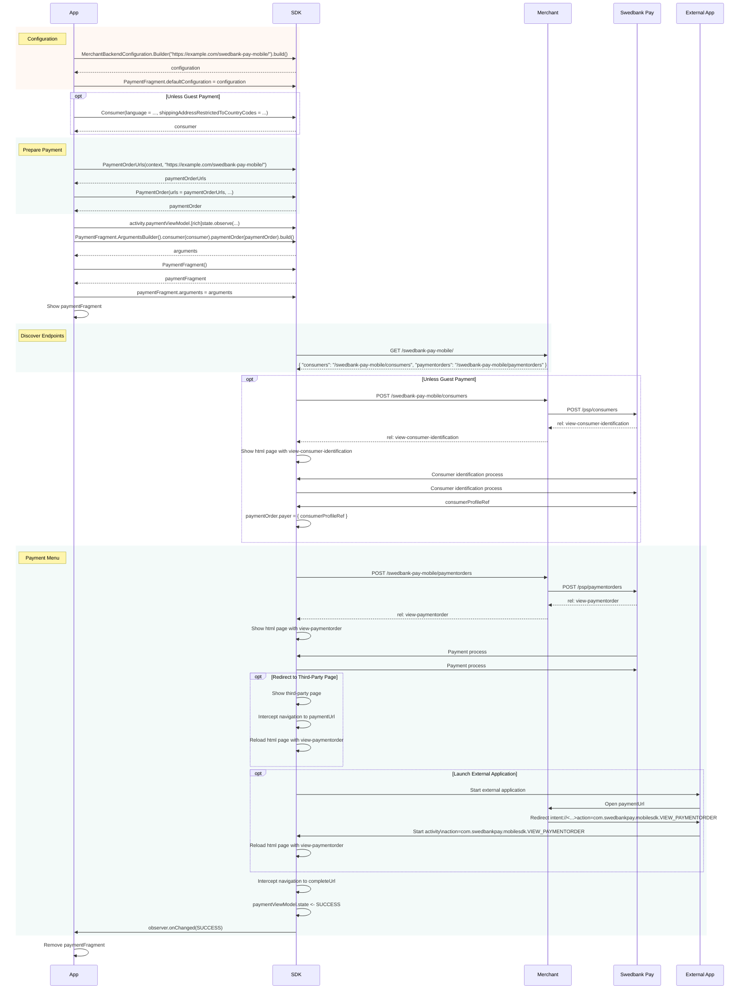


The SDK is at an early stage of development
and is not supported as of yet by Swedbank Pay. It is provided as a
convenience to speed up your development, so please feel free to play around.
However, if you need support, please wait for a future, stable release.




This guide assumes that you are using the Merchant Backend Configuration and
your backend implements the Merchant Backend API. If you are using a custom
backend instead, the meaning of `PaymentFragment` arguments will be different,
as well as any errors reported, but the basic process is the same. The
differences will be highlighted in the chapter on custom backends.

## Installation

The Android component of the Swedbank Pay Mobile SDK is distributed through
JCenter, which is a default repository in Android Studio projects. Therefore,
most applications can integrate the SDK by simply adding the dependency. Please
refer to the [Bintray page][sdk-bintray] for the latest version of the SDK.

## Usage



The public API of the Android SDK is in the package
[`com.swedbankpay.mobilesdk`][dokka-pkg]. The main component is
[`PaymentFragment`][dokka-payfrag], a `Fragment` that handles a single payment
order. To use a `PaymentFragment`, it must have a
[`Configuration`][dokka-config]. In most cases it is enough to construct a
single `Configuration` and set it as the [default][dokka-payfrag-defconf]. In
more advanced cases you will need to subclass `PaymentFragment` and override
[`getConfiguration`][dokka-payfrag-getconf].

For using a backend implementing the Merchant Backend API, the SDK also provides
utility classes in the package
[`com.swedbankpay.mobilesdk.merchantbackend`][dokka-pkg-merch]. The examples on
this page make use of these, including the `Configuration` implementation
[`MerchantBackendConfiguration`][dokka-merchconfig].

```kotlin
val backendUrl = "https://example.com/swedbank-pay-mobile/"

val configuration = MerchantBackendConfiguration.Builder(backendUrl)
    .build()
PaymentFragment.defaultConfiguration = configuration
```

To start a payment, you need a [`PaymentOrder`][dokka-paymentorder], and, unless
making a guest payment, a [`Consumer`][dokka-consumer]. Using a `Consumer` makes
future payments by the same payer easier.

The semantics of `Consumer` properties are the same as the fields of the [`POST
/psp/consumers`][checkin-consumer] request. There are default values for the
`operation` and `language` properties
(`ConsumerOperation.INITIATE_CONSUMER_SESSION` and `Language.ENGLISH`,
respectively).

```kotlin
val consumer = Consumer(
    language = Language.SWEDISH,
    shippingAddressRestrictedToCountryCodes = listOf("NO", "SE", "DK")
)
```

Similarly, the semantics of `PaymentOrder` properties are the same as the fields
of the [`POST /psp/paymentorders`][checkin-paymentorder] request. Sensible
default values are provided for many of the properties. The `urls` property has
no default per se, but there are [convenience
constructors][dokka-paymentorderurls-init] available for it, and it is
recommended that you use them. Assuming you have the Android Payment Url Helper
endpoint set up with the specified static path relative to your backend url
(i.e. `sdk-callback/android-intent`), then using the one of the
`PaymentOrderUrls(context: Context, backendUrl: String)` variants will set the
`paymentUrl` correctly.

```kotlin
val paymentOrder = PaymentOrder(
    currency = Currency.getInstance("SEK"),
    amount = 1500L,
    vatAmount = 375L,
    description = "Test Purchase",
    language = Language.SWEDISH,
    urls = PaymentOrderUrls(context, backendUrl),
    payeeInfo = PayeeInfo(
        // ①
        payeeName = "Merchant1",
        productCategory = "A123",
        orderReference = "or-123456",
        subsite = "MySubsite"
    ),

    orderItems = listOf(
        OrderItem(
            reference = "P1",
            name = "Product1",
            type = ItemType.PRODUCT,
            `class` = "ProductGroup1",
            itemUrl = "https://example.com/products/123",
            imageUrl = "https://example.com/product123.jpg",
            description = "Product 1 description",
            discountDescription = "Volume discount",
            quantity = 4,
            quantityUnit = "pcs",
            unitPrice = 300L,
            discountPrice = 200L,
            vatPercent = 2500,
            amount = 1000L,
            vatAmount = 250L
        )
    )
)
```

*   ① payeeId and payeeReference are required fields, but default to the empty
    string. The assumption here is that your Merchant Backend will override the
    values set here. If your system works better with the Mobile Client setting
    them instead, they are available here also.

To start a payment, create a `PaymentFragment` and set its arguments according
to the payment. The
[`PaymentFragment.ArgumentsBuilder`][dokka-payfrag-argbuilder] class is provided
to help with creating the argument bundle. In most cases you only need to worry
about the [`consumer`][dokka-payfrag-argbuilder-consumer] and
[`paymentOrder`][dokka-payfrag-argbuilder-paymentorder] properties. The payment
process starts as soon as the `PaymentFragment` is visible.

```kotlin
val arguments = PaymentFragment.ArgumentsBuilder()
    .consumer(consumer)
    .paymentOrder(paymentOrder)
    .build()

val paymentFragment = PaymentFragment()
paymentFragment.arguments = arguments

// Now use FragmentManager to show paymentFragment.
// You can also make a navigation graph with PaymentFragment
// and do something like
// findNavController().navigate(R.id.showPaymentFragment, arguments)
```

To observe the payment process, use the [`PaymentViewModel`][dokka-paymentvm]
[of the containing `Activity`][dokka-activity-paymentvm]. When the
`PaymentViewModel` [signals][dokka-paymentvm-livestate] that the payment process
has reached a [final][dokka-paymentvm-state-isfinal] state, you should remove
the `PaymentFragment` and inform the user of the result.

```kotlin
paymentViewModel.state.observe(this, Observer {
    if (it.isFinal == true) {
        // Remove PaymentFragment
        // Check payment status from your backend
        // Notify user
    }
})
```

Note that checking the payment status after completion is outside the scope of
the Mobile SDK. Your backend should collect any information it needs to perform
this check when it services the request to the [Payment Orders
endpoint][backend-payment-orders] made by the `PaymentFragment`.

## Errors

If any errors happen in the payment, the `PaymentViewModel` will report a state
of either `FAILURE` or `RETRYABLE_ERROR`. If the error is retryable, the
`PaymentFragment` will show an error message and a retry control (this is
configurable), but you can also trigger a retry by calling retryPreviousAction
on the `PaymentViewModel`.

When the state is `FAILURE` or `RETRYABLE_ERROR`, and the error condition was
caused by an exception thrown from the `Configuration`, that exception is
available in
[`PaymentViewModel.richState.exception`][dokka-paymentvm-richstate-exception].
The exception will be of any type throw by your `Configuration`. When using
`MerchantBackendConfiguration`, this means it will be an `IOException` if there
was a problem communicating with the backend, and an `IllegalStateException` if
you have made a programming error (consult the exception message). A particular
`IOException` to check for is
[`RequestProblemException`][dokka-problem-exception], which signals that the
backend responded with a Problem message. Another one is
[`UnexpectedResponseException`][dokka-unexpected-exception], which signals that
the SDK did not understand the backend response.

## Problems

If errors are encountered in the payment process, the Merchant Backend is
expected to respond with a [Problem Details for HTTP APIs (RFC 7807)][rfc-7807]
message. If a problem occurs, the application can receive it by observing the
[`richState`][dokka-paymentvm-liverichstate] of the `PaymentViewModel`. If a
problem has occurred, the [`exception`][dokka-paymentvm-richstate-exception]
property of the [`RichState`][dokka-paymentvm-richstate] will contain a
[`RequestProblemException`][dokka-problem-exception]. The problem is then
accessible as [`exception.problem`][dokka-problem-exception-problem]. The
Android SDK will parse any RFC 7807 problem, but it has specialized data types
for known problem types, namely the [Common Problems][swedbankpay-problems] and
the [Merchand Backend Problems][backend-problems].

Problems are presented as a [class hierarchy][dokka-problem] representing
different problem categories. All problems parsed from RFC 7807 messages are
classified as either [`Client`][dokka-problem-client] or
[`Server`][dokka-problem-server] problems. A `Client` problem is one caused by
client behaviour, and is to be fixed by changing the request made to the server.
Generally, a `Client` problem is a programming error, with the possible
exception of
[`Problem.Client.MobileSDK.Unauthorized`][dokka-problem-client-mobilesdk-unauthorized].
A `Server` problem is one caused by a malfunction or lack of service in the
server evironment. A `Server` problem is fixed by correcting the behaviour of
the malfunctioning server, or simply trying again later.

Further, both `Client` and `Server` problems are categorized as `MobileSDK`,
`SwedbankPay`, or `Unknown`. `MobileSDK` problems are ones with [Merchant
Backend problem types][backend-problems], while `SwedbankPay` problems have
[Swedbank Pay API problem types][swedbankpay-problems]. `Unknown` problems are
of types that the SDK has no knowledge of. There is also the interface
[`SwedbankPayProblem`][dokka-swedbankpayproblem], which encompasses both
[`Client`][dokka-problem-client-swedbankpay] and
[`Server`][dokka-problem-server-swedbankpay] type `SwedbankPay` problems.

```kotlin
paymentViewModel.richState.observe(this, Observer {
    if (it.state.isFinal == true) {
        val exeption = it.exception as? RequestProblemException
        if (exception != null) (
            when (val problem = exception.problem) {
                is MerchantBackendProblem.Client.MobileSDK.Unauthorized ->
                    Log.d(TAG, "Credentials invalidated: ${problem.message}")

                if MerchantBackendProblem.Client.MobileSDK ->
                    Log.d(TAG, "Other client error at Merchant Backend: ${problem.raw}")

                is MerchantBackendProblem.Client.SwedbankPay.InputError ->
                    Log.d(TAG, "Payment rejected by Swedbank Pay: ${problem.detail}; Fix: ${problem.action}")

                is MerchantBackendProblem.Client.Unknown ->
                    if (problem.type == "https://example.com/problems/special-problem") {
                        Log.d(TAG, "Special problem occurred: ${problem.detail}")
                    } else {
                        Log.d(TAG, "Unexpected problem: ${problem.raw}")
                    }

                is MerchantBackendProblem.Server.MobileSDK.BackendConnectionTimeout ->
                    Log.d(TAG, "Swedbank Pay timeout: ${problem.message}")

                is MerchantBackendProblem.Server.SwedbankPay.SystemError ->
                    Log.d(TAG, "Generic server error at Swedbank Pay: ${problem.detail}")

                is SwedbankPayProblem ->
                    Log.d(TAG, "Other problem at Swedbank Pay: ${problem.detail}; Fix: ${problem.action}")

                else ->
                    Log.d(TAG, "Unexpected problem: ${problem.raw}")
            }
        }
    }
})
```

## Payment URL and External Applications

The payment process may involve navigating to third-party web pages, or even
launching external applications. To resume processing the payment in the payment
menu, each payment order must have a [Payment Url][paymenturl]. As mentioned
above, the SDK has convenience constructors to set up a payment url for you, and
as the SDK handles showing third-party web pages inside the `PaymentFragment`,
it automatically intercepts any navigation to the payment url, and reloads the
payment menu. This requires no additional setup.

If a third party application is launched, it will signal the return to the
payment menu by opening the payment url, using a standard `ACTION_VIEW`
`Intent`. The payment url is built such that it uses the [Android Payment Url
Helper][android-helper], which serves an html page that converts the url to an
[intent url][android-intent-scheme] and redirects to it. The SDK has an intent
filter for that intent, so the SDK will receive it, bringing the containing
application to the foreground, and reloading the payment menu. If your Merchant
Backend serves the Android Payment Url Helper endpoint at the specified path, no
further setup is needed.

Note that there is an [argument][dokka-payfrag-argbuilder-usebrowser] for
debugging purposes that cause third-party web pages to be opened in an external
application. In that case the process continues analogously to the external
application case. Using this argument should not be necessary, however. If you
do find a case that does not work inside the PaymentFragment, but does work when
using the browser for third-party sites, please file a bug on the Android SDK.



[sdk-bintray]: https://bintray.com/swedbankpay/swedbank-pay-sdk-android/swedbank-pay-sdk-android
[dokka-pkg]: https://github.com/SwedbankPay/swedbank-pay-sdk-android/blob/dev/sdk/dokka_github/sdk/com.swedbankpay.mobilesdk/index.md
[dokka-pkg-merch]: https://github.com/SwedbankPay/swedbank-pay-sdk-android/blob/dev/sdk/dokka_github/sdk/com.swedbankpay.mobilesdk.merchantbackend/index.md
[dokka-payfrag]: https://github.com/SwedbankPay/swedbank-pay-sdk-android/blob/dev/sdk/dokka_github/sdk/com.swedbankpay.mobilesdk/-payment-fragment/index.md
[dokka-payfrag-argbuilder]: https://github.com/SwedbankPay/swedbank-pay-sdk-android/blob/dev/sdk/dokka_github/sdk/com.swedbankpay.mobilesdk/-payment-fragment/-arguments-builder/index.md
[dokka-payfrag-argbuilder-consumer]: https://github.com/SwedbankPay/swedbank-pay-sdk-android/blob/dev/sdk/dokka_github/sdk/com.swedbankpay.mobilesdk/-payment-fragment/-arguments-builder/consumer.md
[dokka-payfrag-argbuilder-paymentorder]: https://github.com/SwedbankPay/swedbank-pay-sdk-android/blob/dev/sdk/dokka_github/sdk/com.swedbankpay.mobilesdk/-payment-fragment/-arguments-builder/payment-order.md
[dokka-payfrag-argbuilder-usebrowser]: https://github.com/SwedbankPay/swedbank-pay-sdk-android/blob/dev/sdk/dokka_github/sdk/com.swedbankpay.mobilesdk/-payment-fragment/-arguments-builder/use-browser.md
[dokka-payfrag-defconf]: https://github.com/SwedbankPay/swedbank-pay-sdk-android/blob/dev/sdk/dokka_github/sdk/com.swedbankpay.mobilesdk/-payment-fragment/-companion/default-configuration.md
[dokka-payfrag-getconf]: https://github.com/SwedbankPay/swedbank-pay-sdk-android/blob/dev/sdk/dokka_github/sdk/com.swedbankpay.mobilesdk/-payment-fragment/get-configuration.md
[dokka-config]: https://github.com/SwedbankPay/swedbank-pay-sdk-android/blob/dev/sdk/dokka_github/sdk/com.swedbankpay.mobilesdk/-configuration/index.md
[dokka-merchconfig]: https://github.com/SwedbankPay/swedbank-pay-sdk-android/blob/dev/sdk/dokka_github/sdk/com.swedbankpay.mobilesdk.merchantbackend/-merchant-backend-configuration/index.md
[dokka-paymentvm]: https://github.com/SwedbankPay/swedbank-pay-sdk-android/blob/dev/sdk/dokka_github/sdk/com.swedbankpay.mobilesdk/-payment-view-model/index.md
[dokka-paymentvm-livestate]: https://github.com/SwedbankPay/swedbank-pay-sdk-android/blob/dev/sdk/dokka_github/sdk/com.swedbankpay.mobilesdk/-payment-view-model/state.md
[dokka-paymentvm-liverichstate]: https://github.com/SwedbankPay/swedbank-pay-sdk-android/blob/dev/sdk/dokka_github/sdk/com.swedbankpay.mobilesdk/-payment-view-model/rich-state.md
[dokka-paymentvm-state-isfinal]: https://github.com/SwedbankPay/swedbank-pay-sdk-android/blob/dev/sdk/dokka_github/sdk/com.swedbankpay.mobilesdk/-payment-view-model/-state/is-final.md
[dokka-paymentvm-richstate]: https://github.com/SwedbankPay/swedbank-pay-sdk-android/blob/dev/sdk/dokka_github/sdk/com.swedbankpay.mobilesdk/-payment-view-model/-rich-state/index.md
[dokka-paymentvm-richstate-exception]: https://github.com/SwedbankPay/swedbank-pay-sdk-android/blob/dev/sdk/dokka_github/sdk/com.swedbankpay.mobilesdk/-payment-view-model/-rich-state/exception.md
[dokka-consumer]: https://github.com/SwedbankPay/swedbank-pay-sdk-android/blob/dev/sdk/dokka_github/sdk/com.swedbankpay.mobilesdk/-consumer/index.md
[dokka-paymentorder]: https://github.com/SwedbankPay/swedbank-pay-sdk-android/blob/dev/sdk/dokka_github/sdk/com.swedbankpay.mobilesdk/-payment-order/index.md
[checkin-consumer]: /checkout/v2/checkin#step-1-initiate-session-for-consumer-identification
[checkin-paymentorder]: /checkout/v2/payment-menu#step-3-create-payment-order
[dokka-paymentorderurls-init]: https://github.com/SwedbankPay/swedbank-pay-sdk-android/blob/dev/sdk/dokka_github/sdk/com.swedbankpay.mobilesdk/-payment-order-urls/-payment-order-urls.md
[dokka-activity-paymentvm]: https://github.com/SwedbankPay/swedbank-pay-sdk-android/blob/dev/sdk/dokka_github/sdk/com.swedbankpay.mobilesdk/payment-view-model.md
[backend-payment-orders]: merchant-backend#payment-orders-endpoint
[dokka-problem-exception]: https://github.com/SwedbankPay/swedbank-pay-sdk-android/blob/dev/sdk/dokka_github/sdk/com.swedbankpay.mobilesdk/
[dokka-problem-exception-problem]: https://github.com/SwedbankPay/swedbank-pay-sdk-android/blob/dev/sdk/dokka_github/sdk/com.swedbankpay.mobilesdk/
[dokka-unexpected-exception]: https://github.com/SwedbankPay/swedbank-pay-sdk-android/blob/dev/sdk/dokka_github/sdk/com.swedbankpay.mobilesdk/
[rfc-7807]: https://tools.ietf.org/html/rfc7807
[swedbankpay-problems]: /introduction#problems
[backend-problems]: merchant-backend#problems
[dokka-problem]: https://github.com/SwedbankPay/swedbank-pay-sdk-android/blob/dev/sdk/dokka_github/sdk/com.swedbankpay.mobilesdk.merchantbackend/-merchant-backend-problem/index.md
[dokka-problem-client]: https://github.com/SwedbankPay/swedbank-pay-sdk-android/blob/dev/sdk/dokka_github/sdk/com.swedbankpay.mobilesdk.merchantbackend/-merchant-backend-problem/-client/index.md
[dokka-problem-client-swedbankpay]: https://github.com/SwedbankPay/swedbank-pay-sdk-android/blob/dev/sdk/dokka_github/sdk/com.swedbankpay.mobilesdk.merchantbackend/-merchant-backend-problem/-client/-swedbank-pay/index.md
[dokka-problem-client-mobilesdk-unauthorized]: https://github.com/SwedbankPay/swedbank-pay-sdk-android/blob/dev/sdk/dokka_github/sdk/com.swedbankpay.mobilesdk.merchantbackend/-merchant-backend-problem/-client/-mobile-s-d-k/-unauthorized/index.md
[dokka-problem-server]: https://github.com/SwedbankPay/swedbank-pay-sdk-android/blob/dev/sdk/dokka_github/sdk/com.swedbankpay.mobilesdk.merchantbackend/-merchant-backend-problem/-server/index.md
[dokka-problem-server-swedbankpay]: https://github.com/SwedbankPay/swedbank-pay-sdk-android/blob/dev/sdk/dokka_github/sdk/com.swedbankpay.mobilesdk.merchantbackend/-merchant-backend-problem/-server/-swedbank-pay/index.md
[dokka-swedbankpayproblem]: https://github.com/SwedbankPay/swedbank-pay-sdk-android/blob/dev/sdk/dokka_github/sdk/com.swedbankpay.mobilesdk.merchantbackend/-swedbank-pay-problem/index.md
[paymenturl]: /checkout/v2/features/technical-reference/payment-url
[android-helper]: merchant-backend#android-payment-url-helper
[android-intent-scheme]: https://developer.chrome.com/multidevice/android/intents
