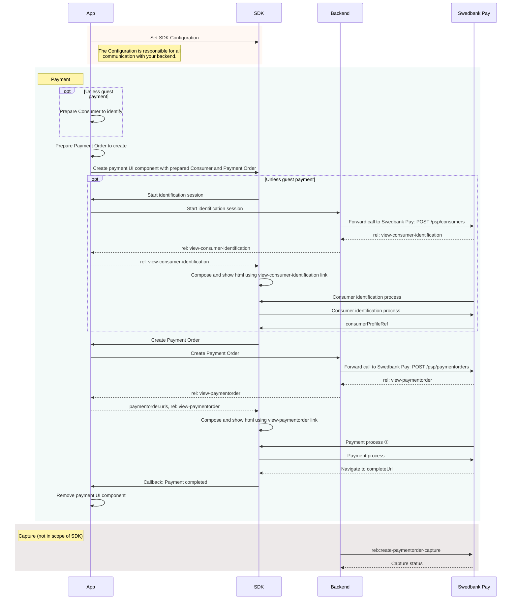


The SDK is at an early stage of development
and is not supported as of yet by Swedbank Pay. It is provided as a
convenience to speed up your development, so please feel free to play around.
However, if you need support, please wait for a future, stable release.




The mobile libraries provide standard UI components (a Fragment on Android, a UIViewController on iOS) that you can integrate in your mobile application in the usual fashion. To work, these components need data from the Swedbank Pay APIs, which you must retrieve through your own servers. At the core, the libraries are agnostic as to how the communication between your app and your servers happens, but an implementation is provided for a server that implements what we call the Merchant Backend API. The Merchant Backend API is designed to transparently reflect the Swedbank Pay API, and the data types used to configure the mobile libraries allow you to organically discover the capabilities of the system.

The SDK is designed to integrate the Swedbank Pay UI inside your application's native UI. It generates any html pages required to show the Swedbank Pay UI internally; it does not support using a Checkout or Payments web page that you host yourself. If doing the latter fits your case better, you can show your web page in a Web View instead. In that case, you may benefit from the [collection of information about showing Checkout or Payments in a Web View][plain-webview].

## Prerequisites

To start integrating the Swedbank Pay Mobile SDK, you need the following:

*   An [HTTPS][https] enabled web server.
*   Agreement that includes [Swedbank Pay Checkout][checkout].
*   Obtained credentials (merchant Access Token) from Swedbank Pay through
    Swedbank Pay Admin. Please observe that Swedbank Pay Checkout encompass
    both the **`consumer`** and **`paymentmenu`** scope.

It is important to secure all communication between your app and your servers. If you wish to use the Merchant Backend API to communicate between your app and your server, an example implementation is provided for Node.js and for Java.

## Introduction

As the Mobile SDK is built on top of [Checkout][checkout], it is a good idea to familiarize yourself with it first. The rest of this document will assume some familiarity with Checkout concepts. Note, however, that you need not build a working Checkout example with web technologies to use the Mobile SDK.

The Mobile SDK provides a mobile component to show [Checkin][checkin] and [Payment Menu][payment-menu] in a mobile application. The integrating application must set a Configuration, which is responsble for making the necessary calls to your backend. A Configuration for a server implementing the Merchant Backend API is bundled with the SDK, but it is simple to implement a Configuration for your custom server. The [After-Payment][after-payment-capture] part is the same as when using Checkout on a web page, and is thus intentionally left out of the scope of the SDK.

See below for a sequence diagram of a payment made using the Mobile SDK. This is a high-level diagram. More detailed views highlighting platform differences will follow for each step.



*   ① The payment process may navigate to 3rd party web pages. This is glossed over in this diagram, but the process and its implications are discussed further in the next pages.

### The Checkin Flow

Internally, the SDK uses the same [Checkin][checkin] flow as would be used on a web page. The flow described on the Checkin page reflects closely what happens inside the SDK. From the perspective of the app using the SDK, that is an implementation detail, and is therefore not reflected in the above diagram. You should, nevertheless, read up on the Checkin documentation before continuing with the SDK documentation.



[plain-webview]: plain-webview
[checkout]: /checkout/v2
[https]: /introduction#connection-and-protocol
[checkin]: /checkout/v2/checkin
[payment-menu]: /checkout/v2/payment-menu
[after-payment-capture]: /checkout/v2/capture
