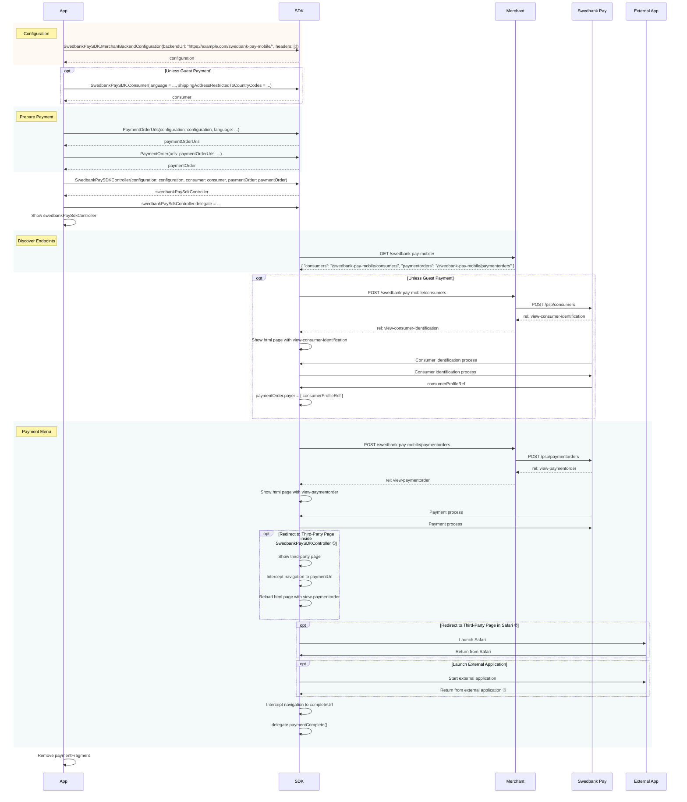
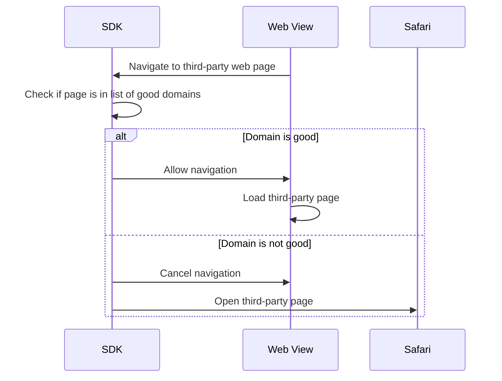
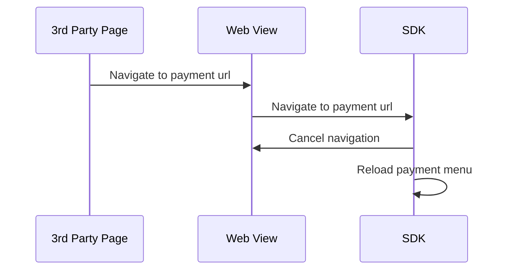
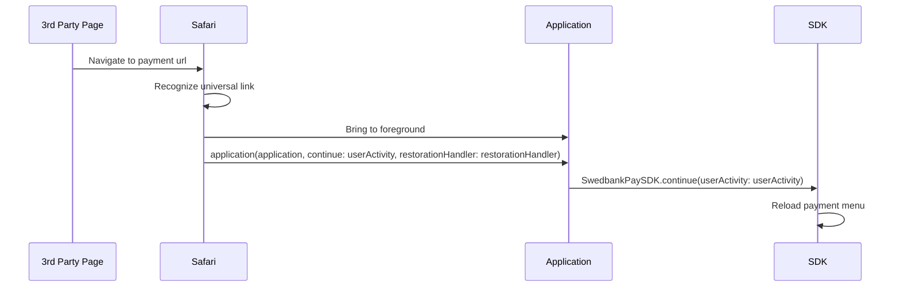
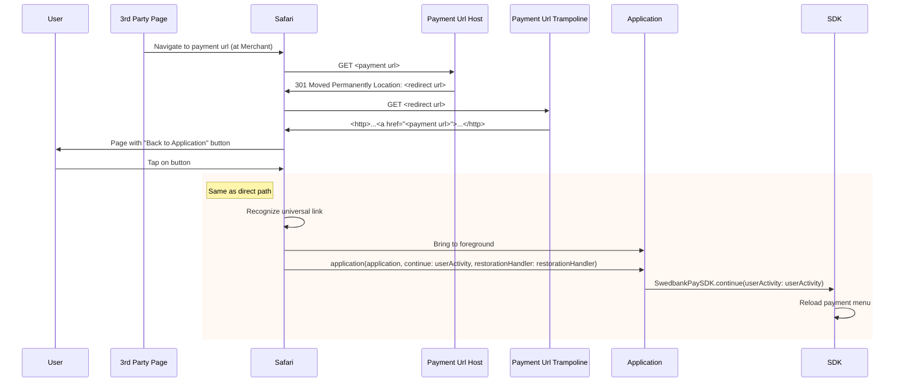
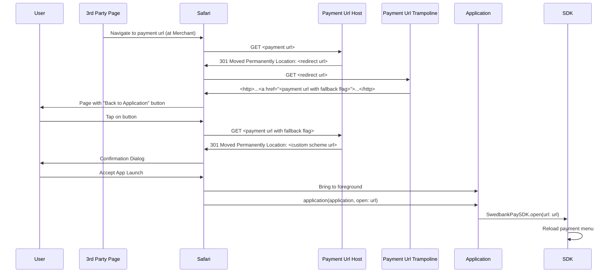


The SDK is at an early stage of development
and is not supported as of yet by Swedbank Pay. It is provided as a
convenience to speed up your development, so please feel free to play around.
However, if you need support, please wait for a future, stable release.




This guide assumes that you are using the Merchant Backend Configuration and your backend implements the Merchant Backend API. If you are using a custom backend instead, the meaning of `SwedbankPaySDKController` arguments will be different, as well as any errors reported, but the basic process is the same. The differences will be highlighted in the chapter on custom backends.

## Installation

The iOS component of the Swedbank Pay Mobile SDK is distributed through [CocoaPods][cocoapods]. If you do not have CocoaPods installed on your development machine, please install it first according to the [instructions][cocoapods-gettingstarted] at the CocoaPods web page.

[Add CocoaPods][cocoapods-using] to your project, if needed. Then, add the [SDK pod][sdk-pod].

Do not forget to run `pod install` after editing the `Podfile`.

### Url Scheme and Associated Domain

The [Payment Url][payment-url] handling in the iOS SDK uses [Universal Links][ios-universal-links], and additionaly a [custom url scheme][ios-custom-scheme] as a fallback mechanism. You must therefore set these up in the app before using the SDK.

The easiest way to add a url scheme to your app is to select the project file, go to the `Info` tab, scroll down to `URL Types`, and click the `+` button to add a new scheme. Insert a single **unique** url scheme to the `URL Schemes` field. You can choose the url `Identifier` freely, but remember that that too should be unique. The `Role` for the url type should be `Editor`. Finally, to mark this url type as the Swedbank Pay payment url scheme, open the `Additional url type properties`, and add a property with the key `com.swedbank.SwedbankPaySDK.callback`, type `Boolean`, and value `YES`.

![Payment url scheme added in project Info tab][custom-scheme-1]

You can also edit the `Info.plist` file directly, if you wish.

![Payment url scheme added in Info.plist editor][custom-scheme-2]

To set up universal links in your application, you first need to [add the Associated Domains capability][xcode-add-cap]. Then, add your Merchant Backend's domain as an [`applinks` associated domain][xcode-add-assoc-domain]. Additionally, your merchant backend must have the appropriate [Apple App Site Association][backend-aasa] file configured.

![Associated Domains Configured][assoc-domains-entitlement]

## Usage



*   ① Only pages tested to work with WKWebView are opened inside SwedbankPaySDKController. This list is updated as new pages are verified.
*   ② Other pages are opened in Safari. See [the section on external applications](#payment-url-and-external-applications) for details on how the process returns to the SDK afterwards.
*   ③ See [the section on external applications](#payment-url-and-external-applications) for details.

The iOS SDK is contained in the module `SwedbankPaySDK`.

```swift
import SwedbankPaySDK
```

The main component of the SDK is `SwedbankPaySDKController`, a `UIViewController` that handles a single payment order. When initializing a `SwedbankPaySDKController`, you must provide a `SwedbankPaySDKConfiguration` that describes the server environment the `SwedbankPaySDKController` is working with, along with a `SwedbankPaySDK.PaymentOrder`, and, unless making a guest payment, a `SwedbankPaySDK.Consumer`. Providing a `SwedbankPaySDK.Consumer` makes future payments by the same payer easier.

The `SwedbankPaySDKConfiguration` is, in most cases, static for a given server environment. Therefore, it makes sense to keep it in a convenient constant. The `SwedbankPaySDK.MerchantBackendConfiguration` initializer can determine your application's custom scheme for payment urls automatically, if you have set it up as described above.

```swift
let swedbankPayConfig = SwedbankPaySDK.MerchantBackendConfiguration(
    backendUrl: "https://example.com/swedbank-pay-mobile/",
    headers: [:]
)
```

The semantics of `SwedbankPaySDK.Consumer` properties are the same as the fields of the [POST /psp/consumers][checkin-consumer]. There are default values for the `operation` and `language` properties (`.InitiateConsumerSession` and `.English`, respectively).

```swift
let consumer = SwedbankPaySDK.Consumer(
    language = .Swedish,
    shippingAddressRestrictedToCountryCodes: = ["NO", "SE", "DK"]
)
```

Similarly, the semantics of `SwedbankPaySDK.PaymentOrder` properties are the same as the fields of the [POST /psp/paymentorders][checkin-paymentorder] request. Sensible default values are provided for many of the properties. In a similar fashion to how the Android SDK works, while there is no default value for the `urls` property, there are convenience constructors for the `SwedbankPaySDK.PaymentOrderUrls` type, which are recommended for general use. Assuming you have the iOS Payment Url Helper endpoint set up with the specified static path relative to your backend url (i.e. `sdk-callback/ios-universal-link`), then using one of the convenience constructors taking a `SwedbankPaySDK.MerchantBackendConfiguration` argument will set the `paymentUrl` correctly.

```swift
let paymentOrder = SwedbankPaySDK.PaymentOrder(
    currency = "SEK",
    amount = 1500,
    vatAmount = 375,
    description = "Test Purchase",
    language = .Swedish,
    urls = SwedbankPaySDK.PaymentOrderUrls(
        configuration: swedbankPayConfig,
        language: .Swedish
    ),
    payeeInfo = SwedbankPaySDK.PayeeInfo(
        // ①
        payeeName = "Merchant1",
        productCategory = "A123",
        orderReference = "or-123456",
        subsite = "MySubsite"
    ),

    orderItems = [
        SwedbankPaySDK.OrderItem(
            reference = "P1",
            name = "Product1",
            type = .Product,
            class = "ProductGroup1",
            itemUrl = URL(string: "https://example.com/products/123"),
            imageUrl = URL(string: "https://example.com/product123.jpg"),
            description = "Product 1 description",
            discountDescription = "Volume discount",
            quantity = 4,
            quantityUnit = "pcs",
            unitPrice = 300,
            discountPrice = 200,
            vatPercent = 2500,
            amount = 1000,
            vatAmount = 250
        )
    ]
)
```

*   ① payeeId and payeeReference are required fields, but default to the empty string. The assumption here is that your Merchant Backend will override the values set here. If your system works better with the Mobile Client setting them instead, they are available here also.

To start a payment, create a `SwedbankPaySDKController` and display it. The payment process starts as soon as the `SwedbankPaySDKController` is visible.

```swift
val paymentController = SwedbankPaySDKController(
    configuration: swedbankPayConfig,
    consumer: consumer,
    paymentOrder: paymentOrder
)

present(paymentController, animated: true, completion: nil)
// There are, of course, many other ways of displaying a view controller
```

To observe the payment process, set a `delegate` to the `SwedbankPaySDKController`. When the delegate is informed that the payment process is finished, you should remove the `SwedbankPaySDKController` and inform the user of the result.

```swift
paymentController.delegate = self
```

```swift
func paymentComplete() {
    dismiss(animated: true, completion: nil)
    // Check payment status from your backend
    // Notify user
}

func paymentCanceled() {
    dismiss(animated: true, completion: nil)
    // Notify user
}

func paymentFailed(error: Error) {
    dismiss(animated: true, completion: nil)
    // Notify user
}
```

Note that checking the payment status after completion is outside the scope of the Mobile SDK. Your backend should collect any information it needs to perform this check when it services the request to the [Payment Orders endpoint][backend-payment-orders] made by the `SwedbankPaySDKController`.

## Problems

If the payment fails for any reason, the cause will be made available as the argument of the `paymentFailed(error:)` delegate method. The error will be of any type thrown by your `SwedbankPaySDKConfiguration`. In the case of `SwedbankPaySDK.MerchantBackendConfiguration` this means `SwedbankPaySDK.MerchantBackendError`.

If errors are encountered in the payment process, the Merchant Backend is expected to respond with a [Problem Details for HTTP APIs (RFC 7807)][rfc-7807] message. If the payment fails because of a problem, the `SwedbankPaySDK.MerchantBackendError` will be `.problem`, the associated value being the problem as parsed from the response. The iOS SDK will parse any RFC 7807 problem, but it has specialized data types for known problem types, namely the [Common Problems][swedbankpay-problems] and the [Merchand Backend Problems][backend-problems].

Problems are expressed in Swift as `enum`s with associated values, representing a hierarchy of problem types. At the root of the hierarchy is `enum SwedbankPaySDK.Problem`, with two cases: `.Client` and `.Server`. A `.Client` problem is one caused by client behaviour, and is to be fixed by changing the request made to the server. Generally, a `.Client` problem is a programming error, with the possible exception of `.Client(.MobileSDK(.Unauthorized))`. A `.Server` problem is one caused by a malfunction or lack of service in the server evironment. A `.Server` problem is fixed by correcting the behaviour of the malfunctioning server, or simply trying again later.

Both `.Client` and `.Server` have an associated value, of type `SwedbankPaySDK.ClientProblem` and `SwedbankPaySDK.ServerProblem` respectively, that further classify the problems as `.MobileSDK`, `.SwedbankPay`, `.Unknown` or `.UnexpectedContent`. `MobileSDK` problems are ones with [Merchant Backend problem types][backend-problems], while `SwedbankPay` problems have [Swedbank Pay API problem types][swedbankpay-problems]. `Unknown` problems are of types that the SDK has no knowledge of. `.UnexpectedContent` problems are not proper RFC 7807 problems, but are emitted when the SDK cannot make sense of the response it received from the backend.

```swift
func paymentFailed(failureReason: SwedbankPaySDKController.FailureReason) {
    // remove SwedbankPaySDKController

    switch failureReason {
        case .Problem(.Client(.MobileSDK(.Unauthorized(let message, _)))):
            print("Credentials invalidated: \(message)")

        case .Problem(.Client(.MobileSDK)):
            print("Other client error at merchant backend")

        case .Problem(.Client(.SwedbankPay(let problem))) where problem.type == .InputError:
            print("Payment rejected by Swedbank Pay: \(problem.detail); Fix: \(problem.action)")

        case .Problem(.Client(.Unknown(let problem))):
            if problem.type == "https://example.com/problems/special-problem" {
                print("Special problem occurred: \(problem.detail)")
            } else {
                print("Unexpected problem: \(problem.raw)")
            }

        case .Problem(.Server(.MobileSDK(.BackendConnectionTimeout(let message, _)))):
            print("Swedbank Pay timeout: \(message)")

        case .Problem(.Server(.SwedbankPay(let problem))) where problem.type == .SystemError:
            print("Generic server error at Swedbank Pay: \(problem.detail)")

        default:
            break
    }
}
```

## Payment URL and External Applications

The payment process may involve navigating to third-party web pages, or even launching external applications. To resume processing the payment in the payment menu, each payment order must have a [Payment Url][paymenturl]. Let us now discuss how that payment url is used in the iOS environment. In any case, using the convenience constructors for `SwedbankPaySDK.PaymentOrderUrls` is recommended; they will generate a unique payment url, which will be routed to the application in all cases, assuming the application and the merchant backend are configured correctly.

`SwedbankPaySDKController` internally uses a `WKWebView`, and in many cases third-party pages can be opened inside that web view. In these cases the SDK can intercept the navigation to the payment url and reload the payment menu without further setup. Unfortunately, our testing has revealed that some web pages used in confirmation flows are incompatible with being opened in a web view. Because of these cases, `SwedbankPaySDKController` will only open known-good pages internally, and will open other pages in Safari instead. The SDK contains a list of domain names of pages tested to work in the web view. You can also specify your own list of domains, and there are debugging features available for testin unknown pages in the web view. Pull requests updating the list of good domains in the SDK are welcome.



Returning to the payment menu from inside the web view is simple: detect the navigation and override it to reload the payment menu instead.



Returning to the payment menu from Safari is more involved. The merchant backend page [explains][ios-paymenturl-helper] the process from the backend perspective; let us now view it from the iOS side.

When the third party page wants to return to the payment menu, it navigates to the payment url. As this navigation is happening inside Safari, the payment url must provide some meaningful respose when Safari makes the request. However, even before that happens, consider the case where the payment url is a [universal link][ios-universal-links] for the application using the SDK. Assuming the [conditions][ios-universal-links-routing] for opening universal links in the registered application are met, then Safari will never actually request the payment url, but will instead open the application, giving it the universal link in its Application Delegate's [`application(_:continue:restorationHandler:)`][uiappdelegate-continueuseractivity] method. Recall that we enabled universal links for the backend url's domain [in the installation instructions](#url-scheme-and-associated-domain). Note that the merchant backend must also be properly configured to [enable univeral links][backend-aasa].

The application delegate is, of course, squarely in the domain of the application; the SDK cannot hook into it automatically. Therefore, you need to implement the [`application(_:continue:restorationHandler:)`][uiappdelegate-continueuseractivity] method, and pass control over to the SDK when a Swedbank Pay SDK Payment Url is passed into it. Do this by calling the `SwedbankPaySDK.continue(userActivity:)` method.

```swift
    func application(
        _ application: UIApplication,
        continue userActivity: NSUserActivity,
        restorationHandler: @escaping ([UIUserActivityRestoring]?) -> Void
    ) -> Bool {
        return SwedbankPaySDK.continue(userActivity: userActivity)
    }
```



Testing has shown, however, that the navigation to the payment url is not always processed as a universal link, and is instead opened in Safari. A major reason for this happening are the conditions placed on routing a universal link to the registered application. A crucial condition to consider is that the navigation must have started from user interaction. It appears that many third party pages involved in verification flows will navigate to the payment url not from user interaction directly, but through e.g. timers. This will, unfortunately, prevent the link from being opened in the application.

As it stands, we need a way to get back to the application even when the payment url is opened in Safari. The simplest way of accomplishing this is to respond with a redirect to a [custom scheme url][ios-custom-scheme]. Doing that will, however, always show an unattractive confirmation alert before the user is directed to the application. Therefore, let us first consider if there is a way to reattempt the universal link navigation, while attempting to maximize the chance of it being routed to the application.

Reviewing the [conditions][ios-universal-links-routing] for universal links opening in the registered application, we note two things: Firstly, the navigation must originate from user interaction. Thus, opening the payment url in Safari must produce a page with a control the user can interact with, which must trigger a navigation to the payment url. Secondly, the navigation must be to a domain different to the current page. This means that opening the payment url must redirect to a page on a different domain, so that a navigation back to the payment url from that page is given to the application to handle.

As explained on the [mechant backend page][ios-paymenturl-helper], we solve this by having the payment url respond with a redirect response to a page with a link to the payment url (but see below).



Finally, to prevent the user being stuck in a situation where universal links fail to work despite our efforts, and to help in the development phase where configurations may end up being broken from time to time, we also have a custom scheme fallback. The way this works is that the when the payment url link is tapped on the page where the payment url redirected to, then in that instance the payment url will redirect to a custom scheme url instead. Now this is, of course, more or less impossible to do, so we relax the requirements of the payment url slightly: In addition to the original payment url, the SDK accepts a payment url with any number of additional query parameters added (note that none may be removed or modified, though). This enables us to alter the behaviour of the backend on the "same" payment url.

To forward the custom-scheme payment urls to the SDK, implement the [`application(_:open:options:)`][uiappdelegate-openurl] method in your application delegate, and call `SwedbankPaySDK.open(url: url)` to let the SDK handle the url.

```swift
    func application(
        _ app: UIApplication,
        open url: URL,
        options: [UIApplication.OpenURLOptionsKey : Any] = [:]
    ) -> Bool {
        return SwedbankPaySDK.open(url: url)
    }
```





[sdk-pod]: https://cocoapods.org/pods/SwedbankPaySDK
[cocoapods]: https://cocoapods.org/
[cocoapods-gettingstarted]: https://guides.cocoapods.org/using/getting-started.html
[cocoapods-using]: https://guides.cocoapods.org/using/using-cocoapods.html
[payment-url]: /checkout/payment-menu#payment-url
[custom-scheme-1]: /assets/img/mobile-sdk/ios-custom-scheme-1.png
[custom-scheme-2]: /assets/img/mobile-sdk/ios-custom-scheme-2.png
[assoc-domains-entitlement]: /assets/img/mobile-sdk/ios-assoc-domain.png
[ios-custom-scheme]: https://developer.apple.com/documentation/uikit/inter-process_communication/allowing_apps_and_websites_to_link_to_your_content/defining_a_custom_url_scheme_for_your_app
[ios-universal-links]: https://developer.apple.com/documentation/uikit/inter-process_communication/allowing_apps_and_websites_to_link_to_your_content
[ios-universal-links-routing]: https://developer.apple.com/documentation/uikit/inter-process_communication/allowing_apps_and_websites_to_link_to_your_content#3001753
[ios-paymenturl-helper]: merchant-backend#ios-payment-url-helper
[uiappdelegate-continueuseractivity]: https://developer.apple.com/documentation/uikit/uiapplicationdelegate/1623072-application
[uiappdelegate-openurl]: https://developer.apple.com/documentation/uikit/uiapplicationdelegate/1623112-application
[backend-aasa]: merchant-backend#apple-app-site-association
[xcode-add-cap]: https://help.apple.com/xcode/mac/current/#/dev88ff319e7
[xcode-add-assoc-domain]: https://developer.apple.com/documentation/safariservices/supporting_associated_domains_in_your_app#3001207
[rfc-7807]: https://tools.ietf.org/html/rfc7807
[swedbankpay-problems]: /introduction#problems
[backend-problems]: merchant-backend#problems
[checkin-consumer]: /checkout/checkin#step-1-initiate-session-for-consumer-identification
[checkin-paymentorder]: /checkout/payment-menu#step-3-create-payment-order
[paymenturl]: /checkout/payment-menu#payment-url
[backend-payment-orders]: merchant-backend#payment-orders-endpoint
