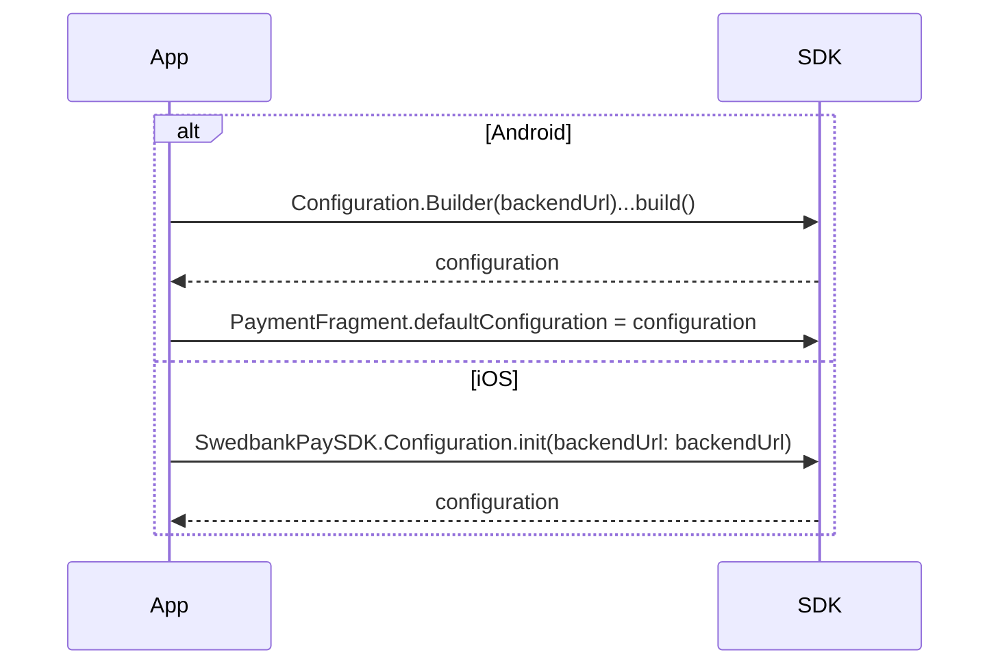
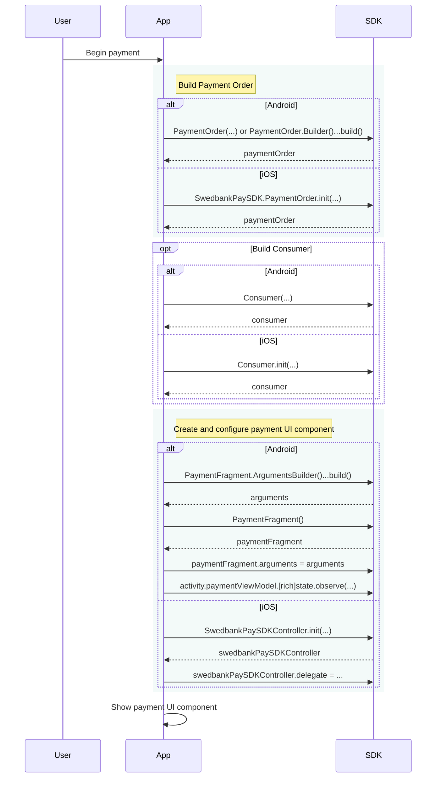
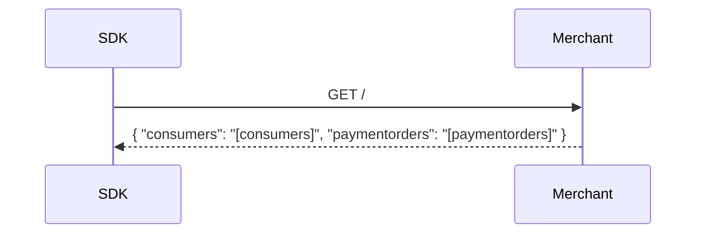
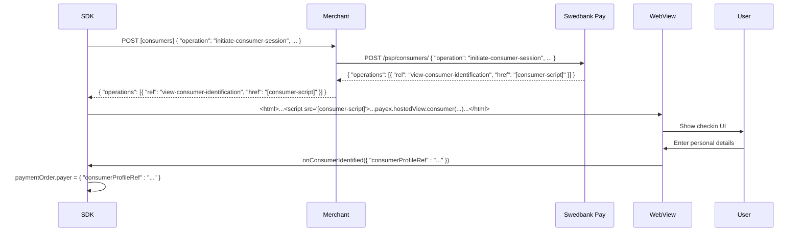
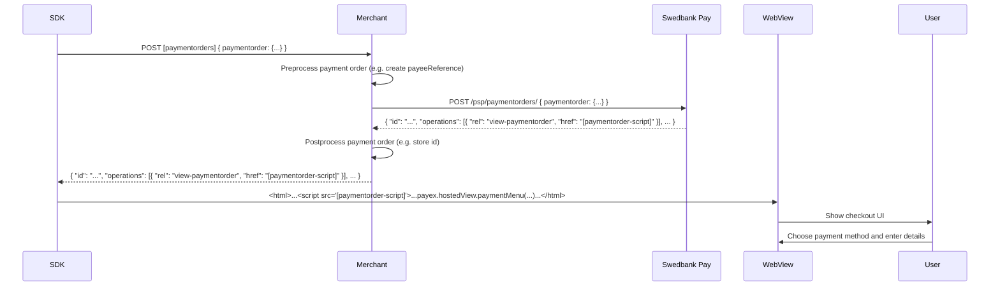
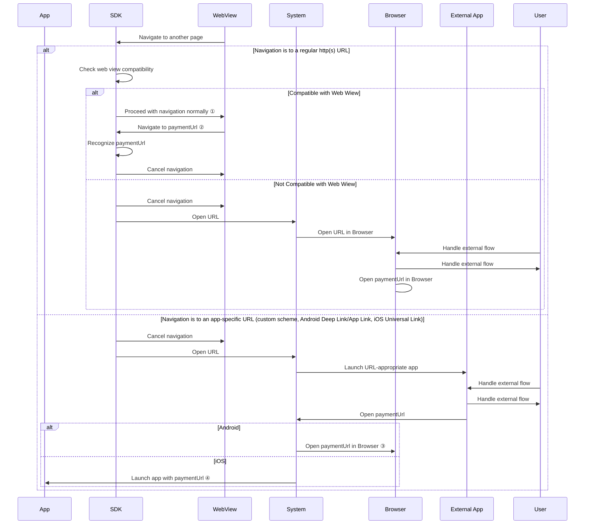
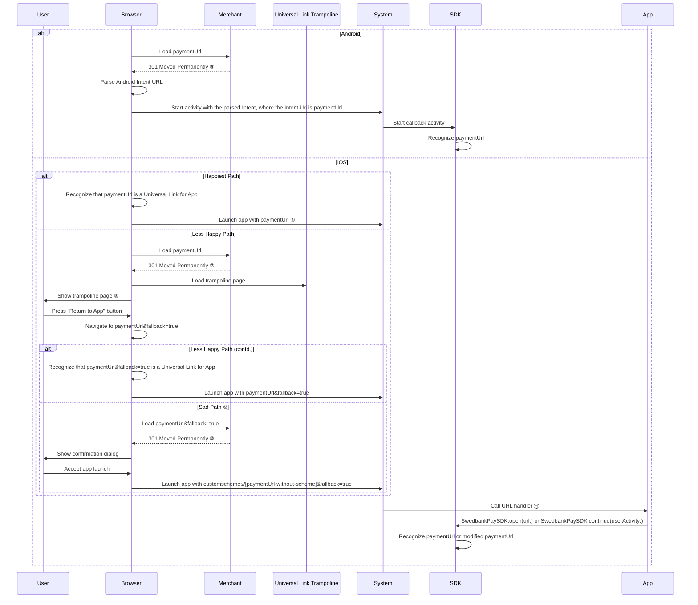
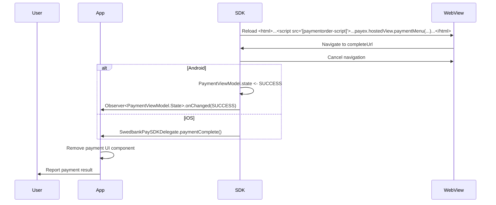


The SDK is at an early stage of development
and is not supported as of yet by Swedbank Pay. It is provided as a
convenience to speed up your development, so please feel free to play around.
However, if you need support, please wait for a future, stable release.






## Initialization

To use the SDK, you must have a valid `Configuration` for it. The API for this is a bit different in Android and iOS, but generally you will only need one `Configuration` for your app. On Android set it to `PaymentFragment.defaultConfiguration`; on iOS store it in a convenient variable.

When you want to make a payment, you construct a `PaymentOrder` with the correct content. A very important part of the `PaymentOrder` is the `urls` field. The SDK has convenience methods for creating one; unless your use-case is advanced, you should use these. On Android use the `PaymentOrderUrls(context, backendUrl, [callbackUrl], [termsOfServiceUrl])` constructor; on iOS use the `PaymentOrderUrls.init(configuration:language:[callbackUrl:][termsOfServiceUrl:])` initializer. In both cases the convenience method depends on your `Configuration` (`backendUrl`is part of the `Configuration`), so be careful if you have multiple Configurations in your app.

Additionally, you may construct a `Consumer` if you wish to identify the payer. This enables saving payment details for further payments.

## Discover Endpoints

The Merchant Backend is specified with a single static entry point; other interfaces are accessed by following links from previous responses. A request to the static entry point currently returns links to the `consumers` and `paymentorders` endpoints. In most cases the response to this request can be cached, and thus only needs to be made once per App session.

## Optional Checkin

If `Consumer` was provided, the payment beings with a "checkin" flow, where the payer is identified. This allows for saving payment details for later payments.

The checkin flow is simple: first a request is made to begin a checkin session, then an html page is constructed using the script link received from that request, and when that page successfully identifies the payer, a javascript callback is received. The `consumerProfileRef` received from that callback is then set to the Payment Order to be processed.

## Begin Checkout

With the Payment Order ready, the SDK begins the "checkout" flow, where the actual payment is made. The checkout flow begins similarly to the checkin flow: a request is made to create a Payment Order, then an html page is constructed and displayed to the user. In the case of the "create Payment Order" request, however, it is expected that the Merchant Backend processes
the request and response: Setting of `payeeId` and `paymentReference` in particular seems better left to the backend; similarly the backend is probably interested in storing the `id` of the created Payment Order for capture and other possible operations.

At this point the user is interacting with the payment menu; the next step depends on the exact payment method chosen.

## External Content

While some payments may be completed inside the payment menu in their entirety, others will require interaction with some external web page, and/or application. In most cases external web pages can be opened in the same web view used to show the payment menu, and when they want to return to the payment menu, they signal this by attempting to navigate to the url set as `paymentUrl` in the Payment Order. We intercept this navigation, and reload the payment menu, as appropriate.

When an external application is launched, the flow signals the return to the payment menu by again opening `paymentUrl`. This time, however, we cannot intercept it. The system then handles opening that url the usual way. For maximum compatibility, `paymentUrl` is a regular https url. On iOS, `paymentUrl` is designed to be in format that is registered as a [Universal Link][ios-universal-links] to the app, which causes the system to open `paymentUrl` in the app. The example backend serves a `/.well-known/apple-app-site-association` file that assigns the paths under `/sdk-callback/` to be Universal Links to the application set in the configuration. The SDK defaults to building `paymentUrl` under this path. Combined with the proper configuration in the app and backend, this makes `paymentUrl`s be Universal Links. On Android 6.0 and later it is possible to do a similar thing, but it is much more difficult to set up on the server side, and we need a solution for earlier versions anyway. Therefore, on Android, `paymentUrl` will be opened in the browser.

Finally, in our testing, we have seen that certain external pages used with certain payment instruments do not work correctly inside a web view, and must be shown in the browser instead. If we determine that the external page is one of these pages, it is opened in the browser. Again, return to the payment menu is signaled by a navigation to `paymentUrl`, which will, in this case be opened in the browser on both platforms (but see below for iOS details).

*   ① The same check is repeated for any further navigation inside the WebView
*   ② All properly configured authentication flows must end up here
*   ③ On Android, paymentUrl is an https URL that redirects to an Android Intent URL.
*   ④ On iOS, paymentUrl is a Universal Link. When an app open a Universal Link to\nanother app, it should be routed to that app instead of the Browser. However, Univeral Links are finicky things, and it is not impossible that it gets opened in the Browser instead. In that case, the flow continues with "paymentUrl opened in Browser" below instead.

### Return from Browser

If the external flow ended with `paymentUrl` opened in the browser, we need a way to get back to the app. On Android, this is simple to accomplish by redirecting to an [Android Intent Uri][android-intent-scheme]; the SDK and backend work together to construct the Intent Uri to point to the correct app. This Intent will cause the app to be brought back into focus, and the PaymentFragment will recognize the `paymentUrl` and reload the payment menu.

On iOS, the situation is more complicated. As mentioned above, `paymentUrl` is a Universal Link, and navigation to it should be routed to the app. However, Universal Links are a bit unreliable, in that they require certain conditions to be fulfilled; otherwise, they are opened in the browser like regular links. Unfortunately, one of the conditions, namely that the navigation originated from the user pressing on a link, is often not fulfilled in the external pages used by payment methods. Therefore, we must have a system that works correctly, even if `paymentUrl` is opened in the browser.

On iOS, we use the following system:

*   `paymentUrl` redirects (301) to a trampoline page hosted at a different domain
*   the trampoline page has a button
*   pressing that button navigates to `paymentUrl` but with an extra parameter
*   `paymentUrl` with the extra parameter redirects to a custom-scheme url

The trampoline page is on a different domain due to another requirement of Universal Links: they are only routed to the app if opened from a different domain. Now, both `paymentUrl` and `paymentUrl` with the extra parameter are Universal Links, and as the second navigation is "forced" to originate from User Interaction, it should be routed to the app. However, if something still goes sideways, and experience says it can, and even this "augmented" `paymentUrl` is opened in the browser, then we finally redirect to a custom-scheme url, which has no choice but to be routed to the app. The reason we do not do this immediately is because using custom schemes triggers a confirmation dialog the developer has no control over, and we want to avoid that.

When the app is then launched with `paymentUrl`, the augmented `paymentUrl`, or the custom-scheme url constructed from `paymentUrl`, the Application Delegate must then forward the url to the SDK using the SwedbankPaySDK.open(url:) or SwedbankPaySDK.continue(userActivity:) method, as the case may be. The SDK will then proceed to reload the payment menu as appropriate.

This system does have the drawback of requiring a custom url scheme, which will almost always be left unused. As we gather more data, we may be able to remove the requirement in the future.

Please see this diagram for an illustration of the different steps in the process:

*   ⑤ Location: `intent://[paymentUrl-without-scheme]/#Intent;scheme=[paymentUrl-scheme];action=com.swedbankpay.mobilesdk.VIEW_PAYMENTORDER;package=[app-package];end;`
*   ⑥ Universal Links have certain conditions for them to be activated. One of these is that the navigation must have started from a user interaction. As many 3D-Secure pages have an automatic redirect, this can cause the link to be opened in the Browser instead. Therefore the chance for this path to be taken is low. (N.B. It does seem than iOS 13.4 has made some change to the logic, causing this happiest path to be hit more often.)
*   ⑦ Location: `https://trampoline.page.host/trampoline/page/path?target=paymentUrl%26fallback=true`
*   ⑧  The "Trampoline Page" has a button, which links back to paymentUrl, but with an additional query parameter (actually this extra parameter is added by the backend when generating the redirect to the trampoline page). Importantly, the Trampoline is on a different domain than paymentUrl, as Universal Links are only forwarded to the app if they are opened from a different domain than the link's domain.
*   ⑨ All cases should be caught by one of these two flows. However, Universal Links remain finicky, and therefore it is good to provide one final fallback.
*   ⑩ Location: `customscheme://[paymentUrl-without-scheme]&fallback=true`. `customscheme` is a URL scheme unique to the App.
*   ⑪ Universal links result in a call to `UIApplicationDelegate.application(_:continue:restorationHandler:)`, while custom-scheme links result in a call to `UIApplicationDelegate.application(_:open:options:)`.

## Payment Completion

When the payment is completed, possibly after reloading the payment menu after a navigation to `paymentUrl`, the payment menu will report success by attempting to navigate to `completeUrl`. The SDK intercepts this and invokes a callback to your app. It is your app's responsibility to then remove the payment UI from view and notify the user. Similarly, if the payment is canceled, the SDK intercepts the navigation to `cancelUrl` and reports the cancellation status to your app.



[android-intent-scheme]: https://developer.chrome.com/multidevice/android/intents
[ios-universal-links]: https://developer.apple.com/documentation/uikit/inter-process_communication/allowing_apps_and_websites_to_link_to_your_content
