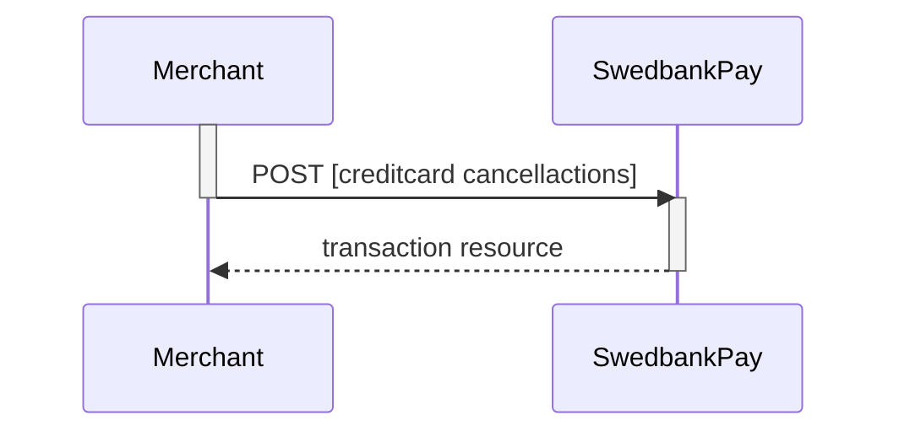
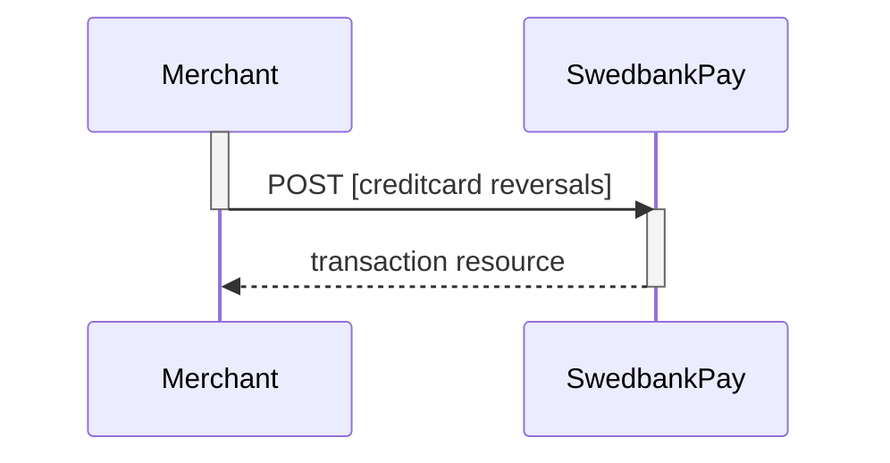

## Options After Posting A Payment

When you detect that the payer reach your `completeUrl` , you need to do a `GET`
request on the payment resource, containing the `paymentID` generated in the
first step, to receive the state of the transaction. You will also be able to
see the available operations after posting a payment.

*   *Abort:* It is possible to abort the process if the payment has no successful
  transactions. See the [`Abort` description here][abort].
*   If the payment shown above is done as a two phase (`Authorization`), you will
  need to implement the `Capture` and `Cancel` requests.
*   For `reversals`, you will need to implement the [Reversal request][reversal].
*   If `CallbackURL` is set: Whenever changes to the payment occur a [Callback
  request][callback] will be posted to the `callbackUrl`, which was generated
  when the payment was created.

## Cancellations

`Cancel` can only be done on a authorized transaction. If you do cancel after
doing a part-capture you will cancel the difference between the capture amount
and the authorization amount.

## Cancel Request

POST /psp/creditcard/payments/{{ page.payment_id }}/cancellations HTTP/1.1
Host: {{ page.api_host }}
Authorization: Bearer <AccessToken>
Content-Type: application/json

{
    "transaction": {
        "description": "Test Cancellation",
        "payeeReference": "ABC123"
    }
}



{:.table .table-striped}
|     Required     | Field                    | Type          | Description                                                                              |
| :--------------: | :----------------------- | :------------ | :--------------------------------------------------------------------------------------- |
|  | `transaction`            | `object`      | The `object` representation of the generic [transaction resource][transaction-resource]. |
|  |     | `string`      | A textual description of the reason for the `cancellation`.                              |
|  |  | `string(50)` |           |

## Cancel Response

The `cancel` resource contains information about a cancellation transaction
made against a payment.

HTTP/1.1 200 OK
Content-Type: application/json

{
    "payment": "/psp/creditcard/payments/{{ page.payment_id }}",
    "cancellation": {
        "id": "/psp/creditcard/payments/{{ page.payment_id }}/cancellations/{{ page.transaction_id }}",
        "transaction": {
            "id": "/psp/creditcard/payments/{{ page.payment_id }}/transactions/{{ page.transaction_id }}",
            "created": "2016-09-14T01:01:01.01Z",
            "updated": "2016-09-14T01:01:01.03Z",
            "type": "Cancellation",
            "state": "Initialized",
            "number": 1234567890,
            "amount": 1000,
            "vatAmount": 250,
            "description": "Test Cancellation",
            "payeeReference": "ABC123",
            "failedReason": "",
            "isOperational": false,
            "operations": []
        }
    }
}



  

    
Field

    
Type

  

  <!-- payment (root sibling) -->
  

    

      <i aria-hidden="true" class="chev swepay-icon-plus-add"></i>
      <code>string</code>
    

    

The relative URL of the payment this <code>cancellation</code> transaction belongs to.

  

  <!-- cancellation (root with children) -->
  

    

      <i aria-hidden="true" class="chev swepay-icon-plus-add"></i>
      <code>object</code>
    

    

The <code>cancellation</code> resource contains information about the <code>cancellation</code> transaction made against a card payment.

    

      <!-- cancellation.id -->
      

        

          <i aria-hidden="true" class="chev swepay-icon-plus-add"></i>
          <code>string</code>
        

        

The relative URL of the created <code>cancellation</code> transaction.

      

      <!-- transaction (object) -->
      

        

          <i aria-hidden="true" class="chev swepay-icon-plus-add"></i>
          <code>object</code>
        

        
        

{{ transaction_md | markdownify }}

        

          <!-- transaction.id -->
          

            

              <i aria-hidden="true" class="chev swepay-icon-plus-add"></i>
              <code>string</code>
            

            

The relative URL of the current  transaction  resource.

          

          <!-- created -->
          

            

              <i aria-hidden="true" class="chev swepay-icon-plus-add"></i>
              <code>date(string)</code>
            

            

The <a href="https://en.wikipedia.org/wiki/ISO_8601">ISO 8601</a>{:target="_blank"} date and time when the transaction was created.

          

          <!-- updated -->
          

            

              <i aria-hidden="true" class="chev swepay-icon-plus-add"></i>
              <code>date(string)</code>
            

            

The <a href="https://en.wikipedia.org/wiki/ISO_8601">ISO 8601</a>{:target="_blank"} date and time when the transaction was updated.

          

          <!-- type -->
          

            

              <i aria-hidden="true" class="chev swepay-icon-plus-add"></i>
              <code>string</code>
            

            

Indicates the transaction type.

          

          <!-- state -->
          

            

              <i aria-hidden="true" class="chev swepay-icon-plus-add"></i>
              <code>string</code>
            

            

Initialized ,  Completed  or  Failed . Indicates the state of the transaction

          

          <!-- number -->
          

            

              <i aria-hidden="true" class="chev swepay-icon-plus-add"></i>
              <code>integer</code>
            

            
            

{{ number_md | markdownify }}

          

          <!-- amount -->
          

            

              <i aria-hidden="true" class="chev swepay-icon-plus-add"></i>
              <code>integer</code>
            

            
            

{{ amount_md | markdownify }}

          

          <!-- vatAmount -->
          

            

              <i aria-hidden="true" class="chev swepay-icon-plus-add"></i>
              <code>integer</code>
            

            
            

{{ vat_amount_md | markdownify }}

          

          <!-- description -->
          

            

              <i aria-hidden="true" class="chev swepay-icon-plus-add"></i>
              <code>string</code>
            

            
            

{{ description_md | markdownify }}

          

          <!-- payeeReference -->
          

            

              <i aria-hidden="true" class="chev swepay-icon-plus-add"></i>
              <code>string(30)</code>
            

            
            

{{ payee_reference_md | markdownify }}

          

          <!-- isOperational -->
          

            

              <i aria-hidden="true" class="chev swepay-icon-plus-add"></i>
              <code>boolean</code>
            

            

<code>true</code>  if the transaction is operational; otherwise  <code>false</code> .

          

          <!-- operations -->
          

            

              <i aria-hidden="true" class="chev swepay-icon-plus-add"></i>
              <code>array</code>
            

            
            

{{ operations_md | markdownify }}

          

        

      

    

  

## List Cancel Transactions

The `cancellations` resource lists the cancellation transactions on a specific
payment.

GET /psp/creditcard/payments/{{ page.payment_id }}/cancellations HTTP/1.1
Host: {{ page.api_host }}
Authorization: Bearer <AccessToken>
Content-Type: application/json





## Cancel Sequence Diagram

## Reversals

This transaction is used when a captured payment needs to be reversed.

## Reversal Request

POST /psp/creditcard/payments/{{ page.payment_id }}/reversals HTTP/1.1
Host: {{ page.api_host }}
Authorization: Bearer <AccessToken>
Content-Type: application/json

{
    "transaction": {
        "amount": 1500,
        "vatAmount": 0,
        "description": "Test Reversal",
        "payeeReference": "ABC123"
    }
}



  

    
Field

    
Type

    
Required

  

  <!-- transaction -->
  

    

      <i aria-hidden="true" class="chev swepay-icon-plus-add"></i>
      <code>object</code>
      
    

    

The <code>object</code> representation of the generic transaction resource</a>.

    

        <!-- amount -->
        

            

                <i aria-hidden="true" class="chev swepay-icon-plus-add"></i>
                <code>integer</code>
                
            

            
            

{{ amount_md | markdownify }}

        

        <!-- vatAmount -->
        

            

                <i aria-hidden="true" class="chev swepay-icon-plus-add"></i>
                <code>integer</code>
                
            

            
            

{{ vat_amount_md | markdownify }}

        

        <!-- description -->
        

            

                <i aria-hidden="true" class="chev swepay-icon-plus-add"></i>
                <code>string</code>
                
            

            

A textual description of the <code>reversal</code>.

        

        <!-- payeeReference -->
        

            

                <i aria-hidden="true" class="chev swepay-icon-plus-add"></i>
                <code>string(50)</code>
                
            

            
            

{{ payee_reference_md | markdownify }}

        

      

  

## Reversal Response

The `reversal` resource contains information about the newly created reversal
transaction.

HTTP/1.1 200 OK
Content-Type: application/json

{
    "payment": "/psp/creditcard/payments/{{ page.payment_id }}",
    "reversal": {
        "id": "/psp/creditcard/payments/{{ page.payment_id }}/reversal/{{ page.transaction_id }}",
        "transaction": {
            "id": "/psp/creditcard/payments/{{ page.payment_id }}/transactions/{{ page.transaction_id }}",
            "created": "2016-09-14T01:01:01.01Z",
            "updated": "2016-09-14T01:01:01.03Z",
            "type": "Reversal",
            "state": "Completed",
            "number": 1234567890,
            "amount": 1000,
            "vatAmount": 250,
            "description": "Test transaction",
            "payeeReference": "AH123456",
            "failedReason": "",
            "isOperational": false,
            "operations": []
        }
    }
}



  

    
Field

    
Type

  

  <!-- payment (root sibling) -->
  

    

      <i aria-hidden="true" class="chev swepay-icon-plus-add"></i>
      <code>string</code>
    

    

The relative URL of the payment this <code>reversal</code> transaction belongs to.

  

  <!-- reversal (root with children) -->
  

    

      <i aria-hidden="true" class="chev swepay-icon-plus-add"></i>
      <code>object</code>
    

    

The <code>reversal</code> resource contains information about the <code>reversal</code> transaction made against a card payment.

    

      <!-- reversal.id -->
      

        

          <i aria-hidden="true" class="chev swepay-icon-plus-add"></i>
          <code>string</code>
        

        

The relative URL of the created <code>reversal</code>transaction.

      

      <!-- transaction (object) -->
      

        

          <i aria-hidden="true" class="chev swepay-icon-plus-add"></i>
          <code>object</code>
        

        
        

{{ transaction_md | markdownify }}

        

          <!-- transaction.id -->
          

            

              <i aria-hidden="true" class="chev swepay-icon-plus-add"></i>
              <code>string</code>
            

            

The relative URL of the current  transaction  resource.

          

          <!-- created -->
          

            

              <i aria-hidden="true" class="chev swepay-icon-plus-add"></i>
              <code>date(string)</code>
            

            

The <a href="https://en.wikipedia.org/wiki/ISO_8601">ISO 8601</a>{:target="_blank"} date and time when the transaction was created.

          

          <!-- updated -->
          

            

              <i aria-hidden="true" class="chev swepay-icon-plus-add"></i>
              <code>date(string)</code>
            

            

The <a href="https://en.wikipedia.org/wiki/ISO_8601">ISO 8601</a>{:target="_blank"} date and time when the transaction was updated.

          

          <!-- type -->
          

            

              <i aria-hidden="true" class="chev swepay-icon-plus-add"></i>
              <code>string</code>
            

            

Indicates the transaction type.

          

          <!-- state -->
          

            

              <i aria-hidden="true" class="chev swepay-icon-plus-add"></i>
              <code>string</code>
            

            
            

{{ state_md | markdownify }}

          

          <!-- number -->
          

            

              <i aria-hidden="true" class="chev swepay-icon-plus-add"></i>
              <code>string</code>
            

            
            

{{ number_md | markdownify }}

          

          <!-- amount -->
          

            

              <i aria-hidden="true" class="chev swepay-icon-plus-add"></i>
              <code>integer</code>
            

            
            

{{ amount_md | markdownify }}

          

          <!-- vatAmount -->
          

            

              <i aria-hidden="true" class="chev swepay-icon-plus-add"></i>
              <code>integer</code>
            

            
            

{{ vat_amount_md | markdownify }}

          

          <!-- description -->
          

            

              <i aria-hidden="true" class="chev swepay-icon-plus-add"></i>
              <code>string</code>
            

            
            

{{ description_md | markdownify }}

          

          <!-- payeeReference -->
          

            

              <i aria-hidden="true" class="chev swepay-icon-plus-add"></i>
              <code>string(30)</code>
            

            
            

{{ payee_reference_md | markdownify }}

          

          <!-- failedReason -->
          

            

              <i aria-hidden="true" class="chev swepay-icon-plus-add"></i>
              <code>string</code>
            

            

The human readable explanation of why the payment failed.

          

          <!-- isOperational -->
          

            

              <i aria-hidden="true" class="chev swepay-icon-plus-add"></i>
              <code>boolean</code>
            

            

<code>true</code>  if the transaction is operational; otherwise  <code>false</code> .

          

          <!-- operations -->
          

            

              <i aria-hidden="true" class="chev swepay-icon-plus-add"></i>
              <code>array</code>
            

            
            

{{ operations_md | markdownify }}

          

        

      

    

  

## List Reversal Transactions

The `reversals` resource lists the reversal transactions (one or more) on a
specific payment.

GET /psp/creditcard/payments/{{ page.payment_id }}/reversals HTTP/1.1
Host: {{ page.api_host }}
Authorization: Bearer <AccessToken>
Content-Type: application/json





## Reversal Sequence Diagram



## Remove Payment Token

If you, for any reason, need to delete a paymentToken you use the
`Delete payment token` request.

{% include alert.html type="warning"
                      icon="warning"
                      body="Please note that this call does not erase the card number stored at Swedbank
  Pay. A card number is automatically deleted six months after a successful
  `Delete payment token` request. If you want to remove card information
  beforehand, you need to contact
  [ehandelsetup@swedbankpay.dk](mailto:ehandelsetup@swedbankpay.dk),
  [verkkokauppa.setup@swedbankpay.fi](mailto:verkkokauppa.setup@swedbankpay.fi),
  [ehandelsetup@swedbankpay.no](mailto:ehandelsetup@swedbankpay.no) or
  [ehandelsetup@swedbankpay.se](mailto:ehandelsetup@swedbankpay.se); and supply
  them with the relevant transaction reference or payment token." %}

## Delete Token Request

PATCH /psp/creditcard/payments/instrumentData/{{ page.payment_token }} HTTP/1.1
Host: {{ page.api_host }}
Authorization: Bearer <AccessToken>
Content-Type: application/json

{
  "state": "Deleted",
  "tokenType" : "PaymentToken",
  "comment": "Comment on why the deletion is happening"
}



## Delete Token Response

HTTP/1.1 200 OK
Content-Type: application/json

{
    "instrumentData": {
        "id": "/psp/creditcard/payments/instrumentdata/{{ page.payment_token }}",
        "paymentToken": "{{ page.payment_token }}",
        "payeeId": "{{ page.merchant_id }}",
        "isDeleted": true,
        "isPayeeToken": false,
        "cardBrand": "MasterCard",
        "maskedPan": "123456xxxxxx1111",
        "expiryDate": "MM/YYYY"
    }
}





[abort]: /old-implementations/payment-instruments-v1/card/after-payment#abort
[callback]: /old-implementations/payment-instruments-v1/card/features/core/callback
[reversal]: /old-implementations/payment-instruments-v1/card/features/core/reversal
[transaction-resource]: /old-implementations/payment-instruments-v1/card/technical-reference/transactions
