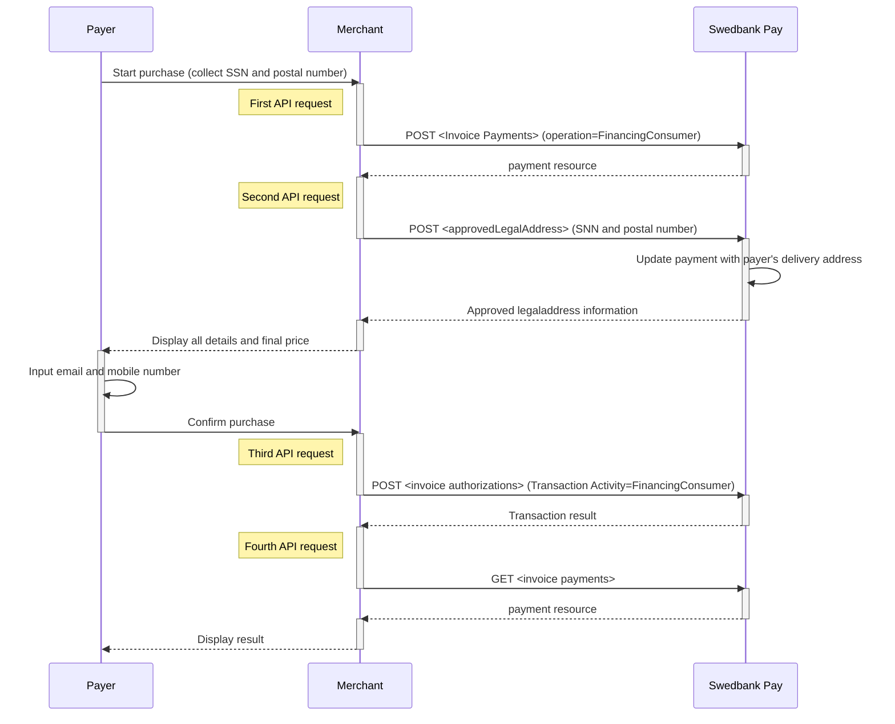







## Invoice Direct Implementation Flow

1.  Collect all purchase information and send it in a `POST` request to Swedbank
   Pay. Make sure to include personal information (SSN and postal code).

2.  Make a new `POST` request towards Swedbank Pay to retrieve the name and
   address of the customer to create a purchase.

3.  Create a `POST`request to retrieve the transaction status.

4.  Send a  `GET` request with the `paymentID` to get the authorization result.

5.  Make a Capture by creating a `POST` request.

*   An invoice payment is always two-phased based - you create an Authorize
transaction, that is followed by a `Capture` or `Cancel` request.
The `Capture` , `Cancel`, `Reversal` opions are
described in [features][features].





The 3 most important steps in the Invoice Direct flow are shown below.

## Step 1: Create A Purchase

Our `payment` example below uses the [`FinancingConsumer`]({{
financing_consumer_url }}) value.



## Financing Consumer Request

{:.code-view-header}
**Request**

```http
POST /psp/invoice/payments HTTP/1.1
Host: {{ page.api_host }}
Authorization: Bearer <AccessToken>
Content-Type: application/json

{
    "payment": {
        "operation": "FinancingConsumer",
        "intent": "Authorization",
        "currency": "SEK",
        "prices": [
            {
                "type": "Invoice",
                "amount": 1500,
                "vatAmount": 0
            }
        ],
        "description": "Test Purchase",
        "generatePaymentToken": false,
        "userAgent": "Mozilla/5.0...",
        "language": "sv-SE",
        "urls": {
            "completeUrl": "https://example.com/payment-completed",
            "cancelUrl": "https://example.com/payment-cancelled",
            "callbackUrl": "https://example.com/payment-callback",
            "logoUrl": "https://example.com/logo.png",
            "termsOfServiceUrl": "https://example.com/terms.pdf"
        },
        "payeeInfo": {
            "payeeId": "{{ page.merchant_id }}",
            "payeeReference": "PR123",
            "payeeName": "Merchant1",
            "productCategory": "PC1234",
            "subsite": "MySubsite"
        },
        "payer": {
            "payerReference": "AB1234",
        }
    },
    "invoice": {
        "invoiceType": "PayExFinancingSe"
    }
}
```


{:.table .table-striped .mb-5}
|     Required     | Field                             | Type          | Description                                                                                                                                                                                                                                                                                                            |
| :--------------: | :-------------------------------- | :------------ | :--------------------------------------------------------------------------------------------------------------------------------------------------------------------------------------------------------------------------------------------------------------------------------------------------------------------- |
| ︎︎︎︎︎ |                          | `object`      | The `payment` object contains information about the specific payment.                                                                                                                                                                                                                                                  |
| ︎︎︎︎︎ |                | `string`      | The operation that the `payment` is supposed to perform. The [`FinancingConsumer`]({{ financing_consumer_url }}) operation is used in our example. |
| ︎︎︎︎︎ |                   | `string`      | `Authorization` is the only intent option for invoice. Reserves the amount, and is followed by a [cancellation]({{ cancel_url }}) or [capture]({{ capture_url }}) of funds.                                                                                                                                                                |
| ︎︎︎︎︎ |                 | `string`      | NOK, SEK, DKK, USD or EUR.                                                                                                                                                                                                                                                                                             |
| ︎︎︎︎︎ |                   | `object`      | The `prices` resource lists the prices related to a specific payment.                                                                                                                                                                                                                                                  |
| ︎︎︎︎︎ |                    | `string`      |                                                                                                                                                                                                                                                                                             |
| ︎︎︎︎︎ |                  | `integer`     |                                                                                                                                                                                                                                                                               |
| ︎︎︎︎︎ |               | `integer`     |                                                                                                                                                                                                                                                                            |
| ︎︎︎︎︎ |              | `string(40)`  |                                                                                                                                                                                                                                          |
| ︎︎︎︎︎ |                | `string`      |                                                                                                                                                                                                                                                    |
| ︎︎︎︎︎ |                 | `string`      |                                                                                                                                                                                                                                                      |
| ︎︎︎︎︎ |                     | `object`      | The `urls` resource lists urls that redirects users to relevant sites.                                                                                                                                                                                                                                                 |
|                  |                 | `array`       | The array of URLs valid for embedding of Swedbank Pay Seamless Views. If not supplied, view-operation will not be available.                                                                                                                                                                                             |
| ︎︎︎︎︎ |             | `string`      |                      |
|                  |               | `string`      | The URL to redirect the payer to if the payment is cancelled. Only used in redirect scenarios. Can not be used simultaneously with `paymentUrl`; only `cancelUrl` or `paymentUrl` can be used, not both.                                                                                                                |
|                  |             | `string`      |                                                                                                                                                                 |
|                  |                 | `string`      |                                                         |
|                  |       | `string`      |                                                                                                                                                                                                                                                                    |
| ︎︎︎︎︎ |                | `object`      |                                                                                                                                                                                                                                                                   |
| ︎︎︎︎︎ |                 | `string`      | This is the unique id that identifies this payee (like merchant) set by Swedbank Pay.                                                                                                                                                                                                                                  |
| ︎︎︎︎︎ |          | `string` |                                                                                                                                                                                                                |
|                  |               | `string`      | The payee name (like merchant name) that will be displayed when redirected to Swedbank Pay.                                                                                                                                                                                                                |
|                  |         | `string`      | A product category or number sent in from the payee/merchant. This is not validated by Swedbank Pay, but will be passed through the payment process and may be used in the settlement process.                                                                                                                         |
|                  |          | `string(50)`  | The order reference should reflect the order reference found in the merchant's systems.                                                                                                                                                                                                                                |
|                  |                 | `string(40)`  |                                                                                                                                                             |
|                  |                    | `string`     | The `payer` object, containing information about the payer.                                                                                                                                                                                                                                          |
|                  |          | `string`     |                                                                                                                                                                                                                                                            |



## Financing Consumer Response

{:.code-view-header}
**Response**

```http
HTTP/1.1 200 OK
Content-Type: application/json

{
    "payment": {
        "id": "/psp/invoice/payments/{{ page.payment_id }}",
        "number": 1234567890,
        "created": "2016-09-14T13:21:29.3182115Z",
        "updated": "2016-09-14T13:21:57.6627579Z",
        "state": "Ready",
        "operation": "Purchase",
        "intent": "Authorization",
        "currency": "SE",
        "amount": 0,
        "remainingCaptureAmount": 1500,
        "remainingCancellationAmount": 1500,
        "remainingReversalAmount": 0,
        "description": "Test Purchase",
        "initiatingSystemUserAgent": "swedbankpay-sdk-dotnet/3.0.1",
        "userAgent": "Mozilla/5.0...",
        "language": "sv-SE",
        "prices": {
            "id": "/psp/invoice/payments/{{ page.payment_id }}/prices"
        },
        "transactions": {
            "id": "/psp/invoice/payments/{{ page.payment_id }}/transactions"
        },
        "authorizations": {
            "id": "/psp/invoice/payments/{{ page.payment_id }}/authorizations"
        },
        "captures": {
            "id": "/psp/invoice/payments/{{ page.payment_id }}/captures"
        },
        "reversals": {
            "id": "/psp/invoice/payments/{{ page.payment_id }}/reversals"
        },
        "cancellations": {
            "id": "/psp/invoice/payments/{{ page.payment_id }}/cancellations"
        },
        "payeeInfo": {
            "id": "/psp/invoice/payments/{{ page.payment_id }}/payeeInfo"
        },
        "payers": {
           "id": "/psp/trustly/payments/{{ page.payment_id }}/payers"
        },
        "urls": {
            "id": "/psp/invoice/payments/{{ page.payment_id }}/urls"
        },
        "settings": {
            "id": "/psp/invoice/payments/{{ page.payment_id }}/settings"
        },
        "approvedLegalAddress": {
            "id": "/psp/invoice/payments/{{ page.payment_id }}/approvedlegaladdress"
        },
        "maskedApprovedLegalAddress": {
            "id": "/psp/invoice/payments/{{ page.payment_id }}/maskedapprovedlegaladdress"
        }
    },
    "approvedLegalAddress": {
        "id": "/psp/invoice/payments/{{ page.payment_id }}/approvedlegaladdress"
    },
    "operations": [
        {
            "href": "{{ page.api_url }}/psp/invoice/payments/{{ page.payment_id }}/captures",
            "rel": "create-capture",
            "method": "POST"
        },
        {
            "href": "{{ page.api_url }}/psp/invoice/payments/{{ page.payment_id }}/cancellations",
            "rel": "create-cancel",
            "method": "POST"
        },
        {
            "href": "{{ page.api_url }}/psp/invoice/payments/{{ page.payment_id }}/approvedlegaladdress",
            "rel": "create-approved-legal-address",
            "method": "POST"
        }
    ]
}
```


{:.table .table-striped .mb-5}
| Field                  | Type         | Description                                                                                                                                                                                                                                                                                                                                                |
| :--------------------- | :----------- | :--------------------------------------------------------------------------------------------------------------------------------------------------------------------------------------------------------------------------------------------------------------------------------------------------------------------------------------------------------- |
|      | `object`     | The `payment` object contains information about the specific payment.                                                                                                                                                                                                                                                                                      |
|              | `string`     |                                                                                                                                                                                                                                                                                                                       |
|          | `integer`    |  |
|         | `string`     | The ISO-8601 date of when the payment was created.                                                                                                                                                                                                                                                                                                         |
|         | `string`     | The ISO-8601 date of when the payment was updated.                                                                                                                                                                                                                                                                                                         |
|           | `string`     | `Ready`, `Pending`, `Failed` or `Aborted`. Indicates the state of the payment, not the state of any transactions performed on the payment. To find the state of the payment's transactions (such as a successful authorization), see the `transactions` resource or the different specialized type-specific resources such as `authorizations` or `sales`. |
|          | `object`     | The `prices` resource lists the prices related to a specific payment.                                                                                                                                                                                                                                                                                      |
|           | `string`     |                                                                                                                                                                                                                                                                                                     |
|     | `string(40)` |                                                                                                                                                                                                                                                                              |
|       | `string`     |                                                                                                                                                                                                                                                                                        |
|        | `string`     |                                                                                                                                                                                                                                                                                          |
|            | `string`     | The URL to the  urls  resource where all URLs related to the payment can be retrieved.                                                                                                                                                                                                                                                                     |
|       | `string`     |                                                                                                                                                                                                                                                  |
|          | `string`     | The URL to the `payer` resource where the information about the payer can be retrieved.                                                        |
|   | `array`      |                                                                                                                                                                                                                                                                                                                 |
|       | `string`     | The HTTP method to use when performing the operation.                                                                                                                                                                                                                                                                                                      |
|         | `string`     | The target URL to perform the operation against.                                                                                                                                                                                                                                                                                                           |
|          | `string`     | The name of the relation the operation has to the current resource.                                                                                                                                                                                                                                                                                        |



## Step 2: Get `approvedLegalAddress` Confirmation

Retrieve the payer's legal address, which is needed to do the next step.

## Approved Legal Address Request

{:.code-view-header}
**Request**

```http
POST /psp/invoice/payments HTTP/1.1
Host: {{ page.api_host }}
Authorization: Bearer <AccessToken>
Content-Type: application/json

{
    "addressee": {
        "socialSecurityNumber": "194810205957",
        "zipCode": "55560"
    }
}
```

## Approved Legal Address Response

{:.code-view-header}
**Response**

```http
HTTP/1.1 200 OK
Content-Type: application/json

{
    "payment": "/psp/invoice/payments/{{ page.payment_id }}",
    "approvedLegalAddress": {
        "id": "/psp/invoice/payments/{{ page.payment_id }}/approvedlegaladdress",
        "addressee": "Leo 6",
        "streetAddress": "Gata 535",
        "zipCode": "55560",
        "city": "Vaxholm",
        "countryCode": "SE"
    }
}
```

## Step 3: Complete The Payment

Add the legal address in your complete request.

## Complete Request

{:.code-view-header}
**Request**

```http
POST /psp/invoice/payments HTTP/1.1
Host: {{ page.api_host }}
Authorization: Bearer <AccessToken>
Content-Type: application/json

{
    "transaction": {
        "activity": "FinancingConsumer"
    },
    "consumer": {
        "socialSecurityNumber": "194810205957",
        "customerNumber": "123456",
        "email": "someExample@payex.com",
        "msisdn": "+46765432198",
        "ip": "127.0.0.1"
    },
    "legalAddress": {
        "addressee": "Leo 6",
        "streetAddress": "Gata 535",
        "zipCode": "55560",
        "city": "Vaxholm",
        "countryCode": "SE"
    }
}
```

## Complete Response

{:.code-view-header}
**Response**

```http
HTTP/1.1 200 OK
Content-Type: application/json

{
    "payment": "/psp/invoice/payments/{{ page.payment_id }}",
    "authorization": {
        "shippingAddress": {
            "id": "/psp/invoice/payments/{{ page.payment_id }}/shippingaddress"
        },
        "legalAddress": {
            "id": "/psp/invoice/payments/{{ page.payment_id }}/legaladdress"
        },
        "id": "/psp/invoice/payments/{{ page.payment_id }}/authorizations/23fc8ea7-57b8-44bb-8313-08d7ca2e1a26",
        "transaction": {
            "id": "/psp/invoice/payments/{{ page.payment_id }}/transactions/23fc8ea7-57b8-44bb-8313-08d7ca2e1a26",
            "created": "2020-03-17T09:46:10.3506297Z",
            "updated": "2020-03-17T09:46:12.2512221Z",
            "type": "Authorization",
            "state": "Completed",
            "number": 71100537930,
            "amount": 4201,
            "vatAmount": 0,
            "description": "Books & Ink",
            "payeeReference": "1584438350",
            "isOperational": false,
            "operations": []
        }
    }
}
```

The sequence diagram below shows a high level description of the invoice
process, including the four requests you have to send to Swedbank Pay to create
an authorized transaction.

## Invoice Flow



## Options After Posting A Purchase Payment

Head over to [Capture][capture] to complete the Invoice Direct integration.



[capture]: /old-implementations/payment-instruments-v1/invoice/capture
[features]: /old-implementations/payment-instruments-v1/invoice/features
