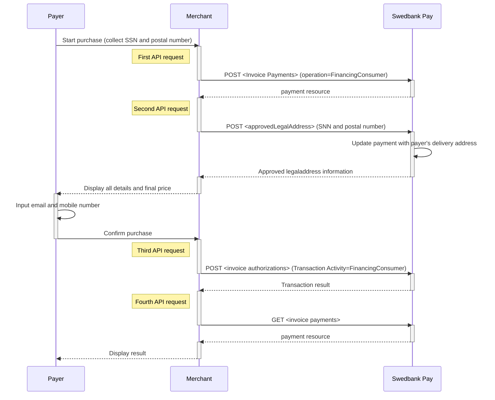







## Invoice Direct Implementation Flow

1.  Collect all purchase information and send it in a `POST` request to Swedbank
   Pay. Make sure to include personal information (SSN and postal code).

2.  Make a new `POST` request towards Swedbank Pay to retrieve the name and
   address of the customer to create a purchase.

3.  Create a `POST`request to retrieve the transaction status.

4.  Send a  `GET` request with the `paymentID` to get the authorization result.

5.  Make a Capture by creating a `POST` request.

*   An invoice payment is always two-phased based - you create an Authorize
transaction, that is followed by a `Capture` or `Cancel` request.
The `Capture` , `Cancel`, `Reversal` opions are
described in [features][features].





The 3 most important steps in the Invoice Direct flow are shown below.

## Step 1: Create A Purchase

Our `payment` example below uses the [`FinancingConsumer`]({{
financing_consumer_url }}) value.



## Financing Consumer Request

POST /psp/invoice/payments HTTP/1.1
Host: {{ page.api_host }}
Authorization: Bearer <AccessToken>
Content-Type: application/json

{
    "payment": {
        "operation": "FinancingConsumer",
        "intent": "Authorization",
        "currency": "SEK",
        "prices": [
            {
                "type": "Invoice",
                "amount": 1500,
                "vatAmount": 0
            }
        ],
        "description": "Test Purchase",
        "generatePaymentToken": false,
        "userAgent": "Mozilla/5.0...",
        "language": "sv-SE",
        "urls": {
            "completeUrl": "https://example.com/payment-completed",
            "cancelUrl": "https://example.com/payment-cancelled",
            "callbackUrl": "https://example.com/payment-callback",
            "logoUrl": "https://example.com/logo.png",
            "termsOfServiceUrl": "https://example.com/terms.pdf"
        },
        "payeeInfo": {
            "payeeId": "{{ page.merchant_id }}",
            "payeeReference": "PR123",
            "payeeName": "Merchant1",
            "productCategory": "PC1234",
            "subsite": "MySubsite"
        },
        "payer": {
            "payerReference": "AB1234",
        }
    },
    "invoice": {
        "invoiceType": "PayExFinancingSe"
    }
}



  

    
Field

    
Type

    
Required

  

  <!-- payment (root) -->
  

    

      <i aria-hidden="true" class="chev swepay-icon-plus-add"></i>
      <code>object</code>
      
    

    

The <code>payment</code> object contains information about the specific payment.

    

      <!-- operation -->
      

        

          <i aria-hidden="true" class="chev swepay-icon-plus-add"></i>
          <code>string</code>
          
        

        

The operation that the <code>payment</code> is supposed to perform. The <code>[FinancingConsumer]({{ financing_consumer_url }})</code> operation is used in our example.

      

      <!-- intent -->
      

        

          <i aria-hidden="true" class="chev swepay-icon-plus-add"></i>
          <code>string</code>
          
        

        

<code>Authorization</code> is the only intent option for invoice. Reserves the amount, and is followed by a <a href="{{ cancel_url }}">cancellation</a> or <a href="{{ capture_url }}">capture</a> of funds.

      

      <!-- currency -->
      

        

          <i aria-hidden="true" class="chev swepay-icon-plus-add"></i>
          <code>enum(string)</code>
          
        

        

The currency of the payment in the ISO 4217 format (e.g. <code>DKK</code>, <code>EUR</code>, <code>NOK</code> or <code>SEK</code>). Some payment methods are only available with selected currencies.

      

      <!-- prices (object) -->
      

        

          <i aria-hidden="true" class="chev swepay-icon-plus-add"></i>
          <code>object</code>
          
        

        

The <code>prices</code> resource lists the prices related to a specific payment.

        

          <!-- type -->
          

            

              <i aria-hidden="true" class="chev swepay-icon-plus-add"></i>
              <code>string</code>
              
            

            
            

{{ prices_type_md | markdownify }}

          

          <!-- amount -->
          

            

              <i aria-hidden="true" class="chev swepay-icon-plus-add"></i>
              <code>integer</code>
              
            

            
            

{{ amount_md_lvl2 | markdownify }}

          

          <!-- vatAmount -->
          

            

              <i aria-hidden="true" class="chev swepay-icon-plus-add"></i>
              <code>integer</code>
              
            

            
            

{{ vat_amount_md_lvl2 | markdownify }}

          

        

      

      <!-- description -->
      

        

          <i aria-hidden="true" class="chev swepay-icon-plus-add"></i>
          <code>string(40)</code>
          
        

        
        

{{ description_md | markdownify }}

      

      <!-- userAgent -->
      

        

          <i aria-hidden="true" class="chev swepay-icon-plus-add"></i>
          <code>string</code>
          
        

        
        

{{ user_agent_md | markdownify }}

      

      <!-- language -->
      

        

          <i aria-hidden="true" class="chev swepay-icon-plus-add"></i>
          <code>enum(string)</code>
          
        

        
        

{{ language_md | markdownify }}

      

      <!-- urls (object) -->
      

        

          <i aria-hidden="true" class="chev swepay-icon-plus-add"></i>
          <code>object</code>
          
        

        

The <code>urls</code> resource lists urls that redirects users to relevant sites.

        

          <!-- hostUrl (optional) -->
          

            

              <i aria-hidden="true" class="chev swepay-icon-plus-add"></i>
              <code>array</code>
            

            

The array of URLs valid for embedding of Swedbank Pay Seamless Views. If not supplied, view-operation will not be available.

          

          <!-- completeUrl -->
          

            

              <i aria-hidden="true" class="chev swepay-icon-plus-add"></i>
              <code>string</code>
              
            

            
            

{{ complete_url_md | markdownify }}

          

          <!-- cancelUrl (optional) -->
          

            

              <i aria-hidden="true" class="chev swepay-icon-plus-add"></i>
              <code>string</code>
            

            

The URL to redirect the payer to if the payment is cancelled. Only used in redirect scenarios. Can not be used simultaneously with <code>paymentUrl</code>; only <code>cancelUrl</code> or <code>paymentUrl</code> can be used, not both.

          

          <!-- callbackUrl (optional) -->
          

            

              <i aria-hidden="true" class="chev swepay-icon-plus-add"></i>
              <code>string</code>
            

            
            

{{ callback_url_md | markdownify }}

          

          <!-- logoUrl (optional) -->
          

            

              <i aria-hidden="true" class="chev swepay-icon-plus-add"></i>
              <code>string</code>
            

            
            

{{ logo_url_md | markdownify }}

          

          <!-- termsOfServiceUrl (optional) -->
          

            

              <i aria-hidden="true" class="chev swepay-icon-plus-add"></i>
              <code>string</code>
            

            
            

{{ tos_url_md | markdownify }}

          

        

      

      <!-- payeeInfo (object) -->
      

        

          <i aria-hidden="true" class="chev swepay-icon-plus-add"></i>
          <code>object</code>
          
        

        
        

{{ payee_info_md | markdownify }}

        

          <!-- payeeId -->
          

            

              <i aria-hidden="true" class="chev swepay-icon-plus-add"></i>
              <code>string</code>
              
            

            

This is the unique id that identifies this payee (like merchant) set by Swedbank Pay.

          

          <!-- payeeReference -->
          

            

              <i aria-hidden="true" class="chev swepay-icon-plus-add"></i>
              <code>string(30)</code>
              
            

            
            

{{ payee_reference_md | markdownify }}

          

          <!-- payeeName (optional) -->
          

            

              <i aria-hidden="true" class="chev swepay-icon-plus-add"></i>
              <code>string</code>
            

            

The payee name (like merchant name) that will be displayed when redirected to Swedbank Pay.

          

          <!-- productCategory (optional) -->
          

            

              <i aria-hidden="true" class="chev swepay-icon-plus-add"></i>
              <code>string(50)</code>
            

            

A product category or number sent in from the payee/merchant. This is not validated by Swedbank Pay, but will be passed through the payment process and may be used in the settlement process.

          

          <!-- orderReference (optional) -->
          

            

              <i aria-hidden="true" class="chev swepay-icon-plus-add"></i>
              <code>string(50)</code>
            

            

The order reference should reflect the order reference found in the merchant's systems.

          

          <!-- subsite (optional, included) -->
          

            

              <i aria-hidden="true" class="chev swepay-icon-plus-add"></i>
              <code>string(40)</code>
            

            
            

{{ subsite_md | markdownify }}

          

        

      

      <!-- payer link (optional) -->
      

        

          <i aria-hidden="true" class="chev swepay-icon-plus-add"></i>
          <code>string</code>
        

        

The <code>payer</code> object, containing information about the payer.

        

          <!-- payerReference (optional) -->
          

            

              <i aria-hidden="true" class="chev swepay-icon-plus-add"></i>
              <code>string</code>
            

            
            

{{ payer_reference_md | markdownify }}

          

        

      

    

  

## Financing Consumer Response

HTTP/1.1 200 OK
Content-Type: application/json

{
    "payment": {
        "id": "/psp/invoice/payments/{{ page.payment_id }}",
        "number": 1234567890,
        "created": "2016-09-14T13:21:29.3182115Z",
        "updated": "2016-09-14T13:21:57.6627579Z",
        "state": "Ready",
        "operation": "Purchase",
        "intent": "Authorization",
        "currency": "SE",
        "amount": 0,
        "remainingCaptureAmount": 1500,
        "remainingCancellationAmount": 1500,
        "remainingReversalAmount": 0,
        "description": "Test Purchase",
        "initiatingSystemUserAgent": "swedbankpay-sdk-dotnet/3.0.1",
        "userAgent": "Mozilla/5.0...",
        "language": "sv-SE",
        "prices": {
            "id": "/psp/invoice/payments/{{ page.payment_id }}/prices"
        },
        "transactions": {
            "id": "/psp/invoice/payments/{{ page.payment_id }}/transactions"
        },
        "authorizations": {
            "id": "/psp/invoice/payments/{{ page.payment_id }}/authorizations"
        },
        "captures": {
            "id": "/psp/invoice/payments/{{ page.payment_id }}/captures"
        },
        "reversals": {
            "id": "/psp/invoice/payments/{{ page.payment_id }}/reversals"
        },
        "cancellations": {
            "id": "/psp/invoice/payments/{{ page.payment_id }}/cancellations"
        },
        "payeeInfo": {
            "id": "/psp/invoice/payments/{{ page.payment_id }}/payeeInfo"
        },
        "payers": {
           "id": "/psp/trustly/payments/{{ page.payment_id }}/payers"
        },
        "urls": {
            "id": "/psp/invoice/payments/{{ page.payment_id }}/urls"
        },
        "settings": {
            "id": "/psp/invoice/payments/{{ page.payment_id }}/settings"
        },
        "approvedLegalAddress": {
            "id": "/psp/invoice/payments/{{ page.payment_id }}/approvedlegaladdress"
        },
        "maskedApprovedLegalAddress": {
            "id": "/psp/invoice/payments/{{ page.payment_id }}/maskedapprovedlegaladdress"
        }
    },
    "approvedLegalAddress": {
        "id": "/psp/invoice/payments/{{ page.payment_id }}/approvedlegaladdress"
    },
    "operations": [
        {
            "href": "{{ page.api_url }}/psp/invoice/payments/{{ page.payment_id }}/captures",
            "rel": "create-capture",
            "method": "POST"
        },
        {
            "href": "{{ page.api_url }}/psp/invoice/payments/{{ page.payment_id }}/cancellations",
            "rel": "create-cancel",
            "method": "POST"
        },
        {
            "href": "{{ page.api_url }}/psp/invoice/payments/{{ page.payment_id }}/approvedlegaladdress",
            "rel": "create-approved-legal-address",
            "method": "POST"
        }
    ]
}



  

    
Field

    
Type

  

  <!-- payment (root) -->
  

    

      <i aria-hidden="true" class="chev swepay-icon-plus-add"></i>
      <code>object</code>
    

    

The <code>payment</code> object contains information about the specific payment.

    

      <!-- id -->
      

        

          <i aria-hidden="true" class="chev swepay-icon-plus-add"></i>
          <code>string</code>
        

        
        

{{ id_md | markdownify }}

      

      <!-- number -->
      

        

          <i aria-hidden="true" class="chev swepay-icon-plus-add"></i>
          <code>integer</code>
        

        
        

{{ number_payment_md | markdownify }}

      

      <!-- created -->
      

        

          <i aria-hidden="true" class="chev swepay-icon-plus-add"></i>
          <code>date(string)</code>
        

        

The <a href="https://en.wikipedia.org/wiki/ISO_8601">ISO 8601</a> date and time when the payment was created.

      

      <!-- updated -->
      

        

          <i aria-hidden="true" class="chev swepay-icon-plus-add"></i>
          <code>date(string)</code>
        

        

The <a href="https://en.wikipedia.org/wiki/ISO_8601">ISO 8601</a> date and time when the payment was updated.

      

      <!-- state -->
      

        

          <i aria-hidden="true" class="chev swepay-icon-plus-add"></i>
          <code>string</code>
        

        

<code>Ready</code>, <code>Pending</code>, <code>Failed</code> or <code>Aborted</code>. Indicates the state of the payment, not the state of any transactions performed on the payment. To find the state of the payment's transactions (such as a successful authorization), see the <code>transactions</code> resource or the different specialized type-specific resources such as <code>authorizations</code> or <code>sales</code>.

      

      <!-- prices (object) -->
      

        

          <i aria-hidden="true" class="chev swepay-icon-plus-add"></i>
          <code>object</code>
        

        

The <code>prices</code> resource lists the prices related to a specific payment.

        

          <!-- prices.id -->
          

            

              <i aria-hidden="true" class="chev swepay-icon-plus-add"></i>
              <code>string</code>
            

            
            

{{ prices_id_md | markdownify }}

          

        

      

      <!-- description -->
      

        

          <i aria-hidden="true" class="chev swepay-icon-plus-add"></i>
          <code>string(40)</code>
        

        
        

{{ description_md | markdownify }}

      

      <!-- userAgent -->
      

        

          <i aria-hidden="true" class="chev swepay-icon-plus-add"></i>
          <code>string</code>
        

        
        

{{ user_agent_md | markdownify }}

      

      <!-- language -->
      

        

          <i aria-hidden="true" class="chev swepay-icon-plus-add"></i>
          <code>enum(string)</code>
        

        
        

{{ language_md | markdownify }}

      

      <!-- urls (link) -->
      

        

          <i aria-hidden="true" class="chev swepay-icon-plus-add"></i>
          <code>string</code>
        

        

The URL to the  urls  resource where all URLs related to the payment can be retrieved.

      

      <!-- payeeInfo (object) -->
      

        

          <i aria-hidden="true" class="chev swepay-icon-plus-add"></i>
          <code>object</code>
        

        
        

{{ payee_info_md | markdownify }}

      

      <!-- payers (link) -->
      

        

          <i aria-hidden="true" class="chev swepay-icon-plus-add"></i>
          <code>string</code>
        

        

The URL to the <code>payer</code> resource where the information about the payer can be retrieved.

      

    

  

  <!-- operations (root sibling) -->
  

    

      <i aria-hidden="true" class="chev swepay-icon-plus-add"></i>
      <code>array</code>
    

    
    

{{ operations_payment_md | markdownify }}

    

      <!-- method -->
      

        

          <i aria-hidden="true" class="chev swepay-icon-plus-add"></i>
          <code>string</code>
        

        

The HTTP method to use when performing the operation.

      

      <!-- href -->
      

        

          <i aria-hidden="true" class="chev swepay-icon-plus-add"></i>
          <code>string</code>
        

        

The target URL to perform the operation against.

      

      <!-- rel -->
      

        

          <i aria-hidden="true" class="chev swepay-icon-plus-add"></i>
          <code>string</code>
        

        

The name of the relation the operation has to the current resource.

      

    

  

## Step 2: Get `approvedLegalAddress` Confirmation

Retrieve the payer's legal address, which is needed to do the next step.

## Approved Legal Address Request

POST /psp/invoice/payments HTTP/1.1
Host: {{ page.api_host }}
Authorization: Bearer <AccessToken>
Content-Type: application/json

{
    "addressee": {
        "socialSecurityNumber": "194810205957",
        "zipCode": "55560"
    }
}



## Approved Legal Address Response

HTTP/1.1 200 OK
Content-Type: application/json

{
    "payment": "/psp/invoice/payments/{{ page.payment_id }}",
    "approvedLegalAddress": {
        "id": "/psp/invoice/payments/{{ page.payment_id }}/approvedlegaladdress",
        "addressee": "Leo 6",
        "streetAddress": "Gata 535",
        "zipCode": "55560",
        "city": "Vaxholm",
        "countryCode": "SE"
    }
}



## Step 3: Complete The Payment

Add the legal address in your complete request.

## Complete Request

POST /psp/invoice/payments HTTP/1.1
Host: {{ page.api_host }}
Authorization: Bearer <AccessToken>
Content-Type: application/json

{
    "transaction": {
        "activity": "FinancingConsumer"
    },
    "consumer": {
        "socialSecurityNumber": "194810205957",
        "customerNumber": "123456",
        "email": "someExample@swedbankpay.com",
        "msisdn": "+46765432198",
        "ip": "127.0.0.1"
    },
    "legalAddress": {
        "addressee": "Leo 6",
        "streetAddress": "Gata 535",
        "zipCode": "55560",
        "city": "Vaxholm",
        "countryCode": "SE"
    }
}



## Complete Response

HTTP/1.1 200 OK
Content-Type: application/json

{
    "payment": "/psp/invoice/payments/{{ page.payment_id }}",
    "authorization": {
        "shippingAddress": {
            "id": "/psp/invoice/payments/{{ page.payment_id }}/shippingaddress"
        },
        "legalAddress": {
            "id": "/psp/invoice/payments/{{ page.payment_id }}/legaladdress"
        },
        "id": "/psp/invoice/payments/{{ page.payment_id }}/authorizations/23fc8ea7-57b8-44bb-8313-08d7ca2e1a26",
        "transaction": {
            "id": "/psp/invoice/payments/{{ page.payment_id }}/transactions/23fc8ea7-57b8-44bb-8313-08d7ca2e1a26",
            "created": "2020-03-17T09:46:10.3506297Z",
            "updated": "2020-03-17T09:46:12.2512221Z",
            "type": "Authorization",
            "state": "Completed",
            "number": 71100537930,
            "amount": 4201,
            "vatAmount": 0,
            "description": "Books & Ink",
            "payeeReference": "1584438350",
            "isOperational": false,
            "operations": []
        }
    }
}



The sequence diagram below shows a high level description of the invoice
process, including the four requests you have to send to Swedbank Pay to create
an authorized transaction.

## Invoice Flow

## Options After Posting A Purchase Payment

Head over to [Capture][capture] to complete the Invoice Direct integration.



[capture]: /old-implementations/payment-instruments-v1/invoice/capture
[features]: /old-implementations/payment-instruments-v1/invoice/features
