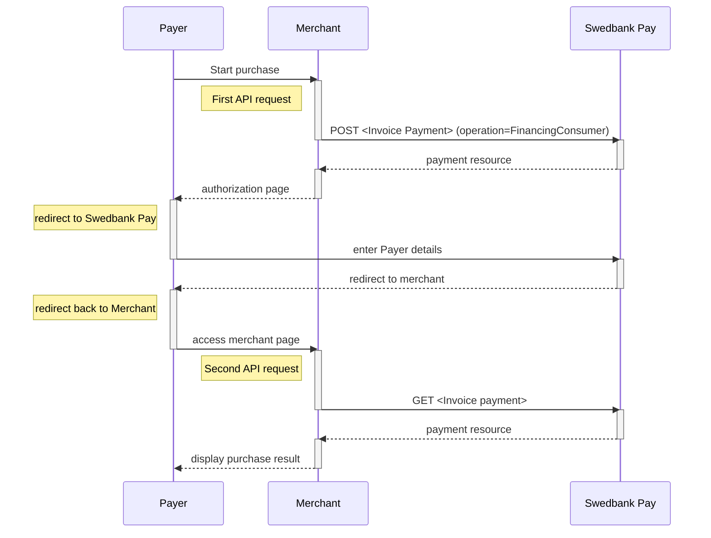







## Introduction

*   When properly set up in your merchant/webshop site and the payer starts the
  purchase process, you need to make a `POST` request towards Swedbank Pay with
  your Purchase information. This will generate a payment object with a unique
  `paymentID`. You will receive a **redirect URL** to a Swedbank Pay payment
  page.
*   You need to redirect the payer's browser to that specified URL so that the
  payer can enter the invoice details in a secure Swedbank Pay environment.
*   Swedbank Pay will redirect the payer's browser to - one of two specified URLs,
  depending on whether the payment session is followed through completely or
  cancelled beforehand. Please note that both a successful and rejected payment
  reach completion, in contrast to a cancelled payment.
*   When you detect that the payer reach your `completeUrl` , you need to do a
  `GET` request to receive the state of the transaction, containing the
  `paymentID` generated in the first step, to receive the state of the
  transaction.

## Step 1: Create The Payment

*   An invoice payment is always two-phased based - you create an
  `Authorize` transaction, that is followed by a `Capture` or `Cancel` request.





To initiate the payment process, you need to make a `POST` request to Swedbank
Pay. Our `payment` example below uses the [`FinancingConsumer`] ({{
financing_consumer_url }}) value. All valid options when posting a payment with
operation equal to `FinancingConsumer`, are described in [features]({{
financing_consumer_url }}).

## How It Looks

{:.text-center}
![screenshot of the first Invoice redirect page][fincon-invoice-redirect]{:height="725px" width="475px"}

{:.text-center}
![screenshot of the second Invoice redirect page][fincon-invoice-approve]{:height="500px" width="475px"}

### Financing Consumer Request

POST /psp/invoice/payments HTTP/1.1
Authorization: Bearer <AccessToken>
Content-Type: application/json

{
    "payment": {
        "operation": "FinancingConsumer",
        "intent": "Authorization",
        "currency": "SEK",
        "prices": [
            {
                "type": "Invoice",
                "amount": 1500,
                "vatAmount": 0
            }
        ],
        "description": "Test Purchase",
        "generatePaymentToken": false,
        "userAgent": "Mozilla/5.0...",
        "language": "sv-SE",
        "urls": {
            "completeUrl": "https://example.com/payment-completed",
            "cancelUrl": "https://example.com/payment-cancelled",
            "callbackUrl": "https://example.com/payment-callback",
            "logoUrl": "https://example.com/logo.png",
            "termsOfServiceUrl": "https://example.com/terms.pdf"
        },
        "payeeInfo": {
            "payeeId": "{{ page.merchant_id }}",
            "payeeReference": "PR123",
            "payeeName": "Merchant1",
            "productCategory": "PC1234",
            "subsite": "MySubsite"
        },
        "payer": {
            "payerReference": "AB1234",
        },
    "invoice": {
        "invoiceType": "PayExFinancingSe"
        }
    }
}



  

    
Field

    
Type

    
Required

  

  <!-- payment (root) -->
  

    

      <i aria-hidden="true" class="chev swepay-icon-plus-add"></i>
      <code>object</code>
      
    

    

The <code>payment</code> object contains information about the specific payment.

    

      <!-- operation -->
      

        

          <i aria-hidden="true" class="chev swepay-icon-plus-add"></i>
          <code>string</code>
          
        

        

The operation that the <code>payment</code> is supposed to perform. The <a href="{{ financing_consumer_url }}">FinancingConsumer</a> operation is used in our example.

      

      <!-- intent -->
      

        

          <i aria-hidden="true" class="chev swepay-icon-plus-add"></i>
          <code>string</code>
          
        

        

<code>Authorization</code> is the only intent option for invoice. Reserves the amount, and is followed by a <a href="{{ cancel_url }}">cancellation</a> or <a href="{{ capture_url }}">capture</a> of funds.

      

      <!-- currency -->
      

        

          <i aria-hidden="true" class="chev swepay-icon-plus-add"></i>
          <code>string</code>
          
        

        

NOK, SEK, DKK, USD or EUR.

      

      <!-- prices (object) -->
      

        

          <i aria-hidden="true" class="chev swepay-icon-plus-add"></i>
          <code>object</code>
          
        

        

The <code>prices</code> resource lists the prices related to a specific payment.

        

          <!-- type -->
          

            

              <i aria-hidden="true" class="chev swepay-icon-plus-add"></i>
              <code>string</code>
              
            

            
            

{{ prices_type_md | markdownify }}

          

          <!-- amount -->
          

            

              <i aria-hidden="true" class="chev swepay-icon-plus-add"></i>
              <code>integer</code>
              
            

            
            

{{ amount_lvl2_md | markdownify }}

          

          <!-- vatAmount -->
          

            

              <i aria-hidden="true" class="chev swepay-icon-plus-add"></i>
              <code>integer</code>
              
            

            
            

{{ vat_amount_lvl2_md | markdownify }}

          

        

      

      <!-- description -->
      

        

          <i aria-hidden="true" class="chev swepay-icon-plus-add"></i>
          <code>string(40)</code>
          
        

        
        

{{ description_md | markdownify }}

      

      <!-- userAgent -->
      

        

          <i aria-hidden="true" class="chev swepay-icon-plus-add"></i>
          <code>string</code>
          
        

        
        

{{ user_agent_md | markdownify }}

      

      <!-- language -->
      

        

          <i aria-hidden="true" class="chev swepay-icon-plus-add"></i>
          <code>string</code>
          
        

        
        

{{ language_md | markdownify }}

      

      <!-- urls (object) -->
      

        

          <i aria-hidden="true" class="chev swepay-icon-plus-add"></i>
          <code>object</code>
          
        

        

The <code>urls</code> resource lists urls that redirects users to relevant sites.

        

          <!-- hostUrl (optional) -->
          

            

              <i aria-hidden="true" class="chev swepay-icon-plus-add"></i>
              <code>array</code>
            

            

The array of URLs valid for embedding of Swedbank Pay Seamless Views. If not supplied, view-operation will not be available.

          

          <!-- completeUrl -->
          

            

              <i aria-hidden="true" class="chev swepay-icon-plus-add"></i>
              <code>string</code>
              
            

            
            

{{ complete_url_md | markdownify }}

          

          <!-- cancelUrl (optional) -->
          

            

              <i aria-hidden="true" class="chev swepay-icon-plus-add"></i>
              <code>string</code>
            

            

The URL to redirect the payer to if the payment is cancelled. Only used in redirect scenarios. Can not be used simultaneously with <code>paymentUrl</code>; only <code>cancelUrl</code> or <code>paymentUrl</code> can be used, not both.

          

          <!-- paymentUrl (optional) -->
          

            

              <i aria-hidden="true" class="chev swepay-icon-plus-add"></i>
              <code>string</code>
            

            
            

{{ payment_url_md | markdownify }}

          

          <!-- callbackUrl (optional) -->
          

            

              <i aria-hidden="true" class="chev swepay-icon-plus-add"></i>
              <code>string</code>
            

            
            

{{ callback_url_md | markdownify }}

          

          <!-- logoUrl (optional) -->
          

            

              <i aria-hidden="true" class="chev swepay-icon-plus-add"></i>
              <code>string</code>
            

            
            

{{ logo_url_md | markdownify }}

          

          <!-- termsOfServiceUrl (optional) -->
          

            

              <i aria-hidden="true" class="chev swepay-icon-plus-add"></i>
              <code>string</code>
            

            
            

{{ tos_url_md | markdownify }}

          

        

      

      <!-- payeeInfo (object) -->
      

        

          <i aria-hidden="true" class="chev swepay-icon-plus-add"></i>
          <code>object</code>
          
        

        
        

{{ payee_info_md | markdownify }}

        

          <!-- payeeId -->
          

            

              <i aria-hidden="true" class="chev swepay-icon-plus-add"></i>
              <code>string</code>
              
            

            

This is the unique id that identifies this payee (like merchant) set by Swedbank Pay.

          

          <!-- payeeReference -->
          

            

              <i aria-hidden="true" class="chev swepay-icon-plus-add"></i>
              <code>string(30)</code>
              
            

            
            

{{ payee_reference_md | markdownify }}

          

          <!-- payeeName (optional) -->
          

            

              <i aria-hidden="true" class="chev swepay-icon-plus-add"></i>
              <code>string</code>
            

            

The payee name (like merchant name) that will be displayed when redirected to Swedbank Pay.

          

          <!-- productCategory (optional) -->
          

            

              <i aria-hidden="true" class="chev swepay-icon-plus-add"></i>
              <code>string(50)</code>
            

            

A product category or number sent in from the payee/merchant. This is not validated by Swedbank Pay, but will be passed through the payment process and may be used in the settlement process.

          

          <!-- orderReference (optional) -->
          

            

              <i aria-hidden="true" class="chev swepay-icon-plus-add"></i>
              <code>string(50)</code>
            

            

The order reference should reflect the order reference found in the merchant's systems.

          

          <!-- subsite (optional, included) -->
          

            

              <i aria-hidden="true" class="chev swepay-icon-plus-add"></i>
              <code>string(40)</code>
            

            
            

{{ subsite_md | markdownify }}

          

        

      

      <!-- payer link (optional with nested reference) -->
      

        

          <i aria-hidden="true" class="chev swepay-icon-plus-add"></i>
          <code>string</code>
        

        

The <code>payer</code> object, containing information about the payer.

        

          <!-- payerReference (optional) -->
          

            

              <i aria-hidden="true" class="chev swepay-icon-plus-add"></i>
              <code>string</code>
            

            
            

{{ payer_reference_md | markdownify }}

          

        

      

    

  

## Financing Consumer Response

HTTP/1.1 200 OK
Content-Type: application/json

{
    "payment": {
        "id": "/psp/invoice/payments/{{ page.payment_id }}",
        "number": 1234567890,
        "instrument": "Invoice",
        "created": "2016-09-14T13:21:29.3182115Z",
        "updated": "2016-09-14T13:21:57.6627579Z",
        "state": "Ready",
        "operation": "FinancingConsumer",
        "intent": "Authorization",
        "currency": "SEK",
        "amount": 0,
        "remainingCaptureAmount": 1000,
        "remainingCancellationAmount": 1000,
        "remainingReversalAmount": 500,
        "description": "Test Purchase",
        "userAgent": "Mozilla/5.0...",
        "language": "sv-SE",
        "prices": {
            "id": "/psp/invoice/payments/{{ page.payment_id }}/prices"
        },
        "transactions": {
            "id": "/psp/invoice/payments/{{ page.payment_id }}/transactions"
        },
        "authorizations": {
            "id": "/psp/invoice/payments/{{ page.payment_id }}/authorizations"
        },
        "captures": {
            "id": "/psp/invoice/payments/{{ page.payment_id }}/captures"
        },
        "reversals": {
            "id": "/psp/invoice/payments/{{ page.payment_id }}/reversals"
        },
        "cancellations": {
            "id": "/psp/invoice/payments/{{ page.payment_id }}/cancellations"
        },
        "payeeInfo": {
            "id": "/psp/invoice/payments/{{ page.payment_id }}/payeeInfo"
        },
        "payers": {
            "id": "/psp/trustly/payments/{{ page.payment_id }}/payers"
        },
        "urls": {
            "id": "/psp/invoice/payments/{{ page.payment_id }}/urls"
        },
        "settings": {
            "id": "/psp/invoice/payments/{{ page.payment_id }}/settings"
        },
        "approvedLegalAddress": {
            "id": "/psp/invoice/payments/{{ page.payment_id }}/approvedlegaladdress"
        },
        "maskedApprovedLegalAddress": {
            "id": "/psp/invoice/payments/{{ page.payment_id }}/maskedapprovedlegaladdress"
        }
    },
    "operations": [
        {
            "href": "{{ page.api_url }}/psp/invoice/payments/{{ page.payment_id }}",
            "rel": "update-payment-abort",
            "method": "PATCH"
        },
        {
            "href": "{{ page.api_url }}/psp/invoice/payments/{{ page.payment_id }}/authorizations",
            "rel": "create-authorize",
            "method": "POST"
        },
        {
            "href": "{{ page.api_url }}/psp/invoice/payments/{{ page.payment_id }}/approvedlegaladdress",
            "rel": "create-approved-legal-address",
            "method": "POST"
        }
    ]
}



## Invoice Flow

The sequence diagram below shows the two requests you have to send to Swedbank
Pay to make a purchase.
The diagram also shows the process of a complete purchase in high level.

## Options after posting a payment

Head over to [after payment][after-payment]
to see what you can do when a payment is completed.
Here you will also find info on `Cancel`, and `Reversal`.



[after-payment]: /old-implementations/payment-instruments-v1/invoice/after-payment
[fincon-invoice-redirect]: /assets/img/payments/fincon-invoice-redirect-first-en.png
[fincon-invoice-approve]: /assets/img/payments/fincon-invoice-redirect-second-en.png
