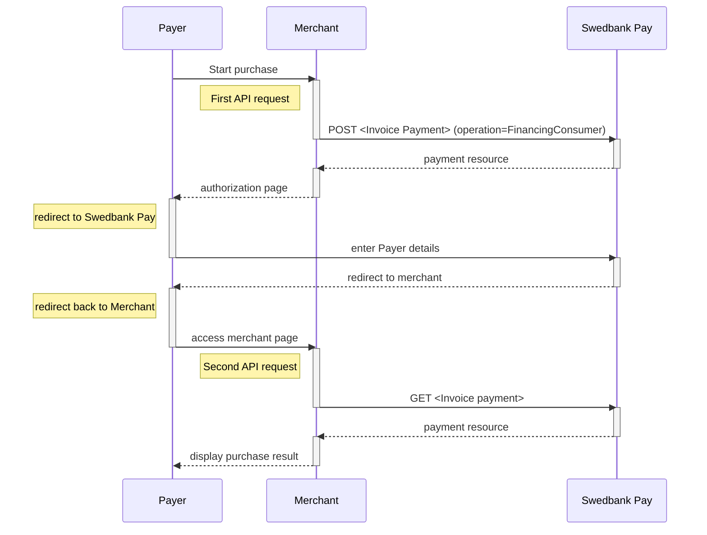







## Introduction

*   When properly set up in your merchant/webshop site and the payer starts the
  purchase process, you need to make a `POST` request towards Swedbank Pay with
  your Purchase information. This will generate a payment object with a unique
  `paymentID`. You will receive a **redirect URL** to a Swedbank Pay payment
  page.
*   You need to redirect the payer's browser to that specified URL so that the
  payer can enter the invoice details in a secure Swedbank Pay environment.
*   Swedbank Pay will redirect the payer's browser to - one of two specified URLs,
  depending on whether the payment session is followed through completely or
  cancelled beforehand. Please note that both a successful and rejected payment
  reach completion, in contrast to a cancelled payment.
*   When you detect that the payer reach your `completeUrl` , you need to do a
  `GET` request to receive the state of the transaction, containing the
  `paymentID` generated in the first step, to receive the state of the
  transaction.

## Step 1: Create The Payment

*   An invoice payment is always two-phased based - you create an
  `Authorize` transaction, that is followed by a `Capture` or `Cancel` request.





To initiate the payment process, you need to make a `POST` request to Swedbank
Pay. Our `payment` example below uses the [`FinancingConsumer`] ({{
financing_consumer_url }}) value. All valid options when posting a payment with
operation equal to `FinancingConsumer`, are described in [features]({{
financing_consumer_url }}).

## How It Looks

{:.text-center}
![screenshot of the first Invoice redirect page][fincon-invoice-redirect]{:height="725px" width="475px"}

{:.text-center}
![screenshot of the second Invoice redirect page][fincon-invoice-approve]{:height="500px" width="475px"}

### Financing Consumer Request

{:.code-view-header}
**Request**

```http
POST /psp/invoice/payments HTTP/1.1
Authorization: Bearer <AccessToken>
Content-Type: application/json

{
    "payment": {
        "operation": "FinancingConsumer",
        "intent": "Authorization",
        "currency": "SEK",
        "prices": [
            {
                "type": "Invoice",
                "amount": 1500,
                "vatAmount": 0
            }
        ],
        "description": "Test Purchase",
        "generatePaymentToken": false,
        "userAgent": "Mozilla/5.0...",
        "language": "sv-SE",
        "urls": {
            "completeUrl": "https://example.com/payment-completed",
            "cancelUrl": "https://example.com/payment-cancelled",
            "callbackUrl": "https://example.com/payment-callback",
            "logoUrl": "https://example.com/logo.png",
            "termsOfServiceUrl": "https://example.com/terms.pdf"
        },
        "payeeInfo": {
            "payeeId": "{{ page.merchant_id }}",
            "payeeReference": "PR123",
            "payeeName": "Merchant1",
            "productCategory": "PC1234",
            "subsite": "MySubsite"
        },
        "payer": {
            "payerReference": "AB1234",
        },
    "invoice": {
        "invoiceType": "PayExFinancingSe"
        }
    }
}
```


{:.table .table-striped .mb-5}
|     Required     | Field                             | Type          | Description                                                                                                                                                                                                                                                                                                           |
| :--------------: | :-------------------------------- | :------------ | :-------------------------------------------------------------------------------------------------------------------------------------------------------------------------------------------------------------------------------------------------------------------------------------------------------------------- |
|  |                          | `object`      | The `payment` object contains information about the specific payment.                                                                                                                                                                                                                                                 |
|  |                | `string`      | The operation that the `payment` is supposed to perform. The [`FinancingConsumer`]({{ financing_consumer_url }}) operation is used in our example. |
|  |                   | `string`      | `Authorization` is the only intent option for invoice. Reserves the amount, and is followed by a [cancellation]({{ cancel_url }}) or [capture]({{ capture_url }}) of funds.                                                                                                                                                               |
|  |                 | `string`      | NOK, SEK, DKK, USD or EUR.                                                                                                                                                                                                                                                                                            |
|  |                   | `object`      | The `prices` resource lists the prices related to a specific payment.                                                                                                                                                                                                                                                 |
|  |                    | `string`      |                                                                                                                                                                                                                                                                                            |
|  |                  | `integer`     |                                                                                                                                                                                                                                                                              |
|  |               | `integer`     |                                                                                                                                                                                                                                                                           |
|  |              | `string(40)`  |                                                                                                                                                                                                                                         |
|  |                | `string`      |                                                                                                                                                                                                                                                   |
|  |                 | `string`      |                                                                                                                                                                                                                                                     |
|  |                     | `object`      | The `urls` resource lists urls that redirects users to relevant sites.                                                                                                                                                                                                                                                |
|                  |                 | `array`       | The array of URLs valid for embedding of Swedbank Pay Seamless Views. If not supplied, view-operation will not be available.                                                                                                                                                                                            |
|  |             | `string`      |                     |
|                  |               | `string`      | The URL to redirect the payer to if the payment is cancelled. Only used in redirect scenarios. Can not be used simultaneously with `paymentUrl`; only `cancelUrl` or `paymentUrl` can be used, not both.                                                                                                               |
|                  |              | `string`      |                                                           |
|                  |             | `string`      |                                                                                                                                                                |
|                  |                 | `string`      |                                                                                                                                                                                    |
|                  |       | `string`      |                                                                                                                                                                                                                                                                   |
|  |                | `object`      |                                                                                                                                                                                                                                                                  |
|  |                 | `string`      | This is the unique id that identifies this payee (like merchant) set by Swedbank Pay.                                                                                                                                                                                                                                 |
|  |          | `string` |                                                                                                                                                                                                               |
|                  |               | `string`      | The payee name (like merchant name) that will be displayed when redirected to Swedbank Pay.                                                                                                                                                                                                               |
|                  |         | `string`      | A product category or number sent in from the payee/merchant. This is not validated by Swedbank Pay, but will be passed through the payment process and may be used in the settlement process.                                                                                                                        |
|                  |          | `string(50)`  | The order reference should reflect the order reference found in the merchant's systems.                                                                                                                                                                                                                               |
|                  |                 | `string(40)`  |                                                                                                                                                            |
|                  |                    | `string`     | The `payer` object, containing information about the payer.                                                                                                                                                                                                                                          |
|                  |          | `string`     |                                                                                                                                                                                                                                                            |



## Financing Consumer Response

{:.code-view-header}
**Response**

```http
HTTP/1.1 200 OK
Content-Type: application/json

{
    "payment": {
        "id": "/psp/invoice/payments/{{ page.payment_id }}",
        "number": 1234567890,
        "instrument": "Invoice",
        "created": "2016-09-14T13:21:29.3182115Z",
        "updated": "2016-09-14T13:21:57.6627579Z",
        "state": "Ready",
        "operation": "FinancingConsumer",
        "intent": "Authorization",
        "currency": "SEK",
        "amount": 0,
        "remainingCaptureAmount": 1000,
        "remainingCancellationAmount": 1000,
        "remainingReversalAmount": 500,
        "description": "Test Purchase",
        "userAgent": "Mozilla/5.0...",
        "language": "sv-SE",
        "prices": {
            "id": "/psp/invoice/payments/{{ page.payment_id }}/prices"
        },
        "transactions": {
            "id": "/psp/invoice/payments/{{ page.payment_id }}/transactions"
        },
        "authorizations": {
            "id": "/psp/invoice/payments/{{ page.payment_id }}/authorizations"
        },
        "captures": {
            "id": "/psp/invoice/payments/{{ page.payment_id }}/captures"
        },
        "reversals": {
            "id": "/psp/invoice/payments/{{ page.payment_id }}/reversals"
        },
        "cancellations": {
            "id": "/psp/invoice/payments/{{ page.payment_id }}/cancellations"
        },
        "payeeInfo": {
            "id": "/psp/invoice/payments/{{ page.payment_id }}/payeeInfo"
        },
        "payers": {
            "id": "/psp/trustly/payments/{{ page.payment_id }}/payers"
        },
        "urls": {
            "id": "/psp/invoice/payments/{{ page.payment_id }}/urls"
        },
        "settings": {
            "id": "/psp/invoice/payments/{{ page.payment_id }}/settings"
        },
        "approvedLegalAddress": {
            "id": "/psp/invoice/payments/{{ page.payment_id }}/approvedlegaladdress"
        },
        "maskedApprovedLegalAddress": {
            "id": "/psp/invoice/payments/{{ page.payment_id }}/maskedapprovedlegaladdress"
        }
    },
    "operations": [
        {
            "href": "{{ page.api_url }}/psp/invoice/payments/{{ page.payment_id }}",
            "rel": "update-payment-abort",
            "method": "PATCH"
        },
        {
            "href": "{{ page.api_url }}/psp/invoice/payments/{{ page.payment_id }}/authorizations",
            "rel": "create-authorize",
            "method": "POST"
        },
        {
            "href": "{{ page.api_url }}/psp/invoice/payments/{{ page.payment_id }}/approvedlegaladdress",
            "rel": "create-approved-legal-address",
            "method": "POST"
        }
    ]
}
```

## Invoice Flow

The sequence diagram below shows the two requests you have to send to Swedbank
Pay to make a purchase.
The diagram also shows the process of a complete purchase in high level.



## Options after posting a payment

Head over to [after payment][after-payment]
to see what you can do when a payment is completed.
Here you will also find info on `Cancel`, and `Reversal`.



[after-payment]: /old-implementations/payment-instruments-v1/invoice/after-payment
[fincon-invoice-redirect]: /assets/img/payments/fincon-invoice-redirect-first-en.png
[fincon-invoice-approve]: /assets/img/payments/fincon-invoice-redirect-second-en.png
