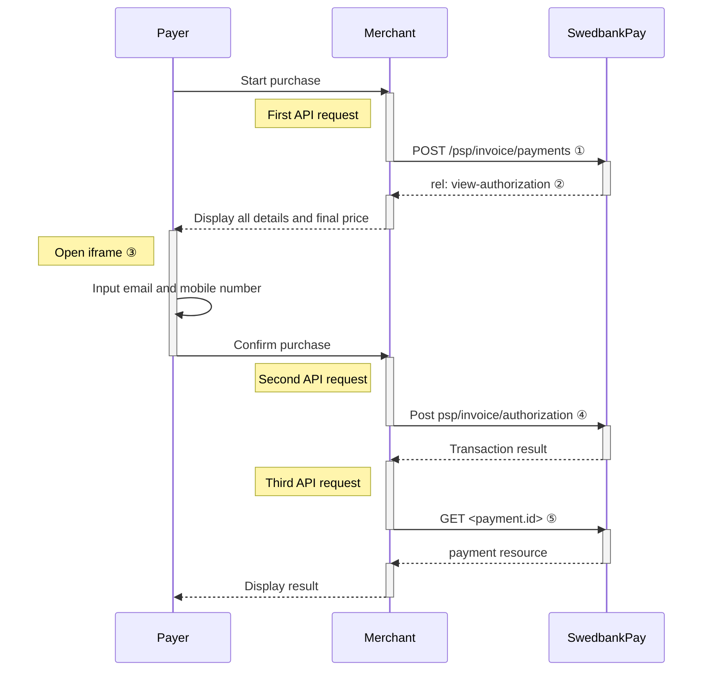







## Introduction

Seamless View provides an integration of the payment process directly on your
website. This solution offers a smooth shopping experience with Swedbank Pay
payment pages seamlessly integrated in an `iframe` on your website. The payer
does not need to leave your webpage, since we are handling the payment in the
`iframe` on your page.

## How It Looks

{:.text-center}
![screenshot of the invoice payment window][invoice-payment]{:height="525px" width="475px"}



## Step 1: Create The Payment



A `FinancingConsumer` payment is a straightforward way to invoice a
payer. It is followed up by posting a capture, cancellation or reversal
transaction.

An example of an abbreviated `POST` request is provided below. Each individual
field of the JSON document is described in the following section. An example of
an expanded `POST` request is available in the [other features
section]({{ financing_consumer_url }}).

When properly set up in your merchant/webshop site and the payer starts the
invoice process, you need to make a POST request towards Swedbank Pay with your
invoice information. This will generate a payment object with a unique
`paymentID`. You will receive a **JavaScript source** in response.

## Seamless View Request

POST /psp/invoice/payments HTTP/1.1
Authorization: Bearer <AccessToken>
Content-Type: application/json

{
    "payment": {
        "operation": "FinancingConsumer",
        "intent": "Authorization",
        "currency": "SEK",
        "prices": [
            {
                "type": "Invoice",
                "amount": 1500,
                "vatAmount": 0
            }
        ],
        "description": "Test Invoice",
        "userAgent": "Mozilla/5.0...",
        "generatePaymentToken": false,
        "paymentToken": ""
        "language": "sv-SE",
        "urls": {
            "hosturls": [
                "https://example.com"
            ],
            "completeUrl": "https://example.com/payment-completed",
            "cancelUrl": "https://example.com/payment-cancelled",
            "callbackUrl": "https://example.com/payment-callback",
            "termsOfServiceUrl": "https://example.com/payment-terms.pdf"
        },
        "payeeInfo": {
            "payeeId": "{{ page.merchant_id }}",
            "payeeReference": "CD1234",
            "payeeName": "Merchant1",
            "productCategory": "A123"
        },
        "payer": {
            "payerReference": "AB1234",
        },
    },
    "invoice": {
        "invoiceType": "PayExFinancingSe"
    }
}



<div class="api-compact" aria-label="Request">
  <div class="header">
    <div>Field</div>
    <div>Type</div>
    <div>Required</div>
  </div>

  <!-- payment (root) -->
  <details class="api-item" data-level="0">
    <summary>
      <span class="field"><i aria-hidden="true" class="chev swepay-icon-plus-add"></i></span>
      <span class="type"><code>object</code></span>
      <span class="req"></span>
    </summary>
    <div class="desc"><div class="indent-0">The <code>payment</code> object contains information about the specific payment.</div></div>

    <div class="api-children">
      <!-- operation -->
      <details class="api-item" data-level="1">
        <summary>
          <span class="field"><i aria-hidden="true" class="chev swepay-icon-plus-add"></i></span>
          <span class="type"><code>string</code></span>
          <span class="req"></span>
        </summary>
        <div class="desc"><div class="indent-1">The operation that the <code>payment</code> is supposed to perform. The <a href="{{ financing_consumer_url }}">FinancingConsumer</a> operation is used in our example.</div></div>
      </details>

      <!-- intent -->
      <details class="api-item" data-level="1">
        <summary>
          <span class="field"><i aria-hidden="true" class="chev swepay-icon-plus-add"></i></span>
          <span class="type"><code>string</code></span>
          <span class="req"></span>
        </summary>
        <div class="desc"><div class="indent-1"><code>Authorization</code>. Reserves the amount, and is followed by a <a href="{{ cancel_url }}">cancellation</a> or <a href="{{ capture_url }}">capture</a> of funds.</div></div>
      </details>

      <!-- currency -->
      <details class="api-item" data-level="1">
        <summary>
          <span class="field"><i aria-hidden="true" class="chev swepay-icon-plus-add"></i></span>
          <span class="type"><code>string</code></span>
          <span class="req"></span>
        </summary>
        <div class="desc"><div class="indent-1">NOK or SEK.</div></div>
      </details>

      <!-- prices (object) -->
      <details class="api-item" data-level="1">
        <summary>
          <span class="field"><i aria-hidden="true" class="chev swepay-icon-plus-add"></i></span>
          <span class="type"><code>object</code></span>
          <span class="req"></span>
        </summary>
        <div class="desc"><div class="indent-1">The <code>prices</code> resource lists the prices related to a specific payment.</div></div>

        <div class="api-children">
          <!-- type -->
          <details class="api-item" data-level="2">
            <summary>
              <span class="field"><i aria-hidden="true" class="chev swepay-icon-plus-add"></i></span>
              <span class="type"><code>string</code></span>
              <span class="req"></span>
            </summary>
            
            <div class="desc"><div class="indent-2">{{ prices_type_md | markdownify }}</div></div>
          </details>

          <!-- amount -->
          <details class="api-item" data-level="2">
            <summary>
              <span class="field"><i aria-hidden="true" class="chev swepay-icon-plus-add"></i></span>
              <span class="type"><code>integer</code></span>
              <span class="req"></span>
            </summary>
            
            <div class="desc"><div class="indent-2">{{ amount_md_lvl2 | markdownify }}</div></div>
          </details>

          <!-- vatAmount -->
          <details class="api-item" data-level="2">
            <summary>
              <span class="field"><i aria-hidden="true" class="chev swepay-icon-plus-add"></i></span>
              <span class="type"><code>integer</code></span>
              <span class="req"></span>
            </summary>
            
            <div class="desc"><div class="indent-2">{{ vat_amount_md_lvl2 | markdownify }}</div></div>
          </details>

          <!-- description -->
          <details class="api-item" data-level="2">
            <summary>
              <span class="field"><i aria-hidden="true" class="chev swepay-icon-plus-add"></i></span>
              <span class="type"><code>string(40)</code></span>
              <span class="req"></span>
            </summary>
            
            <div class="desc"><div class="indent-2">{{ description_md_lvl2 | markdownify }}</div></div>
          </details>
        </div>
      </details>

      <!-- generatePaymentToken (optional) -->
      <details class="api-item" data-level="1">
        <summary>
          <span class="field"><i aria-hidden="true" class="chev swepay-icon-plus-add"></i></span>
          <span class="type"><code>boolean</code></span>
        </summary>
        <div class="desc"><div class="indent-1"><code>true</code> or <code>false</code>. Set this to <code>true</code> if you want to create a paymentToken for future use as One Click.</div></div>
      </details>

      <!-- userAgent -->
      <details class="api-item" data-level="1">
        <summary>
          <span class="field"><i aria-hidden="true" class="chev swepay-icon-plus-add"></i></span>
          <span class="type"><code>string</code></span>
          <span class="req"></span>
        </summary>
        
        <div class="desc"><div class="indent-1">{{ user_agent_md | markdownify }}</div></div>
      </details>

      <!-- language -->
      <details class="api-item" data-level="1">
        <summary>
          <span class="field"><i aria-hidden="true" class="chev swepay-icon-plus-add"></i></span>
          <span class="type"><code>string</code></span>
          <span class="req"></span>
        </summary>
        
        <div class="desc"><div class="indent-1">{{ language_md | markdownify }}</div></div>
      </details>

      <!-- urls (object) -->
      <details class="api-item" data-level="1">
        <summary>
          <span class="field"><i aria-hidden="true" class="chev swepay-icon-plus-add"></i></span>
          <span class="type"><code>object</code></span>
          <span class="req"></span>
        </summary>
        <div class="desc"><div class="indent-1">The<code>urls</code>resource lists urls that redirects users to relevant sites.</div></div>

        <div class="api-children">
          <!-- hostUrls -->
          <details class="api-item" data-level="2">
            <summary>
              <span class="field"><i aria-hidden="true" class="chev swepay-icon-plus-add"></i></span>
              <span class="type"><code>array</code></span>
              <span class="req"></span>
            </summary>
            <div class="desc"><div class="indent-2">The array of valid host URLs.</div></div>
          </details>

          <!-- completeUrl -->
          <details class="api-item" data-level="2">
            <summary>
              <span class="field"><i aria-hidden="true" class="chev swepay-icon-plus-add"></i></span>
              <span class="type"><code>string</code></span>
              <span class="req"></span>
            </summary>
            
            <div class="desc"><div class="indent-2">{{ complete_url_md | markdownify }}</div></div>
          </details>

          <!-- cancelUrl (optional) -->
          <details class="api-item" data-level="2">
            <summary>
              <span class="field"><i aria-hidden="true" class="chev swepay-icon-plus-add"></i></span>
              <span class="type"><code>string</code></span>
            </summary>
            <div class="desc"><div class="indent-2">The URL to redirect the payer to if the payment is cancelled. Only used in redirect scenarios. Can not be used simultaneously with<code>paymentUrl</code>; only <code>cancelUrl</code> or <code>paymentUrl</code> can be used, not both.</div></div>
          </details>

          <!-- paymentUrl (optional) -->
          <details class="api-item" data-level="2">
            <summary>
              <span class="field"><i aria-hidden="true" class="chev swepay-icon-plus-add"></i></span>
              <span class="type"><code>string</code></span>
            </summary>
            
            <div class="desc"><div class="indent-2">{{ payment_url_md | markdownify }}</div></div>
          </details>

          <!-- callbackUrl (optional) -->
          <details class="api-item" data-level="2">
            <summary>
              <span class="field"><i aria-hidden="true" class="chev swepay-icon-plus-add"></i></span>
              <span class="type"><code>string</code></span>
            </summary>
            
            <div class="desc"><div class="indent-2">{{ callback_url_md | markdownify }}</div></div>
          </details>

          <!-- termsOfServiceUrl (optional) -->
          <details class="api-item" data-level="2">
            <summary>
              <span class="field"><i aria-hidden="true" class="chev swepay-icon-plus-add"></i></span>
              <span class="type"><code>string</code></span>
            </summary>
            
            <div class="desc"><div class="indent-2">{{ tos_url_md | markdownify }}</div></div>
          </details>
        </div>
      </details>

      <!-- payeeInfo (object) -->
      <details class="api-item" data-level="1">
        <summary>
          <span class="field"><i aria-hidden="true" class="chev swepay-icon-plus-add"></i></span>
          <span class="type"><code>object</code></span>
          <span class="req"></span>
        </summary>
        
        <div class="desc"><div class="indent-1">{{ payee_info_md | markdownify }}</div></div>

        <div class="api-children">
          <!-- payeeId -->
          <details class="api-item" data-level="2">
            <summary>
              <span class="field"><i aria-hidden="true" class="chev swepay-icon-plus-add"></i></span>
              <span class="type"><code>string</code></span>
              <span class="req"></span>
            </summary>
            <div class="desc"><div class="indent-2">This is the unique id that identifies this payee (like merchant) set by Swedbank Pay.</div></div>
          </details>

          <!-- payeeReference -->
          <details class="api-item" data-level="2">
            <summary>
              <span class="field"><i aria-hidden="true" class="chev swepay-icon-plus-add"></i></span>
              <span class="type"><code>string(30)</code></span>
              <span class="req"></span>
            </summary>
            
            <div class="desc"><div class="indent-2">{{ payee_reference_md | markdownify }}</div></div>
          </details>

          <!-- payeeName (optional) -->
          <details class="api-item" data-level="2">
            <summary>
              <span class="field"><i aria-hidden="true" class="chev swepay-icon-plus-add"></i></span>
              <span class="type"><code>string</code></span>
            </summary>
            <div class="desc"><div class="indent-2">The payee name (like merchant name) that will be displayed when redirected to Swedbank Pay.</div></div>
          </details>

          <!-- productCategory (optional) -->
          <details class="api-item" data-level="2">
            <summary>
              <span class="field"><i aria-hidden="true" class="chev swepay-icon-plus-add"></i></span>
              <span class="type"><code>string(50)</code></span>
            </summary>
            <div class="desc"><div class="indent-2">A product category or number sent in from the payee/merchant. This is not validated by Swedbank Pay, but will be passed through the payment process and may be used in the settlement process.</div></div>
          </details>

          <!-- orderReference (optional) -->
          <details class="api-item" data-level="2">
            <summary>
              <span class="field"><i aria-hidden="true" class="chev swepay-icon-plus-add"></i></span>
              <span class="type"><code>string(50)</code></span>
            </summary>
            <div class="desc"><div class="indent-2">The order reference should reflect the order reference found in the merchant's systems.</div></div>
          </details>
        </div>
      </details>

      <!-- payer (link with nested reference) -->
      <details class="api-item" data-level="1">
        <summary>
          <span class="field"><i aria-hidden="true" class="chev swepay-icon-plus-add"></i></span>
          <span class="type"><code>string</code></span>
        </summary>
        <div class="desc"><div class="indent-1">The <code>payer</code> object, containing information about the payer.</div></div>

        <div class="api-children">
          <!-- payerReference -->
          <details class="api-item" data-level="2">
            <summary>
              <span class="field"><i aria-hidden="true" class="chev swepay-icon-plus-add"></i></span>
              <span class="type"><code>string</code></span>
            </summary>
            
            <div class="desc"><div class="indent-2">{{ payer_reference_md | markdownify }}</div></div>
          </details>

          <!-- invoiceType -->
          <details class="api-item" data-level="2">
            <summary>
              <span class="field"><i aria-hidden="true" class="chev swepay-icon-plus-add"></i></span>
              <span class="type"><code>string</code></span>
              <span class="req"></span>
            </summary>
            <div class="desc"><div class="indent-2"><code>PayExFinancingSe</code>, <code>PayExFinancingNo</code> or <code>PayExFinancingFi</code> depending on which country you're doing business with Swedbank Pay in. (Other external financing partner names must be agreed upon with Swedbank Pay.)</div></div>
          </details>
        </div>
      </details>
    </div>
  </details>
</div>

## Seamless View Response

HTTP/1.1 200 OK
Content-Type: application/json

{
    "payment": {
        "id": "/psp/invoice/payments/{{ page.payment_id }}",
        "number": 1234567890,
        "instrument": "Invoice",
        "created": "YYYY-MM-DDThh:mm:ssZ",
        "updated": "YYYY-MM-DDThh:mm:ssZ",
        "operation": "FinancingConsumer",
        "intent": "Authorization",
        "state": "Ready",
        "currency": "SEK",
        "prices": {
            "id": "/psp/invoice/payments/{{ page.payment_id }}/prices"
        },
        "amount": 0,
        "description": "Test Purchase",
        "initiatingSystemUserAgent": "swedbankpay-sdk-dotnet/3.0.1",
        "userAgent": "Mozilla/5.0...",
        "language": "sv-SE",
        "urls": {
            "id": "/psp/invoice/payments/{{ page.payment_id }}/urls"
        },
        "payeeInfo": {
            "id": "/psp/invoice/payments/{{ page.payment_id }}/payeeinfo"
        },
        "payers": {
           "id": "/psp/invoice/payments/{{ page.payment_id }}/payers"
        },
        "metadata": {
            "id": "/psp/invoice/payments/{{ page.payment_id }}/metadata"
        }
    },
    "operations": [
        {
            "method": "POST",
            "href": "{{ page.api_url }}/psp/invoice/payments/{{ page.payment_id }}/approvedlegaladdress",
            "rel": "create-approved-legal-address",
            "contentType": "application/json"
        },
        {
            "method": "POST",
            "href": "{{ page.api_url }}/psp/invoice/payments/{{ page.payment_id }}/authorizations",
            "rel": "create-authorization",
            "contentType": "application/json"
        },
        {
            "method": "PATCH",
            "href": "{{ page.api_url }}/psp/invoice/payments/{{ page.payment_id }}",
            "rel": "update-payment-abort",
            "contentType": "application/json"
        },
        {
            "method": "GET",
            "href": "{{ page.front_end_url }}/invoice/payments/authorize/{{ page.payment_token }}",
            "rel": "redirect-authorization",
            "contentType": "text/html"
        },
        {
            "method": "GET",
            "href": "{{ page.front_end_url }}/invoice/core/scripts/client/px.invoice.client.js?{{ page.payment_token }}&operation=authorize",
            "rel": "view-authorization",
            "contentType": "application/javascript"
        }
    ]
}



The key information in the response is the `view-authorization` operation. You
will need to embed its `href` in a `<script>` element. The script will enable
loading the payment page in an `iframe` in our next step.



## Step 2: Display The Payment

You need to embed the script source on your site to create a Seamless View in an
`iframe`; so that the payer can enter the payment details in a secure Swedbank Pay
hosted environment. A simplified integration has these following steps:

1.  Create a container that will contain the Seamless View iframe: `<div
   id="swedbank-pay-seamless-view-page">`.
2.  Create a `<script>` source within the container. Embed the `href` value
   obtained in the `POST` request in the `<script>` element. Example:

```html
    <script id="payment-page-script" src="https://ecom.externalintegration.payex.com/invoice/core/ scripts/client/px.invoice.client.js"></script>
```

The previous two steps gives this HTML:

{:.code-view-header}
**HTML**

```html
<!DOCTYPE html>
<html>
    <head>
        <title>Swedbank Pay Seamless View is Awesome!</title>
        <!-- Here you can specify your own javascript file -->
        <script src=<YourJavaScriptFileHere>></script>
    </head>
    <body>
        <div id="swedbank-pay-seamless-view-page">
          <script id="payment-page-script" src="https://ecom.dev.payex.com/invoice/core/scripts/client/px.invoice.client.js"></script>
        </div>
    </body>
</html>
```

## Loading The JavaScript

Lastly, initiate the Seamless View with a JavaScript call to open the `iframe`
embedded on your website.

{:.code-view-header}
**HTML**

```html
<script language="javascript">
    payex.hostedView.invoice({
        // The container specifies which id the script will look for to host the
        // iframe component.
        container: "swedbank-pay-seamless-view-page"
    }).open();
</script>
```

## Purchase Flow

The sequence diagram below shows a high level description of the
invoice process.







[invoice-payment]: /assets/img/checkout/invoice-seamless-view.png
