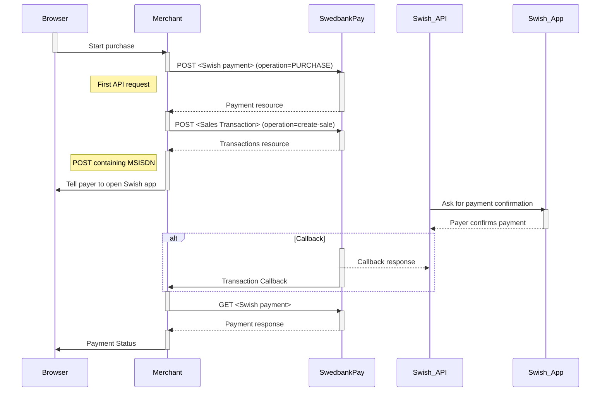
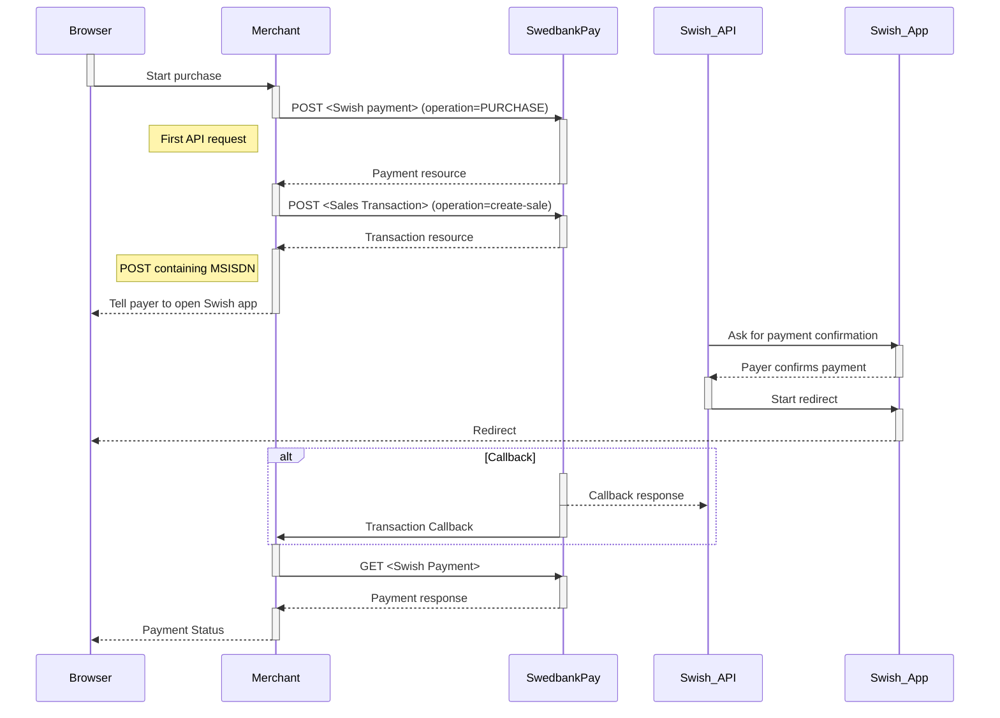



## Payment Flow

*   When the payer starts the purchase process, you make a `POST` request
    towards Swedbank Pay with the collected Purchase information.
*   The next step is to collect the payer's Swish registered mobile number
    and make a `POST` request towards Swedbank Pay to create a sales
    transaction.
*   Swedbank Pay will handle the dialog with Swish and the payer will have
    to confirm the purchase in the Swish app.
*   If `callbackURL` is set, you will receive a payment callback when the Swish
    dialog is completed.
*   Make a `GET` request to check the payment status.





## Step 1: Create A Purchase

A `Purchase` payment is created by performing the following request.



## Initial Direct Request

{:.code-view-header}
**Request**

```http
POST /psp/swish/payments HTTP/1.1
Authorization: Bearer <AccessToken>
Content-Type: application/json

{
    "payment": {
        "operation": "Purchase",
        "intent": "Sale",
        "currency": "SEK",
        "prices": [
            {
                "type": "Swish",
                "amount": 1500,
                "vatAmount": 0
            }
        ],
        "description": "Test Purchase",
        "userAgent": "Mozilla/5.0...",
        "language": "sv-SE",
        "urls": {
            "hostUrls": [ "https://example.com" ],
            "paymentUrl": "https://example.com/perform-payment",
            "completeUrl": "https://example.com/payment-completed",
            "cancelUrl": "https://example.com/payment-cancelled",
            "callbackUrl": "https://example.com/payment-callback",
            "logoUrl": "https://example.com/logo.png",
            "termsOfServiceUrl": "https://example.com/terms.pdf"
        },
        "payeeInfo": {
            "payeeId": "{{ page.merchant_id }}",
            "payeeReference": "ref-123456",
            "payeeName": "Merchant1",
            "productCategory": "A123",
            "orderReference": "or-123456",
            "subsite": "MySubsite"
        },
        "payer": {
            "payerReference": "AB1234",
        },
        "prefillInfo": {
            "msisdn": "+46739000001"
        }
    },
    "swish": {
        "enableEcomOnly": false,
        "paymentRestrictedToAgeLimit": 18,
        "paymentRestrictedToSocialSecurityNumber": "{{ page.consumer_ssn_se }}"
    }

}
```


{:.table .table-striped .mb-5}
|     Required     | Field                        | Type          | Description                                                                                                                                                                                                                                                                                        |
| :--------------: | :--------------------------- | :------------ | :------------------------------------------------------------------------------------------------------------------------------------------------------------------------------------------------------------------------------------------------------------------------------------------------- |
|  |                     | `object`      | The `payment` object contains information about the specific payment.                                                                                                                                                                                                                              |
|  |           | `string`      |                                                                                                                                                                               |
|  |              | `string`      | `Authorization`.                                                                                                                                                                                                                                                                                   |
|  |            | `string`      | SEK.                                                                                                                                                                                                                                                                                               |
|  |              | `object`      | The `prices` resource lists the prices related to a specific payment.                                                                                                                                                                                                                              |
|  |               | `string`      | `Swish`                                                                                                                                                                                                                                                                                              |
|  |             | `integer`     |                                                                                                                                                                                                                                                           |
|  |          | `integer`     |                                                                                                                                                                                                                                                        |  |
|  |         | `string(40)`  |                                                                                                                                                                                                                        |
|                  |           | `string`      | The payee name (like merchant name) that will be displayed when redirected to Swedbank Pay.                                                                                                                                                                                                                      |
|  |           | `string`      |                                                                                                                                                                                                                                |
|  |            | `string`      |                                                                                                                                                                                                                                    |
|  |                | `object`      | The `urls` resource lists urls that redirects users to relevant sites.                                                                                                                                                                                                                             |
|  |        | `string`      |  |
|                  |          | `string`      | The URL to redirect the payer to if the payment is cancelled. Only used in redirect scenarios. Can not be used simultaneously with `paymentUrl`; only cancelUrl or `paymentUrl` can be used, not both.                                                                                              |
|                  |        | `string`      |                                                                                                                                           |
|                  |            | `string`      |                                                                                                                                                                 |
|                  |  | `string`      |                                                                                                                                                                                                                                                |
|  |          | `object`      |                                                                                                                                                                                                                                               |
|  |            | `string`      | This is the unique id that identifies this payee (like merchant) set by Swedbank Pay.                                                                                                                                                                                                              |
|  |     | `string` |                                                                                                                                                                                                                    |
|                  |          | `string`      | The payee name (like merchant name) that will be displayed when redirected to Swedbank Pay.                                                                                                                                                                                            |
|                  |    | `string`      | A product category or number sent in from the payee/merchant. This is not validated by Swedbank Pay, but will be passed through the payment process and may be used in the settlement process.                                                                                                     |
|                  |     | `string(50)`  | The order reference should reflect the order reference found in the merchant's systems.                                                                                                                                                                                                            |
|                  |            | `string(40)`  |                                                                                                                                         |
|                  |               | `string`     | The `payer` object, containing information about the payer.                                                                                                                                                                                                                                          |
|                  |     | `string`     |                                                                                                                                                                                                                                                            |
|                  |         | `object`      | An object holding information which, when available, will be prefilled on the payment page.                                                                                                                                                                                                        |
|                  |             | `string`      | Number will be prefilled on payment page, if valid. The mobile number must have a country code prefix and be 8 to 15 digits in length.                                                                                                                                                             |
|                  |               | `object`      | An object that holds different scenarios for Swish payments.                                                                                                                                                                                                                                       |
|                  |     | `boolean`     | `true` if to only enable Swish on web based transactions.; otherwise `false` to also enable Swish transactions via in-app payments                                                                                                                                                                 |
|          |              | `integer`     | Positive number that sets the required age  needed to fulfill the payment. To use this feature it has to be configured in the contract.                                                                                                                                                            |
|                 |  | `string`      | When provided, the payment will be restricted to a specific social security number to make sure its the same logged in customer who is also the payer. Format: yyyyMMddxxxx. To use this feature it has to be configured in the contract.                                                                                                                             |



## Initial Direct Response

{:.code-view-header}
**Response**

```http
HTTP/1.1 200 OK
Content-Type: application/json

{
    "payment": {
        "id": "/psp/swish/payments/{{ page.payment_id }}",
        "number": 992308,
        "created": "2017-10-23T08:38:57.2248733Z",
        "instrument": "Swish",
        "operation": "Purchase",
        "intent": "Sale",
        "state": "Ready",
        "currency": "SEK",
        "amount": 0,
        "description": "Test Purchase",
        "initiatingSystemUserAgent": "swedbankpay-sdk-dotnet/3.0.1",
        "userAgent": "Mozilla/5.0...",
        "language": "sv-SE",
        "urls": {
            "id": "/psp/swish/payments/{{ page.payment_id }}/urls"
        },
        "payeeInfo": {
            "id": "/psp/swish/payments/{{ page.payment_id }}/payeeinfo"
        },
        "payers": {
           "id": "/psp/swish/payments/{{ page.payment_id }}/payers"
        }
    },
    "operations": [
        {
            "method": "PATCH",
            "href": "{{ page.api_url }}/psp/swish/payments/{{ page.payment_id }}",
            "rel": "update-payment-abort"
        },
        {
            "method": "POST",
            "href": "{{ page.api_url }}/psp/swish/payments/{{ page.payment_id }}/sales",
            "rel": "create-sale"
        }
    ]
}
```

## Step 2a: Create E-Commerce Sale Transaction

This operation creates an e-commerce sales transaction in the Direct payment
scenario. This is managed either by sending a `POST` request as seen below, or
by directing the payer to the hosted payment pages. Note that the `msisdn`
value (the payer's mobile number) is required in this request.

## E-Commerce Request

{:.code-view-header}
**Request**

```http
POST /psp/swish/payments/{{ page.payment_id }}/sales HTTP/1.1
Authorization: Bearer <AccessToken>
Content-Type: application/json

{
    "transaction": {
        "msisdn": "+46739000001"
    }
}

```

{:.table .table-striped}
| Field            | Type     | Required                                                                                          |
| :--------------- | :------- | :------------------------------------------------------------------------------------------------ |
|     | `object` | The `transaction` object contains information about the specific transaction.                     |
|  | `string` | The payer's mobile number. It must have a country code prefix and be 8 to 15 digits in length. |

## E-Commerce Response



## E-Commerce Sequence Diagram

The sequence diagram below shows the two requests you have to send to
Swedbank Pay to make a purchase. The Callback response is a simplified example
in this flow. Go to the [Callback][callback-url] section to view the complete flow.



## Step 2b: Create M-Commerce Sale Transaction

This operation creates an m-commerce sales transaction in the Direct payment
scenario. This is managed either by sending a `POST` request as seen below, or
by directing the payer to the hosted payment pages. Note that the `msisdn`
value (the payer's mobile number) is left out in this request. The
`redirect-app-swish` operation is only present in the m-commerce flow response.

## M-Commerce Request

{:.code-view-header}
**Request**

```http
POST /psp/swish/payments/{{ page.payment_id }}/sales HTTP/1.1
Authorization: Bearer <AccessToken>
Content-Type: application/json

{
    "transaction": {
    }
}
```

{:.table .table-striped}
| Field         | Type     | Required                                                             |
| :------------ | :------- | :------------------------------------------------------------------- |
|  | `object` | The  `transaction` object is empty for m-commerce sale transactions. |

## M-Commerce Response



## Step 3: GET The Payment Status

{:.code-view-header}
**Request**

```http
GET /psp/{{ api_resource }}/payments/{{ page.payment_id }}/ HTTP/1.1
Host: {{ page.api_host }}
Authorization: Bearer <AccessToken>
Content-Type: application/json
```

## GET Payment Response

{:.code-view-header}
**Response**

```http
HTTP/1.1 200 OK
Content-Type: application/json

{
    "payment": {
        "id": "/psp/{{ api_resource }}/payments/{{ page.payment_id }}",
        "number": 1234567890,
        "created": "2016-09-14T13:21:29.3182115Z",
        "updated": "2016-09-14T13:21:57.6627579Z",
        "state": "Ready",
        "operation": "Purchase",
        "intent": "Authorization",
        "currency": "NOK",
        "amount": 1500,
        "remainingCaptureAmount": 1500,
        "remainingCancellationAmount": 1500,
        "remainingReversalAmount": 0,
        "description": "Test Purchase",
        "initiatingSystemUserAgent": "swedbankpay-sdk-dotnet/3.0.1",
        "userAgent": "Mozilla/5.0...",
        "language": "nb-NO",
        "prices": {
            "id": "/psp/{{ api_resource }}/payments/{{ page.payment_id }}/prices"
        },
        "payeeInfo": {
            "id": "/psp/{{ api_resource }}/payments/{{ page.payment_id }}/payeeInfo"
        },
        "payers": {
            "id": "/psp/{{ api_resource }}/payments/{{ page.payment_id }}/payers"
        },
        "urls": {
            "id": "/psp/{{ api_resource }}/payments/{{ page.payment_id }}/urls"
        },
        "transactions": {
            "id": "/psp/{{ api_resource }}/payments/{{ page.payment_id }}/transactions"
        },
        "captures": {
            "id": "/psp/{{ api_resource }}/payments/{{ page.payment_id }}/captures"
        },
        "reversals": {
            "id": "/psp/{{ api_resource }}/payments/{{ page.payment_id }}/reversals"
        },
        "cancellations": {
            "id": "/psp/{{ api_resource }}/payments/{{ page.payment_id }}/cancellations"
        }
    },
    "operations": [
        {
            "method": "PATCH",
            "href": "{{ page.api_url }}/psp/{{ api_resource }}/payments/{{ page.payment_id }}",
            "rel": "update-payment-abort",
            "contentType": "application/json"
        },
        {
            "method": "POST",
            "href": "{{ page.api_url }}/psp/{{ api_resource }}/payments/{{ page.payment_id }}/captures",
            "rel": "create-capture",
            "contentType": "application/json"
        }
    ]
}
```


{:.table .table-striped .mb-5}
| Field                  | Type         | Description                                                                                                                                                                                                                                                                                                                                                |
| :--------------------- | :----------- | :--------------------------------------------------------------------------------------------------------------------------------------------------------------------------------------------------------------------------------------------------------------------------------------------------------------------------------------------------------- |
|      | `object`     | The `payment` object contains information about the specific payment.                                                                                                                                                                                                                                                                                      |
|              | `string`     |                                                                                                                                                                                                                                                                                                                       |
|          | `integer`    |                                                                                                                                                            |
|         | `string`     | The ISO-8601 date of when the payment was created.                                                                                                                                                                                                                                                                                                         |
|         | `string`     | The ISO-8601 date of when the payment was updated.                                                                                                                                                                                                                                                                                                         |
|           | `string`     | `Ready`, `Pending`, `Failed` or `Aborted`. Indicates the state of the payment, not the state of any transactions performed on the payment. To find the state of the payment's transactions (such as a successful authorization), see the `transactions` resource or the different specialized type-specific resources such as `authorizations` or `sales`. |
|          | `object`     | The `prices` resource lists the prices related to a specific payment.                                                                                                                                                                                                                                                                                      |
|       | `string`     |                                                                                                                                                                                                                                                                                                     |
|     | `string(40)` |                                                                                                                                                                                                                                                                                |
|       | `string`     |                                                                                                                                                                                                                                                                                              |
|        | `string`     |                                                                                                                                                                                                                                                                                            |
|            | `string`     | The URL to the  urls  resource where all URLs related to the payment can be retrieved.                                                                                                                                                                                                                                                                     |
|       | `string`     | The URL to the  payeeinfo  resource where the information about the payee of the payment can be retrieved.                                                                                                                                                                                                                                                 |
|          | `string`     | The URL to the `payer` resource where the information about the payer can be retrieved.                                                        |
|   | `array`      |                                                                                                                                                                                                                                                                                                                 |
|       | `string`     | The HTTP method to use when performing the operation.                                                                                                                                                                                                                                                                                                      |
|         | `string`     | The target URL to perform the operation against.                                                                                                                                                                                                                                                                                                           |
|          | `string`     | The name of the relation the operation has to the current resource.                                                                                                                                                                                                                                                                                        |



## M-Commerce Sequence Diagram

The sequence diagram below shows the three requests you have to send to
Swedbank Pay to make a purchase. The Callback response is a simplified example
in this flow. Go to the [Callback][callback-url] section to view the complete flow.





[callback-url]: /old-implementations/payment-instruments-v1/swish/features/core/callback
