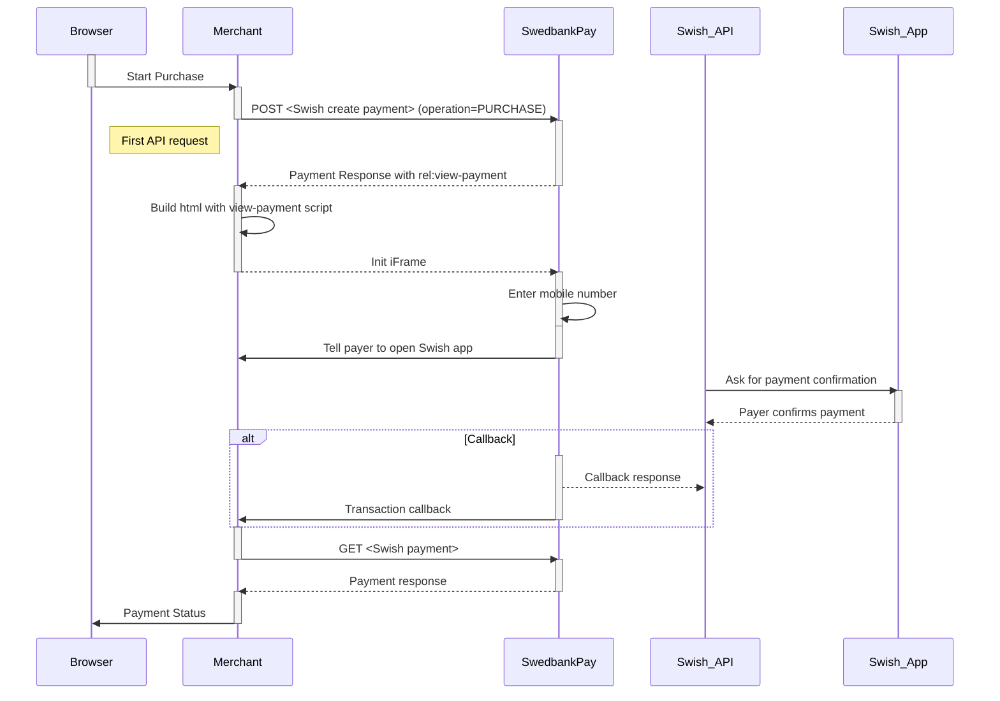

## Swish Seamless View Integration Flow

1.  When the payer starts the purchase process, you make a `POST` request
   towards Swedbank Pay with the collected Purchase information.
   `view-sales` is a `rel` value in one of the operations, sent as a response
   from Swedbank Pay to the Merchant.
2.  `Open iframe` creates the Swedbank Pay hosted iframe.
3.  `Show payer UI page in iframe` displays the payment window as content
    inside of the iframe. The payer can insert mobile information for
    authorization.
4.  `Event: OnPaymentComplete` is when the payment is complete. Please note that
    both a successful and rejected payment reach completion, in contrast to a
    cancelled payment.
5.  To get the transaction result, you need to follow up with a `GET` request
    using the `paymentID` received in the first step.
6.  If CallbackURL is set you will receive a payment callback when the Swish
    dialog is completed, and you will have to make a `GET` request to check
    the payment status.

## Step 1: Create A Purchase

A `Purchase` payment is a straightforward way to charge the card of the payer.
You need to make a `POST` request towards Swedbank Pay as shown below to create
a purchase. An example of an expanded `POST` request is available in the
[other features section][purchase]. This will generate a payment object with a unique
`paymentID`. You will receive a **JavaScript source** in response.





## Seamless View Request

{:.code-view-header}
**Request**

```http
POST /psp/swish/payments HTTP/1.1
Authorization: Bearer <AccessToken>
Content-Type: application/json

{
    "payment": {
        "operation": "Purchase",
        "intent": "Sale",
        "currency": "SEK",
        "prices": [{
                "type": "Swish",
                "amount": 1500,
                "vatAmount": 0
            }
        ],
        "description": "Test Purchase",
        "generatePaymentToken": false,
        "generateRecurrenceToken": false,
        "userAgent": "Mozilla/5.0...",
        "language": "sv-SE",
        "urls": {
            "hostUrls": [ "https://example.com" ],
            "completeUrl": "https://example.com/payment-completed",
            "cancelUrl": "https://example.com/payment-cancelled",
            "paymentUrl": "https://example.com/perform-payment",
            "callbackUrl": "https://example.com/payment-callback",
            "logoUrl": "https://example.com/payment-logo.png",
            "termsOfServiceUrl": "https://example.com/payment-terms.pdf"
        },
        "payeeInfo": {
            "payeeId": "{{ page.merchant_id }}",
            "payeeReference": "CD1234",
            "payeeName": "Merchant1",
            "productCategory": "A123",
            "orderReference": "or123",
            "subsite": "MySubsite"
        },
        "payer": {
            "payerReference": "AB1234",
        },
        "prefillInfo": {
            "msisdn": "+46987654321"
        }
    },
    "swish": {
        "enableEcomOnly": false,
        "paymentRestrictedToAgeLimit": 18,
        "paymentRestrictedToSocialSecurityNumber": "{{ page.consumer_ssn_se }}"
    }
}
```


{:.table .table-striped .mb-5}
|     Required     | Field                        | Type          | Description                                                                                                                                                                                                                                                                                                                                                                                                                                                                                                                                                               |
| :--------------: | :--------------------------- | :------------ | :------------------------------------------------------------------------------------------------------------------------------------------------------------------------------------------------------------------------------------------------------------------------------------------------------------------------------------------------------------------------------------------------------------------------------------------------------------------------------------------------------------------------------------------------------------------------ |
|  |                     | `object`      | The `payment` object contains information about the specific payment.                                                                                                                                                                                                                                                                                                                                                                                                                                                                                                     |
|  |           | `string`      |                                                                                                                                                                                                                                                                                                  |
|  |              | `string`      | `AutoCapture`. A one phase option that enable capture of funds.                                                                                                                                                                                                                                                                                                                                                                                                                                                                                                           |
|  |            | `string`      | `SEK`                                                                                                                                                                                                                                                                                                                                                                                                                                                                                                                                                                     |
|  |              | `object`      | The `prices` resource lists the prices related to a specific payment.                                                                                                                                                                                                                                                                                                                                                                                                                                                                                                     |
|  |               | `string`      |  |
|  |             | `integer`     |                                                                                                                                                                                                                                                                                                                                                                                                                                                                                                                                  |
|  |          | `integer`     |                                                                                                                                                                                                                                                                                                                                                                                                                                                                                                                               |
|                  |     | `integer`     | Positive number sets required age limit to fulfill the payment.                                                                                                                                                                                                                                                                                                                                                                                                                                                                                                           |
|  |         | `string(40)`  |                                                                                                                                                                                                                                                                                                                                                                                                                                                                                               |
|  |           | `string`      |                                                                                                                                                                                                                                                                                                                                                                                                                                                                                                       |
|  |            | `string`      |                                                                                                                                                                                                                                                                                                                                                                                                                                                                                                           |
|  |                | `object`      | The `urls` resource lists urls that redirects users to relevant sites.                                                                                                                                                                                                                                                                                                                                                                                                                                                                                                    |
|  |           | `array`       | The array of URLs valid for embedding of Swedbank Pay Seamless Views. If not supplied, view-operation will not be available.                                                                                                                                                                                                                                                                                                                                                                                                                                                |
|  |        | `string`      |                                                                                                                                                                                                                                                                         |
|                  |          | `string`      | The URL to redirect the payer to if the payment is cancelled. Only used in redirect scenarios. Can not be used simultaneously with `paymentUrl`; only cancelUrl or `paymentUrl` can be used, not both.                                                                                                                                                                                                                                                                                                                                                                     |
|                  |         | `string`      |                                                                                                                                                                                                                                                           |
|                  |        | `string`      |                                                                                                                                                                                                                                                                                                                                                                                                                      |
|                  |            | `string`      |                                                                                                                                                                                                                                                                                                                                                                                                                                        |
|                  |  | `string`      |                                                                                                                                                                                                                                                                                                                                                                                                                                                                                                                       |
|  |           | `object`      |                                                                                                                                                                                                                                                                                                                                                                                                                                                                                                                      |
|  |            | `string`      | This is the unique id that identifies this payee (like merchant) set by Swedbank Pay.                                                                                                                                                                                                                                                                                                                                                                                                                                                                                     |
|  |     | `string` |                                                                                                                                                                                                                                                                                                                                                                                                                                                                                           |
|                  |          | `string`      | The payee name (like merchant name) that will be displayed when redirected to Swedbank Pay.                                                                                                                                                                                                                                                                                                                                                                                                                                                                   |
|                  |    | `string`      | A product category or number sent in from the payee/merchant. This is not validated by Swedbank Pay, but will be passed through the payment process and may be used in the settlement process.                                                                                                                                                                                                                                                                                                                                                                            |
|                  |     | `string(50)`  | The order reference should reflect the order reference found in the merchant's systems.                                                                                                                                                                                                                                                                                                                                                                                                                                                                                   |
|                  |               | `string`     | The `payer` object, containing information about the payer.                                                                                                                                                                                                                                          |
|                  |     | `string`     |                                                                                                                                                                                                                                                            |
|                  |         | `object`      | An object that holds prefill information that can be inserted on the payment page.                                                                                                                                                                                                                                                                                                                                                                                                                                                                                        |
|                  |             | `string`      | Number will be prefilled on payment page, if valid. The mobile number must have a country code prefix and be 8 to 15 digits in length.                                                                                                                                                                                                                                                                                                                                                                                                                                    |
|                  |            | `string(40)`  |                                                                                                                                                                                                                                                                                                                                                                                                                |
|                  |               | `object`      | An object that holds different scenarios for Swish payments.                                                                                                                                                                                                                                                                                                                                                                                                                                                                                                              |
|                  |     | `boolean`     | `true` if to only enable Swish on browser-based transactions.; otherwise `false` to also enable Swish transactions via mobile app.                                                                                                                                                                                                                                                                                                                                                                                                                                        |
|          |              | `integer`     | Positive number that sets the required age  needed to fulfill the payment. To use this feature it has to be configured in the contract.                                                                                                                                                            |
|                 |  | `string`      | When provided, the payment will be restricted to a specific social security number to make sure its the same logged in customer who is also the payer. Format: yyyyMMddxxxx. To use this feature it has to be configured in the contract.                                                                                                                             |



## Seamless View Response

{:.code-view-header}
**Response**

```http
HTTP/1.1 200 OK
Content-Type: application/json

{
    "payment": {
        "id": "/psp/swish/payments/{{ page.payment_id }}",
        "number": 1234567890,
        "instrument": "Swish",
        "created": "2016-09-14T13:21:29.3182115Z",
        "updated": "2016-09-14T13:21:57.6627579Z",
        "state": "Ready",
        "operation": "Purchase",
        "intent": "Sale",
        "currency": "SEK",
        "amount": 0,
        "remainingCaptureAmount": 1500,
        "remainingCancellationAmount": 1500,
        "remainingReversalAmount": 0,
        "description": "Test Purchase",
        "initiatingSystemUserAgent": "swedbankpay-sdk-dotnet/3.0.1",
        "userAgent": "Mozilla/5.0...",
        "language": "sv-SE",
        "prices": { "id": "/psp/swish/payments/{{ page.payment_id }}/prices" },
        "transactions": { "id": "/psp/swish/payments/{{ page.payment_id }}/transactions" },
        "captures": { "id": "/psp/swish/payments/{{ page.payment_id }}/captures" },
        "reversals": { "id": "/psp/swish/payments/{{ page.payment_id }}/reversals" },
        "cancellations": { "id": "/psp/swish/payments/{{ page.payment_id }}/cancellations" },
        "urls": { "id": "/psp/swish/payments/{{ page.payment_id }}/urls" },
        "payeeInfo": { "id": "/psp/swish/payments/{{ page.payment_id }}/payeeInfo" },
        "payers": { "id": "/psp/trustly/payments/{{ page.payment_id }}/payers" },
        "settings": { "id": "/psp/swish/payments/{{ page.payment_id }}/settings" }
    },
    "operations": [
        {
            "href": "{{ page.api_url }}/psp/swish/payments/{{ page.payment_id }}",
            "rel": "update-payment-abort",
            "method": "PATCH",
            "contentType": "application/json"
        },
        {
            "method": "POST",
            "href": "{{ page.api_url }}/psp/swish/payments/{{ page.payment_id }}/sales",
            "rel": "create-sale"
        },
        {
            "href": "{{ page.front_end_url }}/swish/payments/authorize/{{ page.payment_token }}",
            "rel": "redirect-sale",
            "method": "GET",
            "contentType": "text/html"
        },
        {
            "method": "GET",
            "href": "https://ecom.dev.payex.com/swish/core/scripts/client/px.swish.client.js?token={{ page.payment_token }}",
            "rel": "view-sales",
            "contentType": "application/javascript"
        },
        {
            "method": "GET",
            "href": "{{ page.front_end_url }}/swish/core/scripts/client/px.swish.client.js?token={{ page.payment_token }}",
            "rel": "view-payment",
            "contentType": "application/javascript"
        }
    ]
}
```

The key information in the response is the `view-sales` operation. You will need
to embed its `href` in a `<script>` element. The script will enable loading the
payment page in an `iframe` in our next step.



## Step 2: Display The Payment Window

You need to embed the script source on your site to create a Seamless View in an
`iframe`; so that the payer can enter the required information in a secure Swedbank
Pay hosted environment. A simplified integration has these following steps:

1.  Create a container that will contain the Seamless View iframe: `<div
    id="swedbank-pay-seamless-view-page">`.
2.  Create a `<script>` source within the container. Embed the `href` value
    obtained in the `POST` request in the `<script>` element. Example:

```html
<script id="payment-page-script" src="https://ecom.externalintegration.payex.com/swish/core/scripts/client/px.swish.client.js"></script>
```

The previous two steps gives this HTML:

{:.code-view-header}
**HTML**

```html
<!DOCTYPE html>
<html>
    <head>
        <title>Swedbank Pay Seamless View is Awesome!</title>
        <!-- Here you can specify your own javascript file -->
        <script src=<YourJavaScriptFileHere>></script>
    </head>
    <body>
        <div id="swedbank-pay-seamless-view-page">
          <script id="payment-page-script" src="https://ecom.dev.payex.com/swish/core/scripts/client/px.swish.client.js"></script>
        </div>
    </body>
</html>
```

## Load The Seamless View

Lastly, initiate the Seamless View with a JavaScript call to open the `iframe`
embedded on your website.

{:.code-view-header}
**HTML**

```html
<script language="javascript">
    payex.hostedView.swish({
        // The container specifies which id the script will look for to host the
        // iframe component.
        container: "swedbank-pay-seamless-view-page"
    }).open();
</script>
```

## How It Looks

![screenshot of the seamless view swish payment page][seamless-view-img]{:height="215px" width="475px"}

## Seamless View Sequence Diagram

The sequence diagram below shows the requests you have to send to Swedbank Pay
to make a purchase. The Callback response is a simplified example
in this flow. Go to the [Callback][callback] section to view the complete flow.





[callback]: /old-implementations/payment-instruments-v1/swish/features/core/callback
[purchase]: /old-implementations/payment-instruments-v1/swish/features/technical-reference/create-payment
[seamless-view-img]: /assets/img/checkout/swish-seamless-view.png
