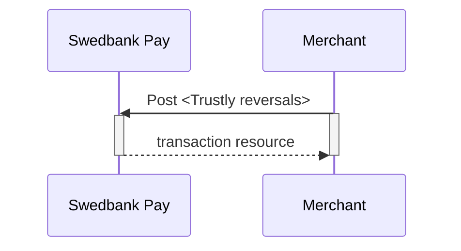

## Options After Posting A Payment

When you detect that the payer has reached your `completeUrl`, you need to do a
`GET` request on the payment resource, which contains the `id` of the `payment`
generated in the first step, to receive the state of the transaction. You will
also be able to see the available `operations` after posting a payment.

*   **Abort:** It is possible to abort the process if the payment has no
  successful transactions. [See the `abort` description](#abort).
*   For reversals, you will need to implement the `reversal` request.
*   **If CallbackURL is set:** Whenever changes to the payment occur a[Callback
  request][callback-request] will be posted to the `callbackUrl`,which was set
  when the payment was created.



## Reversals

The `create-reversal` operation will reverse a payment and
refund the amount to the payer. To reverse a payment, perform the
`create-reversal` operation. The HTTP body of the request should look as
follows:

## Reversal Request

{:.code-view-header}
**Request**

```http
POST /psp/trustly/payments/{{ page.payment_id }}/reversals HTTP/1.1
Host: {{ page.api_host }}
Authorization: Bearer <AccessToken>
Content-Type: application/json

{
    "transaction": {
        "activity": "Sale",
        "amount": 1500,
        "vatAmount": 0,
        "payeeReference": "ABC856",
        "receiptReference": "ABC855",
        "description": "description for transaction"
    }
}
```

{:.table .table-striped}
|     Required     | Field                      | Type         | Description                                                                                                                                                                                                                                                                |
| :--------------: | :------------------------- | :----------- | :------------------------------------------------------------------------------------------------------------------------------------------------------------------------------------------------------------------------------------------------------------------------- |
| ︎ | `transaction`              | `object`     | The transaction object containing details about the reversal transaction.                                                                                                                                                                                                  |
| ︎ |          | `string`     | `FinancingConsumer`.                                                                                                                                                                                                                                                       |
| ︎ |            | `integer`    |                                                                                                                                                                                                                                   |
| ︎ |         | `integer`    |                                                                                                                                                                                                                                |
| ︎ |    | `string` | The `payeeReference` is the receipt/invoice number if `receiptReference` is not defined, which is a **unique** reference with max 50 characters set by the merchant system. This must be unique for each operation and must follow the regex pattern `[\w-]*`. |
|                  |  | `string(50)` |                                                                                                                                                        |
| ︎ |       | `string`     | A textual description of the reversal.                                                                                                                                                                                                                                     |

## Reversal Response

The `reversal` resource will be returned, containing information about the newly created reversal transaction.



## List Reversal Transactions

The `reversals` resource will list the reversal transactions
(one or more) on a specific payment. The URL will be found on a `payment` that has a
successful `sale` operation.

{:.code-view-header}
**Request**

```http
GET /psp/trustly/payments/{{ page.payment_id }}/reversals HTTP/1.1
Host: {{ page.api_host }}
Authorization: Bearer <AccessToken>
Content-Type: application/json
```



## Reversal Sequence Diagram

`Reversal` can only be done on completed Sales transactions.





[callback-request]: /old-implementations/payment-instruments-v1/trustly/features/core/callback
