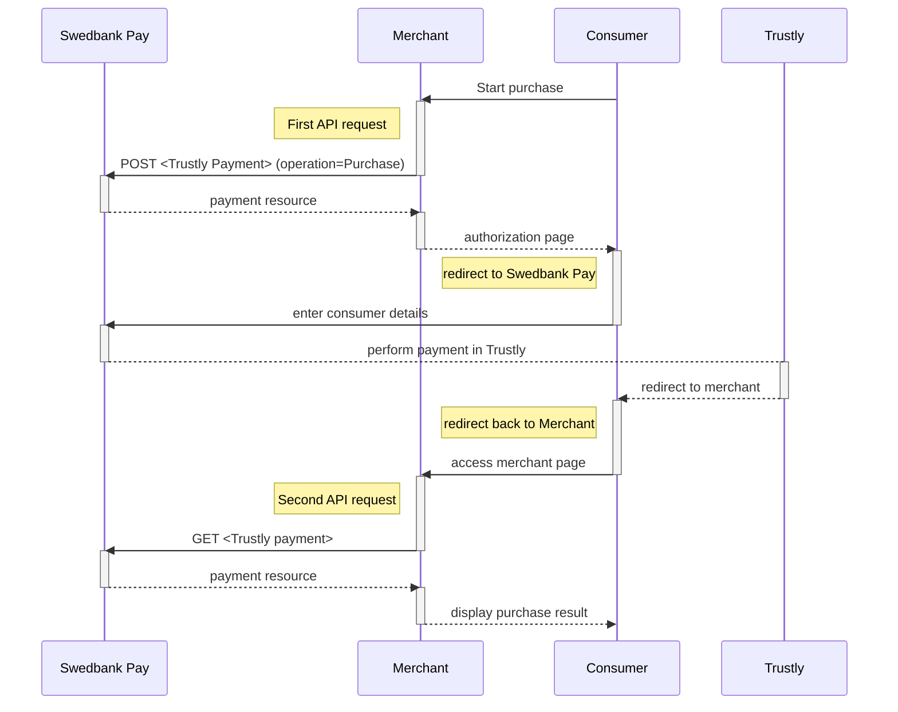

## Introduction

*   When properly set up in your merchant/webshop site and the payer starts the
    purchase process, you need to make a `POST` request towards Swedbank Pay with
    your Purchase information. This will generate a `payment` resource with a unique
    `id`. You will receive a **redirect URL** to a Swedbank Pay payment
    page (`redirect-sale` operation).
*   You need to redirect the payer's browser to that specified URL so that the
    payer can enter the payment details in a secure Swedbank Pay environment.
*   Swedbank Pay will redirect the payer's browser to one of two specified URLs,
    depending on whether the payment session is followed through completely.
    Please note that both a successful and rejected payment
    reach completion.
*   When you detect that the payer reach your `completeUrl`, you need to do a
    `GET` request to receive the state of the transaction, containing the
    `id` URL generated in the first step, to receive the state of the
    transaction.

## Step 1: Create A Payment





To initiate the payment process, you need to make a `POST` request to Swedbank
Pay.

## Redirect Request

{:.code-view-header}
**Request**

```http
POST /psp/trustly/payments HTTP/1.1
Authorization: Bearer <AccessToken>
Content-Type: application/json

{
    "payment": {
        "operation": "Purchase",
        "intent": "Sale",
        "currency": "SEK",
        "prices": [
            {
                "type": "Trustly",
                "amount": 1500,
                "vatAmount": 0
            }
        ],
        "description": "Test Purchase",
        "userAgent": "Mozilla/5.0...",
        "language": "sv-SE",
        "urls": {
            "completeUrl": "https://example.com/payment-completed",
            "cancelUrl": "https://example.com/payment-cancelled",
            "hostUrls": [ "https://example.com" ],
            "callbackUrl": "https://example.com/payment-callback",
            "logoUrl": "https://example.com/logo.png",
            "termsOfServiceUrl": "https://example.com/terms.pdf"
        },
        "payeeInfo": {
            "payeeId": "{{ page.merchant_id }}",
            "payeeReference": "PR123",
            "payeeName": "Merchant1",
            "productCategory": "PC1234",
            "subsite": "MySubsite"
        },
        "payer": {
            "payerReference": "AB1234",
        },
        "prefillInfo": {
            "firstName": "Ola",
            "lastName": "Nordmann"
        }
    }
}
```


{:.table .table-striped .mb-5}
|     Required     | Field                    | Type         | Description                                                                                                                                                                                                                                                                                        |
| :--------------: | :----------------------- | :----------- | :------------------------------------------------------------------------------------------------------------------------------------------------------------------------------------------------------------------------------------------------------------------------------------------------- |
|  |                 | `object`     | The `payment` object contains information about the specific payment.                                                                                                                                                                                                                              |
|  |       | `string`     | The operation that the `payment` is supposed to perform. For Trustly, this will always be `Purchase` as it is currently the only available operation.                                                                                                                                              |
|  |          | `string`     | `Sale` is the only intent option for Trustly. Performs the payment when the payer gets redirected and completes the payment, and is followed by a [reversal](/old-implementations/payment-instruments-v1/trustly/features/core/reversal) of funds.                                                                                                                |
|  |        | `string`     | `SEK`, `EUR`. The currency of the provided `amount`.                                                                                                                                                                                                                                               |
|  |          | `object`     | The `prices` resource lists the prices related to a specific payment.                                                                                                                                                                                                                              |
|  |           | `string`     | Use the `Trustly` type here                                                                                                                                                                                                                                                                        |
|  |         | `integer`    |                                                                                                                                                                                                                                                           |
|  |      | `integer`    |                                                                                                                                                                                                                                                        |
|  |     | `string(40)` |                                                                                                                                                                                                                      |
|  |       | `string`     |                                                                                                                                                                                                                                |
|  |        | `string`     |                                                                                                                                                                                                                                  |
|  |            | `object`     | The `urls` resource lists urls that redirects users to relevant sites.                                                                                                                                                                                                                             |
|  |    | `string`     |   |
|                  |            | `array`       | The URL to redirect the payer to if the payment is cancelled. Only used in redirect scenarios. Can not be used simultaneously with `paymentUrl`; only `cancelUrl` or `paymentUrl` can be used, not both.                                                                                                                                                                  |
|                  |            | `array`       | The array of URLs valid for embedding of Swedbank Pay Seamless View. If not supplied, view-operation will not be available.                                                                                                                                                                        |
|                  |        | `string`      |                                                                                                                                             |
|                  |            | `string`      |                                                                                                                                                                 |
|                  |  | `string`      |                                                                                                                                                                                                                                                |
|  |           | `object`      |                                                                                                                                                                                                                                               |
|  |            | `string`      | This is the unique id that identifies this payee (like merchant) set by Swedbank Pay.                                                                                                                                                                                                              |
|  |     | `string(30*)` |                                                                                                                                                                                                                  |
|                  |          | `string`      | The payee name (like merchant name) that will be displayed when redirected to Swedbank Pay.                                                                                                                                                                                            |
|                  |    | `string`      | A product category or number sent in from the payee/merchant. This is not validated by Swedbank Pay, but will be passed through the payment process and may be used in the settlement process.                                                                                                     |
|                  |     | `string(50)`  | The order reference should reflect the order reference found in the merchant's systems.                                                                                                                                                                                                            |
|                  |            | `string(40)`  |                                                                                                                                         |
|                  |               | `string`     | The `payer` object, containing information about the payer.                                                                                                                                                                                                                                          |
|                  |     | `string`     |                                                                                                                                                                                                                                                            |
|                  |        | `object`      | Object representing information of what the UI text fields should be populated with                                                                                                                                                                                                                |
|                  |          | `string`      | Prefilled value to put in the first name text box.                                                                                                                                                                                                                                                 |
|                  |           | `string`      | Prefilled value to put in the last name text box.                                                                                                                                                                                                                                                  |



## Redirect Response

{:.code-view-header}
**Response**

```http
HTTP/1.1 200 OK
Content-Type: application/json

{
    "payment": {
        "id": "/psp/trustly/payments/{{ page.payment_id }}",
        "number": 99590008046,
        "created": "2020-05-26T12:31:19.3106483Z",
        "updated": "2020-05-26T12:31:19.4513673Z",
        "instrument": "Trustly",
        "operation": "Purchase",
        "intent": "Sale",
        "state": "Ready",
        "currency": "SEK",
        "amount": 0,
        "description": "Test Purchase",
        "initiatingSystemUserAgent": "swedbankpay-sdk-dotnet/3.0.1",
        "userAgent": "Mozilla/5.0...",
        "language": "sv-SE",
        "prices": { "id": "/psp/trustly/payments/{{ page.payment_id }}/prices" },
        "urls": { "id": "/psp/trustly/payments/{{ page.payment_id }}/urls" },
        "payeeInfo": { "id": "/psp/trustly/payments/{{ page.payment_id }}/payeeinfo" },
        "payers": { "id": "/psp/trustly/payments/{{ page.payment_id }}/payers" },
        "metadata": { "id": "/psp/trustly/payments/{{ page.payment_id }}/metadata" }
    },
    "operations": [
        {
            "method": "PATCH",
            "href": "{{ page.api_url }}/psp/trustly/payments/{{ page.payment_id }}",
            "rel": "update-payment-abort"
        },
        {
            "method": "POST",
            "href": "{{ page.api_url }}/psp/trustly/payments/{{ page.payment_id }}/sales",
            "rel": "create-sale"
        },
        {
            "method": "GET",
            "href": "https://ecom.externalintegration.payex.com/trustly/payments/sales/8f3ba6c8f4e3f6125ae6c18bec15c612747cf2c35dc5cac35d4bebc10cf7317e",
            "rel": "redirect-sale"
        }
    ]
}
```

## Redirect Sequence Diagram

This is an example of the Redirect scenario. For other integrations, take a
look at the respective sections. The sequence diagram below shows the two
requests you have to send to Swedbank Pay to make a purchase.

Swedbank Pay Trustly Payments uses the [`Deposit`][deposit] to perform
a payment. After this, the payer will be presented with the returned `iframe`
URL in order to perform the payment with their preferred bank.
Once the user has completed the payment, Swedbank Pay will receive a
notification asynchronously from Trustly, hence why
the UI will initiate polling toward our back-end. The payment status after being
redirect to `completeUrl` will then indicate if the payment was successful or
not, or if the payment is still in progress. If the payment is still in
progress, when reaching `completeUrl`, the Swedbank Pay has then not received a
notification from Trustly that the payment has gone through yet.



## Options After Posting A Payment

Head over to [after payment][after-payment]
to see what you can do when a payment is completed.
Here you will also find info on `Abort` and `Reversal`.



[deposit]: https://trustly.com/en/developer/api#/deposit
[after-payment]: /old-implementations/payment-instruments-v1/trustly/after-payment
