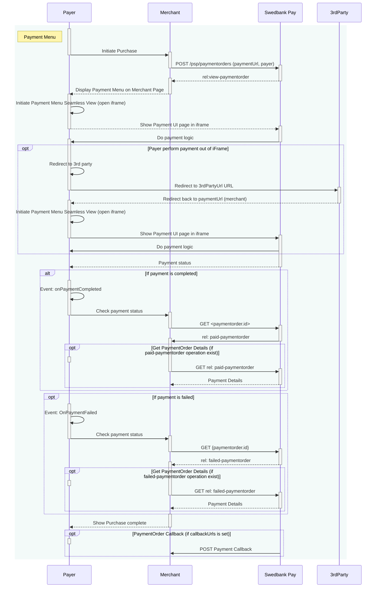



## Step 1: Create Payment Order

We start by performing a `POST` request towards the `paymentorder` resource in
order to create a Payment Order.







### Request



### Response

The response should include this (abbreviated for brevity):


HTTP/1.1 201 Created
Content-Type: application/json

{
    "paymentorder": {
        "id": "/psp/paymentorders/{{ page.payment_order_id }}"
    },
    "operations": [
        {
            "href": "{{ view_payment_order_script_url }}&_tc_tid=30f2168171e142d38bcd4af2c3721959",
            "rel": "view-paymentorder",
            "method": "GET",
            "contentType": "application/javascript"
        }
    ]
}

 

{:.table .table-striped}
| Field          | Type     | Description                                                                        |
| :------------- | :------- | :--------------------------------------------------------------------------------- |
|  | `object` | The payment order object.                                                          |
|    | `string` |                       |
|    | `array`  |  |

The `paymentorder` object is abbreviated since it's just the `id` and
`operations` we are interested in. Store the `id` of the Payment Order
in your system to look up status on the completed payment later.



Then find the `view-paymentorder` operation and embed its `href` in a `<script>`
element. That script will then load the Seamless View for the Payment Menu. We
will look into how to hook that up next.





## Step 2: Display the Payment Menu

To load the payment menu from the JavaScript URL obtained in the back end API
response, it needs to be set as a `script` element's `src` attribute in an HTML
document.

You can cause a page reload and do this with backend-rendered HTML or you can
avoid the page refresh by invoking the POST to create the payment order through
Ajax and then create the script element with JavaScript. We will demonstrate how
to do a JavaScript-based integration below.

First the minimum HTML required to initialize the Payment Menu:

{:.code-view-header}
**HTML**

```html
<!DOCTYPE html>
<html>
    <head>
        <title>Swedbank Pay Payment Menu v2</title>
    </head>
    <body>
        <div id="payment-menu"></div>
        <!-- Here you can specify your own JavaScript file -->
        <script src="<Your-JavaScript-File>"></script>
    </body>
</html>
```

What happens inside `<Your-JavaScript-File>` should look something alike the
following:

{:.code-view-header}
**JavaScript**

```js
var request = new XMLHttpRequest();
request.addEventListener('load', function () {
    response = JSON.parse(this.responseText);
    var script = document.createElement('script');
    // The JavaScript expects a JSON response looking like the created
    // Payment Order, containing the operation 'view-paymentorder.
    var operation = response.operations.find(function (o) {
        return o.rel === 'view-paymentorder';
    });
    script.setAttribute('src', operation.href);
    script.onload = function () {
        // Initialize the Payment Menu and inject it into the 'payment-menu'
        // container <div> defined in the HTML document above.
        payex.hostedView.paymentMenu({
            container: 'payment-menu',
            culture: 'sv-SE'
        }).open();
    };
    // Append the Payment Menu script to the <head>
    var head = document.getElementsByTagName('head')[0];
    head.appendChild(script);
});
// You should replace the address here with your own backend endpoint.
request.open('POST', '<Your-Backend-Endpoint>', true);
request.setRequestHeader('Content-Type', 'application/json; charset=utf-8');
// We will send an object containing the amount the Payment Order should be
// created with. This should of course not be hard coded and you may want to
// send more data from the front-end to the back-end to create a Payment Order
// for your particular use-case.
request.send(JSON.stringify({ amount: 1200 }));
```

## Monitoring The Script URL

With the [PCI-DSS v4][pci]{:target="_blank"} changes taking effect on March 31st
2025, merchants are responsible for ensuring the integrity of the HTML script
used in their integration, including monitoring what is loaded into or over it.
Specifically, Seamless View merchants must verify that the script URL embedded
in their iframe originates from Swedbank Pay or another trusted domain. It is
important to note that Swedbank Pay’s PCI responsibility is strictly limited to
the content within the payment iframe. For further details, refer to section
4.6.3 in the linked document.

To ensure compliance, we recommend implementing [Content Security Policy][csp]{:target="_blank"}
rules to monitor and authorize scripts.

Merchants must whitelist the following domains to restrict browser content
retrieval to approved sources. While `https://*.payex.com` and
`https://*.swedbankpay.com` cover most payment methods, digital wallets such as
Apple Pay, Click to Pay, and Google Pay are delivered via Payair. Alongside the
Payair URL, these wallets may also generate URLs from Apple, Google, MasterCard,
and Visa. See the table below for more information.

When it comes to ACS URLs, nothing is loaded from the ACS domain in the
merchant's end. It will either happen within Swedbank Pay's domain or as a
redirect, which will repeal the merchant's CSP.



{:.table .table-striped}
| URL    | Description             |
| :------ | :--------------- |
| https://*.cdn-apple.com | URL needed for Apple Pay.     |
| https://*.google.com | URL needed for Google Pay.     |
| https://*.gstatic.com | Domain used by Google that hosts images, CSS, and javascript code to reduce bandwidth usage online.     |
| https://*.mastercard.com | URL needed for Click to Pay.     |
| https://*.payair.com | URL for the digital wallets Apple Pay, Click to Pay and Google Pay.     |
| https://*.payex.com    | Universal URL for all payment methods except the digital wallets Apple Pay, Click to Pay and Google Pay.     |
| https://*.swedbankpay.com | Universal URL for all payment methods except the digital wallets Apple Pay, Click to Pay and Google Pay.     |
| https://*.visa.com | URL needed for Click to Pay.     |

This should bring up the Payment Menu in a Seamless View. It should look like
this, depending on whether the payer is identified (top) or a guest user
(bottom):

{:.text-center}
![Payment Menu v2 with payer identified in and card payment opened][login-payment-menu-image]{:width="450" height="900"}

{:.text-center}
![Payment Menu v2 with guest payer and card payment opened][guest-payment-menu-image]{:width="450" height="850"}

When the payer completes the payment, the Payment Menu script will be
signaled and a full redirect to the `completeUrl` sent in with the
Payment Order will be performed. When the `completeUrl` on your server is hit,
you can inspect the status on the stored `paymentorder.id` on the server, and
then perform `capture`.

If the payment is a `Sale` or one-phase purchase, it will be automatically
captured. A third scenario is if the goods are sent physically to the payer;
then you should not do a capture until the goods are sent.

You may open and close the payment menu using `.open()` and `.close()`
functions. You can also invoke `.refresh()` to
[update the Payment Menu][operations] after any changes to the
order.

Below, you will see a complete overview of the payment menu process.
Notice that there are two ways of performing the payment:

*   Payer performs payment **out** of `iframe`.
*   Payer performs payment **within** `iframe`.







[guest-payment-menu-image]: /assets/img/checkout/guest-payment-menu.png
[login-payment-menu-image]: /assets/img/checkout/swedish-logged-in-payment-menu.png
[operations]: /old-implementations/checkout-v2/features/technical-reference/operations
[pci]: https://www.swedbankpay.se/globalassets/global-documents/risk-and-security/pci-dss-v4-0-saq-a-r2.pdf
[csp]: https://www.w3.org/TR/CSP2/
