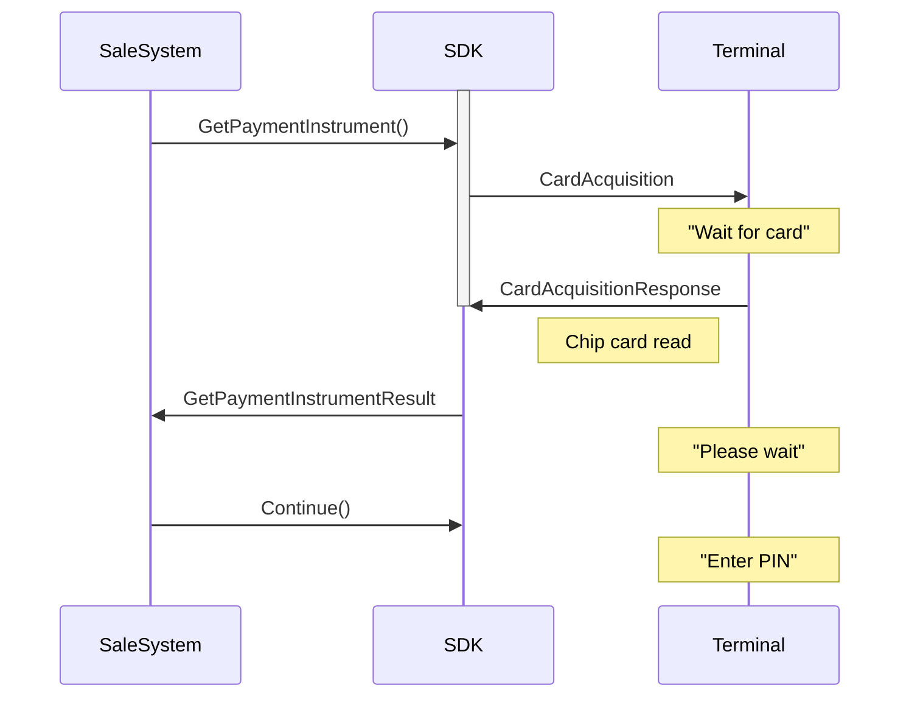

### Method Signature

*   void Continue()

### Description

When a card has been read using `GetPaymentInstrument` and the amount is still not known, this method will let the terminal to proceed with PIN dialog if appropriate. For contactless the terminal will wait for an amount.

