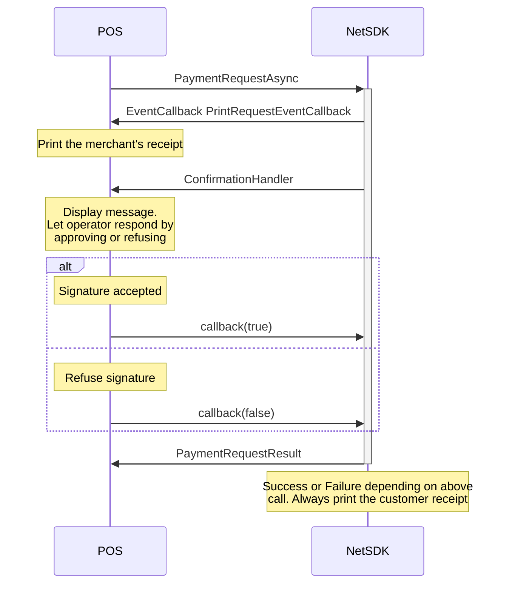

## The Flow

The flow of a CVM signature transaction always needs to be implemented and works the same regardless if the default or client only implementation is made. The difference from a normal transaction is that the sale system first gets a [`PrintRequestEventCallback`][printrequesteventcallback] with the merchant receipt that needs to be signed. Then the sale system will get a callback to [`ConfirmationHandler`][confirmationhandler] with a text to be displayed to the operator in a YES/NO dialog box. The callback itself has a parameter called `callback` which must be used to deliver an answer `true` or `false`. When that callback has been called the sale system will get the final [`PaymentRequestResult`][paymentrequestresult].

{:.code-view-header}
**The following illustrates the flow when using async call**

You must respond by using the callback and you must not call Abort.

If synchronous calls are used the flow is the same but the `PaymentRequestResult` will appear in the [`SyncRequestResult`][syncrequestresultcallback] callback.

The flow works for both `Client Only` mode and when implementing the `default mode`. When Client Only mode, the SDK will fake the print- and input- requests from the terminal to make the flow identical. However when refusing the signature in `Client Only` mode a `ReversalRequest` is made and the customer receipt will indicate that the transaction was cancelled.

[printrequesteventcallback]: /pax-terminal/NET/SwpTrmLib/ISwpTrmCallbackInterface/#eventcallback
[confirmationhandler]: /pax-terminal/NET/SwpTrmLib/ISwpTrmCallbackInterface/#confirmationhandler
[paymentrequestresult]: /pax-terminal/NET/includes/paymentrequestresult
[syncrequestresultcallback]: /pax-terminal/NET/SwpTrmLib/ISwpTrmCallbackInterface/#syncrequestresult
