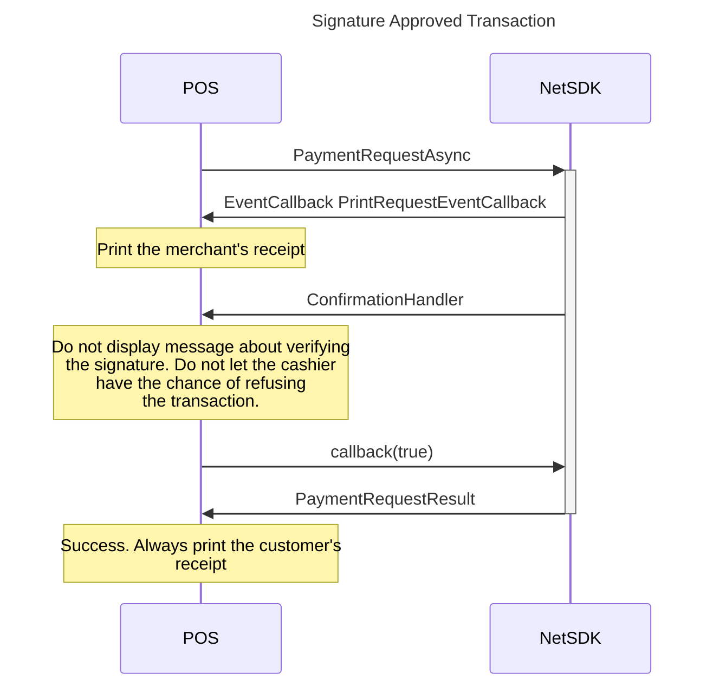

## CVM Signature Specifics

The terminal is required to handle transaction approved by cardholder signigng the receipt, so called CVM signature. In Europe such cards are not issued anymore, but they are elsewhere in the world. The liability is on the issuer side and we are not allowed to deny such cards. There is no requirement on us to approve or disapprove the signature and we are always obligated to approve the transaction. This differs from what we have known earlier and the terminal and the SDK still acts like the cardholder signature needs to be approved by the POS operator (cashier).

The current flow of a CVM signature transaction needs to be handeled but always wind up with an accepted transaction. The difference from a normal transaction is that the sale system first gets a [`PrintRequestEventCallback`][printrequesteventcallback] with the merchant receipt that has lines for signature. Print that since the cardholder may insist on signing. After the print request the sale system will get a callback to [`ConfirmationHandler`][confirmationhandler] with a text meant to be displayed to the operator. **Don't display that**. The callback itself has a parameter called `callback` which must be used to deliver an boolean answer which nowdays always should be `true` to accept the transaction. When that callback has been called the sale system will get the final [`PaymentRequestResult`][paymentrequestresult].

{:.code-view-header}
**The following illustrates the flow when using async call**

```mermaid
sequenceDiagram
title: Signature Approved Transaction
participant POS
participant NetSDK

POS->>+NetSDK: PaymentRequestAsync
NetSDK->>POS: EventCallback PrintRequestEventCallback
Note over POS: Print the merchant's receipt
NetSDK->>POS: ConfirmationHandler
Note over POS: Do not display message about verifying<br>the signature. Do not let the cashier<br>have the chance of refusing<br>the transaction.
POS->>NetSDK: callback(true)
NetSDK->>-POS: PaymentRequestResult
Note over POS: Success. Always print the customer's<br>receipt
```

**You must respond by using the callback and you must not call Abort.**

If synchronous calls are used the flow is the same but the `PaymentRequestResult` will appear in the [`SyncRequestResult`][syncrequestresultcallback] callback.

The flow works for both `Client Only` mode and when implementing the `default mode`. When Client Only mode, the SDK will fake the print- and input- requests from the terminal to make the flow identical. However, do never allow the opreator to refuse the signature. Always respond `true` in the `ConfirmationHandler` callback.

[printrequesteventcallback]: /pax-terminal/NET/SwpTrmLib/ISwpTrmCallbackInterface/#eventcallback
[confirmationhandler]: /pax-terminal/NET/SwpTrmLib/ISwpTrmCallbackInterface/#confirmationhandler
[paymentrequestresult]: /pax-terminal/NET/includes/paymentrequestresult
[syncrequestresultcallback]: /pax-terminal/NET/SwpTrmLib/ISwpTrmCallbackInterface/#syncrequestresult
