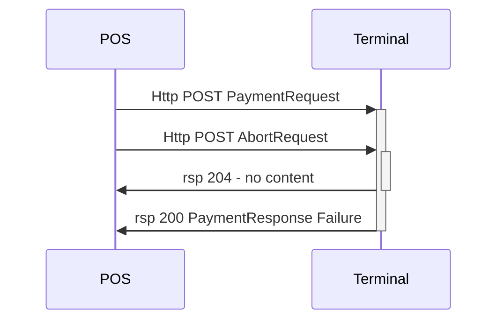

AbortRequest may be sent for any ongoing request.

{:.code-view-header }
**Sample abort payment**

```xml
<SaleToPOIRequest>
    <MessageHeader MessageCategory="Abort" MessageClass="Service" MessageType="Request" POIID="A-POIID" SaleID="ECR1" ServiceID="1524253498"/>
    <AbortRequest>
        <MessageReference MessageCategory="Payment" POIID="A-POIID" SaleID="ECR1" ServiceID="1524253497"/>
        <AbortReason>Abort by Sale System</AbortReason>
    </AbortRequest>
</SaleToPOIRequest>
```

{:.table .table-striped}
| Name | Attributes | Description |
| :------------- | :-------------- |:--------------- |
| MessageReference | MessageCategory | Category of the request being aborted. |
| | POIID | POIID used in the request that is being aborted. |
| | SaleID | SaleID that was used in the request that is being aborted. |
| | ServiceID | ServiceID in the request that is being aborted. |
| AbortReason | | Text explaining the reason for the abortion. |






