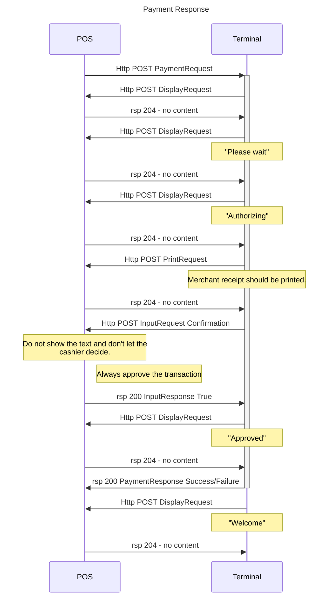
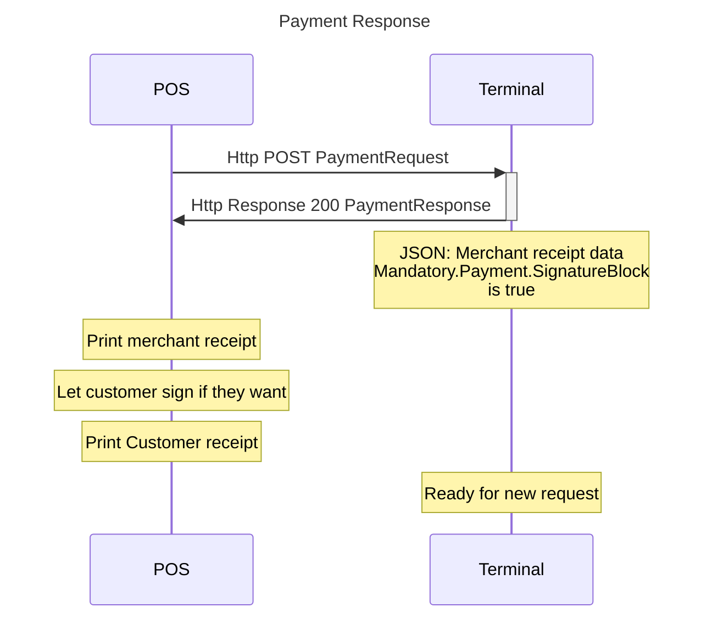

## For CVM method Signature default integration

If the full integration is made and the login was made with SaleCapabilities including `CashierInput`, the following sequence diagram shows how a purchase that is apporoved with a card holder signature would look like. Such cards are from non EU countries and we have no obligation to verify the customer signature. All transactions with signature approval must be accepted. The terminal may still act as if the cashier has to approve or reject the transaction, but the transaction must always be approved. The liability is on the issuer.

## For CVM method Signature Client Only mode

If the Client-Only integration is made or rather, if login was made without SaleCapabilites `CashierInput`, it is **essential** to check the receipt data Json for `{"Merchant":{"Mandatory":{"Payment":"SignatureBlock":true"}}}`. If SignatureBlock is true, the merchant receipt should be printed in case the customer wants to sign it.
The following sequence diagram shows how a purchase that is apporoved with a card holder signature would look like when running Client-Only mode.


