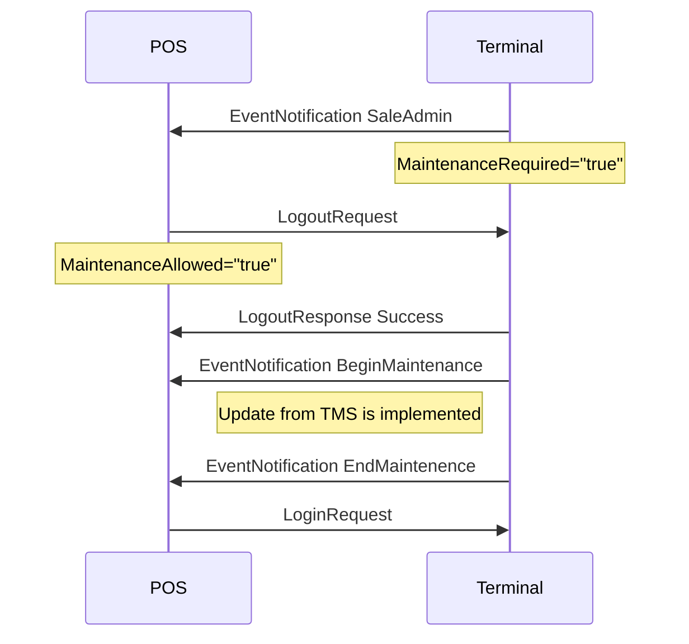

## EventNotification

Event notifications are sent from the terminal to the POS to inform the POS about different things. They do not require a response message and it is not a must to implement any handeling of them, but it may be helpful and make a nice solution. They will only appear if the implementation has a listener for terminal requests.

The most commonly used event notifications are those informing about parameter updates.

```xml
<SaleToPOIRequest>
 <MessageHeader MessageClass="Event" MessageCategory="Event" MessageType="Notification" ServiceID="20" SaleID="1" POIID="A-POIID"/>
 <EventNotification TimeStamp="2023-10-06T07:24:14.473+02:00" EventToNotify="SaleAdmin" MaintenanceRequiredFlag="true">
  <EventDetails>Maintenance Required</EventDetails>
 </EventNotification>
</SaleToPOIRequest>
```

{:.table .table-striped}
| Name | Lev | Attribute | Description |
| :------------- | :--: | :-------------- |:--------------- |
| EventNotification | 1 | TimeStamp | Local time when the event occurred. |
| | | EventToNotify | The essential attribute informing what it is about. Enumeration: `SaleAdmin`, `BeginMaintenance`, `EndMaintenance`, `Reject`, `CardInserted`, `CardRemoved`. |
| | | MaintenanceRequired | true or false. If true, there are updates that will be implemented at next logout if maintenance allowed is set.|
| EventDetails | 2 |  | Informational text about the event. Note! not always present. |
| RejectedMessage | 2 | | If EventToNotify is `Reject`. |

{:.code-view-header}
**Example flow**


