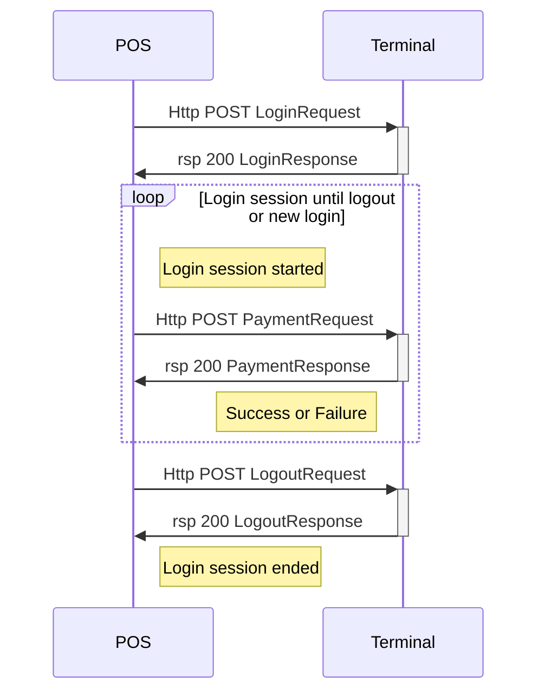
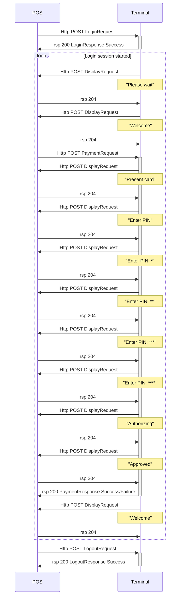

## Simplest Form of Integration

This quick guide will take you through the essentials and hopefully speed up the process of getting your solution ready for the real action. It will show the basics and how a transaction is made and  what the response looks like. It will also show how to abort and how to retrieve result of a priviously made transaction.

Depending on the solution one wants to build, to make a payment just takes two requests with corresponding responses. A `LoginRequest` and a `PaymentRequest` with a happy flow that gives a successful `LoginResponse` and an approved payment that gives a successful `PaymentResponse` with the receipt data.
To make it a little more acceptable one probably wants to be able to abort using an `AbortRequest`, and ask for a transaction status with a `TransactionStatus` request.

{:.code-view-header}
**Typical Happy Flow simple integration**

## Intended Form of Integration

When sending a `LoginRequest` message it is feasible to choose from two styles:

*   Default integration, where POS act as both server and client
*   Light integration, where POS acts as a client only

The default form of integration, full integration, includes a listener on the POS side as well. This makes it possible for the terminal to send requests to the POS. Those requests are mostly display messages letting the POS operator to see what is happening on the terminal. In case a receipt needs to be signed by the customer, the terminal sends an input request together with a print request. The input request will ask for a confirmation from the operator that the signature is ok. When implementing a listener there will also be event notification messages such as `card inserted`, `card removed`, `maintenance required`, `maintenance completed` etc.
The decision of having the terminal to send requests or not is made when sending the [`LoginRequest`][loginrequest] message.

{:.code-view-header}
**Typical Happy Flow full integration**



[loginrequest]: ./first-message
