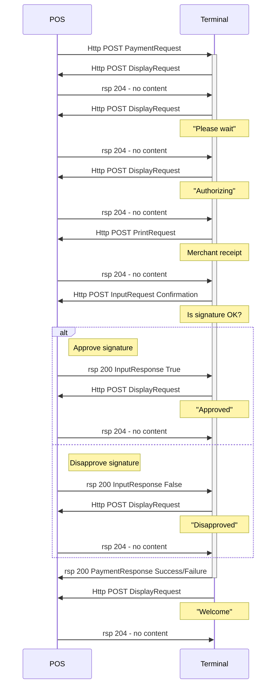

A payment is approved if the `Result` attribute of the `/PaymentResponse/Response` element is `Success`.
For all unapproved payments the same attribute is `Failure` and the actual response code is found in the receipt data if wanted.
Depending on why a payment is unapproved the response may not contain a receipt. However, make sure to always make a payment terminal receipt available if a card has been used.

The payment response carries both a merchant receipt and a customer receipt. The customer receipt should always be used. The merchant receipt is used if the receipt needs to be signed by the customer.
The receiptdata is a Base64 encoded JSON structure.



## For CVM method Signature

If the full integration is made, the following sequence diagram shows how a purchase that is apporoved with a card holder signature would look like.



