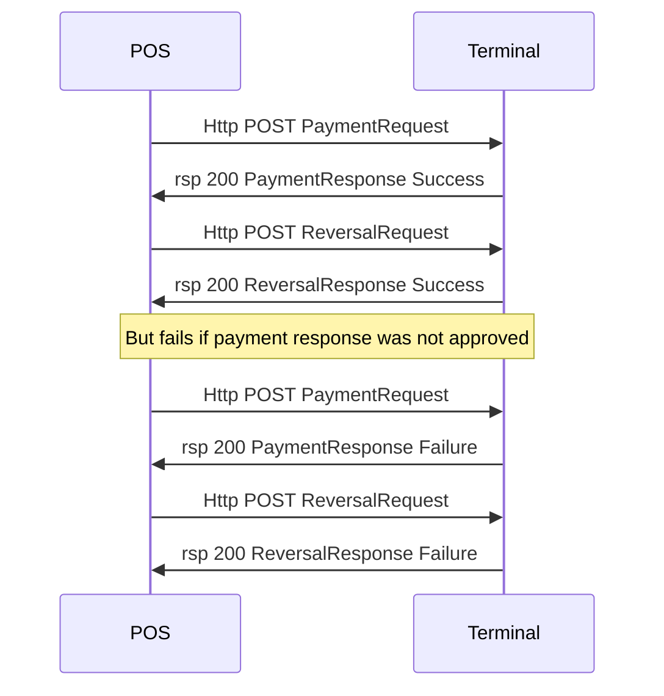

## Reversal

A reversal is an immediate financial correction on a successful transaction that was just made. The reversal request needs information from the successul response that wants to be reversed.  A reversal cannot be made without first getting a successful response.



{:.code-view-header}
**sample ReversalRequest message**

```xml
<SaleToPOIRequest>
 <MessageHeader ProtocolVersion="3.1" MessageClass="Service" MessageCategory="Reversal" MessageType="Request" ServiceID="7" SaleID="1" POIID="A-POIID"/>
 <ReversalRequest ReversalReason="MerchantCancel">
  <OriginalPOITransaction SaleID="1" POIID="A-POIID">
   <POITransactionID TransactionID="8778880381" TimeStamp="2023-10-04T14:25:08.647Z"/>
  </OriginalPOITransaction>
 </ReversalRequest>
</SaleToPOIRequest> :]
 ```

{:.table .table-striped}
| Name | Lev | Attribute | Description |
| :------------- | :---: | :-------------- |:--------------- |
| ReversalRequest | 1 | ReversalReason |  `MerchantCancel` when manually operation by POS operator, `Malfunction` if automatically made by software due to some problem. |
| OriginalPOITransaction | 2 | SaleID | SaleID used for transaction being reversed. |
|   |   | POIID | POIID used for transaction being reversed. |
| POITransactionID | 3 | TransactionID | Copied form POITransactionID received in response for transaction being reversed. |
| | | TimeStamp | Copied form POITransactionID received in response for transaction being reversed. |

## Reversal Response

A successful reversal response contains receipt information as a base64 encoded Json structure. Make sure to print the customer receipt information to give the customer.

{:.code-view-header}
**Sample ReversalResponse message**

```xml
<SaleToPOIResponse>
 <MessageHeader MessageClass="Service" MessageCategory="Reversal" MessageType="Response" ServiceID="7" SaleID="1" POIID="A-POIID"/>
 <ReversalResponse>
  <Response Result="Success"/>
  <POIData>
   <POITransactionID TransactionID="8778880381" TimeStamp="2023-10-04T14:25:08.647Z"/>
  </POIData>
  <PaymentReceipt DocumentQualifier="CustomerReceipt">
   <OutputContent OutputFormat="Text">
    <OutputText>eyJDYXJkaG9sZGVyIjp7Ik1hbmRhdG9yeSI6eyJBY3F1aXJlciI6eyJDYXJkQWNjZXB0b3JOdW1iZXIiOiIxMDAyMDAwMSIsIlRlcm1pbmFsSUQiOiI4Nzc4ODgifSwiQ2FyZEFjY2VwdG9yIjp7IkFkZHJlc3MxIjoiSMOkbGxlc2vDpXJhbiAyOSIsIkJhbmtBZ2VudE5hbWUiOiJiYW5reS1iYW5rIiwiTmFtZSI6IlRlc3Qgc2hvcCIsIk9yZ2FuaXNhdGlvbk51bWJlciI6IjU1NjU2NzEtNjE2NSIsIlBvc3RaaXBDb2RlIjoiNTA1MCIsIlRvd25DaXR5IjoibWVyY2hhbnQtQmFzZTI0LUNpdHkifSwiQ2FyZERldGFpbHMiOnsiQXBwbGljYXRpb25JZGVudGlmaWVyIjoiQTAwMDAwMDAwNDEwMTAiLCJDYXJkU2NoZW1lTmFtZSI6eyJBcHBsaWNhdGlvbkxhYmVsIjoiTWFzdGVyY2FyZCJ9LCJQcmltYXJ5QWNjb3VudE51bWJlciI6IioqKioqKioqKioqKjk2NTkiLCJUZXJtaW5hbFZlcmlmaWNhdGlvblJlc3VsdCI6IjAwMDAwMDgwMDEiLCJUcmFuc2FjdGlvblN0YXR1c0luZm9ybWF0aW9uIjoiMDAwMCJ9LCJPdXRjb21lIjp7IkFwcHJvdmFsQ29kZSI6Ijc0MTU5MSIsIkF1dGhvcmlzYXRpb25SZXNwb25kZXIiOiIzIiwiQXV0aG9yaXNhdGlvblJlc3BvbnNlQ29kZSI6IjAwIiwiRGViaXRTdGF0dXMiOiI5MSJ9LCJQYXltZW50Ijp7IkF1dGhvcmlzYXRpb25DaGFubmVsIjoiMSIsIkNhcmRob2xkZXJWZXJpZmljYXRpb25NZXRob2QiOiIvIiwiQ3VycmVuY3kiOiJTRUsiLCJGaW5hbmNpYWxJbnN0aXR1dGlvbiI6IlNXRSIsIlBheW1lbnRBbW91bnQiOiI4OSwwMCIsIlJlY2VpcHROdW1iZXIiOiI4Nzc4ODgwMzgxIiwiU2lnbmF0dXJlQmxvY2siOmZhbHNlLCJUb3RhbEFtb3VudCI6Ijg5LDAwIiwiVHJhbnNhY3Rpb25Tb3VyY2UiOiJLIiwiVHJhbnNhY3Rpb25UeXBlIjoiMDAifSwiVGltZVN0YW1wIjp7IkRhdGVPZlBheW1lbnQiOiIyMDIzLTEwLTA0IiwiVGltZU9mUGF5bWVudCI6IjE2OjI1In19LCJPcHRpb25hbCI6eyJDYXJkQWNjZXB0b3IiOnsiQ291bnRyeU5hbWUiOiI3NTIiLCJQaG9uZU51bWJlciI6Iis0Njg0MDUxMDAwIn0sIkNhcmREZXRhaWxzIjp7IkNhcmRTY2hlbWVOYW1lIjp7IkFwcGxpY2F0aW9uTGFiZWwiOiJNYXN0ZXJjYXJkIn19LCJQYXltZW50Ijp7IlJlZmVyZW5jZSI6IjE2MjUwODMifSwiUmVjZWlwdFN0cmluZyI6WyJUZXN0IHNob3AiLCJIw6RsbGVza8OlcmFuIDI5IiwiNTA1MCBtZXJjaGFudC1CYXNlMjQtQ2l0eSIsIuKYjiArNDYgOCA0MDUgMTAgMDAiLCJPcmcgbnI6IFNFIDU1NjU2NzEtNjE2NSIsIjIwMjMtMTAtMDQgMTY6MjUiLCIiLCJNSUQvVElEOiAxMDAyMDAwMS84Nzc4ODgiLCIiLCJNYXN0ZXJjYXJkIiwiQ29udGFjdGxlc3MiLCIqKioqKioqKioqKio5NjU5IiwiIiwiSy8xIDMgMDAgU1dFIiwiQUlEOiBBMDAwMDAwMDA0MTAxMCIsIlRWUjogMDAwMDAwODAwMSIsIlRTSTogMDAwMCIsIlJSTjogODc3ODg4MDM4MSIsIkF1dGggY29kZTogNzQxNTkxIiwiQVJDOiAwMCIsIiIsIkvDllA6ICAgICAgICAgODksMDAgU0VLIiwiTWFrdWxlcmluZyIsIiIsIiIsIiIsIktvcnRpbm5laGF2YXJlbnMga3ZpdHRvIl19fX0=</OutputText>
   </OutputContent>
  </PaymentReceipt>
  <PaymentReceipt DocumentQualifier="CashierReceipt">
   <OutputContent OutputFormat="Text">
    <OutputText>eyJNZXJjaGFudCI6eyJNYW5kYXRvcnkiOnsiQWNxdWlyZXIiOnsiQ2FyZEFjY2VwdG9yTnVtYmVyIjoiMTAwMjAwMDEiLCJUZXJtaW5hbElEIjoiODc3ODg4In0sIkNhcmRBY2NlcHRvciI6eyJBZGRyZXNzMSI6IkjDpGxsZXNrw6VyYW4gMjkiLCJCYW5rQWdlbnROYW1lIjoiYmFua3ktYmFuayIsIk5hbWUiOiJUZXN0IHNob3AiLCJPcmdhbmlzYXRpb25OdW1iZXIiOiI1NTY1NjcxLTYxNjUiLCJQb3N0WmlwQ29kZSI6IjUwNTAiLCJUb3duQ2l0eSI6Im1lcmNoYW50LUJhc2UyNC1DaXR5In0sIkNhcmREZXRhaWxzIjp7IkFwcGxpY2F0aW9uSWRlbnRpZmllciI6IkEwMDAwMDAwMDQxMDEwIiwiQ2FyZFNjaGVtZU5hbWUiOnsiQXBwbGljYXRpb25MYWJlbCI6Ik1hc3RlcmNhcmQifSwiUHJpbWFyeUFjY291bnROdW1iZXIiOiI1MTY4MTUqKioqKio5NjU5IiwiVGVybWluYWxWZXJpZmljYXRpb25SZXN1bHQiOiIwMDAwMDA4MDAxIiwiVHJhbnNhY3Rpb25TdGF0dXNJbmZvcm1hdGlvbiI6IjAwMDAifSwiT3V0Y29tZSI6eyJBcHByb3ZhbENvZGUiOiI3NDE1OTEiLCJBdXRob3Jpc2F0aW9uUmVzcG9uZGVyIjoiMyIsIkF1dGhvcmlzYXRpb25SZXNwb25zZUNvZGUiOiIwMCIsIkRlYml0U3RhdHVzIjoiOTEifSwiUGF5bWVudCI6eyJBdXRob3Jpc2F0aW9uQ2hhbm5lbCI6IjEiLCJDYXJkaG9sZGVyVmVyaWZpY2F0aW9uTWV0aG9kIjoiLyIsIkN1cnJlbmN5IjoiU0VLIiwiRmluYW5jaWFsSW5zdGl0dXRpb24iOiJTV0UiLCJQYXltZW50QW1vdW50IjoiODksMDAiLCJSZWNlaXB0TnVtYmVyIjoiODc3ODg4MDM4MSIsIlNpZ25hdHVyZUJsb2NrIjpmYWxzZSwiVG90YWxBbW91bnQiOiI4OSwwMCIsIlRyYW5zYWN0aW9uU291cmNlIjoiSyIsIlRyYW5zYWN0aW9uVHlwZSI6IjAwIn0sIlRpbWVTdGFtcCI6eyJEYXRlT2ZQYXltZW50IjoiMjAyMy0xMC0wNCIsIlRpbWVPZlBheW1lbnQiOiIxNjoyNSJ9fSwiT3B0aW9uYWwiOnsiQ2FyZEFjY2VwdG9yIjp7IkNvdW50cnlOYW1lIjoiNzUyIiwiUGhvbmVOdW1iZXIiOiIrNDY4NDA1MTAwMCJ9LCJDYXJkRGV0YWlscyI6eyJDYXJkU2NoZW1lTmFtZSI6eyJBcHBsaWNhdGlvbkxhYmVsIjoiTWFzdGVyY2FyZCJ9fSwiUGF5bWVudCI6eyJSZWZlcmVuY2UiOiIxNjI1MDgzIn0sIlJlY2VpcHRTdHJpbmciOlsiVGVzdCBzaG9wIiwiSMOkbGxlc2vDpXJhbiAyOSIsIjUwNTAgbWVyY2hhbnQtQmFzZTI0LUNpdHkiLCLimI4gKzQ2IDggNDA1IDEwIDAwIiwiT3JnIG5yOiBTRSA1NTY1NjcxLTYxNjUiLCIyMDIzLTEwLTA0IDE2OjI1IiwiIiwiTUlEL1RJRDogMTAwMjAwMDEvODc3ODg4IiwiIiwiTWFzdGVyY2FyZCIsIkNvbnRhY3RsZXNzIiwiNTE2ODE1KioqKioqOTY1OSIsIiIsIksvMSAzIDAwIFNXRSIsIkFJRDogQTAwMDAwMDAwNDEwMTAiLCJUVlI6IDAwMDAwMDgwMDEiLCJUU0k6IDAwMDAiLCJSUk46IDg3Nzg4ODAzODEiLCJBdXRoIGNvZGU6IDc0MTU5MSIsIkFSQzogMDAiLCIiLCJLw5ZQOiAgICAgICAgIDg5LDAwIFNFSyIsIk1ha3VsZXJpbmciLCIiLCIiLCIiLCJGw7Zyc8OkbGphcmVucyBrdml0dG8iXX19fQ==</OutputText>
   </OutputContent>
  </PaymentReceipt>
 </ReversalResponse>
</SaleToPOIResponse>
```

{:.code-view-header}
**The Json struct of customer receipt**

```json
{
    "Cardholder": {
        "Mandatory": {
            "Acquirer": {
                "CardAcceptorNumber": "10020001",
                "TerminalID": "877888"
            },
            "CardAcceptor": {
                "Address1": "Hälleskåran 29",
                "BankAgentName": "banky-bank",
                "Name": "Test shop",
                "OrganisationNumber": "5565671-6165",
                "PostZipCode": "5050",
                "TownCity": "merchant-Base24-City"
            },
            "CardDetails": {
                "ApplicationIdentifier": "A0000000041010",
                "CardSchemeName": {
                    "ApplicationLabel": "Mastercard"
                },
                "PrimaryAccountNumber": "************9659",
                "TerminalVerificationResult": "0000008001",
                "TransactionStatusInformation": "0000"
            },
            "Outcome": {
                "ApprovalCode": "741591",
                "AuthorisationResponder": "3",
                "AuthorisationResponseCode": "00",
                "DebitStatus": "91"
            },
            "Payment": {
                "AuthorisationChannel": "1",
                "CardholderVerificationMethod": "/",
                "Currency": "SEK",
                "FinancialInstitution": "SWE",
                "PaymentAmount": "89,00",
                "ReceiptNumber": "8778880381",
                "SignatureBlock": false,
                "TotalAmount": "89,00",
                "TransactionSource": "K",
                "TransactionType": "00"
            },
            "TimeStamp": {
                "DateOfPayment": "2023-10-04",
                "TimeOfPayment": "16:25"
            }
        },
        "Optional": {
            "CardAcceptor": {
                "CountryName": "752",
                "PhoneNumber": "+4684051000"
            },
            "CardDetails": {
                "CardSchemeName": {
                    "ApplicationLabel": "Mastercard"
                }
            },
            "Payment": {
                "Reference": "1625083"
            },
            "ReceiptString": [
                "Test shop",
                "Hälleskåran 29",
                "5050 merchant-Base24-City",
                "☎ +46 8 405 10 00",
                "Org nr: SE 5565671-6165",
                "2023-10-04 16:25",
                "",
                "MID/TID: 10020001/877888",
                "",
                "Mastercard",
                "Contactless",
                "************9659",
                "",
                "K/1 3 00 SWE",
                "AID: A0000000041010",
                "TVR: 0000008001",
                "TSI: 0000",
                "RRN: 8778880381",
                "Auth code: 741591",
                "ARC: 00",
                "",
                "KÖP:         89,00 SEK",
                "Makulering",
                "",
                "",
                "",
                "Kortinnehavarens kvitto"
            ]
        }
    }
}
```


