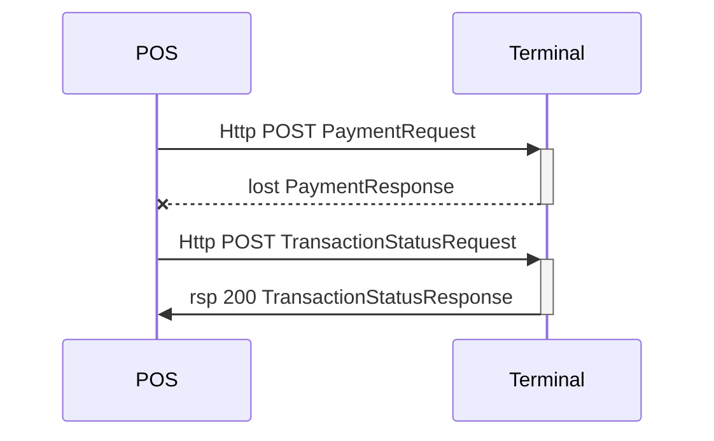

## TransactionStatus

The transaction status request is used for retrieving the transaction result for a transaction for which the result for some reason is lost. The simplest form is to ask for the result of the last transaction, but there are other options too, by specifying more detailed information.



{:.code-view-header}
**Simplest form of TransactionStatus Request**

```xml
<SaleToPOIRequest>
 <MessageHeader ProtocolVersion="3.1" MessageClass="Service" MessageCategory="TransactionStatus" MessageType="Request" ServiceID="7" SaleID="1" POIID="A-POIID"/>
 <TransactionStatusRequest/>
</SaleToPOIRequest>
```

Above request will receive a transaction status response containing the last response that the terminal has sent using the current POIID and SaleID of category `Payment`, `CardAcquisition`, or `Reversal`, nested within the response.

{:.code-view-header}
**TransactionStatus Response Layout**

```xml
<SaleToPOIResponse>
 <MessageHeader ProtocolVersion="3.1" MessageClass="Service" MessageCategory="TransactionStatus" MessageType="Response" ServiceID="18" SaleID="1" POIID="A-POIID"/>
 <TransactionStatusResponse>
  <Response Result="Success"/>
  <RepeatedMessageResponse>
    <MessageHeader>...message header of the found response </MessageHeader>
    <PaymentResponse>...the complete response of the found message. In this case a payment response</PaymentResponse>
  </RepeatedMessageResponse>
 </TransactionStatusResponse>
</SaleToPOIResponse>
```

The element RepeatedMessageResponse holds the complete response message asked for, excluding the SaleToPOIResponse element.

If the transaction asked for is not yet completed, the Response Result attribute will say `Failure` with ErrorCondition `Busy`.

## Request for earlier than last

An earlier transaction may be found if still in the database of the terminal. Add a MessageReference element as child to the TransactionStatusRequest element. The MessageReference may contain one or more attributes to look for. To request for a special ServiceID or just MessageCategory Payment  is probably the most useful variants.

```xml
<SaleToPOIRequest>
    <MessageHeader ProtocolVersion="3.1" MessageClass="Service" MessageCategory="TransactionStatus" MessageType="Request" ServiceID="002141" SaleID="1" POIID="A-POIID"/> 
    <TransactionStatusRequest>
        <MessageReference MessageCategory=”Payment” ServiceID=”002131” SaleID=”1” POIID=”A-POIID”/>
    </TransactionStatusRequest>
</SaleToPOIRequest>

```


