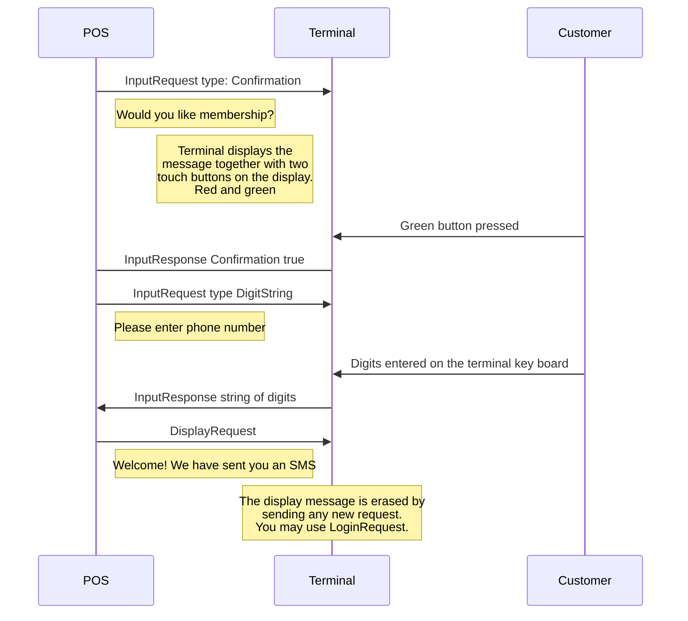

The terminal offers at the moment three different possibilities to communicate with the customer. There is a `DisplayRequest` and then two types of `InputRequest`. One to get a response on a Yes/No question and the other to ask a customer to enter a digit string. The request may be sent during a login session when no other request is on going.



## InputRequest

The InputRequest has two parts. One for what to be displayed and one for the type of input requested.

Note that when the InputRequest is responded to the terminal goes back to display what was displayed before the request.

{:table .table.striped}
| Name | Lev | Attribute | Description |
|:---|:--:|:--|:--|
| InputRequest | 1 | | |
| DisplayOutput | 2 | Device | Only value is `CustomerDisplay`. |
| | | InfoQuality | Only value is `Display`. |
| OutputContent | 3 | OutputFormat | Only value is `Text`. |
| OutputText | 4 | | Question to be asked to the customer. |
| InputData | 2 | Device | Only value is `CustomerInput`. |
| | | InfoQualify | Only value is `Input`. |
| | | InputCommand | Either `GetConfirmation` or `DigitString`. |
|---|---|---|---|

{:.code-view-header}
**Example of a Yes/No input request**

```xml
<SaleToPOIRequest>
 <MessageHeader ProtocolVersion="3.1" MessageClass="Device" MessageCategory="Input" MessageType="Request" ServiceID="45" DeviceID="45" SaleID="1" POIID="A-POIID"/>
 <InputRequest>
  <DisplayOutput Device="CustomerDisplay" InfoQualify="Display">
   <OutputContent OutputFormat="Text">
    <OutputText>Is this a good day?</OutputText>
   </OutputContent>
  </DisplayOutput>
  <InputData Device="CustomerInput" InfoQualify="Input" InputCommand="GetConfirmation"/>
 </InputRequest>
</SaleToPOIRequest>
```

## InputResponse

Worth mentioning about an InputResponse is that it has two results with a `Result` attribute. One for OutputResult and one for InputResult. This differs
from other responses.
The InputResult is the essential of this message. If the `Result` attribute is `Failure` the `ConfirmedFlag` is empty. A failure is probably due to abort from POS system.  

{:.code-view-header}
**Example where customer pressed green button on the sceen or the key pad**

```xml
<SaleToPOIResponse>
 <MessageHeader MessageClass="Device" MessageCategory="Input" MessageType="Response" ServiceID="45" DeviceID="45" SaleID="1" POIID="A-POIID"/>
 <InputResponse>
  <OutputResult Device="CustomerDisplay" InfoQualify="Display">
   <Response Result="Success"/>
  </OutputResult>
  <InputResult Device="CustomerInput" InfoQualify="Input">
   <Response Result="Success"/>
   <Input InputCommand="GetConfirmation">
    <ConfirmedFlag>true</ConfirmedFlag>
   </Input>
  </InputResult>
 </InputResponse>
</SaleToPOIResponse>
```

### Response asking for DigitString

{:.code-view-header}
**Example where customer enters digits on the key pad**

```xml
<SaleToPOIResponse>
 <MessageHeader MessageClass="Device" MessageCategory="Input" MessageType="Response" ServiceID="52" DeviceID="52" SaleID="1" POIID="A-POIID"/>
 <InputResponse>
  <OutputResult Device="CustomerDisplay" InfoQualify="Display">
   <Response Result="Success"/>
  </OutputResult>
  <InputResult Device="CustomerInput" InfoQualify="Input">
   <Response Result="Success"/>
   <Input InputCommand="DigitString">
    <DigitInput>1234567890</DigitInput>
   </Input>
  </InputResult>
 </InputResponse>
</SaleToPOIResponse>
```

## DisplayRequest

A display request is executed immediately and cannot be aborted. There will however always be a response with result `Success` or `Failure`. The display will remain until the next request is sent that changes the display.





{:table .table.striped}
| Name | Lev | Attribute | Description |
|:---|:--:|:--|:--|
| DisplayRequest | 1 | | |
| DisplayOutput | 2 | Device | Only value is `CustomerDisplay`. |
| | | InfoQuality | Only value is `Display`. |
| OutputContent | 3 | OutputFormat | Only value is `Text`. |
| OutputText | 4 | | Message to display. Center alignment. Long lines will wrap. To control line breaks, make one OutputText per line. |

{:.code-view-header}
**Example of a DisplayRequest with several lines**

```xml
<SaleToPOIRequest>
 <MessageHeader ProtocolVersion="3.1" MessageClass="Device" MessageCategory="Display" MessageType="Request" ServiceID="33" DeviceID="33" SaleID="1" POIID="A-POIID"/>
 <DisplayRequest>
  <DisplayOutput Device="CustomerDisplay" InfoQualify="Display">
   <OutputContent OutputFormat="Text">
    <OutputText>Message to be displayed</OutputText>
    <OutputText>may have several lines</OutputText>
    <OutputText>This is the third</OutputText>
    <OutputText>However, a long line will automatically wrap</OutputText>
   </OutputContent>
  </DisplayOutput>
 </DisplayRequest>
</SaleToPOIRequest>
```

The message would give the following on an A30 terminal.

{:.table .table-plain}
| |
| :---: |
| **Message to display** |
| **may have several lines** |
| **This is the third** |
| **However, a long line will** |
| **automatically wrap** |
