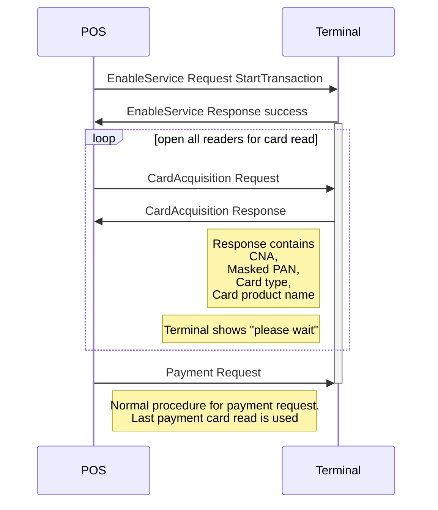
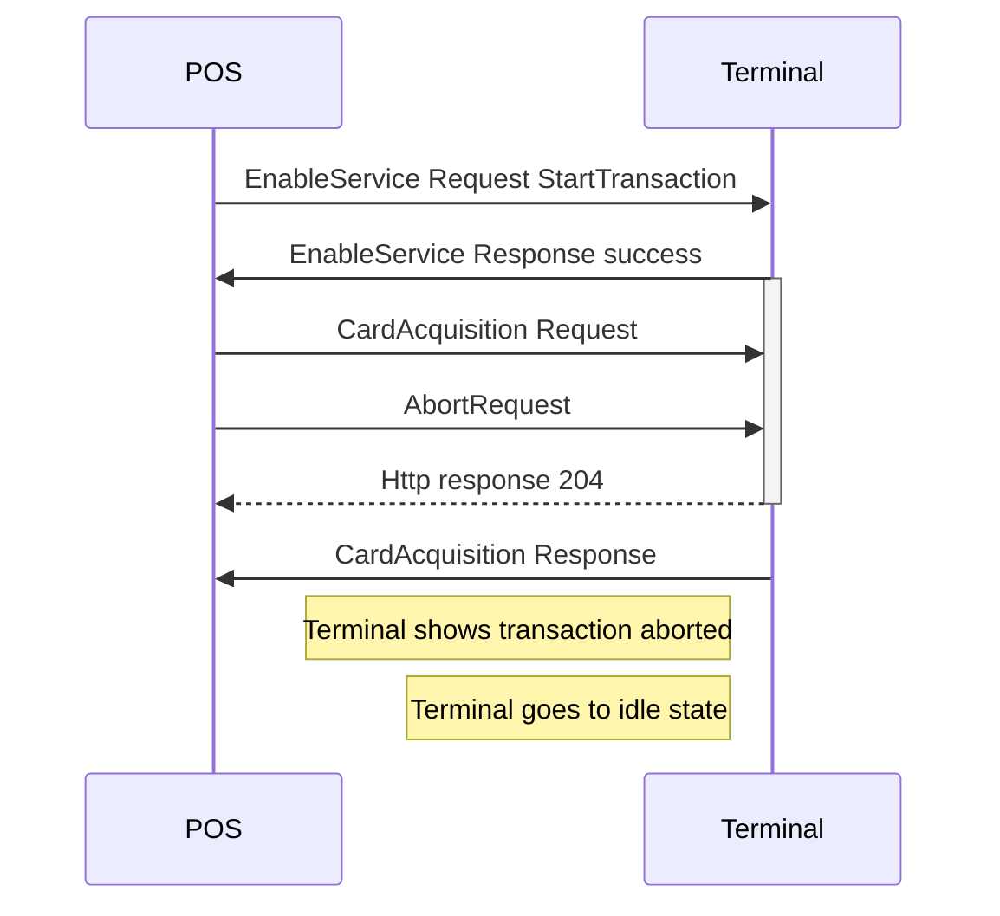
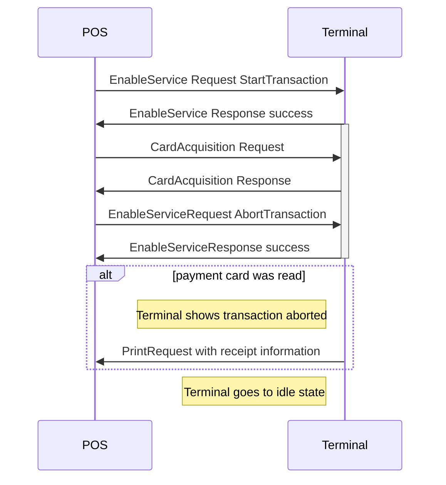
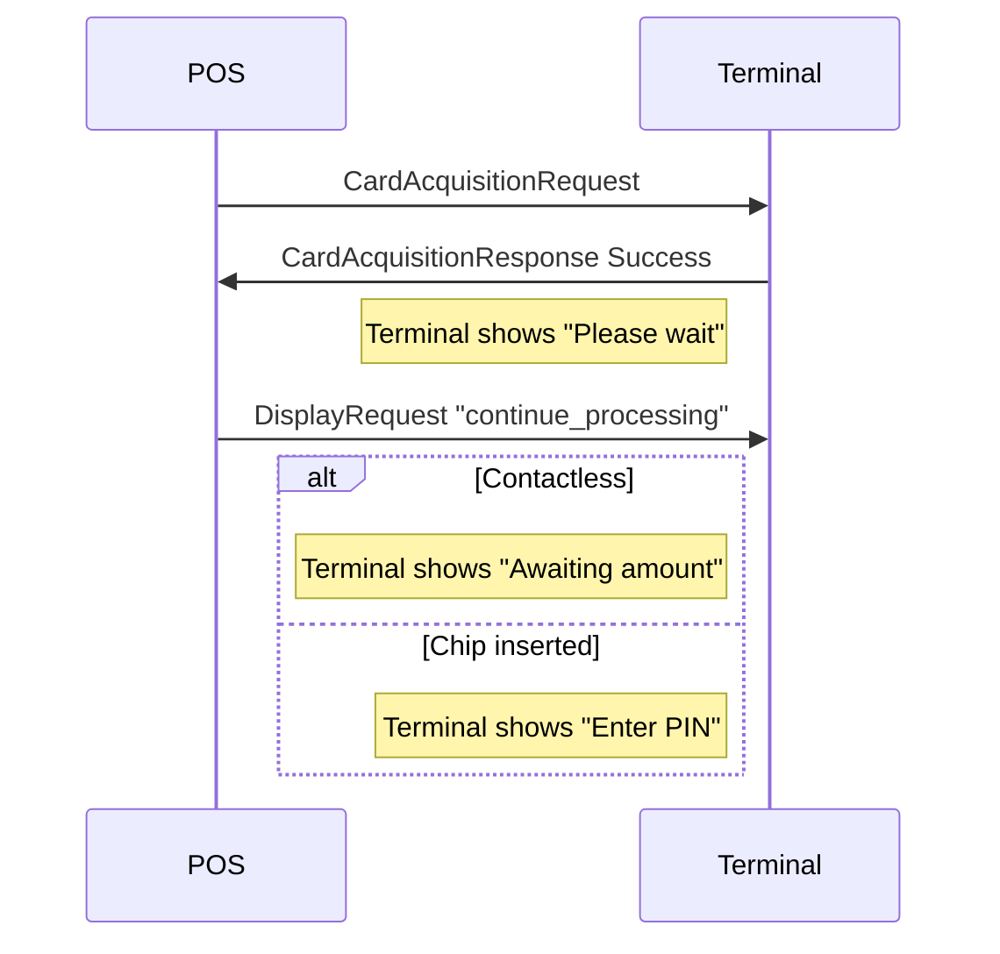

The possibility to read one or more cards before the payment is actually made, makes it possible to know the customer and give a discount on the sale being made. With the possibility comes just a little bit more complexity and logic around messages.



{:.code-vie-header}
**Easy flow reading card before payment request**



The messages `EnableService` and `CardAcquisition` are key to this feature, but when aborting in different situations different messages are used depending on state.
A CardAcquisition is aborted using an `AbortRequest` but the enabled service is aborted using the `EnableServiceRequest AbortTransaction`.

{:.code-vie-header}
**Abort while waiting for a card**



The enabled service Transaction state lasts from the EnableService response until it is aborted or a PaymentRequest is sent. During that state several cardacquisitions may be issued, but if abort is desired after a card acquisition response there is no ongoing request and the state is terminated by the `EnableServiceRequest AbortTransaction`

{:.code-vie-header}
**Abort sequence after card has been read**



## EnableService

{:.code-view-header}
**Request**

```xml
<SaleToPOIRequest>
  <MessageHeader ProtocolVersion="3.1" MessageClass="Service" MessageCategory="EnableService" MessageType="Request" ServiceID="3" SaleID="1" POIID="A-POIID" />
  <EnableServiceRequest TransactionAction="StartTransaction">
    <ServicesEnabled>CardAcquisition</ServicesEnabled>
  </EnableServiceRequest>
</SaleToPOIRequest>
```

{:.table .table-striped}
| Name | Lev | Attribute | Description |
| :------------- | :---: | :-------------- |:--------------- |
| EnableServiceRequest | 1 | TransactionAction | StartTransaction or AbortTransaction. |
| ServiceEnabled | 2 | | Only value used is CardAcquisition. |

{:.code-view-header }
**Response**

```xml
<SaleToPOIResponse>
  <MessageHeader MessageClass="Service" MessageCategory="EnableService" MessageType="Response" ServiceID="3" SaleID="1" POIID="A-POIID" />
    <EnableServiceResponse>
      <Response Result="Success" />
    </EnableServiceResponse>
</SaleToPOIResponse>
```

Next request following a successful EnableServiceResponse for TransactionAction StartTransaction, is `CardAcquisition` or `EnableService` with `TransactionAction AbortTransaction`.

## CardAcquisition





### Proceed after card read

Following a successful CardAcquisitionResponse the terminal will show "Please wait" and any of the messages `EnableServiceRequest AbortTransaction`, `CardAcquisitionRequest`, `PaymentRequest`, `DisplayRequest` or `InputRequest` is feasible. If the amount is still not available a `DisplayRequest` with text set to `continue_processing` will exit the enabled service state and let the terminal proceed with PIN dialog if appropriate.

{:.code-view-header}
**Proceed with PIN dialog if appropriate**


