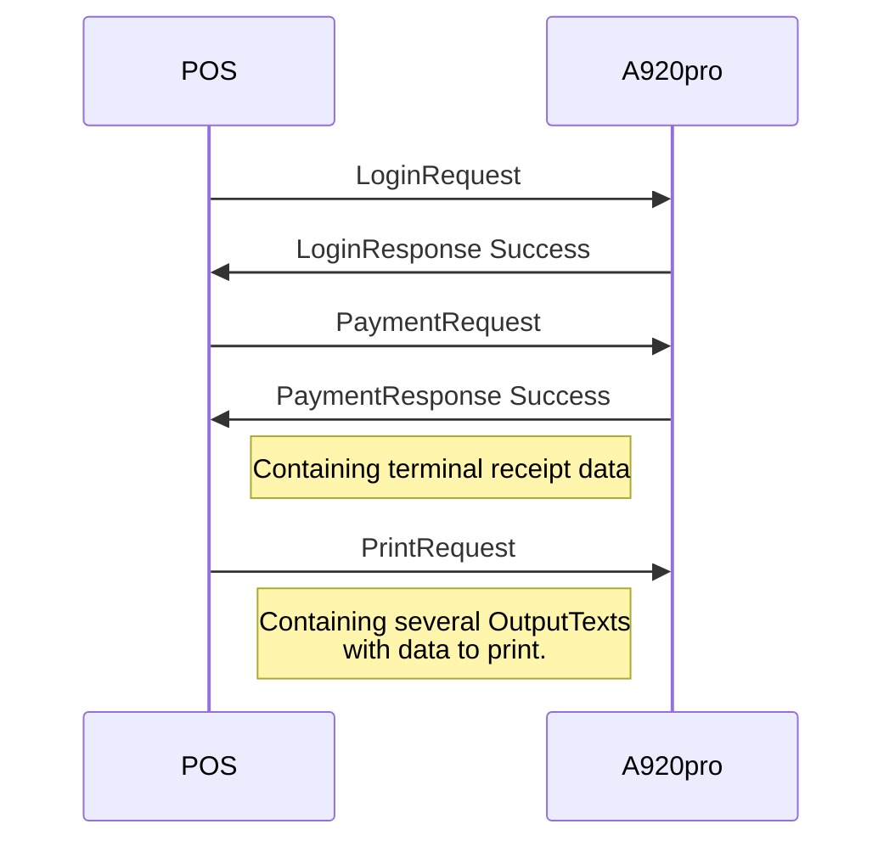

When using an A920pro as an integrated payment terminal it is possible to use the printer by sending a `PrintRequest` to the terminal. Typically this would be to print the sale receipt on the A920pro printer.

The `PrintRequest` may be sent at any time during a `login session` when no other request is ongoing.



## PrintRequest

The PrintRequest message may holds attributes for some formatting. The attributes are optinal and if no attributes are set the default settings will be used.

{:table .table.striped}

| Name | Lev | Attribute | Description |
|:---|:--:|:--|:--|
| PrintRequest | 1 | | |
| PrintOutput | 2 | DocumentQualifier | Value: SaleReceipt |
|  |  | ResponseMode | Value: PrintEnd |
| OutputContent | 3 | OutputFormat | Value: Text |
| OutputText | 4 | Text to be printed. | A new line is generated per OutputText. However, a text may span several rows if a  byte of hex 0A is used as line break |
|  |  | StartRow | Vertical pixel paper feed. It is recommended to end with an empty OutputText with StartRow set to 224 to feed paper past the cutter. |
|  |  | Alignment | Enumeration: Left, Centred, Right, Justified |
|  |  | CharacterHeight | Enumeration: HalfHeight, SingleHeight, DoubleHeight |
|  |  | CharacterWidth | Enumeration: SingleWidth, DoubleWidth |
|  |  | Color | Enumeration: Black, White - white on black background |



{:.code-view-header}
Sample PrintRequest message

```xml
<SaleToPOIRequest>
    <MessageHeader DeviceID="25" MessageCategory="Print" MessageClass="Device" MessageType="Request" POIID="A-POIID" SaleID="1" ServiceID="29"/>
    <PrintRequest>
        <PrintOutput DocumentQualifier="SaleReceipt" ResponseMode="PrintEnd">
            <OutputContent OutputFormat="Text">
                <OutputText Alignment="Left" CharacterHeight="HalfHeight" CharacterWidth="SingleWidth" Color="Black">8x16 font size</OutputText>
                <OutputText Alignment="Left" CharacterWidth="SingleWidth" Color="Black">12x24 font size</OutputText>
                <OutputText Alignment="Justified" CharacterHeight="SingleHeight" CharacterWidth="SingleWidth" Color="Black" StartRow="20">8x32   Justified alignment</OutputText>
                <OutputText Alignment="Left" CharacterHeight="DoubleHeight" CharacterWidth="SingleWidth" Color="White" StartRow="40">12x48 black background</OutputText>
                <OutputText Alignment="Centred" CharacterHeight="HalfHeight" CharacterWidth="DoubleWidth" Color="Black" StartRow="50">Centered 16x16</OutputText>
                <OutputText Alignment="Centred" CharacterWidth="DoubleWidth" Color="Black" StartRow="20">Centered 24x24</OutputText>
                <OutputText Alignment="Right" CharacterHeight="SingleHeight" CharacterWidth="DoubleWidth" Color="Black" StartRow="60">Right aligned 16x32</OutputText>
                <OutputText Alignment="Right" CharacterHeight="DoubleHeight" CharacterWidth="DoubleWidth" Color="Black">Right aligned 24x48</OutputText>
                <OutputText StartRow="224"/>
            </OutputContent>
        </PrintOutput>
    </PrintRequest>
</SaleToPOIRequest>
```
