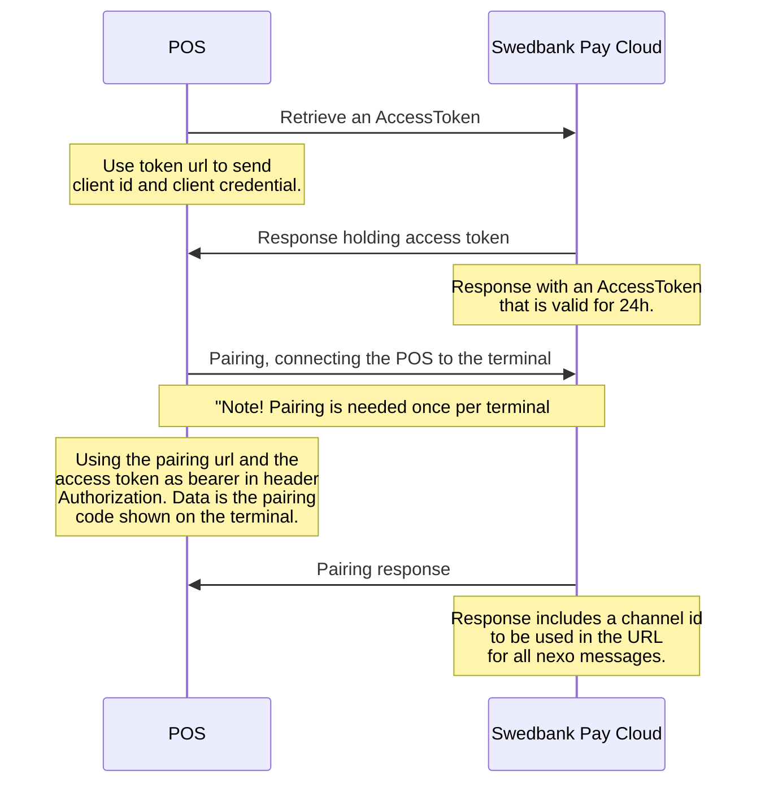

For using a cloud connected terminal the authorization protocol OAuth2 with client credential grant type is used. There will be one client id and client credential per integrator, but there may be situations depending on customer, that an integrator may have more than one. The credentials for test and production are different and valid for 24 months. Make sure it is stored safely and make sure it is easy to update. Credentials are received from Swedbank Pay on request.

The message protocol and flow of messages is described under [nexo Retailer][nexoretailer]{:target="_blank" } and is the same for all connection methods.

## Detailed information

Please check out our [Swagger site][swagger]{:target="_blank"} for more details.

[swagger]: https://cloudconnect.stage.swedbankpay.com/swagger-ui/index.html
[nexoretailer]: /pax-terminal/Nexo-Retailer/
