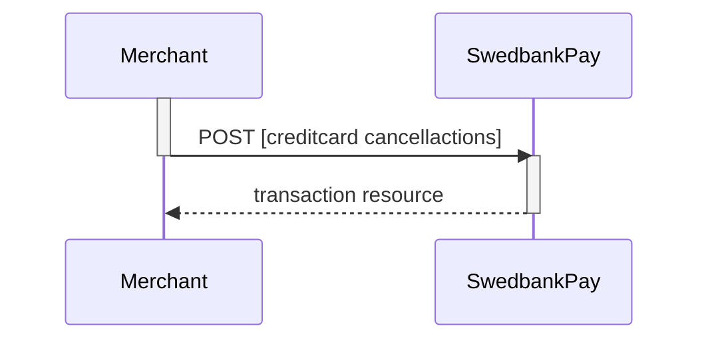
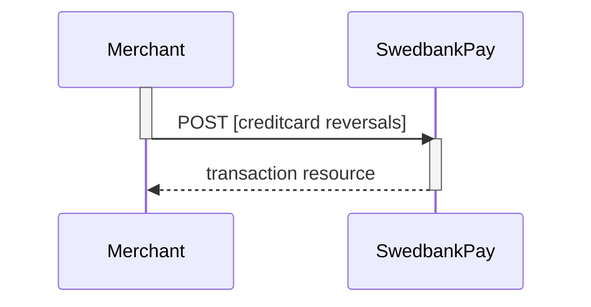

## Options after posting a payment

When you detect that the payer reach your `completeUrl` , you need to do a `GET`
request on the payment resource, containing the `paymentID` generated in the
first step, to receive the state of the transaction. You will also be able to
see the available operations after posting a payment.

*   *Abort:* It is possible to abort the process if the payment has no successful
  transactions. [See the Abort description here][abort].
*   If the payment shown above is done as a two phase (`Authorization`), you will
  need to implement the `Capture` and `Cancel` requests.
*   For `reversals`, you will need to implement the [Reversal request][reversal].
*   If `CallbackURL` is set: Whenever changes to the payment occur a [Callback
  request][callback] will be posted to the `callbackUrl`, which was generated
  when the payment was created.

## Cancellations

`Cancel` can only be done on a authorized transaction. If you do cancel after
doing a part-capture you will cancel the difference between the capture amount
and the authorization amount.

### Create cancellation transaction

Perform the `create-cancel` operation to cancel a previously created - and not
yet captured - payment.

{:.code-view-header}
**Request**

```http
POST /psp/creditcard/payments/{{ page.payment_id }}/cancellations HTTP/1.1
Host: {{ page.api_host }}
Authorization: Bearer <AccessToken>
Content-Type: application/json

{
    "transaction": {
        "description": "Test Cancellation",
        "payeeReference": "ABC123"
    }
}
```

{:.table .table-striped}
|     Required     | Field                    | Type          | Description                                                                              |
| :--------------: | :----------------------- | :------------ | :--------------------------------------------------------------------------------------- |
|  | `transaction`            | `object`      | The `object` representation of the generic [transaction resource][transaction-resource]. |
|  | └➔&nbsp;`description`    | `string`      | A textual description of the reason for the `cancellation`.                              |
|  | └➔&nbsp;`payeeReference` | `string(30*)` |           |

The `cancel` resource contains information about a cancellation transaction
made against a payment.

{:.code-view-header}
**Response**

```http
HTTP/1.1 200 OK
Content-Type: application/json

{
    "payment": "/psp/creditcard/payments/{{ page.payment_id }}",
    "cancellation": {
        "id": "/psp/creditcard/payments/{{ page.payment_id }}/cancellations/{{ page.transaction_id }}",
        "transaction": {
            "id": "/psp/creditcard/payments/{{ page.payment_id }}/transactions/{{ page.transaction_id }}",
            "created": "2016-09-14T01:01:01.01Z",
            "updated": "2016-09-14T01:01:01.03Z",
            "type": "Cancellation",
            "state": "Initialized",
            "number": 1234567890,
            "amount": 1000,
            "vatAmount": 250,
            "description": "Test Cancellation",
            "payeeReference": "ABC123",
            "failedReason": "",
            "isOperational": false,
            "operations": []
        }
    }
}
```

{:.table .table-striped}
| Property                  | Type      | Description                                                                                                                                                                                                  |
| :------------------------ | :-------- | :----------------------------------------------------------------------------------------------------------------------------------------------------------------------------------------------------------- |
| `payment`                 | `string`  | The relative URI of the payment this `cancellation` transaction belongs to.                                                                                                                                  |
| `cancellation`            | `object`  | The `cancellation` resource contains information about the `cancellation` transaction made against a card payment.                                                                                           |
| └➔&nbsp;`id`              | `string`  | The relative URI of the created `cancellation` transaction.                                                                                                                                                  |
| └➔&nbsp;`transaction`     | `object`  | The object representation of the generic [transaction resource][transaction-resource].                                                                                                                       |
| └─➔&nbsp;`id`             | `string`  | The relative URI of the current  transaction  resource.                                                                                                                                                      |
| └─➔&nbsp;`created`        | `string`  | The ISO-8601 date and time of when the transaction was created.                                                                                                                                              |
| └─➔&nbsp;`updated`        | `string`  | The ISO-8601 date and time of when the transaction was updated.                                                                                                                                              |
| └─➔&nbsp;`type`           | `string`  | Indicates the transaction type.                                                                                                                                                                              |
| └─➔&nbsp;`state`          | `string`  | Initialized ,  Completed  or  Failed . Indicates the state of the transaction                                                                                                                                |
| └─➔&nbsp;`number`         | `string`  | The transaction  number , useful when there's need to reference the transaction in human communication. Not usable for programmatic identification of the transaction, for that  id  should be used instead. |
| └─➔&nbsp;`amount`         | `integer` |                                                                                                                                                                     |
| └─➔&nbsp;`vatAmount`      | `integer` |                                                                                                                                                                  |
| └─➔&nbsp;`description`    | `string`  |                                                                                                                                   |
| └─➔&nbsp;`payeeReference` | `string`  |                                                                                                                               |
| └─➔&nbsp;`isOperational`  | `boolean` | `true`  if the transaction is operational; otherwise  `false` .                                                                                                                                              |
| └─➔&nbsp;`operations`     | `array`   | The array of [operations][operations] that are possible to perform on the transaction in its current state.                                                                                                  |

The `cancellations` resource lists the cancellation transactions on a specific
payment.

{:.code-view-header}
**Request**

```http
GET /psp/creditcard/payments/{{ page.payment_id }}/cancellations HTTP/1.1
Host: {{ page.api_host }}
Authorization: Bearer <AccessToken>
Content-Type: application/json
```



#### Cancel Sequence



## Reversals

This transaction is used when a captured payment needs to be reversed.

### Create reversal transaction

The `create-reversal` operation will reverse a previously captured payment.

{:.code-view-header}
**Request**

```http
POST /psp/creditcard/payments/{{ page.payment_id }}/reversals HTTP/1.1
Host: {{ page.api_host }}
Authorization: Bearer <AccessToken>
Content-Type: application/json

{
    "transaction": {
        "amount": 1500,
        "vatAmount": 0,
        "description": "Test Reversal",
        "payeeReference": "ABC123"
    }
}
```

{:.table .table-striped}
|     Required     | Field                    | Type          | Description                                                                              |
| :--------------: | :----------------------- | :------------ | :--------------------------------------------------------------------------------------- |
|  | `transaction`            | `object`      | The `object` representation of the generic [transaction resource][transaction-resource]. |
|  | └➔&nbsp;`amount`         | `integer`     |                                                 |
|  | └➔&nbsp;`vatAmount`      | `integer`     |                                              |
|  | └➔&nbsp;`description`    | `string`      | A textual description of the `reversal`.                                                 |
|  | └➔&nbsp;`payeeReference` | `string(30*)` |           |

The `reversal` resource contains information about the newly created reversal
transaction.

{:.code-view-header}
**Response**

```http
HTTP/1.1 200 OK
Content-Type: application/json

{
    "payment": "/psp/creditcard/payments/{{ page.payment_id }}",
    "reversal": {
        "id": "/psp/creditcard/payments/{{ page.payment_id }}/reversal/{{ page.transaction_id }}",
        "transaction": {
            "id": "/psp/creditcard/payments/{{ page.payment_id }}/transactions/{{ page.transaction_id }}",
            "created": "2016-09-14T01:01:01.01Z",
            "updated": "2016-09-14T01:01:01.03Z",
            "type": "Reversal",
            "state": "Completed",
            "number": 1234567890,
            "amount": 1000,
            "vatAmount": 250,
            "description": "Test transaction",
            "payeeReference": "AH123456",
            "failedReason": "",
            "isOperational": false,
            "operations": []
        }
    }
}
```

{:.table .table-striped}
| Property                  | Type      | Description                                                                                                                                                                                                  |
| :------------------------ | :-------- | :----------------------------------------------------------------------------------------------------------------------------------------------------------------------------------------------------------- |
| `payment`                 | `string`  | The relative URI of the payment this `reversal` transaction belongs to.                                                                                                                                      |
| `reversal`                | `object`  | The `reversal` resource contains information about the `reversal` transaction made against a card payment.                                                                                                    |
| └➔&nbsp;`id`              | `string`  | The relative URI of the created `reversal`transaction.                                                                                                                                                       |
| └➔&nbsp;`transaction`     | `object`  | The object representation of the generic [transaction resource][transaction-resource].                                                                                                                       |
| └─➔&nbsp;`id`             | `string`  | The relative URI of the current  transaction  resource.                                                                                                                                                      |
| └─➔&nbsp;`created`        | `string`  | The ISO-8601 date and time of when the transaction was created.                                                                                                                                              |
| └─➔&nbsp;`updated`        | `string`  | The ISO-8601 date and time of when the transaction was updated.                                                                                                                                              |
| └─➔&nbsp;`type`           | `string`  | Indicates the transaction type.                                                                                                                                                                              |
| └─➔&nbsp;`state`          | `string`  |         |
| └─➔&nbsp;`number`         | `string`  | The transaction number, useful when there's need to reference the transaction in human communication. Not usable for programmatic identification of the transaction, where `id` should be used instead.      |
| └─➔&nbsp;`amount`         | `integer` |                                                                                                                                                                     |
| └─➔&nbsp;`vatAmount`      | `integer` |                                                                                                                                                                  |
| └─➔&nbsp;`description`    | `string`  |                                                                                                                                   |
| └─➔&nbsp;`payeeReference` | `string`  |                                                                                                                               |
| └─➔&nbsp;`failedReason`   | `string`  | The human readable explanation of why the payment failed.                                                                                                                                                    |
| └─➔&nbsp;`isOperational`  | `boolean` | `true`  if the transaction is operational; otherwise  `false` .                                                                                                                                              |
| └─➔&nbsp;`operations`     | `array`   | The array of [operations][operations] that are possible to perform on the transaction in its current state.                                                                                                  |

The `reversals` resource lists the reversal transactions (one or more) on a
specific payment.

{:.code-view-header}
**Request**

```http
GET /psp/creditcard/payments/{{ page.payment_id }}/reversals HTTP/1.1
Host: {{ page.api_host }}
Authorization: Bearer <AccessToken>
Content-Type: application/json
```



### Reversal Sequence





## Remove payment token

If you, for any reason, need to delete a paymentToken you use the
`Delete payment token` request.

{% include alert.html type="warning"
                      icon="warning"
                      body="Please note that this call does not erase the card number stored at Swedbank
  Pay. A card number is automatically deleted six months after a successful
  `Delete payment token` request. If you want to remove card information
  beforehand, you need to contact
  [ehandelsetup@swedbankpay.dk](mailto:ehandelsetup@swedbankpay.dk),
  [verkkokauppa.setup@swedbankpay.fi](mailto:verkkokauppa.setup@swedbankpay.fi),
  [ehandelsetup@swedbankpay.no](mailto:ehandelsetup@swedbankpay.no) or
  [ehandelsetup@swedbankpay.se](mailto:ehandelsetup@swedbankpay.se); and supply
  them with the relevant transaction reference or payment token." %}

{:.code-view-header}
**Request**

```http
PATCH /psp/creditcard/payments/instrumentData/{{ page.payment_token }} HTTP/1.1
Host: {{ page.api_host }}
Authorization: Bearer <AccessToken>
Content-Type: application/json

{
  "state": "Deleted",
  "tokenType" : "PaymentToken",
  "comment": "Comment on why the deletion is happening"
}
```

{:.code-view-header}
**Response**

```http
HTTP/1.1 200 OK
Content-Type: application/json

{
  "instrumentData": {
    "id": "/psp/creditcard/payments/instrumentdata/{{ page.payment_token }}",
    "paymentToken": "{{ page.payment_token }}",
    "payeeId": "{{ page.merchant_id }}",
    "isDeleted": true,
    "isPayeeToken": false,
    "cardBrand": "MasterCard",
    "maskedPan": "123456xxxxxx1111",
    "expiryDate": "MM/YYYY"
  }
}
```



[abort]: /payment-instruments/card/after-payment#abort
[callback]: /payment-instruments/card/other-features#callback
[operations]: /payment-instruments/card/other-features#operations
[reversal]: /payment-instruments/card/after-payment#reversals
[transaction-resource]: /payment-instruments/card/other-features#transactions
