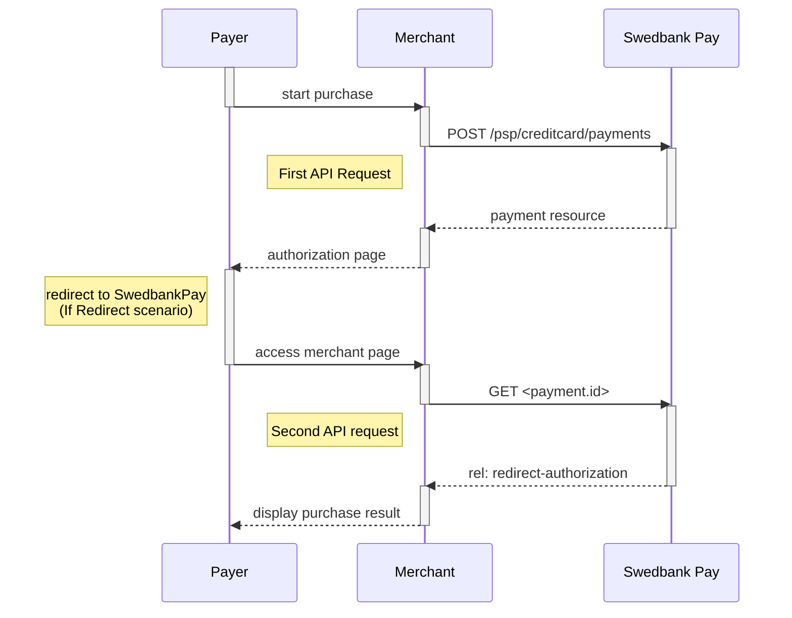







*   When properly set up in your merchant/webshop site and the payer starts the
  purchase process, you need to make a `POST` request towards Swedbank Pay with
  your Purchase information. This will generate a payment object with a unique
  `paymentID`. You either receive a Redirect URL to a Swedbank Pay hosted
  page (Redirect integration) or a JavaScript source in response (Seamless View
  integration).
*   You need to [redirect][redirect] the payer's browser to that specified URL,
    or embed the script source on your site to create a Seamless View in an
    `iframe`; so that the payer can enter the credit card details in a secure
    Swedbank Pay hosted environment.
*   Swedbank Pay will handle 3-D Secure authentication when this is required.
*   Swedbank Pay will redirect the payer's browser to - or display directly in
    the `iframe` - one of two specified URLs, depending on whether the payment
    session is followed through completely or cancelled beforehand. Please note
    that both a successful and rejected payment reach completion, in contrast to
    a cancelled payment.
*   When you detect that the payer reach your `completeUrl` , you need to do a
  `GET` request, containing the `id` of the payment generated in the first step,
  to receive the state of the transaction.

You will redirect the payer to Swedbank Pay hosted pages to collect the credit
card information.

{:.text-center}
![screenshot of the redirect card payment page][card-payment]{:height="570px" width="475px"}

When shopping in SEK, the page will look like this.

{:.text-center}
![screenshot of the swedish redirect card payment page][swedish-card-payment]{:height="605px" width="475px"}

## Operations

The API requests are displayed in the [purchase flow][purchase].
You can [create a card payment][create-payment] with following `operation`
options:

*   [Purchase][purchase]
*   [Recur][recur]
*   [Payout][payout]
*   [Verify][verify]
*   [Unscheduled Purchase][unscheduled-purchase]

Our `payment` example below uses the [`Purchase`][purchase] operation.

## Intent





## Purchase Flow

The sequence diagram below shows a high level description of a complete
purchase, and the requests you have to send to Swedbank Pay. The links will
take you directly to the corresponding API description.

When dealing with card payments, 3-D Secure authentication of the cardholder is
an essential topic. By default, 3-D Secure should be enabled. Depending on
the card issuer, Swedbank Pay will check if the card is enrolled with 3-D
Secure. This process has two alternative outcomes:

*   If the card is enrolled with 3-D Secure, Swedbank Pay will redirect the
    cardholder to the authentication mechanism that is decided by the issuing
    bank. Normally this will be done using BankID or Mobile BankID.
*   If the card is not enrolled with 3-D Secure, no authentication of the
    cardholder is done.



```mermaid
sequenceDiagram
    participant Payer
    participant Merchant
    participant SwedbankPay as Swedbank Pay

    activate Payer
    Payer->>-Merchant: start purchase
    activate Merchant
    Merchant->>-SwedbankPay: POST /psp/creditcard/payments
    activate SwedbankPay
    note left of Payer: First API request
    SwedbankPay-->>-Merchant: payment resource
    activate Merchant
    Merchant-->>-Payer: authorization page
    activate Payer
    Payer->>-SwedbankPay: access authorization page
    activate SwedbankPay
    note left of Payer: redirect to SwedbankPay<br>(If Redirect scenario)
    SwedbankPay-->>-Payer: display purchase information
    activate Payer
    Payer->>Payer: input creditcard information
    Payer->>-SwedbankPay: submit creditcard information
    activate SwedbankPay
        opt Card supports 3-D Secure
        SwedbankPay-->>-Payer: redirect to IssuingBank
        activate Payer
        Payer->>IssuingBank: 3-D Secure authentication process
        activate IssuingBank
        Payer->>-SwedbankPay: access authentication page
        end

    SwedbankPay-->>-Payer: redirect to merchant
    activate Payer
    note left of Payer: redirect back to merchant<br>(If Redirect scenario)

    Payer->>-Merchant: access merchant page
    activate Merchant
    Merchant->>-SwedbankPay: GET <payment.id>
    activate SwedbankPay
    note left of Merchant: Second API request
    SwedbankPay-->>-Merchant: rel: redirect-authorization
    activate Merchant
    Merchant-->>-Payer: display purchase result

        opt Callback is set
        activate SwedbankPay
        SwedbankPay->>SwedbankPay: Payment is updated
        SwedbankPay->>-Merchant: POST Payment Callback
        end
```



[cancel]: /payment-instruments/card/features/core/cancel
[capture]: /payment-instruments/card/capture
[card-payment]: /assets/img/payments/card-payment.png
[create-payment]: /payment-instruments/card/features/technical-reference/create-payment
[payout]: /payment-instruments/card/features/optional/payout
[purchase]: /payment-instruments/card/features/technical-reference/purchase
[recur]: /payment-instruments/card/features/optional/recur
[redirect]: /payment-instruments/card/redirect
[swedish-card-payment]: /assets/img/payments/swedish-card-payment.png
[unscheduled-purchase]: /payment-instruments/card/features/optional/unscheduled-purchase
[verify]: /payment-instruments/card/features/optional/verify
