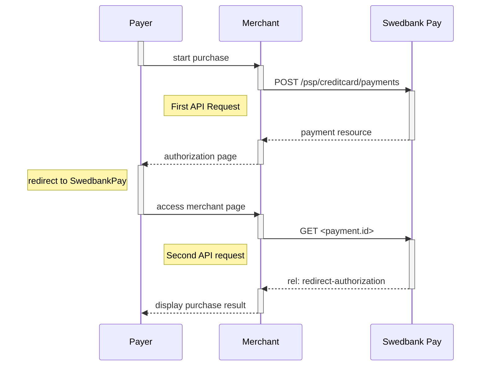

## Card Payments in Mobile Apps

The implementation sequence for Card Payments in mobile apps
is identical to the standard
Redirect scenario, but also includes explanations of how to include this
redirect in mobile apps or in mobile web pages.

### Screenshots for Payments

You will redirect the payer to Swedbank Pay hosted pages to collect
the card information.

{:.text-center}
![Mobile Redirect Payment Page][mobile-redirect-page]{:width="435" height="770"}

Transactions in SEK will have an option for selecting debit or credit card:

{:.text-center}
![Swedish Mobile Redirect Payment Page][swedish-mobile-redirect-page]{:width="435" height="810"}

## API Requests for Payments

The API requests are displayed in the [purchase flow][purchase].
You can [create a card `payment`][create-payment] with following `operation`
options:

*   [`Purchase`][purchase]
*   [`Recur`][recur]
*   [`Payout`][payout]
*   [`Verify`][verify]

Our `payment` example below uses the [`Purchase`][purchase] value.

## Purchase flow mobile

The sequence diagram below shows a high level description of a complete
purchase, and the two requests you have to send to Swedbank Pay. The links will
take you directly to the corresponding API description.

When dealing with card payments, 3-D Secure authentication of the
cardholder is an essential topic. There are two alternative outcomes of a credit
card payment:

*   3-D Secure enabled - by default, 3-D Secure should be enabled, and Swedbank
  Pay will check if the card is enrolled with 3-D Secure. This depends on the
  issuer of the card. If the card is not enrolled with 3-D Secure, no
  authentication of the cardholder is done.
*   Card supports 3-D Secure - if the card is enrolled with 3-D Secure, Swedbank
  Pay will redirect the cardholder to the autentication mechanism that is
  decided by the issuing bank. Normally this will be done using BankID or Mobile
  BankID.



```mermaid
sequenceDiagram
    participant Payer
    participant Merchant
    participant SwedbankPay as Swedbank Pay

    activate Payer
    Payer->>-Merchant: start purchase
    activate Payer
    Merchant->>-SwedbankPay: POST /psp/creditcard/payments
    activate Merchant
    note left of Payer: First API request
    SwedbankPay-->-Merchant: payment resource
    activate SwedbankPay
    Merchant-->>-Payer: authorization page
    activate Merchant
    Payer->>-SwedbankPay: access authorization page
    activate Payer
    note left of Payer: redirect to SwedbankPay
    SwedbankPay-->>-Payer: display purchase information
    activate SwedbankPay
    Payer->>Payer: input creditcard information
    Payer->>-SwedbankPay: submit creditcard information
    activate Payer

        opt Card supports 3-D Secure
        SwedbankPay-->>-Payer: redirect to IssuingBank
        activate SwedbankPay
        Payer->>IssuingBank: 3-D Secure authentication process
        Payer->>-SwedbankPay: access authentication page
        activate Payer
        end

    SwedbankPay-->>-Payer: redirect to merchant
    activate SwedbankPay
    note left of Payer: redirect back to merchant
    Payer->>-Merchant: access merchant page
    activate Payer
    Merchant->>-SwedbankPay: GET <payment.id>
    activate Merchant
    note left of Merchant: Second API request
    SwedbankPay-->>-Merchant: rel: redirect-authorization
    activate SwedbankPay
    Merchant-->>Payer: display purchase result
    activate Merchant

        opt Callback is set
        activate SwedbankPay
        SwedbankPay->>SwedbankPay: Payment is updated
        SwedbankPay->>Merchant: POST Payment Callback
        activate SwedbankPay
        end
```



[create-payment]: /payment-instruments/card/other-features#create-payment
[payout]: /payment-instruments/card/other-features#payout
[purchase]: /payment-instruments/card/other-features#purchase
[mobile-redirect-page]: /assets/img/payments/mobile-card-page.png
[swedish-mobile-redirect-page]: /assets/img/payments/swedish-mobile-card-page.png
[recur]: /payment-instruments/card/other-features#recur
[verify]: /payment-instruments/card/other-features#verify
