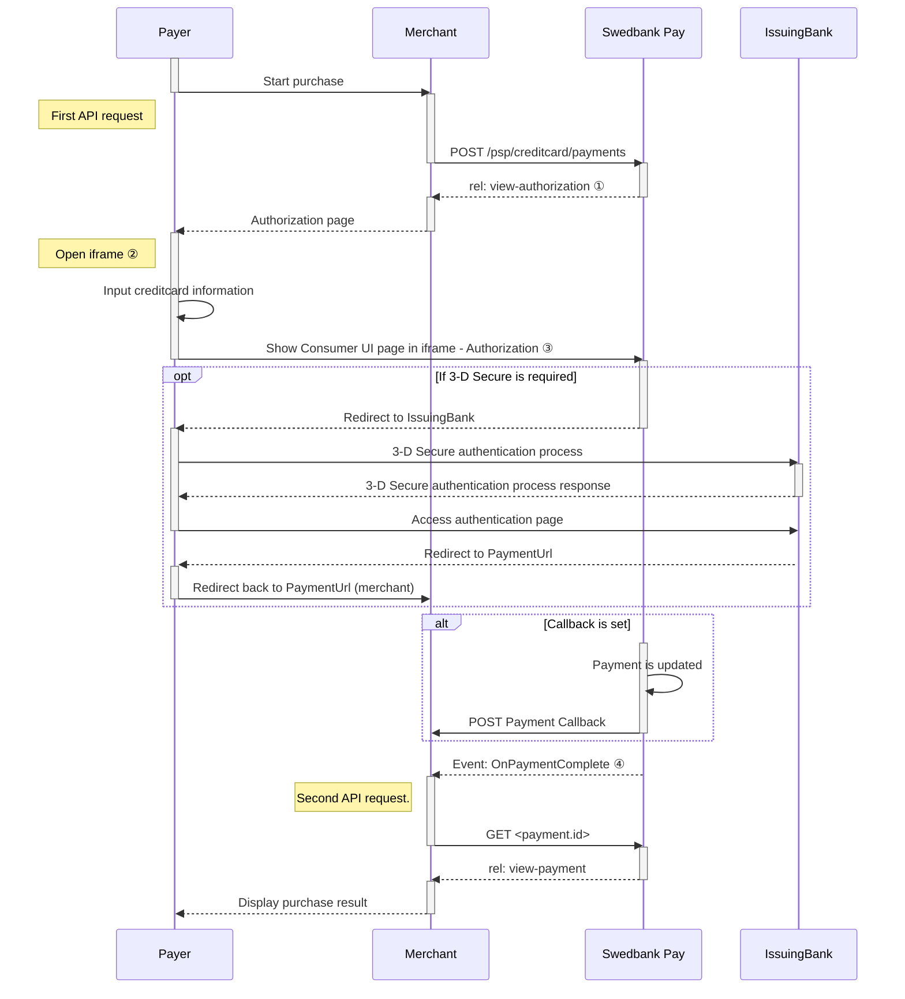

## Introduction

Seamless View provides an integration of the payment process directly on your
website. This solution offers a smooth shopping experience with Swedbank Pay
payment pages seamlessly integrated in an `iframe` on your website. The payer
does not need to leave your webpage, since we are handling the payment in the
`iframe` on your page.

{:.text-center}
![screenshot of the hosted view card payment page][hosted-view-card]{:height="255px" width="475px"}

For payments in the currency SEK, radio buttons for selecting debit or credit
card will appear.

{:.text-center}
![screenshot of the swedish hosted view card payment page][swedish-hosted-view-card]{:height="305px" width="475px"}

## Step 1: Create Payment

A `Purchase` payment is a straightforward way to charge the card of the payer.
It is followed up by posting a capture, cancellation or reversal transaction.

An example of an abbreviated `POST` request is provided below. Each individual 
field of the JSON document is described in the following section. An example of 
an expanded `POST` request is available in the 
[other features section][purchase].



When properly set up in your merchant/webshop site and the payer starts the
purchase process, you need to make a POST request towards Swedbank Pay with your
Purchase information. This will generate a payment object with a unique
`paymentID`. You will receive a **JavaScript source** in response.





The key information in the response is the `view-authorization` operation. You
will need to embed its `href` in a `<script>` element. The script will enable
loading the payment page in an `iframe` in our next step.

## Step 2: Display the Payment

You need to embed the script source on your site to create a hosted-view in an
`iframe`; so that the payer can enter the credit card details in a secure Swedbank Pay
hosted environment. A simplified integration has these following steps:

1.  Create a container that will contain the Seamless View iframe: `<div
   id="swedbank-pay-seamless-view-page">`.
2.  Create a `<script>` source within the container. Embed the `href` value
   obtained in the `POST` request in the `<script>` element. Example:

```html
    <script id="payment-page-script" src="https://ecom.dev.payex.com/creditcard/core/ scripts/client/px.creditcard.client.js"></script>
```

The previous two steps gives this HTML:

{:.code-view-header}
**HTML**

```html
<!DOCTYPE html>
<html>
    <head>
        <title>Swedbank Pay Seamless View is Awesome!</title>
        <!-- Here you can specify your own javascript file -->
        <script src=<YourJavaScriptFileHere>></script>
    </head>
    <body>
        <div id="swedbank-pay-seamless-view-page">
          <script id="payment-page-script" src="https://ecom.dev.payex.com/creditcard/core/scripts/client/px.creditcard.client.js"></script>
        </div>
    </body>
</html>
```

Lastly, initiate the Seamless View with a JavaScript call to open the `iframe`
embedded on your website.

{:.code-view-header}
**JavaScript**

```html
<script language="javascript">
    payex.hostedView.creditCard({
        // The container specifies which id the script will look for to host the
        // iframe component.
        container: "swedbank-pay-seamless-view-page"
    }).open();
</script>
```

When a user actively attempts to perform a payment, the `onPaymentCreated` event
is raised with the following event argument object:

{:.code-view-header}
**onPaymentCreated event object**

```json
{
    "id": "/psp/creditcard/payments/{{ page.payment_id }}",
    "instrument": "creditcard",
}
```

{:.table .table-striped}
| Field        | Type     | Description                           |
| :----------- | :------- | :------------------------------------ |
| `id`         | `string` |  |
| `instrument` | `string` | `creditcard`                          |

## Purchase Flow



### 3-D Secure



Swedbank Pay will handle 3-D Secure authentication when this is required.
When dealing with credit card payments, 3-D Secure authentication of the
cardholder is an essential topic. There are two alternative outcomes of a credit
card payment:

1.  3-D Secure enabled - by default, 3-D Secure should be enabled, and Swedbank
   Pay will check if the card is enrolled with 3-D Secure. This depends on the
   issuer of the card. If the card is not enrolled with 3-D Secure, no
   authentication of the cardholder is done.
2.  Card supports 3-D Secure - if the card is enrolled with 3-D Secure, Swedbank
   Pay will redirect the cardholder to the autentication mechanism that is
   decided by the issuing bank. Normally this will be done using BankID or
   Mobile BankID.

### Explanations

*   ① `rel: view-authorization` is a value in one of the operations, sent as a
  response from Swedbank Pay to the Merchant.
*   ② `Open iframe` creates the Swedbank Pay hosted iframe.
*   ③ `Show Payer UI page in iframe` displays the payment window as content
  inside of the iframe. The payer can enter card information for
  authorization.
*   ④ `Event: OnPaymentComplete` is when a payment is complete. Please note 
  that both successful and rejected payments reach completion, in contrast to a
  cancelled payment.



[payment-page_hosted-view.png]: /assets/screenshots/card/hosted-view/view/macos.png
[abort]: /payment-instruments/card/other-features#abort
[after-payment]: /payment-instruments/card/after-payment
[callback]: /payment-instruments/card/other-features#callback
[cancel]: /payment-instruments/card/after-payment#cancellations
[capture]: /payment-instruments/card/capture
[create-payment]: /payment-instruments/card/other-features#create-payment
[expansion]: /home/technical-information#expansion
[payee-reference]: /payment-instruments/card/other-features#payee-reference
[payout]: /payment-instruments/card/other-features#payout
[purchase]: /payment-instruments/card/other-features#purchase
[price-resource]: /payment-instruments/card/other-features#prices
[recur]: /payment-instruments/card/other-features#recur
[reversal]: /payment-instruments/card/after-payment#reversals
[verify]: /payment-instruments/card/other-features#verify
[create-payment]: /payment-instruments/card/other-features#create-payment
[user-agent]: https://en.wikipedia.org/wiki/User_agent
[hosted-view-card]: /assets/img/payments/hosted-view-card.png
[swedish-hosted-view-card]: /assets/img/payments/swedish-hosted-view-card.png