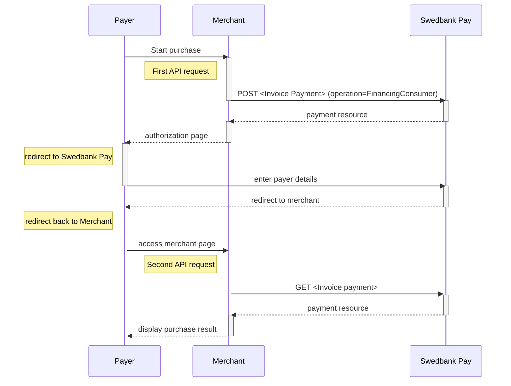







### Important steps before you launch Swedbank Pay Invoice Payments at your website

Prior to launching Swedbank Pay Invoice Payments at your site, make sure that
you have done the following:

1.  Sent a merchant logo in .JPG format to the [Swedish
    setup][setup-mail-sweden], [Norwegian setup][setup-mail-norway] or [Finnish
    setup][setup-mail-finland], depending on your country. The logo will be
    displayed on all your invoices. Minimum accepted size is 600x200 pixels, and
    at least 300 DPI.
2.  Included a link to "Terms and Conditions" for Invoice.

## API Requests

The API requests are displayed in the purchase flow below.
You can create an invoice payment with the following `operation`
options:

*   [Financing Consumer][financing-consumer]
*   [Recur][recur]
*   [Verify][verify]

Our `payment` example uses the [`FinancingConsumer`][financing-consumer]
operation.

{:.text-center}
![screenshot of the first Invoice redirect page][fincon-invoice-redirect]{:height="725px" width="475px"}



## Invoice flow

This is an example of the Redirect scenario. For other integrations, take a
look at the respective sections. The sequence diagram below shows the two
requests you have to send to Swedbank Pay to make a purchase. The diagram also
shows the steps in a [purchase][purchase] process.



[after-payment]: /payment-instruments/invoice/after-payment
[callback-api]: /payment-instruments/invoice/features/technical-reference/callback
[financing-consumer]: /payment-instruments/invoice/other-features#financing-consumer
[optional]: /payment-instruments/invoice/optional
[fincon-invoice-redirect]: /assets/img/payments/fincon-invoice-redirect-first-en.png
[recur]: /payment-instruments/invoice/features/optional/recur
[redirect]: /payment-instruments/invoice/redirect
[purchase]: /payment-instruments/invoice/features/technical-reference/create-payment
[setup-mail-finland]: mailto:verkkokauppa.setup@swedbankpay.fi
[setup-mail-norway]: mailto:ehandelsetup@swedbankpay.no
[setup-mail-sweden]: mailto:ehandelsetup@swedbankpay.se
[verify]: /payment-instruments/invoice/features/optional/verify
