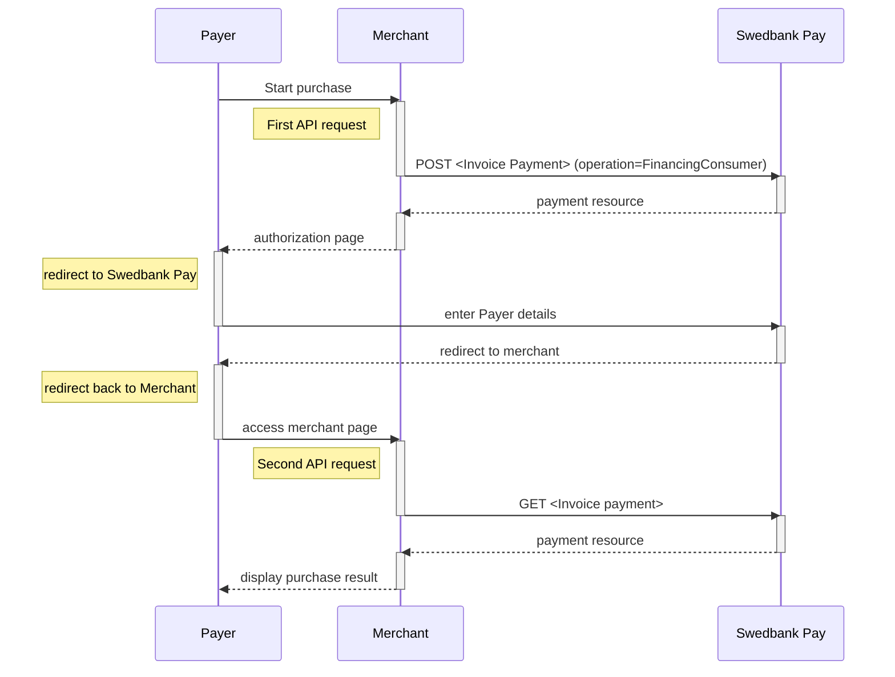

## Introduction

*   When properly set up in your merchant/webshop site and the payer starts the
  purchase process, you need to make a `POST` request towards Swedbank Pay with
  your Purchase information. This will generate a payment object with a unique
  `paymentID`. You will receive a **redirect URL** to a Swedbank Pay payment
  page.
*   You need to redirect the payer's browser to that specified URL so that the
  payer can enter the invoice details in a secure Swedbank Pay environment.
*   Swedbank Pay will redirect the payer's browser to - one of two specified URLs,
  depending on whether the payment session is followed through completely or
  cancelled beforehand. Please note that both a successful and rejected payment
  reach completion, in contrast to a cancelled payment.
*   When you detect that the payer reach your `completeUrl` , you need to do a
  `GET` request to receive the state of the transaction, containing the
  `paymentID` generated in the first step, to receive the state of the
  transaction.

## Step 1: Create a payment

*   An invoice payment is always two-phased based - you create an
  `Authorize` transaction, that is followed by a `Capture` or `Cancel` request.





To initiate the payment process, you need to make a `POST` request to Swedbank Pay.
Our `payment` example below uses the [`FinancingConsumer`]
[financing-consumer] value. All valid options when posting a payment with
operation equal to `FinancingConsumer`, are described in
[other features][financing-consumer].

{:.text-center}
![screenshot of the first Invoice redirect page][fincon-invoice-redirect]{:height="725px" width="475px"}

{:.text-center}
![screenshot of the second Invoice redirect page][fincon-invoice-approve]{:height="500px" width="475px"}

### Financing Consumer

{:.code-view-header}
**Request**

```http
POST /psp/invoice/payments HTTP/1.1
Authorization: Bearer <AccessToken>
Content-Type: application/json

{
    "payment": {
        "operation": "FinancingConsumer",
        "intent": "Authorization",
        "currency": "SEK",
        "prices": [
            {
                "type": "Invoice",
                "amount": 1500,
                "vatAmount": 0
            }
        ],
        "description": "Test Purchase",
        "generateReccurenceToken": false,
        "userAgent": "Mozilla/5.0...",
        "language": "sv-SE",
        "urls": {
            "completeUrl": "https://example.com/payment-completed",
            "cancelUrl": "https://example.com/payment-canceled",
            "callbackUrl": "https://example.com/payment-callback",
            "logoUrl": "https://example.com/logo.png",
            "termsOfServiceUrl": "https://example.com/terms.pdf"
        },
        "payeeInfo": {
            "payeeId": "{{ page.merchant_id }}",
            "payeeReference": "PR123",
            "payeeName": "Merchant1",
            "productCategory": "PC1234",
            "subsite": "MySubsite"
        },
        "payer": {  
            "payerReference": "AB1234",
        }
    "invoice": {
        "invoiceType": "PayExFinancingSe"
        }
    }
}
```

{:.table .table-striped}
|     Required     | Field                             | Type          | Description                                                                                                                                                                                                                                                                                                           |
| :--------------: | :-------------------------------- | :------------ | :-------------------------------------------------------------------------------------------------------------------------------------------------------------------------------------------------------------------------------------------------------------------------------------------------------------------- |
|  | `payment`                         | `object`      | The `payment` object contains information about the specific payment.                                                                                                                                                                                                                                                 |
|  | └➔&nbsp;`operation`               | `string`      | The operation that the `payment` is supposed to perform. The [`FinancingConsumer`][financing-consumer] operation is used in our example. Take a look at the Other Feature section for a full examples of the following `operation` options: [FinancingConsumer][financing-consumer], [Recur][recur], [Verify][verify] |
|  | └➔&nbsp;`intent`                  | `string`      | `Authorization` is the only intent option for invoice. Reserves the amount, and is followed by a [cancellation][cancel] or [capture][capture] of funds.                                                                                                                                                               |
|  | └➔&nbsp;`currency`                | `string`      | NOK, SEK, DKK, USD or EUR.                                                                                                                                                                                                                                                                                            |
|  | └➔&nbsp;`prices`                  | `object`      | The `prices` resource lists the prices related to a specific payment.                                                                                                                                                                                                                                                 |
|  | └─➔&nbsp;`type`                   | `string`      | Use the `Invoice` type here                                                                                                                                                                                                                                                                                           |
|  | └─➔&nbsp;`amount`                 | `integer`     |                                                                                                                                                                                                                                                                              |
|  | └─➔&nbsp;`vatAmount`              | `integer`     |                                                                                                                                                                                                                                                                           |
|  | └➔&nbsp;`description`             | `string(40)`  |                                                                                                                                                                                                                                         |
|                  | └➔&nbsp;`generateRecurrenceToken` | `boolean`     | `true` or `false`. Set this to `true` if you want to create a recurrenceToken for future use Recurring purchases (subscription payments).                                                                                                                                                                             |
|  | └➔&nbsp;`userAgent`               | `string`      | The [`User-Agent` string][user-agent] of the payer's web browser.                                                                                                                                                                                                                                                  |
|  | └➔&nbsp;`language`                | `string`      |                                                                                                                                                                                                                                                     |
|  | └➔&nbsp;`urls`                    | `object`      | The `urls` resource lists urls that redirects users to relevant sites.                                                                                                                                                                                                                                                |
|                  | └─➔&nbsp;`hostUrl`                | `array`       | The array of URLs valid for embedding of Swedbank Pay Hosted Views. If not supplied, view-operation will not be available.                                                                                                                                                                                            |
|  | └─➔&nbsp;`completeUrl`            | `string`      | The URL that Swedbank Pay will redirect back to when the payer has completed his or her interactions with the payment. This does not indicate a successful payment, only that it has reached a final (complete) state. A `GET` request needs to be performed on the payment to inspect it further. See [`completeUrl`][complete-url] for details.                    |
|                  | └─➔&nbsp;`cancelUrl`              | `string`      | The URI to redirect the payer to if the payment is canceled. Only used in redirect scenarios. Can not be used simultaneously with `paymentUrl`; only `cancelUrl` or `paymentUrl` can be used, not both.                                                                                                               |
|                  | └─➔&nbsp;`paymentUrl`             | `string`      | This Parameter is used when the payer is redirected out of the Seamless View (the iframe) and sent back after completing the payment. It should point to the page of where the Payment Order Seamless View is hosted. Read more about [paymentUrl][paymenturl].                                                          |
|                  | └─➔&nbsp;`callbackUrl`            | `string`      | The URL that Swedbank Pay will perform an HTTP `POST` against every time a transaction is created on the payment. See [callback][callback] for details.                                                                                                                                                               |
|                  | └─➔&nbsp;`logoUrl`                | `string`      |                                                                                                                                                                                    |
|                  | └─➔&nbsp;`termsOfServiceUrl`      | `string`      |                                                                                                                                                                                                                                                                   |
|  | └➔&nbsp;`payeeInfo`               | `object`      |                                                                                                                                                                                                                                                                  |
|  | └─➔&nbsp;`payeeId`                | `string`      | This is the unique id that identifies this payee (like merchant) set by Swedbank Pay.                                                                                                                                                                                                                                 |
|  | └─➔&nbsp;`payeeReference`         | `string(30*)` |                                                                                                                                                                                                               |
|                  | └─➔&nbsp;`payeeName`              | `string`      | The payee name (like merchant name) that will be displayed when redirected to Swedbank Pay.                                                                                                                                                                                                               |
|                  | └─➔&nbsp;`productCategory`        | `string`      | A product category or number sent in from the payee/merchant. This is not validated by Swedbank Pay, but will be passed through the payment process and may be used in the settlement process.                                                                                                                        |
|                  | └─➔&nbsp;`orderReference`         | `String(50)`  | The order reference should reflect the order reference found in the merchant's systems.                                                                                                                                                                                                                               |
|                  | └─➔&nbsp;`subsite`                | `String(40)`  |                                                                                                                                                            |
|                  | └➔&nbsp;`payer`                   | `string`     | The `payer` object, containing information about the payer.                                                                                                                                                                                                                                          |
|                  | └─➔&nbsp;`payerReference`         | `string`     |                                                                                                                                                                                                                                                            |

{:.code-view-header}
**Response**

```http
HTTP/1.1 200 OK
Content-Type: application/json

{
    "payment": {
        "id": "/psp/invoice/payments/{{ page.payment_id }}",
        "number": 1234567890,
        "instrument": "Invoice",
        "created": "2016-09-14T13:21:29.3182115Z",
        "updated": "2016-09-14T13:21:57.6627579Z",
        "state": "Ready",
        "operation": "FinancingConsumer",
        "intent": "Authorization",
        "currency": "SEK",
        "amount": 0,
        "remainingCaptureAmount": 1000,
        "remainingCancellationAmount": 1000,
        "remainingReversalAmount": 500,
        "description": "Test Purchase",
        "userAgent": "Mozilla/5.0...",
        "language": "sv-SE",
        "prices": {
            "id": "/psp/invoice/payments/{{ page.payment_id }}/prices"
        },
        "transactions": {
            "id": "/psp/invoice/payments/{{ page.payment_id }}/transactions"
        },
        "authorizations": {
            "id": "/psp/invoice/payments/{{ page.payment_id }}/authorizations"
        },
        "captures": {
            "id": "/psp/invoice/payments/{{ page.payment_id }}/captures"
        },
        "reversals": {
            "id": "/psp/invoice/payments/{{ page.payment_id }}/reversals"
        },
        "cancellations": {
            "id": "/psp/invoice/payments/{{ page.payment_id }}/cancellations"
        },
        "payeeInfo": {
            "id": "/psp/invoice/payments/{{ page.payment_id }}/payeeInfo"
        },
        "payers": {
            "id": "/psp/trustly/payments/{{ page.payment_id }}/payers"
        },
        "urls": {
            "id": "/psp/invoice/payments/{{ page.payment_id }}/urls"
        },
        "settings": {
            "id": "/psp/invoice/payments/{{ page.payment_id }}/settings"
        },
        "approvedLegalAddress": {
            "id": "/psp/invoice/payments/{{ page.payment_id }}/approvedlegaladdress"
        },
        "maskedApprovedLegalAddress": {
            "id": "/psp/invoice/payments/{{ page.payment_id }}/maskedapprovedlegaladdress"
        }
    },
    "operations": [
        {
            "href": "{{ page.api_url }}/psp/invoice/payments/{{ page.payment_id }}",
            "rel": "update-payment-abort",
            "method": "PATCH"
        },
        {
            "href": "{{ page.api_url }}/psp/invoice/payments/{{ page.payment_id }}/authorizations",
            "rel": "create-authorize",
            "method": "POST"
        },
        {
            "href": "{{ page.api_url }}/psp/invoice/payments/{{ page.payment_id }}/approvedlegaladdress",
            "rel": "create-approved-legal-address",
            "method": "POST"
        }
    ]
}
```

## Invoice flow

The sequence diagram below shows the two requests you have to send to Swedbank
Pay to make a purchase.
The diagram also shows the process of a complete purchase in high level.



## Options after posting a payment

Head over to [after payment][after-payment]
to see what you can do when a payment is completed.
Here you will also find info on `Cancel`, and `Reversal`.



[abort]: /payment-instruments/invoice/after-payment#abort
[after-payment]: /payment-instruments/invoice/after-payment
[callback]: /payment-instruments/invoice/other-features#callback
[complete-url]: /payment-instruments/invoice/other-features#completeurl
[paymenturl]: /checkout/other-features#payment-url-1
[cancel]: /payment-instruments/invoice/after-payment#cancellations
[capture]: /payment-instruments/invoice/capture
[financing-consumer]: /payment-instruments/invoice/other-features#financing-consumer
[payee-reference]: /payment-instruments/invoice/other-features#payeeinfo
[recur]: /payment-instruments/invoice/other-features#recur
[user-agent]: https://en.wikipedia.org/wiki/User_agent
[verify]: /payment-instruments/invoice/other-features#verify
[fincon-invoice-redirect]: /assets/img/payments/fincon-invoice-redirect-first-en.png
[fincon-invoice-approve]: /assets/img/payments/fincon-invoice-redirect-second-en.png
