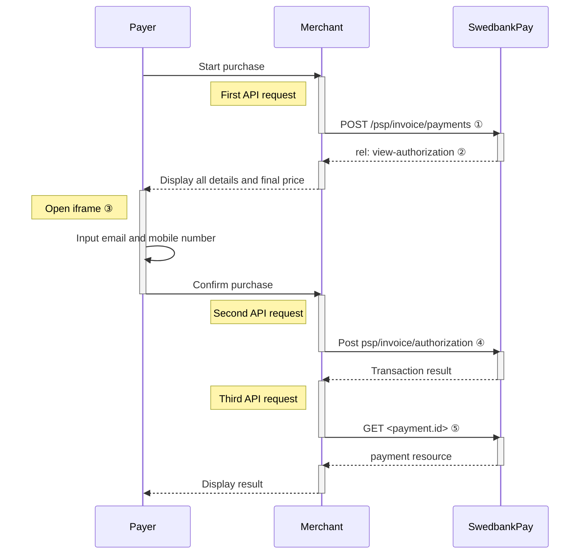

## Introduction

Seamless View provides an integration of the payment process directly on your
website. This solution offers a smooth shopping experience with Swedbank Pay
payment pages seamlessly integrated in an `iframe` on your website. The payer
does not need to leave your webpage, since we are handling the payment in the
`iframe` on your page.

{:.text-center}
![screenshot of the invoice payment window][invoice-payment]{:height="525px" width="475px"}



## Step 1: Create the payment



A `FinancingConsumer` payment is a straightforward way to invoice a
payer. It is followed up by posting a capture, cancellation or reversal
transaction.

An example of an abbreviated `POST` request is provided below. Each individual
field of the JSON document is described in the following section. An example of
an expanded `POST` request is available in the [other features
section][financing-consumer].

When properly set up in your merchant/webshop site and the payer starts the
invoice process, you need to make a POST request towards Swedbank Pay with your
invoice information. This will generate a payment object with a unique
`paymentID`. You will receive a **JavaScript source** in response.

{:.code-view-header}
**Request**

```http
POST /psp/invoice/payments HTTP/1.1
Authorization: Bearer <AccessToken>
Content-Type: application/json

{
    "payment": {
        "operation": "FinancingConsumer",
        "intent": "Authorization",
        "currency": "SEK",
        "prices": [
            {
                "type": "Invoice",
                "amount": 1500,
                "vatAmount": 0
            }
        ],
        "description": "Test Invoice",
        "userAgent": "Mozilla/5.0...",
        "generatePaymentToken": false,
        "paymentToken": ""
        "language": "sv-SE",
        "urls": {
            "hosturls": [
                "https://example.com"
            ],
            "completeUrl": "https://example.com/payment-completed",
            "cancelUrl": "https://example.com/payment-canceled",
            "callbackUrl": "https://example.com/payment-callback",
            "termsOfServiceUrl": "https://example.com/payment-terms.pdf"
        },
        "payeeInfo": {
            "payeeId": "{{ page.merchant_id }}",
            "payeeReference": "CD1234",
            "payeeName": "Merchant1",
            "productCategory": "A123"
        },
        "payer": {
            "payerReference": "AB1234",
        },
    },
    "invoice": {
        "invoiceType": "PayExFinancingSe"
    }
}
```

{:.table .table-striped}
|     Required     | Field                             | Type          | Description                                                                                                                                                                                                                                                                                                                                    |
| :--------------: | :-------------------------------- | :------------ | :--------------------------------------------------------------------------------------------------------------------------------------------------------------------------------------------------------------------------------------------------------------------------------------------------------------------------------------------- |
|  | `payment`                         | `object`      | The `payment` object contains information about the specific payment.                                                                                                                                                                                                                                                                          |
|  | └➔&nbsp;`operation`               | `string`      | The operation that the `payment` is supposed to perform. The [`FinancingConsumer`][financing-consumer] operation is used in our example. |
|  | └➔&nbsp;`intent`                  | `string`      | `Authorization`. Reserves the amount, and is followed by a [cancellation][cancel] or [capture][capture] of funds.                                                                                                                                                                                                                              |
|  | └➔&nbsp;`currency`                | `string`      | NOK or SEK.                                                                                                                                                                                                                                                                                                                                    |
|  | └➔&nbsp;`prices`                  | `object`      | The `prices` resource lists the prices related to a specific payment.                                                                                                                                                                                                                                                                          |
|  | └─➔&nbsp;`type`                   | `string`      | Use the invoice value [See the Prices resource and prices object types for more information][price-resource].                                                                                                                                                                                                                                  |
|  | └─➔&nbsp;`amount`                 | `integer`     |                                                                                                                                                                                                                                                                                                       |
|  | └─➔&nbsp;`vatAmount`              | `integer`     |                                                                                                                                                                                                                                                                                                    |
|  | └➔&nbsp;`description`             | `string(40)`  |                                                                                                                                                                                                                                                                  |
|                  | └➔&nbsp;`generatePaymentToken`    | `boolean`     | `true` or `false`. Set this to `true` if you want to create a paymentToken for future use as One Click.                                                                                                                                                                                                                                        |
|  | └➔&nbsp;`userAgent`               | `string`      | The [`User-Agent` string][user-agent] of the payer's web browser.                                                                                                                                                                                                                                                                           |
|  | └➔&nbsp;`language`                | `string`      |                                                                                                                                                                                                                                                                              |
|  | └➔&nbsp;`urls`                    | `object`      | The`urls`resource lists urls that redirects users to relevant sites.                                                                                                                                                                                                                                                                           |
|  | └─➔&nbsp;`hostUrls`               | `array`       | The array of URLs valid for embedding of Swedbank Pay Seamless Views. If not supplied, view-operation will not be available.                                                                                                                                                                                                                     |
|  | └─➔&nbsp;`completeUrl`            | `string`      | The URL that Swedbank Pay will redirect back to when the payer has completed his or her interactions with the payment. This does not indicate a successful payment, only that it has reached a final (complete) state. A`GET`request needs to be performed on the payment to inspect it further. See [`completeUrl`][complete-url] for details.                                               |
|                  | └─➔&nbsp;`cancelUrl`              | `string`      | The URI to redirect the payer to if the payment is canceled. Only used in redirect scenarios. Can not be used simultaneously with`paymentUrl`; only cancelUrl or`paymentUrl`can be used, not both.                                                                                                                                             |
|                  | └─➔&nbsp;`callbackUrl`            | `string`      | The URL that Swedbank Pay will perform an HTTP POST against every time a transaction is created on the payment. See [callback][callback] for details.                                                                                                                                                                                          |
|                  | └─➔&nbsp;`termsOfServiceUrl`      | `string`      |                                                                                                                                                                                                                                                                                            |
|  | └➔&nbsp;`payeeInfo`               | `object`      |                                                                                                                                                                                                                                                                                             |
|  | └─➔&nbsp;`payeeId`                | `string`      | This is the unique id that identifies this payee (like merchant) set by Swedbank Pay.                                                                                                                                                                                                                                                          |
|  | └─➔&nbsp;`payeeReference`         | `string(30*)` |                                                                                                                                                                                                                                        |
|                  | └─➔&nbsp;`payeeName`              | `string`      | The payee name (like merchant name) that will be displayed when redirected to Swedbank Pay.                                                                                                                                                                                                                                        |
|                  | └─➔&nbsp;`productCategory`        | `string`      | A product category or number sent in from the payee/merchant. This is not validated by Swedbank Pay, but will be passed through the payment process and may be used in the settlement process.                                                                                                                                                 |
|                  | └─➔&nbsp;`orderReference`         | `String(50)`  | The order reference should reflect the order reference found in the merchant's systems.                                                                                                                                                                                                                                                        |
|                  | └➔&nbsp;`payer`                   | `string`     | The `payer` object, containing information about the payer.                                                                                                                                                                                                                                          |
|                  | └─➔&nbsp;`payerReference`         | `string`     |                                                                                                                                                                                                                                                            |
|  | └─➔&nbsp;`invoiceType`            | `String`      | `PayExFinancingSe`, `PayExFinancingNo` or `PayExFinancingFi` depending on which country you're doing business with Swedbank Pay in. (Other external financing partner names must be agreed upon with Swedbank Pay.)                                                                                                                            |

{:.code-view-header}
**Response**

```http
HTTP/1.1 200 OK
Content-Type: application/json

{
    "payment": {
        "id": "/psp/invoice/payments/{{ page.payment_id }}",
        "number": 1234567890,
        "instrument": "Invoice",
        "created": "YYYY-MM-DDThh:mm:ssZ",
        "updated": "YYYY-MM-DDThh:mm:ssZ",
        "operation": "FinancingConsumer",
        "intent": "Authorization",
        "state": "Ready",
        "currency": "SEK",
        "prices": {
            "id": "/psp/invoice/payments/{{ page.payment_id }}/prices"
        },
        "amount": 0,
        "description": "Test Purchase",
        "initiatingSystemUserAgent": "PostmanRuntime/3.0.1",
        "userAgent": "Mozilla/5.0...",
        "language": "sv-SE",
        "urls": {
            "id": "/psp/invoice/payments/{{ page.payment_id }}/urls"
        },
        "payeeInfo": {
            "id": "/psp/invoice/payments/{{ page.payment_id }}/payeeinfo"
        },
        "payers": {
           "id": "/psp/invoice/payments/{{ page.payment_id }}/payers"
        },
        "metadata": {
            "id": "/psp/invoice/payments/{{ page.payment_id }}/metadata"
        }
    },
    "operations": [
        {
            "method": "POST",
            "href": "{{ page.api_url }}/psp/invoice/payments/{{ page.payment_id }}/approvedlegaladdress",
            "rel": "create-approved-legal-address",
            "contentType": "application/json"
        },
        {
            "method": "POST",
            "href": "{{ page.api_url }}/psp/invoice/payments/{{ page.payment_id }}/authorizations",
            "rel": "create-authorization",
            "contentType": "application/json"
        },
        {
            "method": "PATCH",
            "href": "{{ page.api_url }}/psp/invoice/payments/{{ page.payment_id }}",
            "rel": "update-payment-abort",
            "contentType": "application/json"
        },
        {
            "method": "GET",
            "href": "{{ page.front_end_url }}/invoice/payments/authorize/{{ page.payment_token }}",
            "rel": "redirect-authorization",
            "contentType": "text/html"
        },
        {
            "method": "GET",
            "href": "{{ page.front_end_url }}/invoice/core/scripts/client/px.invoice.client.js?{{ page.payment_token }}&operation=authorize",
            "rel": "view-authorization",
            "contentType": "application/javascript"
        }
    ]
}
```

The key information in the response is the `view-authorization` operation. You
will need to embed its `href` in a `<script>` element. The script will enable
loading the payment page in an `iframe` in our next step.

## Step 2: Display the Payment

You need to embed the script source on your site to create a Seamless View in an
`iframe`; so that the payer can enter the payment details in a secure Swedbank Pay
hosted environment. A simplified integration has these following steps:

1.  Create a container that will contain the Seamless View iframe: `<div
   id="swedbank-pay-seamless-view-page">`.
2.  Create a `<script>` source within the container. Embed the `href` value
   obtained in the `POST` request in the `<script>` element. Example:

```html
    <script id="payment-page-script" src="https://ecom.dev.payex.com/invoice/core/ scripts/client/px.invoice.client.js"></script>
```

The previous two steps gives this HTML:

{:.code-view-header}
**HTML**

```html
<!DOCTYPE html>
<html>
    <head>
        <title>Swedbank Pay Seamless View is Awesome!</title>
        <!-- Here you can specify your own javascript file -->
        <script src=<YourJavaScriptFileHere>></script>
    </head>
    <body>
        <div id="swedbank-pay-seamless-view-page">
          <script id="payment-page-script" src="https://ecom.dev.payex.com/invoice/core/scripts/client/px.invoice.client.js"></script>
        </div>
    </body>
</html>
```

Lastly, initiate the Seamless View with a JavaScript call to open the `iframe`
embedded on your website.

{:.code-view-header}
**HTML**

```html
<script language="javascript">
    payex.hostedView.invoice({
        // The container specifies which id the script will look for to host the
        // iframe component.
        container: "swedbank-pay-seamless-view-page"
    }).open();
</script>
```

## Purchase Flow

The sequence diagram below shows a high level description of the
invoice process.







[callback]: /payment-instruments/invoice/features/technical-reference/callback
[cancel]: /payment-instruments/invoice/after-payment#cancellations
[capture]: /payment-instruments/invoice/capture
[complete-url]: /payment-instruments/invoice/features/technical-reference/complete-url
[create-payment]: /payment-instruments/invoice/features/technical-reference/create-payment
[financing-consumer]: /payment-instruments/invoice/other-features#financing-consumer
[invoice-payment]: /assets/img/checkout/invoice-seamless-view.png
[price-resource]: /payment-instruments/invoice/features/technical-reference/prices
[user-agent]: https://en.wikipedia.org/wiki/User_agent
