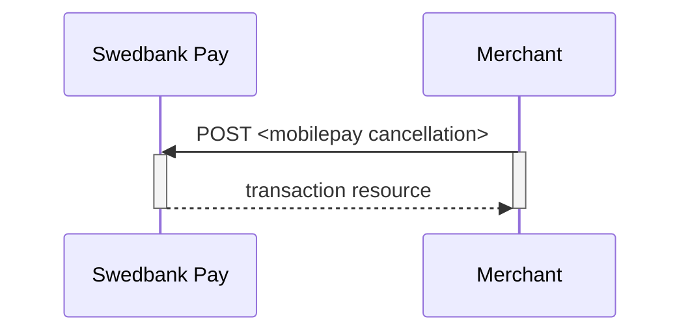
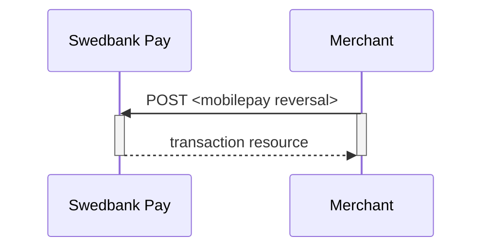

## Options after posting a payment

*   **Abort**: It is possible to [abort a payment][abort] if the payment has no
    successful transactions.
*   If the payment shown above has a completed `authorization`, you will need to
    implement the `Capture` and `Cancel` requests.
*   For reversals, you will need to implement the `Reversal` request.
*   **If CallbackURL is set**: Whenever changes to the payment occur a [Callback
    request][technical-reference-callback] will be posted to the `callbackUrl`,
    generated when the payment was created.

## Cancellations

The `cancellations` resource lists the cancellation transactions on a
specific payment.

### Create cancellation transaction

Perform the `create-cancel` operation to cancel a previously created payment.
You can only cancel a payment - or part of payment - not yet captured.

{:.code-view-header}
**Request**

```http
POST /psp/mobilepay/payments/{{ page.payment_id }}/cancellations HTTP/1.1
Host: {{ page.api_host }}
Authorization: Bearer <AccessToken>
Content-Type: application/json

{
    "transaction": {
        "description": "Test Cancellation",
        "payeeReference": "ABC123"
    }
}
```

{:.table .table-striped}
| ︎ | Field                    | Type         | Description                                                                           |
| :--------------- | :----------------------- | :----------- | :------------------------------------------------------------------------------------ |
| ︎ | `transaction`            | `string`     | The transaction object contains information about this cancellation.                  |
| ︎ | └➔&nbsp;`description`    | `string`     | A textual description of the reason for the cancellation.                             |
| ︎ | └➔&nbsp;`payeeReference` | `string(50)` |  |



## Cancel Sequence

Cancel can only be done on a authorized transaction.
If you do cancel after doing a part-capture you will cancel the different
between the capture amount and the authorization amount.



## Reversals



## Create reversal transaction

The `create-reversal` operation reverses a previously created and
captured payment.

{:.code-view-header}
**Request**

```http
POST /psp/mobilepay/payments/{{ page.payment_id }}/reversals HTTP/1.1
Host: {{ page.api_host }}
Authorization: Bearer <AccessToken>
Content-Type: application/json

{
    "transaction": {
        "amount": 1000,
        "vatAmount": 0,
        "description" : "Test Reversal",
        "payeeReference": "DEF456"
    }
}
```

{:.table .table-striped}
| ︎ | Field                    | Type         | Description                                                                           |
| :--------------- | :----------------------- | :----------- | :------------------------------------------------------------------------------------ |
| ︎ | `transaction`            | `integer`    | The reversal `transaction`.                                                           |
| ︎ | └➔&nbsp;`amount`         | `integer`    |                                              |
| ︎ | └➔&nbsp;`vatAmount`      | `integer`    |                                           |
| ︎ | └➔&nbsp;`description`    | `string`     | A textual description of the capture                                                  |
| ︎ | └➔&nbsp;`payeeReference` | `string(50)` |  |



## Reversal Sequence

Reversal can only be done on a payment where there are some
captured amount not yet reversed.







[abort]: /payment-instruments/mobile-pay/after-payment#abort
[technical-reference-callback]: /payment-instruments/mobile-pay/other-features#callback
