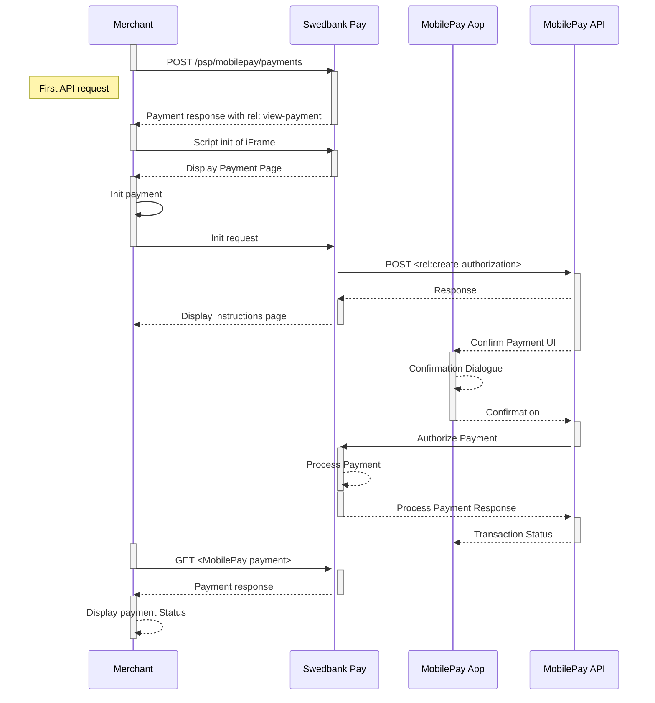

## Step 1: Create a purchase

When properly set up in your merchant/webshop site and the payer starts the
purchase process, you need to make a `POST` request towards Swedbank Pay with
your Purchase information. This will generate a payment object with a unique
`paymentID`. An example of an abbreviated `POST` request is provided below. You
will receive a response in which you can find the **JavaScript source** in the
`view-payment` operation. An example of an expanded `POST` request is available
in the [other features section][purchase].



{:.code-view-header}
**Request**

```http
POST /psp/mobilepay/payments HTTP/1.1
Host: {{ page.api_host }}
Authorization: Bearer <AccessToken>
Content-Type: application/json

{
    "payment": {
        "operation": "Purchase",
        "intent": "Authorization",
        "currency": "DKK",
        "prices": [
            {
                "type": "MobilePay",
                "amount": 1500,
                "vatAmount": 0,
            }
        ],
        "description": "MobilePay Test",
        "userAgent": "Mozilla/5.0",
        "language": "da-DK",
        "urls": {
            "hostUrls": [ "https://example.com", "https://example.net" ],
            "completeUrl": "https://example.com/payment-completed",
            "cancelUrl": "https://example.com/payment-canceled",
            "paymentUrl": "https://example.com/perform-payment",
            "callbackUrl": "https://example.com/payment-callback",
            "logoUrl": "https://example.com/path/to/logo.png",
            "termsOfServiceUrl": "https://example.com/terms.pdf"
        },
        "payeeInfo": {
            "payeeId": "{{ page.merchant_id }}",
            "payeeReference": "payeeReference",
            "payeeName": "Merchant1",
            "productCategory": "A123",
            "orderReference": "or-12456",
            "subsite": "MySubsite"
        },
        "payer": {
            "payerReference": "AB1234",
        },
        "prefillInfo": {
            "msisdn": "+4598765432"
        }
    },
    "mobilepay": {
        "shoplogoUrl": "https://example.com/shoplogourl.png"
    }
}

```

{:.table .table-striped}
| Required         | Field                           | Data type    | Description                                                                                                                                                                                                                                               |
| :--------------- | :------------------------------ | :----------- | :-------------------------------------------------------------------------------------------------------------------------------------------------------------------------------------------------------------------------------------------------------- |
|  | `payment`                       | `object`     | The payment object.                                                                                                                                                                                                                                       |
|  | └➔&nbsp;`operation`             | `string`     | `Purchase`                                                                                                                                                                                                                                                |
|  | └➔&nbsp;`intent`                | `string`     | `Authorization`                                                                                                                                                                                                                                           |
|  | └➔&nbsp;`currency`              | `string`     | `NOK`, `SEK`, `DKK`, `USD` or `EUR`.                                                                                                                                                                                                                      |
|  | └➔&nbsp;`prices`                | `object`     | The prices object.                                                                                                                                                                                                                                        |
|  | └─➔&nbsp;`type`                 | `string`     | `MobilePay` (for supporting all card types configured at Swedbank Pay). If you need to specify what card brands you want to support you may specify this by sending in the card brand, e.g `Dankort` (for card type Dankort), `Visa` (for card type Visa), `MasterCard` (for card type Mastercard) and `Maestro` (for card type Maestro).|
|  | └─➔&nbsp;`amount`               | `integer`    |                                                                                                                                                                                                   |
|  | └─➔&nbsp;`vatAmount`            | `integer`    |                                                                                                                                                                                                |
|                  | └─➔&nbsp;`feeAmount`            | `integer`    | If the amount given includes Fee, this may be displayed for the user in the payment page (redirect only).                                                                                                                                                 |
|  | └➔&nbsp;`description`           | `string(40)` |                                                                                                                                                                          |
|  | └➔&nbsp;`userAgent`             | `string`     | The [`User-Agent`string][user-agent] of the payer's web browser.                                                                                                                                                                                         |
|  | └➔&nbsp;`language`              | `string`     |                                                                                                                                                                                       |
|  | └➔&nbsp;`urls`                  | `object`     | The URLs object containing the urls used for this payment.                                                                                                                                                                                                |
|  | └➔&nbsp;`hosturls`              | `array`      | The array of URIs valid for embedding of Swedbank Pay Seamless Views. If not supplied, view-operation will not be available.                                                                                                                                                                                                |
|  | └─➔&nbsp;`completeUrl`          | `string`     | The URI that Swedbank Pay will redirect back to when the payment page is completed. This does not indicate a successful payment, only that it has reached a completion state. A `GET` request needs to be performed on the payment to inspect it further. See [`completeUrl`][complete-url] for details. |
|  | └─➔&nbsp;`cancelUrl`            | `string`     | The URI that Swedbank Pay will redirect back to when the user presses the cancel button in the payment page.                                                                                                                                              |
|                  | └─➔&nbsp;`paymentUrl`           | `string`     | The URI that Swedbank Pay will redirect back to when the view-operation needs to be loaded, to inspect and act on the current status of the payment. Only used in Seamless Views. If both `cancelUrl` and `paymentUrl` is sent, the `paymentUrl` will used.                                        |
|                  | └─➔&nbsp;`callbackUrl`          | `string`     | The URI that Swedbank Pay will perform an HTTP `POST` against every time a transaction is created on the payment. See [callback][callback] for details.                                                                                         |
|  | └─➔&nbsp;`termsOfServiceUrl`    | `string`     |                                                                                                                                                                                                       |
|  | └➔&nbsp;`payeeInfo`             | `object`     | This object contains the identificators of the payee of this payment.                                                                                                                                                                                     |
|  | └─➔&nbsp;`payeeId`              | `string`     | This is the unique id that identifies this payee (like merchant) set by Swedbank Pay.                                                                                                                                                                     |
|  | └─➔&nbsp;`payeeReference`       | `string(50)` |                                                                                                                                                                      |
|                  | └─➔&nbsp;`payeeName`            | `string`     | The payee name (like merchant name) that will be displayed when redirected to Swedbank Pay.                                                                                                                                                               |
|                  | └─➔&nbsp;`productCategory`      | `string`     | A product category or number sent in from the payee/merchant. This is not validated by Swedbank Pay, but will be passed through the payment process and may be used in the settlement process.                                                            |
|                  | └─➔&nbsp;`orderReference`       | `String(50)` | The order reference should reflect the order reference found in the merchant's systems.                                                                                                                                                                   |
|                  | └─➔&nbsp;`subsite`              | `String(40)` |                                                                                                                                                                                                                 |
|                  | └➔&nbsp;`payer`                 | `string`     | The `payer` object, containing information about the payer.                                                                                                                                                                                                                                          |
|                  | └─➔&nbsp;`payerReference`       | `string`     |                                                                                                                                                                                                                                                            |
|                  | └➔&nbsp;`prefillInfo`           | `object`     | An object that holds prefill information that can be inserted on the payment page.                                                                                                                                                                        |
|                  | └─➔&nbsp;`msisdn`               | `string`     | Number will be prefilled on MobilePays page, if valid. Only Danish and Finnish phone numbers are supported. The country code prefix is +45 and +358 respectivly.                                                                                          |
|  | └➔&nbsp;`mobilepay.shoplogoUrl` | `string`     | URI to logo that will be visible at MobilePay Online. For it to display correctly in the MobilePay app, the image must be 250x250 pixels, a png or jpg served over a secure connection using https, and be publicly available.                            |

{:.code-view-header}
**Response**

```http
HTTP/1.1 200 OK
Content-Type: application/json

{
   "payment": {
       "id": "/psp/mobilepay/payments/{{ page.payment_id }}",
       "number": 72100003079,
       "created": "2018-09-05T14:18:44.4259255Z",
       "instrument": "MobilePay",
       "operation": "Purchase",
       "intent": "Authorization",
       "state": "Ready",
       "currency": "DKK",
       "prices": {
           "id": "/psp/mobilepay/payments/{{ page.payment_id }}/prices"
        },
       "amount": 0,
       "description": "MobilePay Test",
       "initiatingSystemUserAgent": "PostmanRuntime/7.2.0",
       "userAgent": "Mozilla/5.0",
       "language": "da-DK",
       "urls": {
           "id": "/psp/mobilepay/payments/{{ page.payment_id }}/urls"
        },
       "payeeInfo": {
           "id": "/psp/mobilepay/payments/{{ page.payment_id }}/payeeinfo"
        },
        "payers": {
           "id": "/psp/mobilepay/payments/{{ page.payment_id }}/payers"
        }
    },
   "operations": [
        {
           "method": "PATCH",
           "href": "{{ page.api_url }}/psp/mobilepay/payments/{{ page.payment_id }}",
           "rel": "update-payment-abort"
        },
        {
            "method": "GET",
            "href": "{{ page.front_end_url }}/mobilepay/core/scripts/client/px.mobilepay.client.js?token={{ page.payment_token }}&Culture=da-DK",
            "rel": "view-authorization",
            "contentType": "application/javascript"
        },
        {
            "method": "GET",
            "href": "{{ page.front_end_url }}/mobilepay/core/scripts/client/px.mobilepay.client.js?token={{ page.payment_token }}&Culture=da-DK",
            "rel": "view-payment",
            "contentType": "application/javascript"
        }
    ]
}
```

The key information in the response is the `view-payment` operation. You
will need to embed its `href` in a `<script>` element. The script will enable
loading the payment page in an `iframe` in our next step.

## Step 2: Display  the payment window

You need to embed the script source on your site to create a Seamless View in an
`iframe` so that the payer can enter the required information in a secure
Swedbank Pay hosted environment. A simplified integration has these following
steps:

1.  Create a container that will contain the Seamless View iframe: `<div
    id="swedbank-pay-seamless-view-page">`.
2.  Create a `<script>` source within the container. Embed the `href` value
    obtained in the `POST` request in the `<script>` element. Example:

```html
    <script id="payment-page-script" src="https://ecom.dev.payex.com/mobilepay/core/ scripts/client/px.mobilepay.client.js"></script>
```

The previous two steps gives this HTML:

{:.code-view-header}
**HTML**

```html
<!DOCTYPE html>
<html>
    <head>
        <title>Swedbank Pay Seamless View is Awesome!</title>
        <!-- Here you can specify your own javascript file -->
        <script src=<YourJavaScriptFileHere>></script>
    </head>
    <body>
        <div id="swedbank-pay-seamless-view-page">
          <script id="payment-page-script" src="https://ecom.dev.payex.com/mobilepay/core/scripts/client/px.mobilepay.client.js"></script>
        </div>
    </body>
</html>
```

Lastly, initiate the Seamless View with a JavaScript call to open the `iframe`
embedded on your website.

{:.code-view-header}
**JavaScript**

```js
<script language="javascript">
    payex.hostedView.mobilepay({
        // The container specifies which id the script will look for to host the
        // iframe component.
        container: "swedbank-pay-seamless-view-page"
    }).open();
</script>
```

## MobilePay Online Seamless View flow

The sequence diagram below shows the two requests you have to send to
Swedbank Pay to make a purchase.
The links will take you directly to the API description for the specific
request.



1.  When the payer starts the purchase process, you make a `POST` request
    towards Swedbank Pay with the collected Purchase information.
2.  `rel: view-payment` is a value in one of the operations, sent as a response
    from Swedbank Pay to the Merchant.
3.  `Open iFrame` creates the Swedbank Pay Seamless View.
    The Seamless View displays the payment page as content inside of the
    `iFrame`.
4.  A `POST` request is sent to the MobilePay API with
    the mobile number (optional) for authorization.
5.  Swedbank Pay handles the dialogue with MobilePay and the payer confirms the
    purchase in the MobilePay app.
6.  After the purchase has been authorized, the payer will be redirected back
    to the merchant, where the status can be checked to ensure the payment was
    successful.



[callback]: /payment-instruments/mobile-pay/features/technical-reference/callback
[complete-url]: /payment-instruments/mobile-pay/features/technical-reference/complete-url
[purchase]: /payment-instruments/mobile-pay/features/technical-reference/purchase
[user-agent]:  https://en.wikipedia.org/wiki/User_agent
