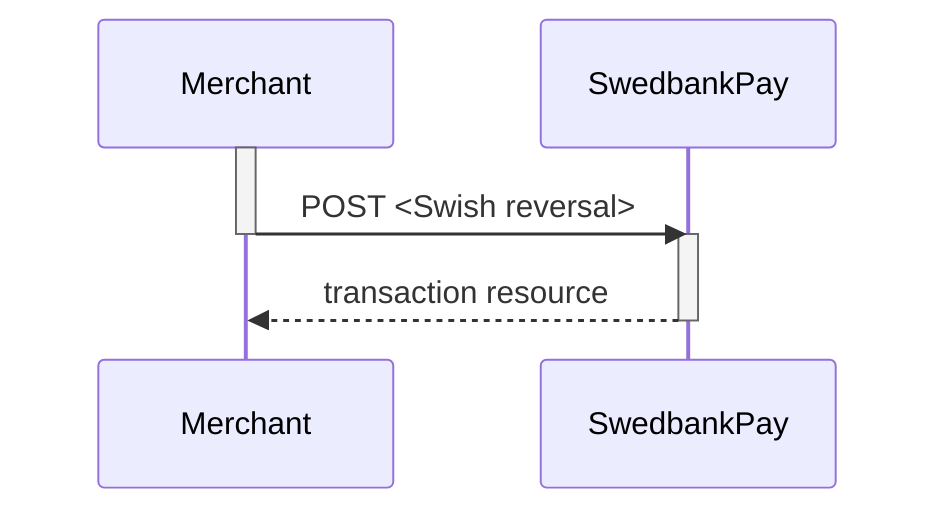

After the payment is confirmed, the payer will be redirected from the Swish
app to the `completeUrl` set in the [create payment request][create-payment].
You need to retrieve payment status with `GET` [Sales
transaction][sales-transaction] before presenting a confirmation page to the
payer.

## Options after posting a payment

*   **If CallbackURL is set**: Whenever changes to the payment occur a [Callback
    request][technical-reference-callback] will be posted to the `callbackUrl`,
    which was generated when the payment was created.
*   You can create a reversal transactions by implementing the Reversal request.
    You can also access and reverse a payment through your merchant pages in the
    [Swedbank Pay admin portal][payex-admin-portal].

## Swish transactions

All Swish transactions are described below. Please note that Swish does not
support [Merchant Initiated Transactions][unscheduled-purchase] for the time
being.

## Sales

The `sales` resource lists the sales transactions (one or more)
on a specific payment.

{:.code-view-header}
**Request**

```http
GET /psp/swish/payments/{{ page.payment_id }}/sales HTTP/1.1
Host: {{ page.api_host }}
Authorization: Bearer <AccessToken>
Content-Type: application/json
```



### Create Sales transaction

In browser based solutions the payers `msisdn` (mobile number) is required. This
is managed either by sending a `POST` request as seen below, or by redirecting
the payer to the hosted payment page. The `msisdn` is only required for
browser based solutions. With mobile app based solutions, the payer uses the
device that hosts the Swish app to manage the purchase, making `msisdn`
optional.

{:.code-view-header}
**Browser-based Request**

```http
POST /psp/swish/payments/{{ page.payment_id }}/sales HTTP/1.1
Host: {{ page.api_host }}
Authorization: Bearer <AccessToken>
Content-Type: application/json

{
    "transaction": {
        "msisdn": "+46739000001"
    }
}
```

{:.code-view-header}
**Browser-based Response**

```http
HTTP/1.1 200 OK
Content-Type: application/json

{
    "payment": "/psp/swish/payments/{{ page.payment_id }}",
    "sale": {
        "date": "23.10.2017 08:39:37 +00:00",
        "paymentRequestToken": "LhXrK84MSpWU2RO09f8kUP-FHiBo-1pB",
        "id": "/psp/swish/payments/{{ page.payment_id }}/sales/{{ page.transaction_id }}",
        "transaction": {
            "id": "{{ page.transaction_id }}",
            "created": "2017-10-23T08:39:35.6478733Z",
            "updated": "2017-10-23T08:39:37.3788733Z",
            "type": "Sale",
            "state": "AwaitingActivity",
            "number": 992309,
            "amount": 1500,
            "vatAmount": 0,
            "description": "Test Purchase",
            "payeeReference": "Postman1508747933",
            "isOperational": true,
            "operations": []
        }
    }
}
```

{:.code-view-header}
**In-app Request**

```http
POST /psp/swish/payments/{{ page.payment_id }}/sales HTTP/1.1
Host: {{ page.api_host }}
Authorization: Bearer <AccessToken>
Content-Type: application/json

{
    "transaction": {
    }
}
```

{:.code-view-header}
**In-app Response**

```http
HTTP/1.1 200 OK
Content-Type: application/json

{
    "payment": "/psp/swish/payments/{{ page.payment_id }}",
    "sale": {
        "date": "23.10.2017 08:39:37 +00:00",
        "paymentRequestToken": "LhXrK84MSpWU2RO09f8kUP-FHiBo-1pB",
        "id": "/psp/swish/payments/{{ page.payment_id }}/sales/{{ page.transaction_id }}",
        "transaction": {
            "id": "{{ page.transaction_id }}",
            "created": "2017-10-23T08:39:35.6478733Z",
            "updated": "2017-10-23T08:39:37.3788733Z",
            "type": "Sale",
            "state": "AwaitingActivity",
            "number": 992309,
            "amount": 1500,
            "vatAmount": 0,
            "description": "Test Purchase",
            "payeeReference": "Postman1508747933",
            "isOperational": true,
            "operations": [
                {
                    "href": "swish://paymentrequest?token=<swishtoken>&callbackurl=<completeUrl>",
                    "method": "GET",
                    "rel": "redirect-app-swish"
                }
            ]
        }
    }
}
```

The `operation` `redirect-app-swish` is only returned when using in-app flows.

The payment now contains a sale transaction with the status (state)
`AwaitingActivity`, meaning we are awaiting a response from Swish.
When the payer confirms the payment a callback request will follow
from Swedbank Pay.

## Reversals

The `Reversals` resource list the reversals transactions (one or more) on a
specific payment.

### Reversal Sequence

A reversal transcation need to match the Payee reference of a completed
sales transaction.



{:.code-view-header}
**Request**

```http
GET /psp/swish/payments/{{ page.payment_id }}/reversals HTTP/1.1
Host: {{ page.api_host }}
Authorization: Bearer <AccessToken>
Content-Type: application/json
```



### Create Reversal transaction

A reversal transaction can be created after a completed authorization by
performing a request to the `create-reversal` operation.
A [callback][technical-reference-callback] request will follow from
Swedbank Pay.

{:.code-view-header}
**Request**

```http
POST /psp/swish/payments/{{ page.payment_id }}/reversals HTTP/1.1
Host: {{ page.api_host }}
Authorization: Bearer <AccessToken>
Content-Type: application/json

{
    "transaction": {
        "amount": 1500,
        "vatAmount": 0,
        "description" : "Test Reversal",
        "payeeReference": "ABC123"
    }
}
```

{:.table .table-striped}
|     Required     | Field                    | Type         | Description                                                                      |
| :--------------: | :----------------------- | :----------- | :------------------------------------------------------------------------------- |
| ︎ | `transaction`            | `object`     | The `transaction` object, containing information about this `reversal`.          |
| ︎ | └➔&nbsp;`amount`         | `integer`    |                                         |
| ︎ | └➔&nbsp;`vatAmount`      | `integer`    |                                      |
| ︎ | └➔&nbsp;`description`    | `string`     | A textual description of the capture                                             |
| ︎ | └➔&nbsp;`payeeReference` | `string(35)` |  |





## Capture

Swish does not support `capture` as it is a one-phase payment method all
completed payments are captured.

## Cancel

Swish does not support `cancel` as `cancel` can only be used on two-phase
payments before they are captured or reversed.

## Recurring

Swish does not support `recurring` payments.



[create-payment]: /payment-instruments/swish/other-features#create-payment
[payex-admin-portal]: https://admin.payex.com/psp/login/
[sales-transaction]: #sales
[technical-reference-callback]: /payment-instruments/swish/other-features#callback
[unscheduled-purchase]: /payment-instruments/card/other-features#unscheduled-purchase
