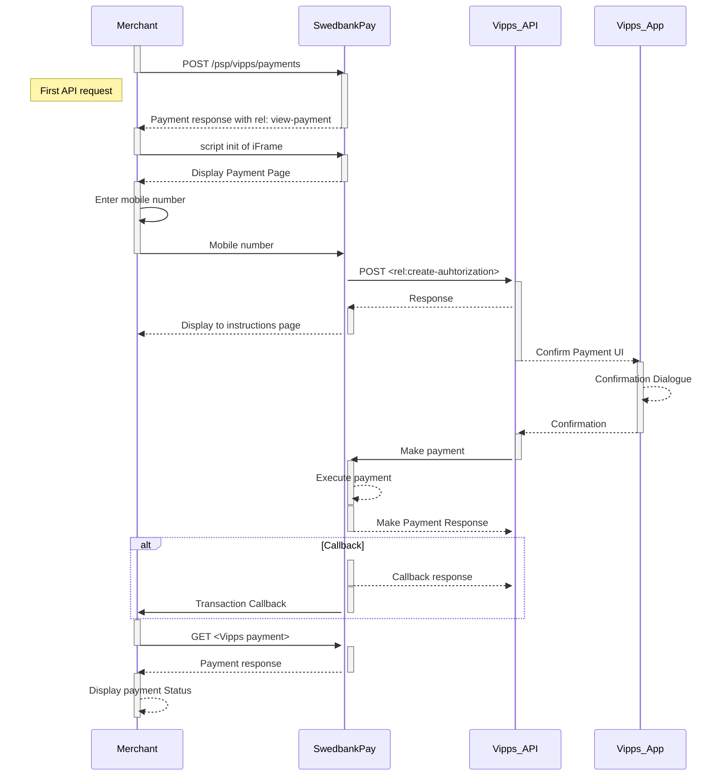

![steps of the vipps purchase flow][vipps-purchase-flow]{:width="1200px" :height="500px"}

## Step 1: Create a Purchase

When properly set up in your merchant/webshop site and the payer starts the
purchase process, you need to make a `POST` request towards Swedbank Pay with
your Purchase information. This will generate a payment object with a unique
`paymentID`. An example of an abbreviated `POST` request is provided below. You
will receive a response in which you can find the **JavaScript source** in the
`view-payment` operation. An example of an expanded `POST` request is available
in the [other features section][purchase].







{:.code-view-header}
**Request**

```http
POST /psp/vipps/payments HTTP/1.1
Host: {{ page.api_host }}
Authorization: Bearer <AccessToken>
Content-Type: application/json

{
    "payment": {
        "operation": "Purchase",
        "intent": "Authorization",
        "currency": "NOK",
        "prices": [
            {
                "type": "Vipps",
                "amount": 1500,
                "vatAmount": 0
            }
        ],
        "description": "Vipps Test",
        "userAgent": "Mozilla/5.0",
        "language": "nb-NO",
        "urls": {
            "hostUrls": [ "https://example.com", "https://example.net" ],
            "completeUrl": "https://example.com/payment-completed",
            "cancelUrl": "https://example.com/payment-canceled",
            "paymentUrl": "https://example.com/perform-payment",
            "callbackUrl": "https://example.com/payment-callback",
            "logoUrl": "https://example.com/path/to/logo.png",
            "termsOfServiceUrl": "https://example.com/terms.pdf"
        },
        "payeeInfo": {
            "payeeId": "{{ page.merchant_id }}",
            "payeeReference": "payeeReference",
            "payeeName": "Merchant1",
            "productCategory": "A123",
            "orderReference": "or-12456",
            "subsite": "MySubsite"
        },
        "payer": {
            "payerReference": "AB1234",

        },
        "prefillInfo": {
            "msisdn": "+4798765432"
        }
    }
}
```

{:.table .table-striped}
|     Required     | Field                             | Type          | Description                                                                                                                                                                                                                                                                                        |
| :--------------: | :-------------------------------- | :------------ | :------------------------------------------------------------------------------------------------------------------------------------------------------------------------------------------------------------------------------------------------------------------------------------------------- |
|  | `payment`                         | `object`      | The `payment` object contains information about the specific payment.                                                                                                                                                                                                                              |
|  | └➔&nbsp;`operation`               | `string`      | The [`Purchase`][purchase] operation is used in our example. Take a look at the [create `payment` section][create-payment] for a full example of the [Purchase][purchase] `operation`.                                                                                                             |
|  | └➔&nbsp;`intent`                  | `string`      | `Authorization`. Reserves the amount, and is followed by a [cancellation][cancellations] or [capture][captures] of funds.<br> <br> `AutoCapture`. A one phase option that enable capture of funds automatically after authorization.                                                               |
|  | └➔&nbsp;`currency`                | `string`      | NOK                                                                                                                                                                                                                                                                                                |
|  | └➔&nbsp;`prices`                  | `object`      | The `prices` resource lists the prices related to a specific payment.                                                                                                                                                                                                                              |
|  | └─➔&nbsp;`type`                   | `string`      | Use the Vipps value. [See the Prices resource and prices object types for more information][price-resource].                                                                                                                                                                                       |
|  | └─➔&nbsp;`amount`                 | `integer`     |                                                                                                                                                                                                                                            |
|  | └─➔&nbsp;`vatAmount`              | `integer`     |                                                                                                                                                                                                                                         |
|  | └➔&nbsp;`description`             | `string(40)`  |                                                                                                                                                                                                                        |
|                  | └➔&nbsp;`generatePaymentToken`    | `boolean`     | `true` or `false`. Set this to `true` if you want to create a paymentToken for future use as One Click.                                                                                                                                                                                            |
|                  | └➔&nbsp;`generateRecurrenceToken` | `boolean`     | `true` or `false`. Set this to `true` if you want to create a recurrenceToken for future use Recurring purchases (subscription payments).                                                                                                                                                          |
|  | └➔&nbsp;`userAgent`               | `string`      | The [`User-Agent` string][user-agent] of the payer's web browser.                                                                                                                                                                                                                               |
|  | └➔&nbsp;`language`                | `string`      |                                                                                                                                                                                                                                    |
|  | └➔&nbsp;`urls`                    | `object`      | The `urls` resource lists urls that redirects users to relevant sites.                                                                                                                                                                                                                             |
|  | └─➔&nbsp;`hostUrls`               | `array`       | The array of URLs valid for embedding of Swedbank Pay Seamless Views. If not supplied, view-operation will not be available.                                                                                                                                                                         |
|  | └─➔&nbsp;`completeUrl`            | `string`      | The URL that Swedbank Pay will redirect back to when the payer has completed his or her interactions with the payment. This does not indicate a successful payment, only that it has reached a final (complete) state. A `GET` request needs to be performed on the payment to inspect it further. See [`completeUrl`][complete-url] for details.  |
|                  | └─➔&nbsp;`cancelUrl`              | `string`      | The URI to redirect the payer to if the payment is canceled. Only used in redirect scenarios. Can not be used simultaneously with `paymentUrl`; only cancelUrl or `paymentUrl` can be used, not both.                                                                                              |
|                  | └─➔&nbsp;`paymentUrl`             | `string`      | The URI that Swedbank Pay will redirect back to when the view-operation needs to be loaded, to inspect and act on the current status of the payment. Only used in Seamless Views. If both `cancelUrl` and `paymentUrl` is sent, the `paymentUrl` will used.                                        |
|                  | └─➔&nbsp;`callbackUrl`            | `string`      | The URL that Swedbank Pay will perform an HTTP POST against every time a transaction is created on the payment. See [callback][callback] for details.                                                                                                                                              |
|                  | └─➔&nbsp;`logoUrl`                | `string`      |                                                                                                                                                                 |
|                  | └─➔&nbsp;`termsOfServiceUrl`      | `string`      |                                                                                                                                                                                                                                                |
|  | └➔&nbsp;`payeeInfo`               | `object`      |                                                                                                                                                                                                                                               |
|  | └─➔&nbsp;`payeeId`                | `string`      | This is the unique id that identifies this payee (like merchant) set by Swedbank Pay.                                                                                                                                                                                                              |
|  | └─➔&nbsp;`payeeReference`         | `string(50*)` |                                                                                                                                                                                                                    |
|                  | └─➔&nbsp;`payeeName`              | `string`      | The payee name (like merchant name) that will be displayed when redirected to Swedbank Pay.                                                                                                                                                                                            |
|                  | └─➔&nbsp;`productCategory`        | `string`      | A product category or number sent in from the payee/merchant. This is not validated by Swedbank Pay, but will be passed through the payment process and may be used in the settlement process.                                                                                                     |
|                  | └─➔&nbsp;`orderReference`         | `String(50)`  | The order reference should reflect the order reference found in the merchant's systems.                                                                                                                                                                                                            |
|                  | └─➔&nbsp;`subsite`                | `String(40)`  |                                                                                                                                         |
|                  | └➔&nbsp;`payer`                   | `string`      | The `payer` object, containing information about the payer.                                                                                                                                                                                                                                          |
|                  | └─➔&nbsp;`payerReference`         | `string`      |                                                                                                                                                                                                                                                            |
|                  | └➔&nbsp;`prefillInfo`             | `object`      | An object that holds prefill information that can be inserted on the payment page.                                                                                                                                                                                                                 |
|                  | └─➔&nbsp;`msisdn`                 | `string`      | Number will be prefilled on payment page, if valid. Only Norwegian phone numbers are supported. The country code prefix is +47                                                                                                                                                                     |

{:.code-view-header}
**Response**

```http
HTTP/1.1 200 OK
Content-Type: application/json

{
   "payment": {
       "id": "/psp/vipps/payments/{{ page.payment_id }}",
       "number": 72100003079,
       "created": "2018-09-05T14:18:44.4259255Z",
       "instrument": "Vipps",
       "operation": "Purchase",
       "intent": "Authorization",
       "state": "Ready",
       "currency": "NOK",
       "prices": {
           "id": "/psp/vipps/payments/{{ page.payment_id }}/prices"
        },
       "amount": 0,
       "description": "Vipps Test",
       "initiatingSystemUserAgent": "PostmanRuntime/7.2.0",
       "userAgent": "Mozilla/5.0 weeeeee",
       "language": "nb-NO",
       "urls": {
           "id": "/psp/vipps/payments/{{ page.payment_id }}/urls"
        },
       "payeeInfo": {
           "id": "/psp/vipps/payments/{{ page.payment_id }}/payeeinfo"
        },
        "payers": {
           "id": "/psp/vipps/payments/{{ page.payment_id }}/payers"
        },
       "metadata": {
           "id": "/psp/vipps/payments/{{ page.payment_id }}/metadata"
        }
    },
   "operations": [
        {
           "method": "PATCH",
           "href": "{{ page.api_url }}/psp/vipps/payments/{{ page.payment_id }}",
           "rel": "update-payment-abort"
        },
        {
           "method": "GET",
           "href": "{{ page.front_end_url }}/vipps/payments/authorize/{{ page.payment_token }}",
           "rel": "redirect-authorization"
        },
        {
            "method": "GET",
            "href": "{{ page.front_end_url }}/vipps/core/scripts/client/px.vipps.client.js?token={{ page.payment_token }}&Culture=sv-SE",
            "rel": "view-authorization",
            "contentType": "application/javascript"
        },
        {
            "method": "GET",
            "href": "{{ page.front_end_url }}/vipps/core/scripts/client/px.vipps.client.js?token={{ page.payment_token }}&Culture=sv-SE",
            "rel": "view-payment",
            "contentType": "application/javascript"
        }
    ]
}
```

The key information in the response is the `view-payment` operation. You
will need to embed its `href` in a `<script>` element. The script will enable
loading the payment page in an `iframe` in our next step.

## Step 2: Display the payment window

You need to embed the script source on your site to create a Seamless View in an
`iframe`; so that the payer can enter the required information in a secure
Swedbank Pay hosted environment. A simplified integration has these following
steps:

1.  Create a container that will contain the Seamless View iframe: `<div
    id="swedbank-pay-seamless-view-page">`.
2.  Create a `<script>` source within the container. Embed the `href` value
    obtained in the `POST` request in the `<script>` element. Example:

```html
    <script id="payment-page-script" src="https://ecom.dev.payex.com/vipps/core/ scripts/client/px.vipps.client.js"></script>
```

The previous two steps gives this HTML:

{:.code-view-header}
**HTML**

```html
<!DOCTYPE html>
<html>
    <head>
        <title>Swedbank Pay Seamless View is Awesome!</title>
        <!-- Here you can specify your own javascript file -->
        <script src=<YourJavaScriptFileHere>></script>
    </head>
    <body>
        <div id="swedbank-pay-seamless-view-page">
          <script id="payment-page-script" src="https://ecom.dev.payex.com/vipps/core/scripts/client/px.vipps.client.js"></script>
        </div>
    </body>
</html>
```

Lastly, initiate the Seamless View with a JavaScript call to open the `iframe`
embedded on your website.

{:.code-view-header}
**JavaScript**

```html
<script language="javascript">
    payex.hostedView.vipps({
        // The container specifies which id the script will look for to host the
        // iframe component.
        container: "swedbank-pay-seamless-view-page"
    }).open();
</script>
```

This is what the result should look like:

{:.text-center}
![Vipps seamless view][Vipps-screenshot-1]{:width="475px" :height="150px"}

## Vipps Seamless View integration flow

The sequence diagram below shows the two requests you have to send to
Swedbank Pay to make a purchase.
The links will take you directly to the API description for the specific
request.



1.  When the payer starts the purchase process, you make a `POST` request
   towards Swedbank Pay with the collected Purchase information.
2.  `rel: view-payment` is a value in one of the operations, sent as a response
   from Swedbank Pay to the Merchant.
3.  `Open iframe` creates the Swedbank Pay Seamless View.
     The Seamless View displays the payment page as content inside of the
   `iframe`. The payer can enter their mobile phone number for authorization.
4.  A `POST` request is sent to the Vipps API with the mobile number for
   authorization.
5.  The response will contain the state of the transaction. It will normally be
   `AwaitingActivity` in this phase of the payment, meaning we are awaiting a
   response from Vipps.
6.  Swedbank Pay handles the dialogue with Vipps and the payer confirms the
   purchase in the Vipps app.



[abort]: /payment-instruments/vipps/after-payment#abort
[callback]: /payment-instruments/vipps/other-features#callback
[callbackurl]: /payment-instruments/vipps/other-features#callback
[cancellations]: /payment-instruments/vipps/after-payment#cancellations
[captures]: /payment-instruments/vipps/after-payment#captures
[complete-url]: /payment-instruments/vipps/other-features#completeurl
[create-payment]: /payment-instruments/vipps/other-features#create-payment
[seamless-view]: /payment-instruments/vipps/seamless-view
[payee-reference]: /payment-instruments/vipps/other-features#payee-reference
[price-resource]: /payment-instruments/vipps/other-features#prices
[purchase]: /payment-instruments/vipps/other-features#purchase
[reference-redirect]: /payment-instruments/vipps/redirect
[reversal]: /payment-instruments/vipps/after-payment#reversals
[user-agent]: https://en.wikipedia.org/wiki/User_agent
[Vipps_flow_PaymentPages.png]: /assets/img/vipps-flow-paymentpages.png
[vipps-purchase-flow]: /assets/img/payments/vipps-purchase-flow.png
[Vipps-screenshot-1]: /assets/img/payments/vipps-seamless-view.png
