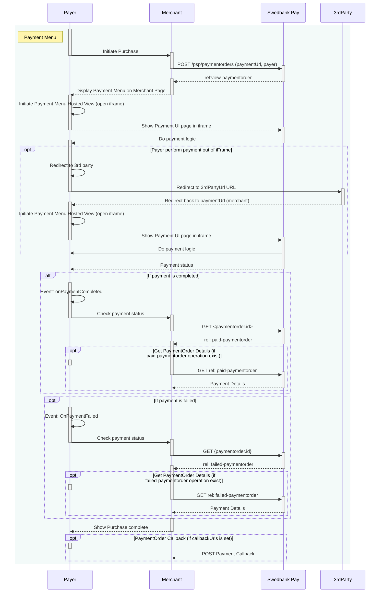



## Step 1: Create Payment Order

We start by performing a `POST` request towards the `paymentorder` resource in
order to create a Payment Order.







### Request



### Response

The response back should look something like this (abbreviated for brevity):

{:.code-view-header}
**Response**

```http
HTTP/1.1 201 Created
Content-Type: application/json

{
    "paymentorder": {
      "id": "/psp/paymentorders/{{ page.payment_order_id }}"
    },
    "operations": [
        {
            "href": "{{ view_payment_order_script_url }}",
            "rel": "view-paymentorder",
            "method": "GET",
            "contentType": "application/javascript"
        }
    ]
}
```

{:.table .table-striped}
| Field          | Type     | Description                                                                        |
| :------------- | :------- | :--------------------------------------------------------------------------------- |
| `paymentorder` | `object` | The payment order object.                                                          |
| └➔&nbsp;`id`   | `string` |                       |
| `operations`   | `array`  | The array of possible operations to perform, given the state of the payment order. |

The `paymentorder` object is abbreviated since it's just the `id` and
`operations` we are interested in. Store the `id` of the Payment Order
in your system to look up status on the completed payment later.



Then find the `view-paymentorder` operation and embed its `href` in a `<script>`
element. That script will then load the Seamless View for the Payment Menu. We
will look into how to hook that up next.



## Step 2: Display the Payment Menu

To load the payment menu from the JavaScript URL obtained in the back end API
response, it needs to be set as a `script` element's `src` attribute in an HTML
document.

You can cause a page reload and do this with backend-rendered HTML or you can
avoid the page refresh by invoking the POST to create the payment order through
Ajax and then create the script element with JavaScript. We will demonstrate how
to do a JavaScript-based integration below.

First the minimum HTML required to initialize the Payment Menu:

{:.code-view-header}
**HTML**

```html
<!DOCTYPE html>
<html>
    <head>
        <title>Swedbank Pay Payment Menu</title>
    </head>
    <body>
        <div id="payment-menu"></div>
        <!-- Here you can specify your own JavaScript file -->
        <script src="<Your-JavaScript-File>"></script>
    </body>
</html>
```

What happens inside `<Your-JavaScript-File>` should look something alike the
following:

{:.code-view-header}
**JavaScript**

```js
var request = new XMLHttpRequest();
request.addEventListener('load', function () {
    response = JSON.parse(this.responseText);
    var script = document.createElement('script');
    // The JavaScript expects a JSON response looking like the created
    // Payment Order, containing the operation 'view-paymentorder.
    var operation = response.operations.find(function (o) {
        return o.rel === 'view-paymentorder';
    });
    script.setAttribute('src', operation.href);
    script.onload = function () {
        // Initialize the Payment Menu and inject it into the 'payment-menu'
        // container <div> defined in the HTML document above.
        payex.hostedView.paymentMenu({
            container: 'payment-menu',
            culture: 'sv-SE'
        }).open();
    };
    // Append the Payment Menu script to the <head>
    var head = document.getElementsByTagName('head')[0];
    head.appendChild(script);
});
// You should replace the address here with your own backend endpoint.
request.open('POST', '<Your-Backend-Endpoint>', true);
request.setRequestHeader('Content-Type', 'application/json; charset=utf-8');
// We will send an object containing the amount the Payment Order should be
// created with. This should of course not be hard coded and you may want to
// send more data from the front-end to the back-end to create a Payment Order
// for your particular use-case.
request.send(JSON.stringify({ amount: 1200 }));
```

This should bring up the Payment Menu in a Seamless View. It should look like
this, depending on whether the payer is identified (top) or a guest user
(bottom):

{:.text-center}
![Payment Menu with payer identified in and card payment opened][login-payment-menu-image]{:width="450" height="900"}

{:.text-center}
![Payment Menu with guest payer and card payment opened][guest-payment-menu-image]{:width="450" height="850"}

When the payer completes the payment, the Payment Menu script will be
signaled and a full redirect to the `completeUrl` sent in with the
Payment Order will be performed. When the `completeUrl` on your server is hit,
you can inspect the status on the stored `paymentorder.id` on the server, and
then perform `capture`.

If the payment is a `Sale` or one-phase purchase, it will be automatically
captured. A third scenario is if the goods are sent physically to the payer;
then you should await capture until after the goods have been sent.

You may open and close the payment menu using `.open()` and `.close()`
functions. You can also invoke `.refresh()` to
[update the Payment Menu][payment-order-operations] after any changes to the
order.

Below, you will see a complete overview of the payment menu process.
Notice that there are two ways of performing the payment:

*   Payer performs payment **out** of `iframe`.
*   Payer performs payment **within** `iframe`.







[guest-payment-menu-image]: /assets/img/checkout/guest-payment-menu-450x850.png
[login-payment-menu-image]: /assets/img/checkout/logged-in-payment-menu-450x900.png
[payment-order-operations]: /checkout/after-payment#operations
