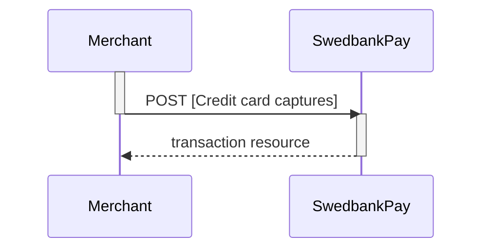
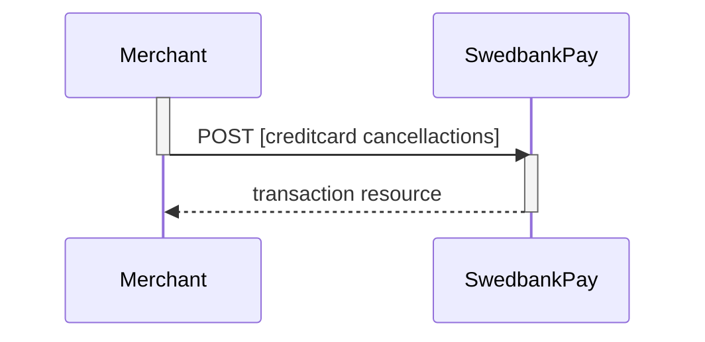
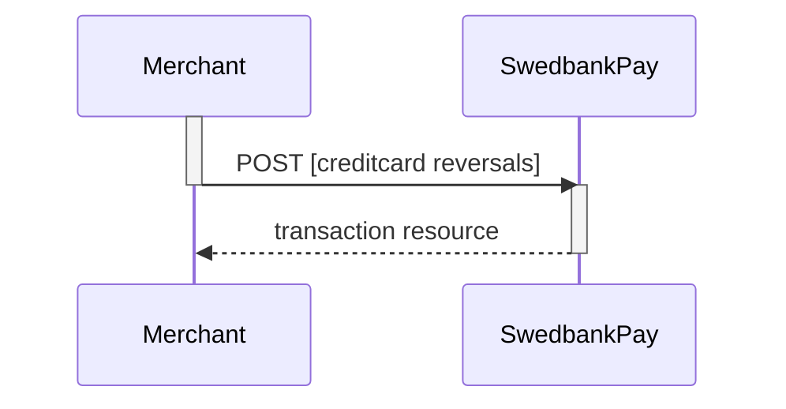
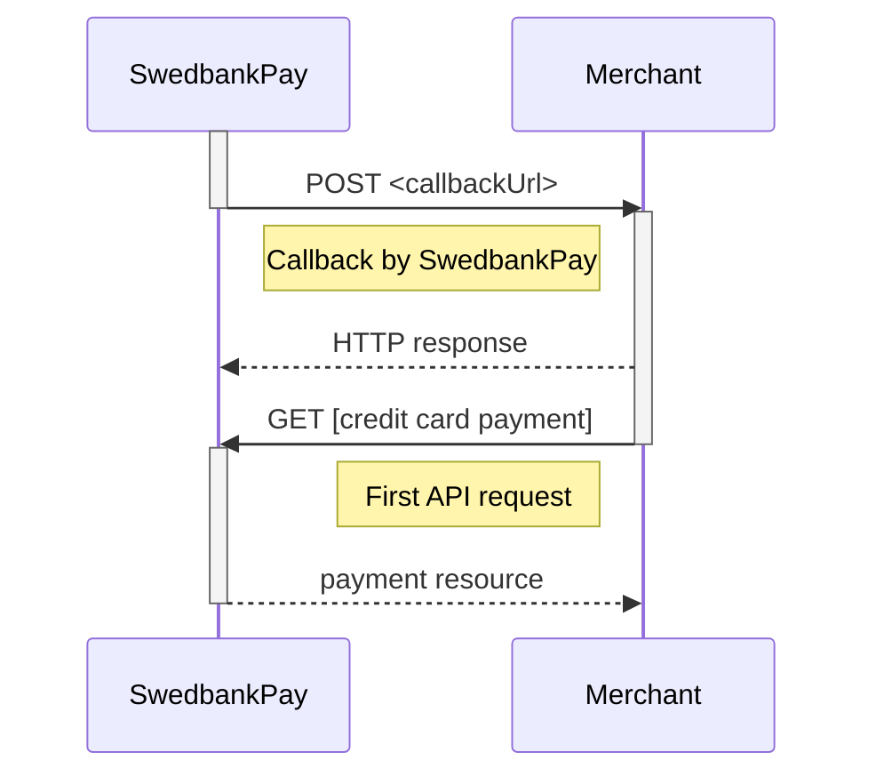



## Options after posting a payment

To see the available operations after posting a payment, do a `GET` request on
the payment resource.



* *Abort:* It is possible to abort the process if the payment has no successful
  transactions. [See the Abort description here][abort].
* If the payment shown above is done as a two phase (`Authorization`), you will
  need to implement the `Capture` and `Cancel` requests.
* For `reversals`, you will need to implement the [Reversal request][reversal].
* If `CallbackURL` is set: Whenever changes to the payment occur a [Callback
  request][callback] will be posted to the `callbackUrl`, which was generated
  when the payment was created.

## Capture

The capture transaction is the when you ensure that the funds are charged from
the consumer. This step usaully takes place when the product has exchanged
possession. One must first do a `GET` request on the payment to find the
`create-capture` operation.

### Create capture transaction

To create a `capture` transaction to withdraw money from the payer's card, you
need to perform the `create-capture` operation.

{:.code-header}
**Request**

```HTTP
POST /psp/creditcard/payments/5adc265f-f87f-4313-577e-08d3dca1a26c/captures HTTP/1.1
Host: api.externalintegration.payex.com
Authorization: Bearer <AccessToken>
Content-Type: application/json

{
    "transaction": {
        "amount": 1500,
        "vatAmount": 250,
        "description": "Test Capture",
        "payeeReference": "ABC123"
    }
}
```

{:.table .table-striped}
| Required | Property                 | Type          | Description                                                                                                   |
| :------: | :----------------------- | :------------ | :------------------------------------------------------------------------------------------------------------ |
|  ✔︎︎︎︎︎  | `transaction`            | `object`      | The object representation of the generic [transaction resource][transaction-resource].                        |
|  ✔︎︎︎︎︎  | └➔&nbsp;`amount`         | `integer`     | Amount Entered in the lowest momentary units of the selected currency. E.g. 10000 100.00 NOK, 5000 50.00 SEK. |
|  ✔︎︎︎︎︎  | └➔&nbsp;`vatAmount`      | `integer`     | Amount Entered in the lowest momentary units of the selected currency. E.g. 10000 100.00 NOK, 5000 50.00 SEK. |
|  ✔︎︎︎︎︎  | └➔&nbsp;`description`    | `string`      | A textual description of the capture transaction.                                                             |
|  ✔︎︎︎︎︎  | └➔&nbsp;`payeeReference` | `string(30*)` | A unique reference for the capture transaction. See [payeeReference][payeeReference] for details.             |

{:.code-header}
**Response**

```HTTP
HTTP/1.1 200 OK
Content-Type: application/json

{
    "payment": "/psp/creditcard/payments/5adc265f-f87f-4313-577e-08d3dca1a26c",
    "capture": {
        "id": "/psp/creditcard/payments/5adc265f-f87f-4313-577e-08d3dca1a26c/captures/12345678-1234-1234-1234-123456789012",
        "transaction": {
            "id": "/psp/creditcard/payments/5adc265f-f87f-4313-577e-08d3dca1a26c/transactions/12345678-1234-1234-1234-123456789012",
            "created": "2016-09-14T01:01:01.01Z",
            "updated": "2016-09-14T01:01:01.03Z",
            "type": "Capture",
            "state": "Completed",
            "number": 1234567890,
            "amount": 1500,
            "vatAmount": 250,
            "description": "Test Capture",
            "payeeReference": "ABC123",
            "isOperational": false,
            "operations": []
        }
    }
}
```

{:.table .table-striped}
| Property                  | Type      | Description                                                                                                                                                                                                  |
| :------------------------ | :-------- | :----------------------------------------------------------------------------------------------------------------------------------------------------------------------------------------------------------- |
| `payment`                 | `string`  | The relative URI of the payment this `capture` transaction belongs to.                                                                                                                                       |
| `capture`                 | `object`  | The `capture` resource contains information about the `capture` transaction made against a card payment.                                                                                                     |
| └➔&nbsp;`id`              | `string`  | The relative URI of the created `capture` transaction.                                                                                                                                                       |
| └➔&nbsp;`transaction`     | `object`  | The object representation of the generic [`transaction resource`][transaction-resource].                                                                                                                     |
| └─➔&nbsp;`id`             | `string`  | The relative URI of the current  `transaction`  resource.                                                                                                                                                    |
| └─➔&nbsp;`created`        | `string`  | The ISO-8601 date and time of when the transaction was created.                                                                                                                                              |
| └─➔&nbsp;`updated`        | `string`  | The ISO-8601 date and time of when the transaction was created.                                                                                                                                              |
| └─➔&nbsp;`type`           | `string`  | Indicates the transaction type.                                                                                                                                                                              |
| └─➔&nbsp;`state`          | `string`  | Initialized ,  Completed  or  Failed . Indicates the state of the transaction                                                                                                                                |
| └─➔&nbsp;`number`         | `string`  | The transaction  number , useful when there's need to reference the transaction in human communication. Not usable for programmatic identification of the transaction, for that  id  should be used instead. |
| └─➔&nbsp;`amount`         | `integer` | Amount is entered in the lowest momentary units of the selected currency. E.g.  10000  = 100.00 NOK,  5000  = 50.00 SEK.                                                                                     |
| └─➔&nbsp;`vatAmount`      | `integer` | If the amount given includes VAT, this may be displayed for the user in the payment page (redirect only). Set to 0 (zero) if this is not relevant.                                                           |
| └─➔&nbsp;`description`    | `string`  | A human readable description of maximum 40 characters of the transaction                                                                                                                                     |
| └─➔&nbsp;`payeeReference` | `string`  | A unique reference for the transaction. See [payeeReference][payeeReference] for details.                                                                                                                    |
| └─➔&nbsp;`failedReason`   | `string`  | The human readable explanation of why the payment failed.                                                                                                                                                    |
| └─➔&nbsp;`isOperational`  | `boolean` | `true`  if the transaction is operational; otherwise  `false` .                                                                                                                                              |
| └─➔&nbsp;`operations`     | `array`   | The array of [operations][operations] that are possible to perform on the transaction in its current state.                                                                                                  |

The `captures` resource list the capture transactions (one or more) on a
specific payment.

{:.code-header}
**Request**

```HTTP
GET /psp/creditcard/payments/5adc265f-f87f-4313-577e-08d3dca1a26c/captures HTTP/1.1
Host: api.externalintegration.payex.com
Authorization: Bearer <AccessToken>
Content-Type: application/json
```

{:.code-header}
**Response**

```HTTP
HTTP/1.1 200 OK
Content-Type: application/json

{
    "payment": "/psp/creditcard/payments/5adc265f-f87f-4313-577e-08d3dca1a26c",
    "captures": {
        "id": "/psp/creditcard/payments/5adc265f-f87f-4313-577e-08d3dca1a26c/captures",
        "captureList": [
            {
                "id": "/psp/creditcard/payments/5adc265f-f87f-4313-577e-08d3dca1a26c/captures/12345678-1234-1234-1234-123456789012",
                "transaction": {
                    "id": "/psp/creditcard/payments/5adc265f-f87f-4313-577e-08d3dca1a26c/transactions/12345678-1234-1234-1234-123456789012",
                    "created": "2016-09-14T01:01:01.01Z",
                    "updated": "2016-09-14T01:01:01.03Z",
                    "type": "Capture",
                    "state": "Completed",
                    "number": 1234567890,
                    "amount": 1000,
                    "vatAmount": 250,
                    "description": "Test transaction",
                    "payeeReference": "AH123456",
                    "failedReason": "",
                    "isOperational": false,
                    "operations": []
                }
            }
        ]
    }
}
```

{:.table .table-striped}
| Property                  | Type      | Description                                                                                                                                                                                                  |
| :------------------------ | :-------- | :----------------------------------------------------------------------------------------------------------------------------------------------------------------------------------------------------------- |
| `payment`                 | `string`  | The relative URI of the payment this list of  `capture` transactions belong to.                                                                                                                              |
| `captures`                | `object`  | The  `capture` resource contains information about the  `capture` transaction made against a card payment.                                                                                                   |
| └➔&nbsp;`id`              | `string`  | The relative URI of the current   `capture`s  resource.                                                                                                                                                      |
| └➔&nbsp;`captureList`     | `array`   | The array of  `capture` transaction objects.                                                                                                                                                                 |
| └─➔&nbsp;`id`             | `string`  | The relative URI of the current  transaction  resource.                                                                                                                                                      |
| └➔&nbsp;`transaction`     | `object`  | The object representation of the generic [transaction resource][transaction-resource].                                                                                                                       |
| └─➔&nbsp;`id`             | `string`  | The relative URI of the current  transaction  resource.                                                                                                                                                      |
| └─➔&nbsp;`created`        | `string`  | The ISO-8601 date and time of when the transaction was created.                                                                                                                                              |
| └─➔&nbsp;`updated`        | `string`  | The ISO-8601 date and time of when the transaction was created.                                                                                                                                              |
| └─➔&nbsp;`type`           | `string`  | Indicates the transaction type.                                                                                                                                                                              |
| └─➔&nbsp;`state`          | `string`  | Initialized ,  Completed  or  Failed . Indicates the state of the transaction                                                                                                                                |
| └─➔&nbsp;`number`         | `string`  | The transaction  number , useful when there's need to reference the transaction in human communication. Not usable for programmatic identification of the transaction, for that  id  should be used instead. |
| └─➔&nbsp;`amount`         | `integer` | Amount is entered in the lowest momentary units of the selected currency. E.g.  10000  = 100.00 NOK,  5000  = 50.00 SEK.                                                                                     |
| └─➔&nbsp;`vatAmount`      | `integer` | If the amount given includes VAT, this may be displayed for the user in the payment page (redirect only). Set to 0 (zero) if this is not relevant.                                                           |
| └─➔&nbsp;`description`    | `string`  | A human readable description of maximum 40 characters of the transaction                                                                                                                                     |
| └─➔&nbsp;`payeeReference` | `string`  | A unique reference for the transaction. See [payeeReference][payeeReference] for details.                                                                                                                    |
| └─➔&nbsp;`failedReason`   | `string`  | The human readable explanation of why the payment failed.                                                                                                                                                    |
| └─➔&nbsp;`isOperational`  | `boolean` | `true`  if the transaction is operational; otherwise  `false` .                                                                                                                                              |
| └─➔&nbsp;`operations`     | `array`   | The array of [operations][operations] that are possible to perform on the transaction in its current state.                                                                                                  |

### Capture Sequence

`Capture` can only be done on a authorized transaction. It is possible to do a
part-capture where you only capture a part of the authorization amount. You can
later do more captures on the same payment up to the total authorization amount.



### Cancellations

The `cancellations` resource lists the cancellation transactions on a specific
payment.

{:.code-header}
**Request**

`Cancel` can only be done on a authorized transaction. If you do cancel after
doing a part-capture you will cancel the difference between the capture amount
and the authorization amount.

### Create cancellation transaction

Perform the `create-cancel` operation to cancel a previously created - and not
yet captured - payment.

{:.code-header}
**Request**

```HTTP
POST /psp/creditcard/payments/5adc265f-f87f-4313-577e-08d3dca1a26c/cancellations HTTP/1.1
Host: api.externalintegration.payex.com
Authorization: Bearer <AccessToken>
Content-Type: application/json

{
    "transaction": {
        "description": "Test Cancellation",
        "payeeReference": "ABC123"
    }
}
```

{:.table .table-striped}
| Required | Property                 | Type          | Description                                                                                              |
| :------: | :----------------------- | :------------ | :------------------------------------------------------------------------------------------------------- |
|  ✔︎︎︎︎︎  | `transaction`            | `object`      | The `object` representation of the generic [transaction resource][transaction-resource].                 |
|  ✔︎︎︎︎︎  | └➔&nbsp;`description`    | `string`      | A textual description of the reason for the `cancellation`.                                              |
|  ✔︎︎︎︎︎  | └➔&nbsp;`payeeReference` | `string(30*)` | A unique reference for the `cancellation` transaction. See [payeeReference][payeeReference] for details. |

The `cancel` resource contains information about a cancellation transaction
made against a payment.

{:.code-header}
**Response**

```HTTP
HTTP/1.1 200 OK
Content-Type: application/json

{
    "payment": "/psp/creditcard/payments/5adc265f-f87f-4313-577e-08d3dca1a26c",
    "cancellation": {
        "id": "/psp/creditcard/payments/5adc265f-f87f-4313-577e-08d3dca1a26c/cancellations/12345678-1234-1234-1234-123456789012",
        "transaction": {
            "id": "/psp/creditcard/payments/5adc265f-f87f-4313-577e-08d3dca1a26c/transactions/12345678-1234-1234-1234-123456789012",
            "created": "2016-09-14T01:01:01.01Z",
            "updated": "2016-09-14T01:01:01.03Z",
            "type": "Cancellation",
            "state": "Initialized",
            "number": 1234567890,
            "amount": 1000,
            "vatAmount": 250,
            "description": "Test Cancellation",
            "payeeReference": "ABC123",
            "failedReason": "",
            "isOperational": false,
            "operations": []
        }
    }
}
```

{:.table .table-striped}
| Property                  | Type      | Description                                                                                                                                                                                                  |
| :------------------------ | :-------- | :----------------------------------------------------------------------------------------------------------------------------------------------------------------------------------------------------------- |
| `payment`                 | `string`  | The relative URI of the payment this `cancellation` transaction belongs to.                                                                                                                                  |
| `cancellation`            | `object`  | The `cancellation` resource contains information about the `cancellation` transaction made against a card payment.                                                                                           |
| └➔&nbsp;`id`              | `string`  | The relative URI of the created `cancellation` transaction.                                                                                                                                                  |
| └➔&nbsp;`transaction`     | `object`  | The object representation of the generic [transaction resource][transaction-resource].                                                                                                                       |
| └─➔&nbsp;`id`             | `string`  | The relative URI of the current  transaction  resource.                                                                                                                                                      |
| └─➔&nbsp;`created`        | `string`  | The ISO-8601 date and time of when the transaction was created.                                                                                                                                              |
| └─➔&nbsp;`updated`        | `string`  | The ISO-8601 date and time of when the transaction was created.                                                                                                                                              |
| └─➔&nbsp;`type`           | `string`  | Indicates the transaction type.                                                                                                                                                                              |
| └─➔&nbsp;`state`          | `string`  | Initialized ,  Completed  or  Failed . Indicates the state of the transaction                                                                                                                                |
| └─➔&nbsp;`number`         | `string`  | The transaction  number , useful when there's need to reference the transaction in human communication. Not usable for programmatic identification of the transaction, for that  id  should be used instead. |
| └─➔&nbsp;`amount`         | `integer` | Amount is entered in the lowest momentary units of the selected currency. E.g.  10000  = 100.00 NOK,  5000  = 50.00 SEK.                                                                                     |
| └─➔&nbsp;`vatAmount`      | `integer` | If the amount given includes VAT, this may be displayed for the user in the payment page (redirect only). Set to 0 (zero) if this is not relevant.                                                           |
| └─➔&nbsp;`description`    | `string`  | A human readable description of maximum 40 characters of the transaction                                                                                                                                     |
| └─➔&nbsp;`payeeReference` | `string`  | A unique reference for the transaction. See [payeeReference][payeeReference] for details.                                                                                                                    |
| └─➔&nbsp;`failedReason`   | `string`  | The human readable explanation of why the payment failed.                                                                                                                                                    |
| └─➔&nbsp;`isOperational`  | `boolean` | `true`  if the transaction is operational; otherwise  `false` .                                                                                                                                              |
| └─➔&nbsp;`operations`     | `array`   | The array of [operations][operations] that are possible to perform on the transaction in its current state.                                                                                                  |

The `cancellations` resource lists the cancellation transactions on a specific
payment.

{:.code-header}
**Request**

```HTTP
GET /psp/creditcard/payments/5adc265f-f87f-4313-577e-08d3dca1a26c/cancellations HTTP/1.1
Host: api.externalintegration.payex.com
Authorization: Bearer <AccessToken>
Content-Type: application/json
```

{:.code-header}
**Response**

```HTTP
HTTP/1.1 200 OK
Content-Type: application/json

{
    "payment": "/psp/creditcard/payments/5adc265f-f87f-4313-577e-08d3dca1a26c",
    "cancellations": {
        "id": "/psp/creditcard/payments/5adc265f-f87f-4313-577e-08d3dca1a26c/cancellations",
        "cancellationList": [{
            "id": "/psp/creditcard/payments/5adc265f-f87f-4313-577e-08d3dca1a26c/cancellations/12345678-1234-1234-1234-123456789012",
            "transaction": {
                "id": "/psp/creditcard/payments/5adc265f-f87f-4313-577e-08d3dca1a26c/transactions/12345678-1234-1234-1234-123456789012",
                "created": "2016-09-14T01:01:01.01Z",
                "updated": "2016-09-14T01:01:01.03Z",
                "type": "Cancellation",
                "state": "Completed",
                "number": 1234567890,
                "amount": 1000,
                "vatAmount": 250,
                "description": "Test transaction",
                "payeeReference": "AH123456",
                "failedReason": "",
                "isOperational": false,
                "operations": []
            }
        }]
    }
}
```

{:.table .table-striped}
| Property                   | Type      | Description                                                                                                                                                                                                  |
| :------------------------- | :-------- | :----------------------------------------------------------------------------------------------------------------------------------------------------------------------------------------------------------- |
| `payment`                  | `string`  | The relative URI of the payment this list of `cancellation` transactions belong to.                                                                                                                          |
| `cancellations`            | `object`  | The `cancellation` resource contains information about the `cancellation` transaction made against a card payment.                                                                                           |
| └➔&nbsp;`id`               | `string`  | The relative URI of the current `cancellation` resource.                                                                                                                                                     |
| └➔&nbsp;`cancellationList` | `array`   | The array of `cancellation` transaction objects.                                                                                                                                                             |
| └─➔&nbsp;`id`              | `string`  | The relative URI of the current transaction  resource.                                                                                                                                                       |
| └➔&nbsp;`transaction`      | `object`  | The object representation of the generic [transaction resource][transaction-resource].                                                                                                                       |
| └─➔&nbsp;`id`              | `string`  | The relative URI of the current  transaction  resource.                                                                                                                                                      |
| └─➔&nbsp;`created`         | `string`  | The ISO-8601 date and time of when the transaction was created.                                                                                                                                              |
| └─➔&nbsp;`updated`         | `string`  | The ISO-8601 date and time of when the transaction was created.                                                                                                                                              |
| └─➔&nbsp;`type`            | `string`  | Indicates the transaction type.                                                                                                                                                                              |
| └─➔&nbsp;`state`           | `string`  | Initialized , Completed or Failed . Indicates the state of the transaction                                                                                                                                   |
| └─➔&nbsp;`number`          | `string`  | The transaction  number , useful when there's need to reference the transaction in human communication. Not usable for programmatic identification of the transaction, for that  id  should be used instead. |
| └─➔&nbsp;`amount`          | `integer` | Amount is entered in the lowest momentary units of the selected currency. E.g.  10000  = 100.00 NOK,  5000  = 50.00 SEK.                                                                                     |
| └─➔&nbsp;`vatAmount`       | `integer` | If the amount given includes VAT, this may be displayed for the user in the payment page (redirect only). Set to 0 (zero) if this is not relevant.                                                           |
| └─➔&nbsp;`description`     | `string`  | A human readable description of maximum 40 characters of the transaction                                                                                                                                     |
| └─➔&nbsp;`payeeReference`  | `string`  | A unique reference for the transaction. See [payeeReference][payeeReference] for details.                                                                                                                    |
| └─➔&nbsp;`failedReason`    | `string`  | The human readable explanation of why the payment failed.                                                                                                                                                    |
| └─➔&nbsp;`isOperational`   | `boolean` | `true` if the transaction is operational; otherwise `false` .                                                                                                                                                |
| └─➔&nbsp;`operations`      | `array`   | The array of [operations][operations] that are possible to perform on the transaction in its current state.                                                                                                  |

#### Cancel Sequence



## Reversals

This transaction is used when a captured payment needs to be reversed.

### Create reversal transaction

The `create-reversal` operation will reverse a previously captured payment.

{:.code-header}
**Request**

```HTTP
POST /psp/creditcard/payments/5adc265f-f87f-4313-577e-08d3dca1a26c/reversals HTTP/1.1
Host: api.externalintegration.payex.com
Authorization: Bearer <AccessToken>
Content-Type: application/json

{
    "transaction": {
        "amount": 1500,
        "vatAmount": 0,
        "description": "Test Reversal",
        "payeeReference": "ABC123"
    }
}
```

{:.table .table-striped}
|:---:|:----------|:------|:-----------
| Required | Property | Type | Description |
|   ✔︎︎︎︎︎   | `transaction`            | `object`      | The `object` representation of the generic [transaction resource][transaction-resource].                 |
|   ✔︎︎︎︎︎   | └➔&nbsp;`amount` | `integer` | Amount Entered in the lowest momentary units of the selected currency. E.g. 10000 = 100.00 NOK, 5000 = 50.00 SEK. |
|   ✔︎︎︎︎︎   | └➔&nbsp;`vatAmount` | `integer` | Amount Entered in the lowest momentary units of the selected currency. E.g. 10000 = 100.00 NOK, 5000 = 50.00 SEK.|
|   ✔︎︎︎︎︎   | └➔&nbsp;`description` | `string` | A textual description of the `reversal`.|
|   ✔︎︎︎︎︎   | └➔&nbsp;`payeeReference` | `string(30*)` | A unique reference for the `reversal` transaction. See [payeeReference][payeeReference] for details.|

The `reversal` resource contains information about the newly created reversal
transaction.

{:.code-header}
**Response**

```HTTP
HTTP/1.1 200 OK
Content-Type: application/json

{
    "payment": "/psp/creditcard/payments/5adc265f-f87f-4313-577e-08d3dca1a26c",
    "reversal": {
        "id": "/psp/creditcard/payments/5adc265f-f87f-4313-577e-08d3dca1a26c/reversal/12345678-1234-1234-1234-123456789012",
        "transaction": {
            "id": "/psp/creditcard/payments/5adc265f-f87f-4313-577e-08d3dca1a26c/transactions/12345678-1234-1234-1234-123456789012",
            "created": "2016-09-14T01:01:01.01Z",
            "updated": "2016-09-14T01:01:01.03Z",
            "type": "Reversal",
            "state": "Completed",
            "number": 1234567890,
            "amount": 1000,
            "vatAmount": 250,
            "description": "Test transaction",
            "payeeReference": "AH123456",
            "failedReason": "",
            "isOperational": false,
            "operations": []
        }
    }
}
```

{:.table .table-striped}
| Property                  | Type      | Description                                                                                                                                                                                                  |
| :------------------------ | :-------- | :----------------------------------------------------------------------------------------------------------------------------------------------------------------------------------------------------------- |
| `payment`                 | `string`  | The relative URI of the payment this `reversal` transaction belongs to.                                                                                                                                    |
| `reversal`                | `object`  | The `reversal`resource contains information about the `reversal`transaction made against a card payment.                                                                                                     |
| └➔&nbsp;`id`              | `string`  | The relative URI of the created `reversal`transaction.                                                                                                                                                       |
| └➔&nbsp;`transaction`     | `object`  | The object representation of the generic [transaction resource][transaction-resource].                                                                                                                       |
| └─➔&nbsp;`id`             | `string`  | The relative URI of the current  transaction  resource.                                                                                                                                                      |
| └─➔&nbsp;`created`        | `string`  | The ISO-8601 date and time of when the transaction was created.                                                                                                                                              |
| └─➔&nbsp;`updated`        | `string`  | The ISO-8601 date and time of when the transaction was created.                                                                                                                                              |
| └─➔&nbsp;`type`           | `string`  | Indicates the transaction type.                                                                                                                                                                              |
| └─➔&nbsp;`state`          | `string`  | Initialized ,  Completed  or  Failed . Indicates the state of the transaction                                                                                                                                |
| └─➔&nbsp;`number`         | `string`  | The transaction  number , useful when there's need to reference the transaction in human communication. Not usable for programmatic identification of the transaction, for that  id  should be used instead. |
| └─➔&nbsp;`amount`         | `integer` | Amount is entered in the lowest momentary units of the selected currency. E.g.  10000  = 100.00 NOK,  5000  = 50.00 SEK.                                                                                     |
| └─➔&nbsp;`vatAmount`      | `integer` | If the amount given includes VAT, this may be displayed for the user in the payment page (redirect only). Set to 0 (zero) if this is not relevant.                                                           |
| └─➔&nbsp;`description`    | `string`  | A human readable description of maximum 40 characters of the transaction                                                                                                                                     |
| └─➔&nbsp;`payeeReference` | `string`  | A unique reference for the transaction. See [payeeReference][payeeReference] for details.                                                                                                                    |
| └─➔&nbsp;`failedReason`   | `string`  | The human readable explanation of why the payment failed.                                                                                                                                                    |
| └─➔&nbsp;`isOperational`  | `boolean` | `true`  if the transaction is operational; otherwise  `false` .                                                                                                                                              |
| └─➔&nbsp;`operations`     | `array`   | The array of [operations][operations] that are possible to perform on the transaction in its current state.                                                                                                  |

The `reversals` resource lists the reversal transactions (one or more) on a
specific payment.

{:.code-header}
**Request**

```HTTP
GET /psp/creditcard/payments/5adc265f-f87f-4313-577e-08d3dca1a26c/reversals HTTP/1.1
Host: api.externalintegration.payex.com
Authorization: Bearer <AccessToken>
Content-Type: application/json
```

{:.code-header}
**Response**

```HTTP
HTTP/1.1 200 OK
Content-Type: application/json

{
    "payment": "/psp/creditcard/payments/5adc265f-f87f-4313-577e-08d3dca1a26c",
    "reversals": {
        "id": "/psp/creditcard/payments/5adc265f-f87f-4313-577e-08d3dca1a26c/reversal",
        "reversalList": [{
            "id": "/psp/creditcard/payments/5adc265f-f87f-4313-577e-08d3dca1a26c/reversal/12345678-1234-1234-1234-123456789012",
            "transaction": {
                "id": "/psp/creditcard/payments/5adc265f-f87f-4313-577e-08d3dca1a26c/transactions/12345678-1234-1234-1234-123456789012",
                "created": "2016-09-14T01:01:01.01Z",
                "updated": "2016-09-14T01:01:01.03Z",
                "type": "Reversal",
                "state": "Completed",
                "number": 1234567890,
                "amount": 1000,
                "vatAmount": 250,
                "description": "Test transaction",
                "payeeReference": "AH123456",
                "failedReason": "",
                "isOperational": false,
                "operations": []
            }
        }]
    }
}
```

{:.table .table-striped}
| Property                  | Type      | Description                                                                                                                                                                                                  |
| :------------------------ | :-------- | :----------------------------------------------------------------------------------------------------------------------------------------------------------------------------------------------------------- |
| `payment`                 | `string`  | The relative URI of the payment this list of `reversals` transactions belong to.                                                                                                                            |
| `recersals`               | `object`  | The `reversals` resource contains information about the `reversals` transaction made against a card payment.                                                                                                     |
| └➔&nbsp;`id`              | `string`  | The relative URI of the current `reversals` resource.                                                                                                                                                        |
| └➔&nbsp;`reversalList`    | `array`   | The array of `reversals` transaction objects.                                                                                                                                                                |
| └─➔&nbsp;`id`             | `string`  | The relative URI of the current transaction  resource.                                                                                                                                                       |
| └➔&nbsp;`transaction`     | `object`  | The object representation of the generic [transaction resource][transaction-resource].                                                                                                                       |
| └─➔&nbsp;`id`             | `string`  | The relative URI of the current  transaction  resource.                                                                                                                                                      |
| └─➔&nbsp;`created`        | `string`  | The ISO-8601 date and time of when the transaction was created.                                                                                                                                              |
| └─➔&nbsp;`updated`        | `string`  | The ISO-8601 date and time of when the transaction was created.                                                                                                                                              |
| └─➔&nbsp;`type`           | `string`  | Indicates the transaction type.                                                                                                                                                                              |
| └─➔&nbsp;`state`          | `string`  | Initialized , Completed or Failed . Indicates the state of the transaction                                                                                                                                   |
| └─➔&nbsp;`number`         | `string`  | The transaction  number , useful when there's need to reference the transaction in human communication. Not usable for programmatic identification of the transaction, for that  id  should be used instead. |
| └─➔&nbsp;`amount`         | `integer` | Amount is entered in the lowest momentary units of the selected currency. E.g.  10000  = 100.00 NOK,  5000  = 50.00 SEK.                                                                                     |
| └─➔&nbsp;`vatAmount`      | `integer` | If the amount given includes VAT, this may be displayed for the user in the payment page (redirect only). Set to 0 (zero) if this is not relevant.                                                           |
| └─➔&nbsp;`description`    | `string`  | A human readable description of maximum 40 characters of the transaction                                                                                                                                     |
| └─➔&nbsp;`payeeReference` | `string`  | A unique reference for the transaction. See [payeeReference][payeeReference] for details.                                                                                                                    |
| └─➔&nbsp;`failedReason`   | `string`  | The human readable explanation of why the payment failed.                                                                                                                                                    |
| └─➔&nbsp;`isOperational`  | `boolean` | `true` if the transaction is operational; otherwise `false` .                                                                                                                                                |
| └─➔&nbsp;`operations`     | `array`   | The array of [operations][operations] that are possible to perform on the transaction in its current state.                                                                                                  |

### Reversal Sequence



## Remove payment token

If you, for any reason, need to delete a paymentToken you use the
`Delete payment token` request.

{% include alert.html type="warning"
                      icon="warning"
                      body="Please note that this call does not erase the card number stored at Swedbank
  Pay. A card number is automatically deleted six months after a successful
  `Delete payment token` request. If you want to remove card information
  beforehand, you need to contact ehandelsetup@swedbankpay.dk,
  verkkokauppa.setup@swedbankpay.fi, ehandelsetup@swedbankpay.no or
  ehandelsetup@swedbankpay.se; and supply them with
  the relevant transaction reference or payment token." %}

{:.code-header}
**Request**

```HTTP
PATCH /psp/creditcard/payments/instrumentData/<paymentToken> HTTP/1.1
Host: api.externalintegration.payex.com
Authorization: Bearer <AccessToken>
Content-Type: application/json

{
  "state": "Deleted",
  "tokenType" : "PaymentToken|RecurrenceToken",
  "comment": "Comment on why the deletion is happening"
}
```

{:.code-header}
**Response**

```HTTP
HTTP/1.1 200 OK
Content-Type: application/json

{
  "instrumentData": {
    "id": "/psp/creditcard/payments/instrumentdata/12345678-1234-1234-1234-123456789000",
    "paymentToken": "12345678-1234-1234-1234-123456789000",
    "payeeId": "61c65499-de5c-454e-bf4c-043f22538d49",
    "isDeleted": true|false,
    "isPayeeToken": false,
    "cardBrand": "Visa|MasterCard|...",
    "maskedPan": "123456xxxxxx1111",
    "expiryDate": "MM/YYYY"
  }
}
```

## Callback

When a change or update from the back-end system are made on a payment or
transaction, Swedbank Pay will perform a callback to inform the payee (merchant)
about this update. `Callback` functionality is explaned in more detail
[here][callback].





[transaction-resource]: /payments/credit-card/other-features/#transactions
[payeeReference]: /payments/credit-card/other-features/#payeereference
[payment-resource]: /payments/credit-card/other-features/#payment
[abort]: /payments/credit-card/other-features/#abort
[callback]: /payments/credit-card/other-features/#callback
[cancel]: /payments/credit-card/after-payment/#cancellations
[capture]: /payments/credit-card/after-payment/#Capture
[finalize]: /payments/credit-card/after-payment/#finalize
[operations]: /payments/credit-card/other-features/#operations
[reversal]: /payments/credit-card/after-payment/#reversals
