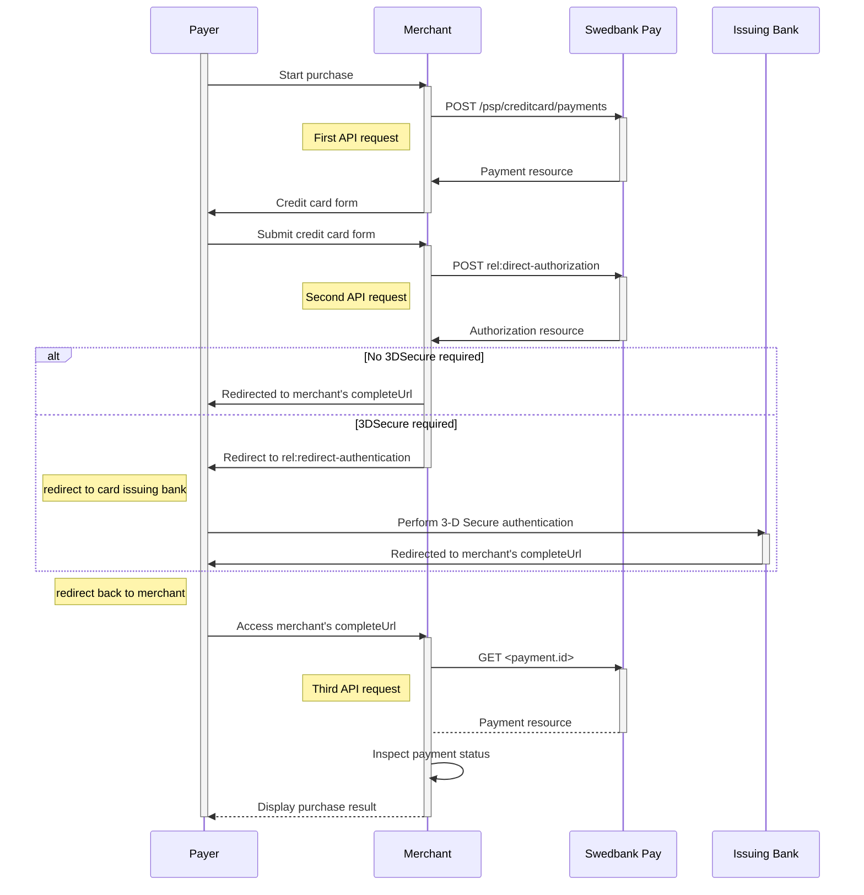









## Payment flow

Below is a quick stepwise summary of how the Direct Card Payment scenario works.

*   The payer places an order and you make a `Purchase` request towards Swedbank
  Pay with the gathered payment information.
*   The action taken next is the `direct-authorization` operation that is returned
  in the first request. You `POST` the payer's card data to the URL in the
  [`direct-authorization`][authorization] operation.
*   If the issuer requires 3-D Secure authentication, you will then receive an
  operation called `redirect-authentication`. You must redirect the payer to
  this URL to let them authenticate against the issuer's 3-D Secure page.
    -   When the 3-D Secure flow is completed, the payer will be redirected back to
      the URL provided in `completeUrl` or `cancelUrl`, depending on the actions
      performed by the payer.
    -   If the issuer does not require 3-D Secure authentication, the payment will
      already be `Completed` after performing the `direct-authorization`
      request. Note that `Completed` just indicates that the payment is in a
      final state; the financial transaction could be either OK or failed.
*   Finally you make a `GET` request towards Swedbank Pay with the `id` of the
  payment created in the first step, which will return the result of the
  authorization.

## Step 1: Create a Purchase

A `Purchase` payment is a straightforward way to charge the card of the payer.
It is followed up by posting a capture, cancellation or reversal transaction.

An example of an abbreviated `POST` request is provided below. An example of an
expanded `POST` request is available in the [other features section][purchase].







{% include alert.html type="informative" icon="report_problem" body="**Step 2** is
to create an authorization transaction. Implement only Step 2a if **3-D Secure
authentication is enabled**. Note that if the issuer does **not require** 3-D
Secure authentication, implement only Step 2b. You will see that the requests
are the same for both steps. The difference is in the operations, where Step 2a
has the `redirect-authentication` operation in its response. This is needed for
the payer to be redirected to complete the 3-D Secure authentication." %}

## Step 2a: Create authorization without 3-D Secure authentication

The `direct-authorization` operation creates an authorization transaction
directly.

{:.code-header}
**Request**

```http
POST /psp/creditcard/payments/{{ page.payment_id }}/authorizations HTTP/1.1
Host: {{ page.api_host }}
Authorization: Bearer <AccessToken>
Content-Type: application/json

{
    "transaction": {
        "cardNumber": "4925000000000004",
        "cardExpiryMonth": "12",
        "cardExpiryYear": "22",
        "cardVerificationCode": "749",
        "cardholderName": "Olivia Nyhuus",
        "chosenCoBrand": "visa"
    }
}
```

{:.table .table-striped}
|     Required     | Field                          | Type      | Description                                                                     |
| :--------------: | :----------------------------- | :-------- | :------------------------------------------------------------------------------ |
|  | `transaction`                  | `object`  | The transaction object.                                                         |
|  | └➔&nbsp;`cardNumber`           | `string`  | Primary Account Number (PAN) of the card, printed on the face of the card.      |
|  | └➔&nbsp;`cardExpiryMonth`      | `integer` | Expiry month of the card, printed on the face of the card.                      |
|  | └➔&nbsp;`cardExpiryYear`       | `integer` | Expiry year of the card, printed on the face of the card.                       |
|                  | └➔&nbsp;`cardVerificationCode` | `string`  | Card verification code (CVC/CVV/CVC2), usually printed on the back of the card. |
|                  | └➔&nbsp;`cardholderName`       | `string`  | Name of the cardholder, usually printed on the face of the card.                |

{:.code-header}
**Response**

```http
HTTP/1.1 200 OK
Content-Type: application/json

{
    "payment": "/psp/creditcard/payments/{{ page.payment_id }}",
    "authorization": {
        "direct": true,
        "cardBrand": "Visa",
        "cardType": "Credit",
        "maskedPan": "492500******0004",
        "expiryDate": "12/2022",
        "panToken": "eb488c77-8118-4c9f-b3b3-ff134936df64",
        "panEnrolled": false,
        "issuerAuthorizationApprovalCode": "L99099",
        "acquirerTransactionType": "SSL",
        "acquirerStan": "99099",
        "acquirerTerminalId": "86",
        "acquirerTransactionTime": "2020-04-07T22:35:26Z",
        "nonPaymentToken": "ed4683a8-6d2a-4a14-b065-746a41316b8f",
        "id": "/psp/creditcard/payments/{{ page.payment_id }}/authorizations/{{ page.transaction_id }}",
        "transaction": {
            "id": "/psp/creditcard/payments/{{ page.payment_id }}/transactions/{{ page.transaction_id }}",
            "created": "2020-04-07T20:35:24.8344431Z",
            "updated": "2020-04-07T20:35:26.3472343Z",
            "type": "Authorization",
            "state": "Completed",
            "number": 99100557070,
            "amount": 4201,
            "vatAmount": 0,
            "description": "Books & Ink",
            "payeeReference": "cyrusLibrary1586291679",
            "isOperational": false,
            "operations": [
                {
                    "method": "PATCH",
                    "href": "{{ page.api_url}}/psp/creditcard/payments/{{ page.payment_id }}/authorizations/{{ page.transaction_id }}",
                    "rel": "update-authorization-overchargedamount"
                }
            ]
        }
    }
}
```

{:.table .table-striped}
| Field                             | Type      | Description                                                                                                                                                                                                  |
| :-------------------------------- | :-------- | :----------------------------------------------------------------------------------------------------------------------------------------------------------------------------------------------------------- |
| `payment`                         | `object`  | The payment object.                                                                                                                                                                                          |
| `authorization`                   | `object`  | The authorization object.                                                                                                                                                                                    |
| └➔&nbsp;`direct`                  | `string`  | The type of the authorization.                                                                                                                                                                               |
| └➔&nbsp;`cardBrand`               | `string`  | `Visa`, `MC`, etc. The brand of the card.                                                                                                                                                                    |
| └➔&nbsp;`cardType`                | `string`  | `Credit Card` or `Debit Card`. Indicates the type of card used for the authorization.                                                                                                                        |
| └➔&nbsp;`issuingBank`             | `string`  | The name of the bank that issued the card used for the authorization.                                                                                                                                        |
| └➔&nbsp;`paymentToken`            | `string`  | The payment token created for the card used in the authorization.                                                                                                                                            |
| └➔&nbsp;`maskedPan`               | `string`  | The masked PAN number of the card.                                                                                                                                                                           |
| └➔&nbsp;`expiryDate`              | `string`  | The month and year of when the card expires.                                                                                                                                                                 |
| └➔&nbsp;`panToken`                | `string`  | The token representing the specific PAN of the card.                                                                                                                                                         |
| └➔&nbsp;`panEnrolled`             | `string`  |                                                                                                                                                                                                              |
| └➔&nbsp;`acquirerTransactionTime` | `string`  | `3DSECURE` or `SSL`. Indicates the transaction type of the acquirer.                                                                                                                                         |
| └➔&nbsp;`nonPaymentToken`         | `string`  | Swedbank Pay's tokenization of the card used; identifies the card, but can not be used for payment transactions. Needs to be activated by Swedbank Pay before use.                                                                                                                                         |
| └➔&nbsp;`id`                      | `string`  |                                                                                                                                             |
| └➔&nbsp;`transaction`             | `object`  | The object representation of the generic transaction resource.                                                                                                                                               |
| └─➔&nbsp;`id`                     | `string`  |                                                                                                                                                  |
| └─➔&nbsp;`created`                | `string`  | The ISO-8601 date and time of when the transaction was created.                                                                                                                                              |
| └─➔&nbsp;`updated`                | `string`  | The ISO-8601 date and time of when the transaction was updated.                                                                                                                                              |
| └─➔&nbsp;`type`                   | `string`  | Indicates the transaction type.                                                                                                                                                                              |
| └─➔&nbsp;`state`                  | `string`  | `Initialized`, `Completed` or `Failed`. Indicates the state of the transaction.                                                                                                                              |
| └─➔&nbsp;`number`                 | `string`  | The transaction `number`, useful when there's need to reference the transaction in human communication. Not usable for programmatic identification of the transaction, for that `id` should be used instead. |
| └─➔&nbsp;`amount`                 | `integer` | Amount is entered in the lowest momentary units of the selected currency. E.g. `10000` = 100.00 NOK, `5000` = 50.00 SEK.                                                                                     |
| └─➔&nbsp;`vatAmount`              | `integer` | If the amount given includes VAT, this may be displayed for the user in the payment page (redirect only). Set to 0 (zero) if this is not relevant.                                                           |
| └─➔&nbsp;`description`            | `string`  |                                                                                                                                   |
| └─➔&nbsp;`payeeReference`         | `string`  | A unique reference for the transaction.                                                                                                                                                                      |
| └─➔&nbsp;`failedReason`           | `string`  | The human readable explanation of why the payment failed.                                                                                                                                                    |
| └─➔&nbsp;`isOperational`          | `bool`    | `true` if the transaction is operational; otherwise `false`.                                                                                                                                                 |
| └─➔&nbsp;`operations`             | `array`   | The array of operations that are possible to perform on the transaction in its current state.                                                                                                                |

If the issuer does not require 3-D Secure authentication, the payment will be
completed after the `direct-authorization` request and the `state` of the
`transaction` will be set to `Completed`. If the issuer requires 3-D Secure
authentication, read step 2b below for how to complete the authorization.



## Step 2b: Create authorization with 3-D Secure authentication

If the issuer requires 3-D Secure authentication, the response from the
authorization request will contain a `redirect-authentication` operation and the
`state` of the `transaction` will be `AwaitingActivity`. This means that the
payer will have to be redirected to the issuer to complete the 3-D Secure
authentication. See the request and response examples below.

{:.code-header}
**Request**

```http
POST /psp/creditcard/payments/{{ page.payment_id }}/authorizations HTTP/1.1
Host: {{ page.api_host }}
Authorization: Bearer <AccessToken>
Content-Type: application/json

{
    "transaction": {
        "cardNumber": "4547781087013329",
        "cardExpiryMonth": "12",
        "cardExpiryYear": "22",
        "cardVerificationCode": "749",
        "cardholderName": "Olivia Nyhuus",
        "chosenCoBrand": "visa"
    }
}
```

{:.table .table-striped}
|     Required     | Field                          | Type      | Description                                                                     |
| :--------------: | :----------------------------- | :-------- | :------------------------------------------------------------------------------ |
|  | `transaction`                  | `object`  | The transaction object.                                                         |
|  | └➔&nbsp;`cardNumber`           | `string`  | Primary Account Number (PAN) of the card, printed on the face of the card.      |
|  | └➔&nbsp;`cardExpiryMonth`      | `integer` | Expiry month of the card, printed on the face of the card.                      |
|  | └➔&nbsp;`cardExpiryYear`       | `integer` | Expiry year of the card, printed on the face of the card.                       |
|                  | └➔&nbsp;`cardVerificationCode` | `string`  | Card verification code (CVC/CVV/CVC2), usually printed on the back of the card. |
|                  | └➔&nbsp;`cardholderName`       | `string`  | Name of the cardholder, usually printed on the face of the card.                |

{:.code-header}
**Response**

```http
HTTP/1.1 200 OK
Content-Type: application/json

{
    "payment": "/psp/creditcard/payments/{{ page.payment_id }}",
    "authorization": {
        "direct": true,
        "cardBrand": "Visa",
        "cardType": "Credit",
        "issuingBank": "Utl. Visa",
        "paymentToken": "{{ page.payment_token }}",
        "maskedPan": "454778******3329",
        "expiryDate": "12/2020",
        "panToken": "cca2d98d-8bb3-4bd6-9cf3-365acbbaff96",
        "panEnrolled": true,
        "acquirerTransactionTime": "0001-01-01T00:00:00Z",
        "id": "/psp/creditcard/payments/{{ page.payment_id }}/authorizations/{{ page.transaction_id }}",
        "transaction": {
            "id": "/psp/creditcard/payments/{{ page.payment_id }}/transactions/{{ page.transaction_id }}",
            "created": "2020-03-10T13:15:01.9586254Z",
            "updated": "2020-03-10T13:15:02.0493818Z",
            "type": "Authorization",
            "state": "AwaitingActivity",
            "number": 70100366758,
            "amount": 4201,
            "vatAmount": 0,
            "description": "Test transaction",
            "payeeReference": "1583846100",
            "isOperational": true,
            "operations": [
                {
                    "method": "GET",
                    "href": "{{ page.api_url }}/psp/creditcard/confined/payments/authorizations/authenticate/{{ page.transaction_id }}",
                    "rel": "redirect-authentication"
                }
            ]
        }
    }
}
```

{:.table .table-striped}
| Field                             | Type      | Description                                                                                                                                                                                                  |
| :-------------------------------- | :-------- | :----------------------------------------------------------------------------------------------------------------------------------------------------------------------------------------------------------- |
| `payment`                         | `object`  | The payment object.                                                                                                                                                                                          |
| `authorization`                   | `object`  | The authorization object.                                                                                                                                                                                    |
| └➔&nbsp;`direct`                  | `string`  | The type of the authorization.                                                                                                                                                                               |
| └➔&nbsp;`cardBrand`               | `string`  | `Visa`, `MC`, etc. The brand of the card.                                                                                                                                                                    |
| └➔&nbsp;`cardType`                | `string`  | `Credit Card` or `Debit Card`. Indicates the type of card used for the authorization.                                                                                                                        |
| └➔&nbsp;`issuingBank`             | `string`  | The name of the bank that issued the card used for the authorization.                                                                                                                                        |
| └➔&nbsp;`paymentToken`            | `string`  | The payment token created for the card used in the authorization.                                                                                                                                            |
| └➔&nbsp;`maskedPan`               | `string`  | The masked PAN number of the card.                                                                                                                                                                           |
| └➔&nbsp;`expiryDate`              | `string`  | The month and year of when the card expires.                                                                                                                                                                 |
| └➔&nbsp;`panToken`                | `string`  | The token representing the specific PAN of the card.                                                                                                                                                         |
| └➔&nbsp;`panEnrolled`             | `string`  |                                                                                                                                                                                                              |
| └➔&nbsp;`acquirerTransactionTime` | `string`  | `3DSECURE` or `SSL`. Indicates the transaction type of the acquirer.                                                                                                                                         |
| └➔&nbsp;`id`                      | `string`  |                                                                                                                                             |
| └➔&nbsp;`transaction`             | `object`  | The object representation of the generic transaction resource.                                                                                                                                               |
| └─➔&nbsp;`id`                     | `string`  |                                                                                                                                                  |
| └─➔&nbsp;`created`                | `string`  | The ISO-8601 date and time of when the transaction was created.                                                                                                                                              |
| └─➔&nbsp;`updated`                | `string`  | The ISO-8601 date and time of when the transaction was updated.                                                                                                                                              |
| └─➔&nbsp;`type`                   | `string`  | Indicates the transaction type.                                                                                                                                                                              |
| └─➔&nbsp;`state`                  | `string`  | `Initialized`, `Completed` or `Failed`. Indicates the state of the transaction.                                                                                                                              |
| └─➔&nbsp;`number`                 | `string`  | The transaction `number`, useful when there's need to reference the transaction in human communication. Not usable for programmatic identification of the transaction, for that `id` should be used instead. |
| └─➔&nbsp;`amount`                 | `integer` | Amount is entered in the lowest momentary units of the selected currency. E.g. `10000` = 100.00 NOK, `5000` = 50.00 SEK.                                                                                     |
| └─➔&nbsp;`vatAmount`              | `integer` | If the amount given includes VAT, this may be displayed for the user in the payment page (redirect only). Set to 0 (zero) if this is not relevant.                                                           |
| └─➔&nbsp;`description`            | `string`  |                                                                                                                                   |
| └─➔&nbsp;`payeeReference`         | `string`  | A unique reference for the transaction.                                                                                                                                                                      |
| └─➔&nbsp;`failedReason`           | `string`  | The human readable explanation of why the payment failed.                                                                                                                                                    |
| └─➔&nbsp;`isOperational`          | `bool`    | `true` if the transaction is operational; otherwise `false`.                                                                                                                                                 |
| └─➔&nbsp;`operations`             | `array`   | The array of operations that are possible to perform on the transaction in its current state.                                                                                                                |

When you find the `redirect-authentication` operation in the response from the
authorization request, you will have to perform an HTTP redirect of the payer to
the URI of the `href` to complete the authorization by performing a 3-D Secure
authentication with the issuer.

When the 3-D Secure flow is completed, the payer will be redirected back to the
URL provided in `completeUrl` or `cancelUrl`, depending on the actions performed
by the payer.

The sequence diagram below shows a high level description of a complete
purchase, and the requests you have to send to Swedbank Pay.



## Options after posting a purchase payment

*   If the payment shown above is done as a two-phase (Authorization), you will
  need to implement the [Capture][capture] and [Cancel][cancel] requests.
*   **Abort:** It is possible to [abort a payment][abort] if the payment has no
  successful transactions.
*   For `reversals`, you will need to implement the [Reversal][reversal] request.
*   **Callback from Swedbank Pay:** Whenever changes to the payment occur a
  [Callback request][callback] will be posted to the `callbackUrl`, generated
  when the payment was created.



[abort]: /payments/card/after-payment#abort
[expansion]: /home/technical-information#expansion
[callback]: /payments/card/other-features#callback
[cancel]: /payments/card/after-payment#cancellations
[capture]: /payments/card/capture
[reversal]: /payments/card/after-payment#reversals
[authorization]: /payments/card/other-features#card-authorization-transaction
[other features]: /payments/card/other-features#purchase
[purchase]:  /payments/card/other-features#purchase
[recur]:  /payments/card/other-features#recur
[payout]:  /payments/card/other-features#purchase
[verify]: /payments/card/other-features#verify
[create-payment]: /payments/card/other-features#create-payment
