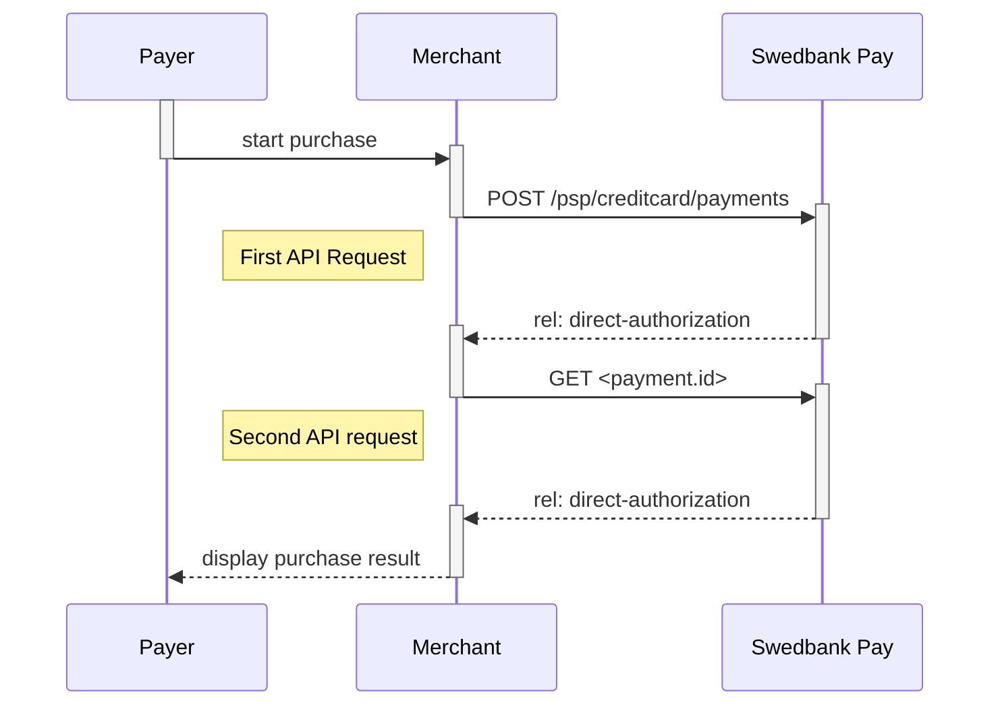
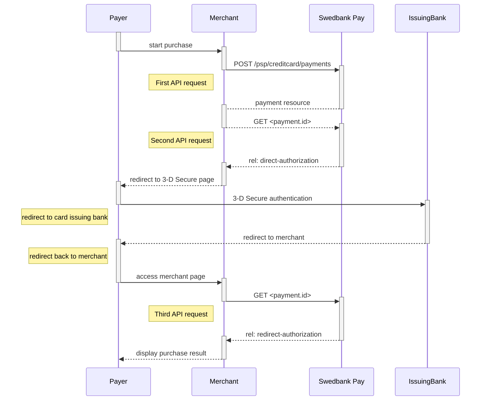







## Introduction

* The payer places an order and you make a `POST` request towards Swedbank Pay
  with gathered `Purchase` information.
* The action taken next is the `direct-authorization` operation that is returned
  in the first request. You `POST` the payer's card data to the URL in
  the[`direct-authorization` operation][authorization].
* If 3-D Secure authentication is required, you will then receive a URL where
  you will have to redirect the payer.
* When the payment is completed, the payer needs to be redirected back to your
  merchant/webshop site.
* Finally you make a `GET` request towards Swedbank Pay with the `paymentID`
  received in the first step, which will return the purchase result.

The sequence diagram below shows a high level description of a complete
purchase, and the requests you have to send to Swedbank Pay. The links will take
you directly to the corresponding API description.

## API Requests

The API requests are displayed in the [purchase flow][purchase].
You can [create a card `payment`][create-payment] with following `operation`
options:

* [`Purchase`][purchase]
* [`Recur`][recur]
* [`Payout`][payout]
* [`Verify`][verify]

Our `payment` example above uses the [`Purchase`][purchase] value which is
explained below.

### Purchase

A `Purchase` payment is a straightforward way to charge the card of the payer.
It is followed up by posting a capture, cancellation or reversal transaction.

An example of an abbreviated `POST` request is provided below. Each individual
Property of the JSON document is described in the following section.
An example of an expanded `POST` request is available in the
[other features section][purchase].





## Type of authorization - Intent

* **Authorization (two-phase):** If you want the credit card to reserve the
  amount, you will have to specify that the `intent` of the `Purchase` is
  `Authorization`. The amount will be reserved but not charged. You will later
  (i.e. when you are ready to ship the purchased products) have to make a
  [Capture][capture] or [Cancel][cancel] request.

### General

* *No 3-D Secure and card acceptance*: There are optional paramers that can be
  used in relation to 3-D Secure and card acceptance. By default, most credit
  card agreements with an acquirer will require that you use 3-D Secure for card
  holder authentication. However, if your agreement allows you to make a card
  payment without this authentication, or that specific cards can be declined,
  you may adjust these optional parameters when creating the payment.
* *Defining CallbackURL*: When implementing a scenario, it is optional to set
  a [CallbackURL][callback] in the `POST` request. If `CallbackURL` is set, then
  Swedbank Pay will send a postback request to this URL when the consumer has
  fulfilled the payment. [See the Callback API description here][callback].

## Type of capture - Intent

* **AutoCapture (one-phase):** If you want the credit card to be charged right
  away, you will have to specify that the `intent` of the `Purchase` is
  `AutoCapture`. The credit card will be charged and you don't need to do any
  more financial operations to this purchase.

## Payment Resource



### 3-D Secure authentication

When dealing with credit card payments, 3-D Secure authentication of the
cardholder is an essential topic. There are two alternative outcomes of a credit
card payment:

* *3-D Secure enabled (by default):* 3-D Secure should be enabled, and
  Swedbank Pay will check if the card is enrolled with 3-D Secure. This depends
  on the issuer of the card. If the card is not enrolled with 3-D Secure, no
  authentication of the cardholder is done.
* *Card supports 3-D Secure:* If the card is enrolled with 3-D Secure,
  Swedbank Pay will redirect the cardholder to the autentication mechanism that
  is decided by the issuing bank. Normally this will be done using BankID or
  Mobile BankID.

## Options after posting a purchase payment

* If the payment shown above is done as a two-phase (Authorization), you will
  need to implement the [Capture][capture] and [Cancel][cancel] requests.
* **Abort:** It is possible to [abort a payment][abort] if the payment has no
  successful transactions.
* For `reversals`, you will need to implement the [Reversal][reversal] request.
* **Callback from Swedbank Pay:** Whenever changes to the payment occur a
  [Callback request][callback] will be posted to the `callbackUrl`, generated
  when the payment was created.



[abort]: /payments/card/other-features#abort
[expansion]: /payments/card/other-features#expansion
[callback]: /payments/card/other-features#callback
[cancel]: /payments/card/after-payment#cancellations
[capture]: /payments/card/after-payment#capture
[reversal]: /payments/card/after-payment#reversals
[authorization]: /payments/card/other-features#create-authorization-transaction
[other features]: /payments/card/other-features#purchase
[purchase]:  /payments/card/other-features#purchase
[recur]:  /payments/card/other-features#recur
[payout]:  /payments/card/other-features#purchase
[verify]: /payments/card/other-features#verify
[create-payment]: /payments/card/other-features#create-payment
