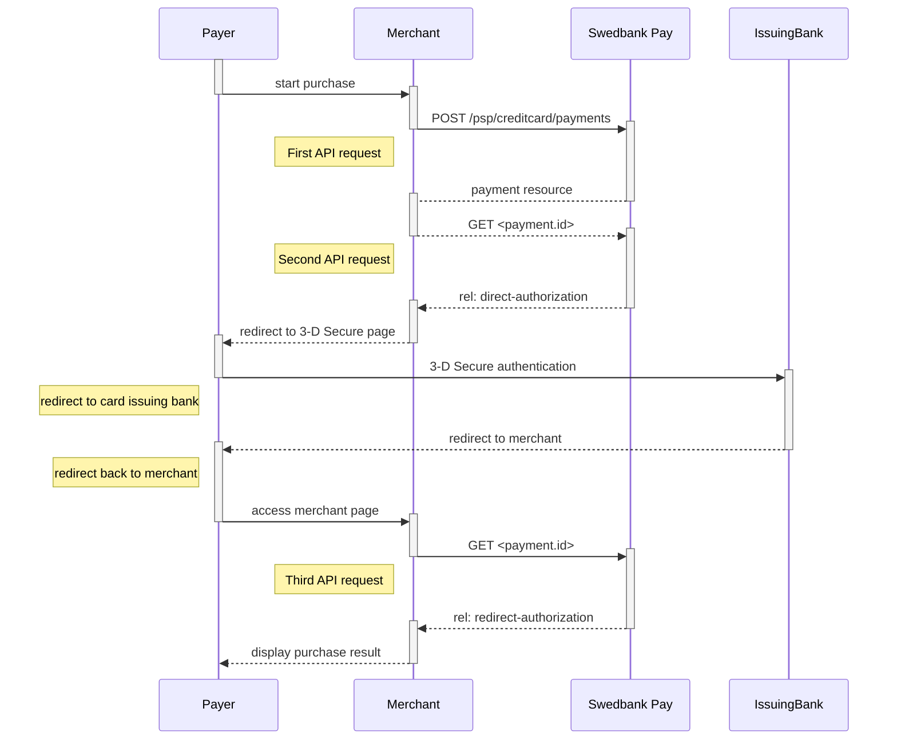







## Introduction

* The payer places an order and you make a `POST` request towards Swedbank Pay
  with gathered `Purchase` information.
* The action taken next is the `direct-authorization` operation that is returned
  in the first request. You `POST` the payer's card data to the URL in
  the[`direct-authorization` operation][authorization].
* If 3-D Secure authentication is required, you will then receive a URL where
  you will have to redirect the payer.
* When the payment is completed, the payer needs to be redirected back to your
  merchant/webshop site.
* Finally you make a `GET` request towards Swedbank Pay with the `paymentID`
  received in the first step, which will return the purchase result.

## Step 1: Create a Purchase

A `Purchase` payment is a straightforward way to charge the card of the payer.
It is followed up by posting a capture, cancellation or reversal transaction.

An example of an abbreviated `POST` request is provided below.
An example of an expanded `POST` request is available in the
[other features section][purchase].







## Step 2a: Create an authorization transaction

The `direct-authorization` operation creates an authorization transaction
directly whilst the `redirect-authorization` operation redirects the consumer to
a Swedbank Pay hosted payment page, where the payment is authorized by the
consumer. Below you will see the two first request and response headers, used
when there is no 3-D secure authentication. Therefore, the `state` of the
transaction is set to `Completed`. No `redirect-authentication` is needed
and the `panEnrolled` is also set to `false`.

{:.code-header}
**Request**

```http
POST /psp/creditcard/payments/{{ page.payment_id }}/authorizations HTTP/1.1
Host: {{ page.api_host }}
Authorization: Bearer <AccessToken>
Content-Type: application/json

{
    "transaction": {
        "cardNumber": "4547781087013329",
        "cardExpiryMonth": "12",
        "cardExpiryYear": "22",
        "cardVerificationCode": "749",
        "cardholderName": "Olivia Nyhuus",
        "chosenCoBrand": "visa"
    }
}
```

{:.code-header}
**Response**

```http
HTTP/1.1 200 OK
Content-Type: application/json

{
    "payment": "/psp/creditcard/payments/{{ page.payment_id }}",
    "authorization": {
        "direct": true,
        "cardBrand": "Visa",
        "cardType": "Credit",
        "paymentToken": "{{ page.payment_token }}",
        "maskedPan": "492500******0004",
        "expiryDate": "12/2022",
        "panToken": "eb488c77-8118-4c9f-b3b3-ff134936df64",
        "panEnrolled": false,
        "issuerAuthorizationApprovalCode": "L57226",
        "acquirerTransactionType": "SSL",
        "acquirerStan": "57226",
        "acquirerTerminalId": "45",
        "acquirerTransactionTime": "2020-03-10T14:13:52Z",
        "nonPaymentToken": "ed4683a8-6d2a-4a14-b065-746a41316b8f",
        "transactionInitiator": "CARDHOLDER",
        "id": "/psp/creditcard/payments/{{ page.payment_id }}/authorizations/{{ page.transaction_id }},
        "transaction": {
            "id": "/psp/creditcard/payments/{{ page.payment_id }}/transactions/{{ page.transaction_id }}",
            "created": "2020-03-10T13:13:52.2767764Z",
            "updated": "2020-03-10T13:13:53.280398Z",
            "type": "Authorization",
            "state": "Completed",
            "number": 70100366754,
            "amount": 4201,
            "vatAmount": 0,
            "description": "Test transaction",
            "payeeReference": "1583846025",
            "isOperational": false,
            "operations": [
                {
                    "method": "PATCH",
                    "href": "https://api.stage.payex.com/psp/creditcard/payments/{{ page.payment_id }}/authorizations/{{ page.transaction_id }}",
                    "rel": "update-authorization-overchargedamount"
                }
            ]
        }
    }
}
```

## Step 2b: Create an authorization transaction with 3-D secure

If 3-D Secure authentication is needed, the `rel` is set to
`redirect-authentication` and the `state` is `AwaitingActivity`. This means that
the payer will have to be redirected to complete the 3-D secure authentication. See the
request and response example below.

{:.code-header}
**Request**

```http
POST /psp/creditcard/payments/{{ page.payment_id }}/authorizations HTTP/1.1
Host: {{ page.api_host }}
Authorization: Bearer <AccessToken>
Content-Type: application/json

{
    "transaction": {
        "cardNumber": "4547781087013329",
        "cardExpiryMonth": "12",
        "cardExpiryYear": "22",
        "cardVerificationCode": "749",
        "cardholderName": "Olivia Nyhuus",
        "chosenCoBrand": "visa"
    }
}
```

{:.table .table-striped}
| Required | Field                       | Type      | Description                                                                     |
| :------: | :----------------------------- | :-------- | :------------------------------------------------------------------------------ |
|  ✔︎︎︎︎︎  | `transaction`                  | `object`  | The transaction object.                                                         |
|  ✔︎︎︎︎︎  | └➔&nbsp;`cardNumber`           | `string`  | Primary Account Number (PAN) of the card, printed on the face of the card.      |
|  ✔︎︎︎︎︎  | └➔&nbsp;`cardExpiryMonth`      | `integer` | Expiry month of the card, printed on the face of the card.                      |
|  ✔︎︎︎︎︎  | └➔&nbsp;`cardExpiryYear`       | `integer` | Expiry year of the card, printed on the face of the card.                       |
|          | └➔&nbsp;`cardVerificationCode` | `string`  | Card verification code (CVC/CVV/CVC2), usually printed on the back of the card. |
|          | └➔&nbsp;`cardholderName`       | `string`  | Name of the cardholder, usually printed on the face of the card.               |

{:.code-header}
**Response**

```http
HTTP/1.1 200 OK
Content-Type: application/json

{
    "payment": "/psp/creditcard/payments/{{ page.payment_id }}",
    "authorization": {
        "direct": true,
        "cardBrand": "Visa",
        "cardType": "Credit",
        "issuingBank": "Utl. Visa",
        "paymentToken": "{{ page.payment_token }}",
        "maskedPan": "454778******3329",
        "expiryDate": "12/2020",
        "panToken": "cca2d98d-8bb3-4bd6-9cf3-365acbbaff96",
        "panEnrolled": true,
        "acquirerTransactionTime": "0001-01-01T00:00:00Z",
        "id": ""/psp/creditcard/payments/{{ page.payment_id }}/authorizations/{{ page.transaction_id }}",
        "transaction": {
            "id": ""/psp/creditcard/payments/{{ page.payment_id }}/transactions/{{ page.transaction_id }}",
            "created": "2020-03-10T13:15:01.9586254Z",
            "updated": "2020-03-10T13:15:02.0493818Z",
            "type": "Authorization",
            "state": "AwaitingActivity",
            "number": 70100366758,
            "amount": 4201,
            "vatAmount": 0,
            "description": "Test transaction",
            "payeeReference": "1583846100",
            "isOperational": true,
            "operations": [
                {
                    "method": "GET",
                    "href": "https://api.stage.payex.com/psp/creditcard/confined/payments/authorizations/authenticate/{{ page.transaction_id }}",
                    "rel": "redirect-authentication"
                }
            ]
        }
    }
}
```

{:.table .table-striped}
| Field   | Type      | Description                                                                     |
| :----------------------------- | :-------- | :------------------------------------------------------------------------------ |
| `payment`                  | `object`  | The payment object.                                                         |
| `authorization`           | `object`  | The authorization object.     |
| └➔&nbsp;`direct`      | `string` | The type of the authorization.                       |
| └➔&nbsp;`cardBrand`       | `string` | `Visa`, `MC`, etc. The brand of the card.                         |
| └➔&nbsp;`cardType` | `string`  | `Credit Card` or `Debit Card`. Indicates the type of card used for the authorization.  |
| └➔&nbsp;`issuingBank`       | `string`  |  The name of the bank that issued the card used for the authorization.               |
| └➔&nbsp;`paymentToken`            | `string`  | The payment token created for the card used in the authorization.              |
| └➔&nbsp;`maskedPan` | `string`  | The masked PAN number of the card.  |
| └➔&nbsp;`expiryDate`              | `string`  | The month and year of when the card expires.                                   |
| └➔&nbsp;`panToken` | `string`  | The token representing the specific PAN of the card.  |
| └➔&nbsp;`panEnrolled`              | `string`  |    |
| └➔&nbsp;`acquirerTransactionTime` | `string`  | `3DSECURE` or `SSL`. Indicates the transaction type of the acquirer.     |
| └➔&nbsp;`id`              | `string`  |        |
| └➔&nbsp;`transaction`              | `object`  |   The object representation of the generic transaction resource.     |
| └─➔&nbsp;`id` | `string`  |       |
| └─➔&nbsp;`created`                | `string`  | The ISO-8601 date and time of when the transaction was created.                                                                                                                                              |
| └─➔&nbsp;`updated`                | `string`  | The ISO-8601 date and time of when the transaction was updated.                                                                                                                                              |
| └─➔&nbsp;`type`                   | `string`  | Indicates the transaction type.                                                                                                                                                                              |
| └─➔&nbsp;`state`                  | `string`  | `Initialized`, `Completed` or `Failed`. Indicates the state of the transaction.  |
| └─➔&nbsp;`number`                 | `string`  | The transaction `number`, useful when there's need to reference the transaction in human communication. Not usable for programmatic identification of the transaction, for that `id` should be used instead. |
| └─➔&nbsp;`amount`                 | `integer` | Amount is entered in the lowest momentary units of the selected currency. E.g. `10000` = 100.00 NOK, `5000` = 50.00 SEK.                                                                                     |
|  └─➔&nbsp;`vatAmount`              | `integer` | If the amount given includes VAT, this may be displayed for the user in the payment page (redirect only). Set to 0 (zero) if this is not relevant.                                                           |
|  └─➔&nbsp;`description`            | `string`  | A human readable description of maximum 40 characters of the transaction.                                                                                                                                    |
|  └─➔&nbsp;`payeeReference`         | `string`  | A unique reference for the transaction.                                                                                                                                                                      |
| └─➔&nbsp;`failedReason`           | `string`  | The human readable explanation of why the payment failed.                                                                                                                                                    |
| └─➔&nbsp;`isOperational`          | `bool`    | `true` if the transaction is operational; otherwise `false`.                                                                                                                                                 |
| └─➔&nbsp;`operations`             | `array`   | The array of operations that are possible to perform on the transaction in its current state.                                                                                                                |

### 3-D Secure authentication

When dealing with credit card payments, 3-D Secure authentication of the
cardholder is an essential topic. There are two alternative outcomes of a credit
card payment:

* *3-D Secure enabled (by default):* 3-D Secure should be enabled, and
  Swedbank Pay will check if the card is enrolled with 3-D Secure. This depends
  on the issuer of the card. If the card is not enrolled with 3-D Secure, no
  authentication of the cardholder is done.
* *Card supports 3-D Secure:* If the card is enrolled with 3-D Secure,
  Swedbank Pay will redirect the cardholder to the autentication mechanism that
  is decided by the issuing bank. Normally this will be done using BankID or
  Mobile BankID.



The sequence diagram below shows a high level description of a complete
purchase, and the requests you have to send to Swedbank Pay.



## Options after posting a purchase payment

* If the payment shown above is done as a two-phase (Authorization), you will
  need to implement the [Capture][capture] and [Cancel][cancel] requests.
* **Abort:** It is possible to [abort a payment][abort] if the payment has no
  successful transactions.
* For `reversals`, you will need to implement the [Reversal][reversal] request.
* **Callback from Swedbank Pay:** Whenever changes to the payment occur a
  [Callback request][callback] will be posted to the `callbackUrl`, generated
  when the payment was created.



[abort]: /payments/card/other-features#abort
[expansion]: /payments/card/other-features#expansion
[callback]: /payments/card/other-features#callback
[cancel]: /payments/card/after-payment#cancellations
[capture]: /payments/card/after-payment#capture
[reversal]: /payments/card/after-payment#reversals
[authorization]: /payments/card/other-features#create-authorization-transaction
[other features]: /payments/card/other-features#purchase
[purchase]:  /payments/card/other-features#purchase
[recur]:  /payments/card/other-features#recur
[payout]:  /payments/card/other-features#purchase
[verify]: /payments/card/other-features#verify
[create-payment]: /payments/card/other-features#create-payment
