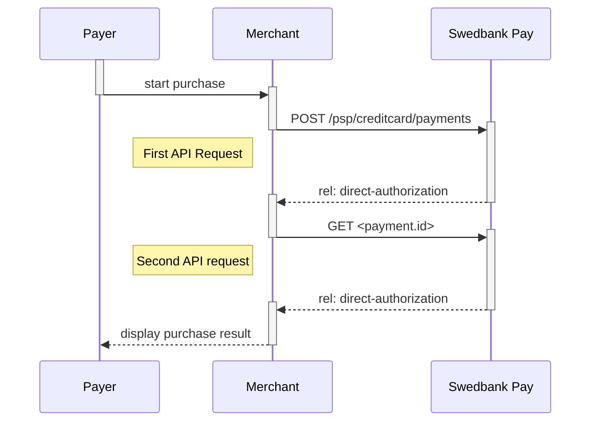
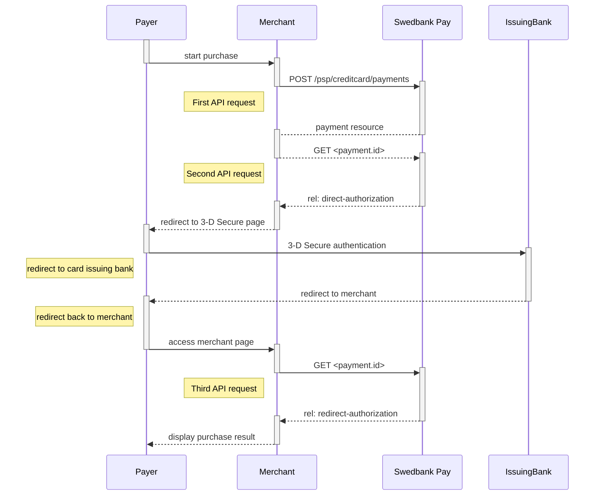







### Purchase flow

* The payer places an order and you make a `POST` request towards Swedbank Pay
  with gathered `Purchase` information.
* The action taken next is the `direct-authorization` operation that is returned
  in the first request. You `POST` the payer's card data to the URL in
  the[`direct-authorization` operation][authorization].
* If 3-D Secure authentication is required, you will then receive a URL where
  you will have to redirect the payer.
* When the payment is completed, the payer needs to be redirected back to your
  merchant/webshop site.
* Finally you make a `GET` request towards Swedbank Pay with the `paymentID`
  received in the first step, which will return the purchase result.

The sequence diagram below shows a high level description of a complete
purchase, and the requests you have to send to Swedbank Pay. The links will take
you directly to the corresponding API description.



### API Requests

The API requests are displayed in the [purchase flow](#purchase-flow-mobile).
You can [create a card `payment`][create-payment] with following `operation`
options:

* [Purchase][purchase]
* [Recur][recur]
* [Payout][payout]
* [Verify][verify]

Our `payment` example above uses the [`purchase`][purchase] value which is
explained below.

### Purchase

A `Purchase` payment is a straightforward way to charge the card of the payer.
It is followed up by posting a capture, cancellation or reversal transaction.

An example of an abbreviated `POST` request is provided below. Each individual
Property of the JSON document is described in the following section.
An example of an expanded `POST` request is available in the
[other features section][purchase].



{:.code-header}
**Request**

```http
POST /psp/creditcard/payments HTTP/1.1
Authorization: Bearer <AccessToken>
Content-Type: application/json

{
    "payment": {
        "operation": "Purchase",
        "intent": "Authorization",
        "currency": "SEK",
        "prices": [{
                "type": "CreditCard",
                "amount": 1500,
                "vatAmount": 0
            }
        ],
        "description": "Test Purchase",
        "generatePaymentToken": false,
        "generateRecurrenceToken": false,
        "userAgent": "Mozilla/5.0...",
        "language": "sv-SE",
        "urls": {
            "hostUrls": ["http://test-dummy.net"],
            "completeUrl": "http://test-dummy.net/payment-completed",
            "cancelUrl": "http://test-dummy.net/payment-canceled",
            "paymentUrl": "http://example.com/perform-payment",
            "callbackUrl": "http://test-dummy.net/payment-callback",
            "logoUrl": "http://test-dummy.net/payment-logo.png",
            "termsOfServiceUrl": "http://test-dummy.net/payment-terms.pdf",
        },
        "payeeInfo": {
            "payeeId": "12345678-1234-1234-1234-123456789012",
            "payeeReference": "CD1234",
            "payeeName": "Merchant1",
            "productCategory": "A123",
            "orderReference": "or123",
        },
        "metadata": {
            "key1": "value1",
            "key2": 2,
            "key3": 3.1,
            "key4": false
        },
        "riskIndicator": {
            "deliveryEmailAddress": "string",
            "deliveryTimeFrameindicator": "01",
            "preOrderDate": "YYYYMMDD",
            "preOrderPurchaseIndicator": "01",
            "shipIndicator": "01",
            "giftCardPurchase": false,
            "reOrderPurchaseIndicator": "01",
            "pickUpAddress": {
                "name": "companyname",
                "streetAddress": "string",
                "coAddress": "string",
                "city": "string",
                "zipCode": "string",
                "countryCode": "string"
            }
        }
    },
    "creditCard": {
        "rejectCreditCards": false,
        "rejectDebitCards": false,
        "rejectConsumerCards": false,
        "rejectCorporateCards": false,
        "no3DSecure": false,
        "noCvc": false
    }
}
```

{:.table .table-striped}
| Required | Property                                             | Type        | Description                                                                                                                                                                                                                                                                                                                                                                                                                                                                                                                                                                                                       |
| :------: | :--------------------------------------------------- | :---------- | :---------------------------------------------------------------------------------------------------------------------------------------------------------------------------------------------------------------------------------------------------------------------------------------------------------------------------------------------------------------------------------------------------------------------------------------------------------------------------------------------------------------------------------------------------------------------------------------------------------------- |
|  ✔︎︎︎︎︎  | operation                                            | string      | Purchase                                                                                                                                                                                                                                                                                                                                                                                                                                                                                                                                                                                                          |
|  ✔︎︎︎︎︎  | intent                                               | string      | `PreAuthorization`. Holds the funds for a certain time in contrast to reserving the amount. A preauthoriation is always followed by the [finalize][finalize] operation. <br> <br> `Authorization`. Reserves the amount, and is followed by a [cancellation][cancel] or [capture][capture] of funds.<br> <br> `AutoCapture`. A one phase option that enable capture of funds automatically after authorization.                                                                                                                                                                                                    |
|          | paymentToken                                         | string      | If you put in a paymentToken here, the payment will preload the stored payment data related to the `paymentToken` and let the consumer make a purchase without having to enter all card data. This is called a "One Click" purchase.                                                                                                                                                                                                                                                                                                                                                                         |
|  ✔︎︎︎︎︎  | currency                                             | string      | NOK, SEK, DKK, USD or EUR.                                                                                                                                                                                                                                                                                                                                                                                                                                                                                                                                                                                        |
|  ✔︎︎︎︎︎  | prices.type                                          | string      | Use the generic type CreditCard if you want to enable all card brands supported by merchant contract. Use card brands like Visa (for card type Visa), MasterCard (for card type Mastercard) and others if you want to specify different amount for each card brand. If you want to use more than one amount you must have one instance in the prices node for each card brand. You will not be allowed to both specify card brands and CreditCard at the same time in this field. [See the Prices resource and prices object types for more information][price-resource].                                         |
|  ✔︎︎︎︎︎  | prices.amount                                        | integer     | Amount is entered in the lowest monetary units of the selected currency. E.g. 10000 = 100.00 NOK, 5000 = 50.00 SEK.                                                                                                                                                                                                                                                                                                                                                                                                                                                                                               |
|  ✔︎︎︎︎︎  | prices.vatAmount                                     | integer     | If the amount given includes VAT, this may be displayed for the user in the payments (redirect only). Set to 0 (zero) if this is not relevant.                                                                                                                                                                                                                                                                                                                                                                                                                                                                |
|  ✔︎︎︎︎︎  | description                                          | string(40)  | A textual description max 40 characters of the purchase.                                                                                                                                                                                                                                                                                                                                                                                                                                                                                                                                                          |
|          | payerReference                                       | string      | The reference to the payer (consumer/end user) from the merchant system. E.g mobile number, customer number etc.                                                                                                                                                                                                                                                                                                                                                                                                                                                                                                  |
|          | generatePaymentToken                                 | boolean     | `true` or `false`. Set this to `true` if you want to create a paymentToken for future use as One Click.                                                                                                                                                                                                                                                                                                                                                                                                                                                                                                           |
|          | generateRecurrenceToken                              | boolean     | `true` or `false`. Set this to `true` if you want to create a recurrenceToken for future use Recurring purchases (subscription payments).                                                                                                                                                                                                                                                                                                                                                                                                                                                                         |
|  ✔︎︎︎︎︎  | userAgent                                            | string      | The user agent reference of the consumer's browser - [see user agent definition][user-agent-definition]                                                                                                                                                                                                                                                                                                                                                                                                                                                                                                           |
|  ✔︎︎︎︎︎  | language                                             | string      | nb-NO, sv-SE or en-US.                                                                                                                                                                                                                                                                                                                                                                                                                                                                                                                                                                                            |
|          | urls.hostUrl                                         | array       | The array of URLs valid for embedding of Swedbank Pay Hosted Views. If not supplied, view-operation will not be available.                                                                                                                                                                                                                                                                                                                                                                                                                                                                                        |
|  ✔︎︎︎︎︎  | urls.completeUrl                                     | string      | The URL that Swedbank Pay will redirect back to when the payment is completed.                                                                                                                                                                                                                                                                                                                                                                                                                                                                                                                               |
|          | urls.cancelUrl                                       | string      | The URI to redirect the payer to if the payment is canceled. Only used in redirect scenarios. Can not be used simultaneously with paymentUrl; only cancelUrl or paymentUrl can be used, not both.                                                                                                                                                                                                                                                                                                                                                                                                                 |
|          | urls.paymentUrl                                      | string      | The URI that Swedbank Pay will redirect back to when the view-operation needs to be loaded, to inspect and act on the current status of the payment. Only used in Seamless Views. If both cancelUrl and paymentUrl is sent, the paymentUrl will used.                                                                                                                                                                                                                                                                                                                                                             |
|          | urls.callbackUrl                                     | string      | The URL that Swedbank Pay will perform an HTTP POST against every time a transaction is created on the payment. See [callback][callback] for details.                                                                                                                                                                                                                                                                                                                                                                                                                                                             |
|          | urls.logoUrl                                         | string      | The URL that will be used for showing the customer logo. Must be a picture with maximum 50px height and 400px width. Require https.                                                                                                                                                                                                                                                                                                                                                                                                                                                                               |
|          | urls.termsOfServiceUrl                               | string      | A URL that contains your terms and conditions for the payment, to be linked on the payment. Require https.                                                                                                                                                                                                                                                                                                                                                                                                                                                                                                   |
|  ✔︎︎︎︎︎  | payeeInfo.payeeId                                    | string      | This is the unique id that identifies this payee (like merchant) set by Swedbank Pay.                                                                                                                                                                                                                                                                                                                                                                                                                                                                                                                             |
|  ✔︎︎︎︎︎  | payeeInfo.payeeReference                             | string(30*) | A unique reference from the merchant system. It is set per operation to ensure an exactly-once delivery of a transactional operation. See [payeeReference][payee-reference] for details.                                                                                                                                                                                                                                                                                                                                                                                                                          |
|          | payeeInfo.payeeName                                  | string      | The payee name (like merchant name) that will be displayed to consumer when redirected to Swedbank Pay.                                                                                                                                                                                                                                                                                                                                                                                                                                                                                                           |
|          | payeeInfo.productCategory                            | string      | A product category or number sent in from the payee/merchant. This is not validated by Swedbank Pay, but will be passed through the payment process and may be used in the settlement process.                                                                                                                                                                                                                                                                                                                                                                                                                    |
|          | payeeInfo.orderReference                             | String(50)  | The order reference should reflect the order reference found in the merchant's systems.                                                                                                                                                                                                                                                                                                                                                                                                                                                                                                                           |
|          | payeeInfo.subsite                                    | String(40)  | The subsite field can be used to perform split settlement on the payment. The subsites must be resolved with Swedbank Pay reconciliation before being used.                                                                                                                                                                                                                                                                                                                                                                                                                                                       |
|          | metadata                                             | object      | The keys and values that should be associated with the payment. Can be additional identifiers and data you want to associate with the payment.                                                                                                                                                                                                                                                                                                                                                                                                                                                                    |
|          | riskIndicator.deliveryEmailAddress                   | string      | Optional (increased chance for frictionless flow if set).<br> <br> For electronic delivery, the email address to which the merchandise was delivered.                                                                                                                                                                                                                                                                                                                                                                                                                                                             |
|          | riskIndicator.deliveryTimeFrameIndicator             | string      | Optional (increased chance for frictionless flow if set).<br> <br> Indicates the merchandise delivery timeframe.<br>01 (Electronic Delivery)<br>02 (Same day shipping)<br>03 (Overnight shipping)<br>04 (Two-day or more shipping)<br>                                                                                                                                                                                                                                                                                                                                                                            |
|          | riskIndicator.preOrderDate                           | string      | Optional (increased chance for frictionless flow if set).<br> <br>For a pre-ordered purchase. The expected date that the merchandise will be available.<br>FORMAT: "YYYYMMDD"                                                                                                                                                                                                                                                                                                                                                                                                                                     |
|          | riskIndicator.preOrderPurchaseIndicator              | string      | Optional (increased chance for frictionless flow if set).<br> <br> Indicates whether Cardholder is placing an order for merchandise with a future availability or release date.<br>01 (Merchandise available)<br>02 (Future availability)                                                                                                                                                                                                                                                                                                                                                                         |
|          | riskIndicator.shipIndicator                          | string      | Optional (increased chance for frictionless flow if set).<br> <br>Indicates shipping method chosen for the transaction.<br> 01 (Ship to cardholder's billing address)<br>02 (Ship to another verified address on file with merchant)<br>03 (Ship to address that is different than cardholder's billing address)<br>04 (Ship to Store / Pick-up at local store. Store address shall be populated in shipping address fields)<br>05 (Digital goods, includes online services, electronic giftcards and redemption codes)<br>06 (Travel and Event tickets, not shipped)<br>07 (Other, e.g. gaming, digital service) |
|          | riskIndicator.giftCardPurchase                       | boolean     | Optional (increased chance for frictionless flow if set).<br> <br>`true` if this is a purchase of a gift card.                                                                                                                                                                                                                                                                                                                                                                                                                                                                                                    |
|          | riskIndicator.reOrderPurchaseIndicator               | string      | Optional (increased chance for frictionless flow if set).<br> <br>Indicates whether Cardholder is placing an order for merchandise with a future availability or release date.<br>01 (Merchandise available)<br>02 (Future availability)                                                                                                                                                                                                                                                                                                                                                                          |
|          | riskIndicator.pickUpAddress                          | object      | If shipIndicator set to 4, then prefil this.                                                                                                                                                                                                                                                                                                                                                                                                                                                                                                                                                                      |
|          | riskIndicator.pickUpAddress.name                     | string      | If shipIndicator set to 4, then prefil this.                                                                                                                                                                                                                                                                                                                                                                                                                                                                                                                                                                      |
|          | riskIndicator.pickUpAddress.streetAddress            | string      | If shipIndicator set to 4, then prefil this.                                                                                                                                                                                                                                                                                                                                                                                                                                                                                                                                                                      |
|          | riskIndicator.pickUpAddress.coAddress                | string      | If shipIndicator set to 4, then prefil this.                                                                                                                                                                                                                                                                                                                                                                                                                                                                                                                                                                      |
|          | riskIndicator.pickUpAddress.city                     | string      | If shipIndicator set to 4, then prefil this.                                                                                                                                                                                                                                                                                                                                                                                                                                                                                                                                                                      |
|          | riskIndicator.pickUpAddress.zipCode                  | string      | If shipIndicator set to 4, then prefil this.                                                                                                                                                                                                                                                                                                                                                                                                                                                                                                                                                                      |
|          | riskIndicator.pickUpAddress.countryCode              | string      | If shipIndicator set to 4, then prefil this.                                                                                                                                                                                                                                                                                                                                                                                                                                                                                                                                                                      |
|          | creditCard.rejectDebitCards                          | boolean     | `true` if debit cards should be declined; otherwise `false` per default. Default value is set by Swedbank Pay and can be changed at your request.                                                                                                                                                                                                                                                                                                                                                                                                                                                                 |
|          | creditCard.rejectCreditCards                         | boolean     | `true` if credit cards should be declined; otherwise `false` per default. Default value is set by Swedbank Pay and can be changed at your request.                                                                                                                                                                                                                                                                                                                                                                                                                                                                |
|          | creditCard.rejectConsumerCards                       | boolean     | `true` if consumer cards should be declined; otherwise `false` per default. Default value is set by Swedbank Pay and can be changed at your request.                                                                                                                                                                                                                                                                                                                                                                                                                                                              |
|          | creditCard.rejectCorporateCards                      | boolean     | `true` if corporate cards should be declined; otherwise `false` per default. Default value is set by Swedbank Pay and can be changed at your request.                                                                                                                                                                                                                                                                                                                                                                                                                                                             |
|          | creditCard.no3DSecure                                | boolean     | `true` if 3-D Secure should be disabled for this payment in the case a stored card is used; otherwise `false` per default. To use this feature it has to be enabled on the contract with Swedbank Pay.                                                                                                                                                                                                                                                                                                                                                                                                              |
|          | creditCard.noCvc                                     | boolean     | `true` if the CVC field should be disabled for this payment in the case a stored card is used; otherwise `false` per default. To use this feature it has to be enabled on the contract with Swedbank Pay.                                                                                                                                                                                                                                                                                                                                                                                                         |

### Type of authorization (Intent)

* **Authorization (two-phase):** If you want the credit card to reserve the
  amount, you will have to specify that the `intent` of the `purchase` is
  `Authorization`. The amount will be reserved but not charged. You will later
  (i.e. when you are ready to ship the purchased products) have to make a
  [Capture][Capture] or [Cancel][Cancel] request.

### Type of capture (Intent)

* **AutoCapture (one-phase):** If you want the credit card to be charged right
  away, you will have to specify that the `intent` of the `purchase` is
  `AutoCapture`. The credit card will be charged and you don't need to do any
  more financial operations to this purchase.

### General

* **No 3-D Secure and card acceptance**: There are optional paramers that can be
  used in relation to 3-D Secure and card acceptance. By default, most credit
  card agreements with an acquirer will require that you use 3-D Secure for card
  holder authentication. However, if your agreement allows you to make a card
  payment without this authentication, or that specific cards can be declined,
  you may adjust these optional parameters when posting in the payment. This is
  specified in the technical reference section for creating credit card payments
   - you will find the link in the sequence diagram below.
* **Defining CallbackURL**: When implementing a scenario, it is optional to set
  a [CallbackURL][callback] in the `POST` request. If `CallbackURL` is set, then
  Swedbank Pay will send a postback request to this URL when the consumer has
  fulfilled the payment. [See the Callback API description here][callback].

## Payment Resource



### 3-D Secure authentication

When dealing with credit card payments, 3-D Secure authentication of the
cardholder is an essential topic. There are two alternative outcomes of a credit
card payment:

* **3-D Secure enabled (by default):** 3-D Secure should be enabled, and
  Swedbank Pay will check if the card is enrolled with 3-D Secure. This depends
  on the issuer of the card. If the card is not enrolled with 3-D Secure, no
  authentication of the cardholder is done.
* **Card supports 3-D Secure:** If the card is enrolled with 3-D Secure,
  Swedbank Pay will redirect the cardholder to the autentication mechanism that
  is decided by the issuing bank. Normally this will be done using BankID or
  Mobile BankID.



### Options after posting a purchase payment

* If the payment shown above is done as a two-phase (Authorization), you will
  need to implement the [Capture][Capture] and [Cancel][Cancel] requests.
* **Abort:** It is possible to [abort a payment][abort] if the payment has no
  successful transactions.
* For `reversals`, you will need to implement the [Reversal][reversal] request.
* **Callback from Swedbank Pay:** Whenever changes to the payment occur a
  [Callback request][callback] will be posted to the `callbackUrl`, generated
  when the payment was created.



[abort]: /payments/card/other-features/#abort
[expansion]: /payments/card/other-features/#expansion
[callback]: /payments/card/other-features/#callback
[Cancel]: /payments/card/after-payment/#Cancellations
[Capture]: /payments/cardd/after-payment/#Capture
[PCI-link]: https://www.pcisecuritystandards.org/
[reversal]: /payments/card/after-payment/#Reversals
[authorization]: /payments/card/other-features/#create-authorization-transaction
[other features]: /payments/card/other-features#purchase
[purchase]:  /payments/card/other-features/#purchase
[recur]:  /payments/card/other-features/#recur
[payout]:  /payments/card/other-features/#purchase
[verify]: /payments/card/other-features/#verify
[create-payment]: /payments/card/other-features/#create-payment
